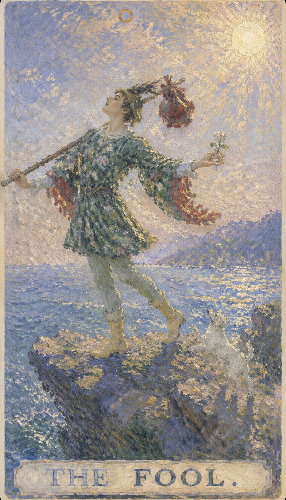

# 愚者

愚者是整副塔罗旅程的第一口呼吸。他还没有被经验塑造成固定的样子，因此带着天真、好奇与一点不知危险的勇气，走向未知的悬崖。

这张牌把人带回最初的开放状态。鲁莽只是它的阴影；真正的愚者，怀抱着对生命的信任，愿意让道路在脚下逐渐显现。愚者活在当下，正经历着"现在"的力量——那些活在过去或未来的人，或许会笑他对眼前的执着是愚蠢，却不明白：我们最大的力量，正是此刻所拥有的。过去无法改变，未来难以掌握，唯有现在，我们能去做、去感受、去相信。

牌面中身穿斑斓彩衣、戴着小丑帽的年轻人，在悬崖边昂首阔步。他右手握着象征潜能的权杖，背上的小包袱装满尚未启用的经验，头上的桂冠暗示成功的可能。左手捧着白玫瑰，白色象征纯洁，玫瑰象征热情，也代表天真无知。脚边的白犬凭本能行事，既是忠诚的陪伴，也是提醒现实危险的警讯。他目光投向远方神情欢愉，对脚下深渊浑然无惧，仿佛深信生命会托住他。远处的雪山是他未来的旅程，而身后白色的阳光，知道他从何而来、将往何处。

## 基础要素

1. 牌名：愚者 (The Fool)
2. 数字编号：00 / 0 号牌
3. 核心主题：自由、信任、冒险、生命旅程的开端
4. 元素：风
5. 星座或行星：天王星 / 风元素
6. 希伯来字母：Aleph（阿列夫）
7. 代表意义：带着初心走向未知，在经验形成之前先允许生命开始

## 牌面要素

| 要素 | 含义 |
|------|------|
| 悬崖 | 未知与风险的边界。即将迈出的一步，可能是跨向新事物的一大步，也可能是危险的开始。 |
| 白犬 | 忠诚与保护的本能，也在提醒愚者注意即将到来的危险，是现实中的警讯。 |
| 白玫瑰 | 纯真、无邪的动机与开放的心。白色象征纯洁，玫瑰象征热情。 |
| 小包袱 | 愚者带着的资源与才能，象征灵魂所需的种子，可能尚未被完全利用或发现。 |
| 远山 / 雪山 | 难以逾越的障碍与高大的目标，也是未来的精神旅程与考验。 |
| 白色太阳 | 清晰、纯洁与觉醒的精神，是生命力、祝福与新的开始。 |
| 帽子（与红色羽毛） | 帽形呼应无限符号，代表无限可能；红羽象征激情与活力。 |
| 彩衣与花朵图案 | 多彩衣饰代表无忧无虑的自由精神，花朵图案表现纯真与少年心态。 |
| 姿态 | 愚者无忧无虑地迈步，是自信，也可能是无知的自信。 |
| 鞋履与绿袜 | 鞋色暗示精神旅程中的实际步伐，绿袜象征生长与与自然的连接。 |

## 塔罗灵数

数字 0 是尚未成形的圆，也是无限可能的容器。它不属于任何固定阶段，却能穿越全部阶段，象征从无到有、从空白到经验的旅程。

愚者的 0 号也说明他既可以是旅程的开始，也可以是旅程中的任何时刻。当人愿意放下旧身份，以新眼光面对世界，就会再次成为愚者。

## 牌面解读重点

愚者正位，表示在人事物中"潜意识认为应该这么做，并且做了"；愚者逆位，则是"潜意识想做就做"。正逆位的差别，在于潜意识是否对人事物做过甄别。它的共同特点是：主观上没有预设的想法，客观上也没有明确的目的——一切凭着当下的直觉与本能展开。

## 正位牌意

**关键词**：新的起点，自由，好奇，本能，无意识，现在正是好时机，开端，起源，清白，天真，纯真，单纯，自发性，自然，自由精神，不拘一格，冒险，无畏，潜力，直觉，灵感，轻装上阵，旅行，尝试

正位的愚者表示你正站在新路口。完整答案尚未出现，开放、诚实与行动的勇气已经足够点亮第一步。你正在冒险、正在探索，拥有无边界的梦想与无限的潜力；你相信未知，相信自己的直觉，无拘无束、充满活力地踏上旅程。

### 爱情/婚姻

愚者暗示一段"活在当下、随遇而安"的感情时期。你可能以独特的方式获得爱情，很容易坠入爱河，喜欢浪漫多彩的关系。单身者容易遇到让自己心动的人，甚至可能在旅途中遇见伴侣；有伴侣者则可能进入旅行、搬迁、共同尝试新生活的阶段。需要注意的是，愚者的爱很真诚，却不一定成熟——对方可能难以捉摸、天真，或不愿受到任何长期计划与承诺的约束，承诺仍需要时间落地。

- **现况**：两人之间还不太了解，虽有一些发展潜力，但也可能在更熟悉之后选择分开，目前并非很亲密的关系。
- **桃花**：可能出现让你迷恋不已的新对象，但实际上未必适合你；若贸然投入付出，势必容易受伤。
- **看法**：带着一丝难以置信——"我怎么会跟这个人在一起？若能重来一次，我多半不会做同样的决定。"
- **复合**：此刻维持单身对你较为有利，不要因一时心软就再度复合，重修旧好并不是好选择。

### 事业学业

事业学业上代表新项目、新课程、新岗位或跨领域尝试。你热衷于探索，好奇心强、富有潜力，适合启动、提出新点子、踏足新领域，倾向自由的工作氛围，适合艺术类或自由职业。学业上则出于好奇对当前课业产生浓厚兴趣，善于把握重点，常以独特方式取得意外收获。但这张牌不鼓励毫无计划地孤注一掷；若你已压抑太久，它也在鼓励你给自己一次开始的机会。

- **现况**：可能正面对颇为不确定的状况，此时明哲保身最重要，切忌玩火自焚。
- **建议**：先冷静下来，把真实状况看清楚，别再被当成傻子，执迷不悟可能代价高昂。
- **关系**：做法或许过于特立独行，以致旁人难以靠近，工作上也不易交到知己或找到合作者。
- **发展**：若眼下选择明显走偏，不必一错再错；有机会调整方向就尽早行动，原地停留未必有帮助。

### 人际财富

人际上容易认识不同圈层的人，因彰显个性而受欢迎，喜欢以轻松的方式结交各类朋友，也容易在旅途中结识新朋友。财富方面可能有新机会，但你不太擅长理财，投资上容易孤注一掷、不计后果，前期仍需轻装试水、以学习心态靠近，避免因一时兴奋承担过高风险。建议谨慎投资、多多储蓄。

- **现况**：也许并没有真正交心的好友，内在感到空虚；若维持原有的行为模式，仍难结交知心朋友。
- **建议**：好好反省与朋友相处的过程，若曾不小心冒犯到对方，该为自己的行为道歉。
- **财运**：留意冲动消费与盲目投资，看清合同与现实条件，把钱先存起来，非必要不轻易支出。

### 健康生活

健康生活上适合重新开始，例如调整作息、尝试运动、旅行散心。愚者鼓励一种焕然一新的生活态度，让身心回到轻盈、好奇的状态。但要避免冒险行为、粗心受伤或忽略身体发出的提醒——珍惜身体这副旅途中的行囊，基本的保护需要放在前面。

### 其它牌意

可能代表旅行、搬家、辞旧迎新、临时决定、自由职业、未知机会，也包括吸取经验教训、憧憬自然、毫无目的地前行、四处流浪、喜欢尝试新鲜挑战。若问结果，正位通常表示事情会开启，但后续发展取决于你是否愿意边走边学。

### 情境指引

- **过去**：从前的你更天真、冒险或无忧无虑，不受传统束缚，常愿尝试新事物。
- **现在**：一种自由自在的生活态度，对未知的接纳；你正享受新鲜感，或准备踏上新旅程。
- **未来**：新的机遇与经历即将到来，保持乐观积极，因为前路充满无限可能。
- **挑战**：可能因过于冒险而遇到问题，如何在冒险与谨慎之间找到平衡，是你的课题。
- **障碍**：害怕未知、过分担忧或抗拒变化，都可能妨碍你迈出新的一步。
- **环境**：周遭环境鼓励你去探索与体验，可能有来自朋友或社群的支持，让你更自由。
- **支持**：身边的人多半支持你的新开始，给你勇气与信心去追梦。
- **建议**：对新机会保持开放，不要害怕冒险，但同时要有一定的计划与准备以防万一。
- **优势**：乐观、灵活，愿意接受新事物，能适应变化并从中找到乐趣。
- **弱点**：过于冲动、缺乏规划，有时因不考虑后果而招致不必要的麻烦。
- **正面影响**：新的发现、个人成长与自由地表达自我。
- **负面影响**：轻率或鲁莽的决策，可能带来风险与失误。
- **希望发生**：希望新的开始带来积极变化，为生活增添乐趣与意义。
- **害怕发生**：害怕新的尝试失败，或新旅程导致意外与失望。
- **你如何看对方**：把对方看作充满活力与冒险精神的人，他/她的自由气质吸引着你。
- **对方如何看待你**：对方欣赏你为追梦所展现的冒险精神，并为此感到敬佩。
- **关系当前状态**：正处在新阶段的开端，充满激动人心的未知与可能。
- **关系未来发展**：预示新的探索与成长，双方可能一起迎接新的经历与挑战。
- **结果**：通常乐观，预示一个全新的开始，鼓励你追随热情与好奇，尽情享受旅途。

## 逆位牌意

**关键词**：鲁莽，逃避责任，判断不足，幼稚，延误，缺乏计划，冒险过度，情绪低落，时机不对，陷入停顿，漫无目的，行为散漫，自负，固执，轻率，大意，不顾一切，承担风险，无知，失误

逆位的愚者提醒你重新理解自由。缺少准备、边界和基本判断时，机会容易滑向失误。它常暗示：当你被要求有所承诺时，却想从责任中寻求解脱，正在找一个脱身之道——然而此刻并非这么做的时机。现在该是对自己的将来有所承诺、或解决过去遗留问题的时候，处理完那些未竟之事，你才能重新过上自发而自由的生活。

### 爱情/婚姻

感情中容易出现不负责任、忽冷忽热、只想享受新鲜感却不愿承担后果的状态。内心缺乏安全感，感情上冲动不理智，容易不顾众人反对坠入爱河，又容易被恋人辜负背叛而受伤。爱情旅程波折多，彼此关系忽冷忽热，不喜欢被婚姻束缚，婚后也难以专一。单身者要小心被表面魅力吸引；有伴侣者则要避免用逃避沟通来维持所谓的自由。

- **现况**：即使还没到形同陌路，关系也已降至冰点，彼此没有了恋爱的感觉，也无法分享心情。
- **桃花**：眼下并无新对象出现，你自己也不想被绑住，不如趁单身好好享受一个人的自由。
- **看法**：两人之间已没什么感情，也无需再勉力经营，这段关系几乎名存实亡。
- **复合**：关系已归零，想恢复到从前已不可能；若真想在一起，只能当成全新的恋情重新开始。

### 事业学业

事业学业上可能准备不足、方向混乱，或因冲动选择留下后续压力。常暗示时机掌握欠佳：因恐惧而在决定性时刻没有把握机会，或固执于旧计划、过分依赖他人建议——不是该行动时按兵不动，就是在不恰当的时间贸然出手，从而招致失败。学业上容易因猜题错误而失利，考前突击也难有好成绩。此时宜先补齐信息和计划，再决定是否辞职、投资或改变路线。

- **现况**：工作上碰到极大的不确定性，几乎没有什么是你能掌握的，除随波逐流外，或许该考虑另谋高就。
- **建议**：事情已超出你的掌控，与其硬碰，不如早做准备；勉强解决反而容易碰得头破血流。
- **关系**：这份工作里人际并不复杂，彼此交集不多，做好自己的事即可，不必过多去管别人。
- **发展**：前景很不稳定，也非你一人能左右，留下来像在赌博，离开或许能遇到更多机会。

### 人际财富

人际上可能因为说话太随意、承诺太轻率而失信，也容易因过于单纯被人轻视，或因性格冲动、行为怪异而被旁人视为"怪胎"。财富方面做事粗心、花钱无节制、缺乏理财观念，财务毫无计划、收入不稳定、不易有积蓄，需防止冲动消费、盲目投资或对机会过度乐观，尤其要看清合同与现实条件。

- **现况**：并未很认真地经营人际，也讨厌喧闹的聚会，独自行动反而更自在。
- **建议**：彼此之间未必有什么误会，只是不太对盘；保持一定距离，许多问题便会随风而逝。
- **财运**：不太关注自己的财务，往往等到问题严重才发觉，应当更务实一些；此刻不宜计划任何非必需的采购，把钱先存起来。

### 健康生活

健康上要注意意外伤害、作息紊乱和危险尝试。逆位愚者提醒人珍惜身体这副旅途中的行囊，把基本保护放在前面。情绪上也容易低落、漫无目的，需要为自己重新找回方向感与节律，避免因散漫而透支健康。

### 其它牌意

事情可能因为准备不足而延迟，也可能出现临时取消、走错方向、半途而废，或旅途中断、行为不检点、无视自己的错误。先整理路线、看清现实，再重新出发，会比仓促前进更稳。

### 情境指引

- **过去**：曾经的冒失或天真，导致机会未被好好利用，或因害怕改变而错失良机。
- **现在**：徘徊不前或迷失方向，可能过于依赖他人意见，而没有听从自己的内心。
- **未来**：若不改变当前行为，可能继续面临不确定性与潜在的失败。
- **挑战**：如何重获信心与决断力，做出更明智、有见识的选择，而非盲目冒失地行动。
- **障碍**：过度犹豫、缺乏自我信念、对失败的恐惧，都阻碍着你的进步。
- **环境**：环境可能缺乏对新尝试的支持，周围人不认同你的决定，使你感到孤立。
- **支持**：需要寻找更多内在支持——自我信任与决断力，而非过分依赖别人的看法。
- **建议**：重新评估当前的方向与选择，确保决策基于清晰的思维与自我了解，而非一时冲动。
- **优势**：有机会从失败中学习，重新找到自己的道路，在未来决策中更加谨慎。
- **弱点**：可能过于轻率，或对人生道路感到迷茫与无奈。
- **正面影响**：虽然有限，但逆位愚者可作为一种警示，提醒你别重复旧错，转而寻找更稳定的路。
- **负面影响**：不稳定、失去方向、浪费机会，也可能代表个人成长的停滞。
- **希望发生**：希望找到明确的人生方向，做出有益的决定来改善现状。
- **害怕发生**：害怕更多的不确定与失误，以及由此带来的后果。
- **你如何看对方**：可能觉得对方不负责任，不够成熟，没准备好面对现实的挑战。
- **对方如何看待你**：对方可能认为你缺乏目标方向，行为难以预测、有些冒失。
- **关系当前状态**：处在不稳定的边缘，需要双方明确意向与期望，并对未来认真考量。
- **关系未来发展**：若延续当前趋势，将持续缺乏稳定与确定；扭转它需要双方共同努力与清晰沟通。
- **结果**：可能是一段需要反思与重新规划的时期，之后或有新的开始，但前提是意识到过去的错误并学会避免重复。
