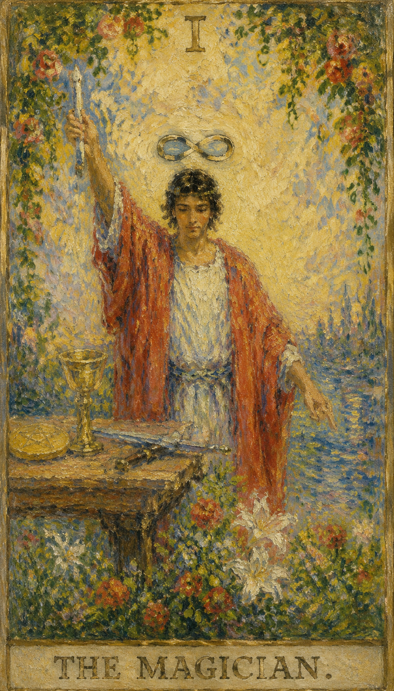

# 魔术师

四个词形容他：

创造力、行动力、掌控力、有意识。

塔罗牌魔术师正在实行法术，他右手高举权杖指向天，召唤神奇的法力，左手食指指向地，象征了他是联合天与地的桥梁，主宰者地上的一切。他身前的桌上放着权杖（火元素），圣杯（水元素），宝剑（风元素）和星币（土元素），既代表塔罗牌小阿尔卡那的四个牌组，也是四要素的象征。他身穿得红袍代表热情与主动，白色亵服代表内在的纯洁与智慧。他具有无穷的创造能力与潜力，但需要坚强意志和纯洁内心的保证。他的腰带是一条蛇，在这里的蛇不是代表邪恶，而是象征智慧和启发。头上的八字型符号代表其法力的无穷。四周绕着鲜花，红色的玫瑰象征热情，白色的百合象征智慧。鲜黄的背景预示着未来的成功。魔术师在塔罗牌中的编号是一，意味着一切真正的开始。

魔术师从天空中（灵感）接受能量，一种灵光一现的灵感或者是自我的意识，并将这些能量导入某种具体且真实的东西——土地。也就是说他将想法转化成一些我们看得到，摸得着的事物。他运用他的意志力产生了具体的成果；他不是被生活的潮流推着走，而是在这些潮流中为他自己行动，并做出具体的成果。

魔术师背后的符号包括魔术棒、圆盘、剑和杯子，分别代表着力量、财富、思想和情感。这四个符号组合在一起，代表着魔术师拥有全面的能力和智慧，可以掌控所有的局面和机遇。魔术师还拥有自信和勇气，是一个具有创造力和想象力的人。

由此，可以看得出，魔术师他是一个个人意识和宇宙能量的结合，同时能够通过自己手里资源的整合充分发挥主观能动性最终达成目的。

整体牌面充满着希望的美好的能量，只要你愿意付出去努力，那你这件事就可以达成。

## 牌面要素

- 元素：风
- 星座：双子、处女
- 行星：水星【手臂、手、肩膀、肺、支气管、呼吸道、神经系统】
- 希伯来字母：第二个字母Beth(Beit)

### 提问：一共几种颜色？说出颜色的代表的含义。

| 要素 | 含义 |
|------|------|
| 白色内衣 | 纯净和精神上的事务，可能象征纯洁的动机和行为。 |
| 红色斗篷 | 激情、能量和力量；象征行动和意志力、热情与主动。 |
| 白色长袍 | 纯洁和无暇，代表内在的灵性和智慧。 |
| 上举的右手 | 连接高等力量的手势，象征从宇宙中汲取能量。 |
| 左手指向地面 | 接地的手势，意味着现实世界与精神世界的连接和平衡。 |
| 魔术师桌上的工具 | 杯子、宝剑、权杖和星币象征塔罗中的四个元素：水、空气、火、土。代表不同的层面和能力。 |
| 横向的无限符号 | 无限可能和永恒，代表精神性和知识的无限流动。 |
| 红玫瑰和白百合 | 红玫瑰代表激情和欲望以及行动的热情【生】，白百合代表纯洁和心灵；智慧【死】。 |
| 葡萄藤 | 成长和连接自然的象征，它们通常表示生命力，以及自然界的丰富和多产。 |
| 黄色背景 | 快乐、知识和智慧的颜色，它可以是正面能量、激情和活力的来源，未来的成功。 |
| 表上的工具布局 | 排列有序，表明思考有组织、计划周密。 |
| 权杖/魔杖 | 代表种下意图或行动的“种子”，象征开始行动、火、行动力、创造力、热情、激情。 |
| 红色腰带 | 忠诚与责任的符号，也可能是能量和生命力的象征。 |
| 牌边缘的花朵 | 自然的丰饶，也代表生命的不断循环和更替。 |

## 塔罗灵数

数字1、象征着开始、开端和新事物。

- 数字1、关键词：独立、自主、将军、主动积极。
- 数字1、金钱关键词：创造力、点子多、小聪明、领导力
- 数字1、感情关键词：固执、爱恨分明、听我的、立场清晰，不喜欢浪费时间和金钱在无趣的情感上。
- 数字1、很多人是创业家，冲动，做事很拼、比较有语言天赋，可以学很多国外语言、演讲，适合做独立性较高的工作，不喜欢被别人管束，感情上喜欢别人听他的。

塔罗牌：魔术师(阳性能量)所有含有数字1的牌。

能量倾向特质：独立

数字1、是所有能量的源头，它能提供驱策其他数字发挥活力的能量。

数字1、越多越纯，表示活力旺盛，精明干练，自动自发，具备成功的所有条件。不耗尽这股力量容易导致忧郁和气馁。

数字1、使人立志独立，1的数字越多，想独立的意念越强。

数字1、代表领导权和创造力、如果两者未平衡发展，将会令他人不自在、过度的武断和独裁。

数字1、的影响太强烈会使人显得自私和专横霸道。

数字1、的课题是：如何和他人合作，听听他人的意见。不要钻牛角尖。

魔术师是1号牌，1是单数、奇数，在毕达哥斯拉学派中认为1是数字的开始，属于阳性数字，代表了创生与起源，1也是万物之母及智能的象征，在图象上的代表为点。因此魔术师是一张阳性能量很强的牌，他最大的能量就来自于创造力。

### 提问：你觉得魔术师适合单身还是适合恋爱？

魔术师在无论在单身还是恋爱中都喜欢晒给别人看，谈恋爱的话会变得专一，有伴侣的话，他会引导伴侣变得优秀、赞美伴侣、喜欢秀恩爱，如果他很花心的话，说明他的伴侣跟不上他的节奏。单身的话，在人群当中受瞩目很有人格魅力、自身带有很强的气场，他很优秀、有一技之长、不缺桃花。

### 提问：你觉得魔术师喜欢什么样的伴侣呢？

魔术师喜欢能够感染他和带动他和愿意欣赏他美好的并且能够支持他的事业或者正在做事情的伴侣、不会带给他很多负面情绪和压抑的伴侣，要给他独立的空间，他喜欢独立思考和反省自己，喜欢氛围感和新鲜感，审美力和洞察力很强，享受得到别人的关注，如果分手的话，不会拖泥带水，果断决绝。

## 魔术师正位

**关键词**：受好奇心驱使展开调查研究，具有独创性，具备发展潜力，展开新的计划并获得成功，幸福的开始，显现，表现，显化，表征，机智，足智多谋，智慧，丰富资源，控制力，影响力，操纵力，统治，政权，能力，机会，驱动，推动，迅速移动，快速前进，灵感

这是个着手新事物的适当时机。对的时间，对的机会，对的动机，使你的努力值回票价。对于展开行动，实现计划而言，这正是一个良好时机。由于你已为实现计划扎下良好基础，所以新的冒险很可能会实现。清楚的方向感和意志力的贯彻，大大的提升了成功的可能性。

### 爱情/婚姻

**关键词**：心有灵犀一点通，表现的很爱，进入下一阶段，控制欲强，情绪变化快，出现新的恋人，默契的伴侣

将有一段新恋情展开，对方备受异性欢迎，两个人都是比较务实的人，彼此间的性格是互补型的，两个人在一起做事能默契配合，不会因为特质方面的因素而影响到感情。两人在一起能够品尝爱情的喜悦，会以不断变更约会地点和方式，来令彼此保持新鲜感。

- **现况**：在感情当中充满热情，也有主动表达与沟通的能力，再加上在动机上十分单纯，应该是一段感情丰富的时期。
- **桃花**：其实新恋情的对象已经出现，只是你没有注意到而已，若是细心观察自己所处的环境，主动出击必然会有结果。
- **看法**：这是一段很有前景的感情，但现在还是刚刚起步的阶段，在这段感情中应该要主动付出，未来才会有好的收获。
- **复合**：这段感情完全没有复合的可能性，也许是已经有了新欢，或是即将出现更好的对象，不要在旧情人身上浪费时间了。

### 事业学业

**关键词**：学习努力，工作高效，思维敏捷，调配资源，运筹帷幄，进展顺利，智力非凡，想象力丰富

工作方面，头脑灵活，充满创意，处理事务得当，工作效率较高，并且非常注重细节，能够充分发挥自己所学，在工作中的创意可能得到旁人认同，适合从事艺术方面的工作。同时因为喜欢充满创新的工作，所以也适合从事技术创新，播音员，大众传媒等相关工作。学业方面，对学习非常有兴趣，也很努力，而且能以一种新的方式读书，并获得好的成绩。

- **现况**：你面对一个新的工作，这个工作的资源十分充足，只要你能把握机会，发挥主观能动性，就会得到你想要的东西。
- **建议**：你需要使用新的观念和方法去处理问题，把握即将到来的机会才能突破困境，有时候也可以考虑作用新人来负责这件事情。
- **人际**：在工作当中最重要的是与别人沟通，这会帮助你开展人际关系，拓宽道路，使事情的进展更加顺利。
- **发展**：这个工作的未来还有很大的发展空间，但还有很多东西没有成型并规范，你可以在这个工作当中创造更多的自我价值。

### 人际财富

**关键词**：人缘佳，喜交友，善经营，人际关系中的焦点，计划完美，发展空间大，成功，果断，好的开端

人际关系方面，人缘不错，喜欢结交更多的朋友，懂得如何与不同人交往，从中寻得良师益友，并与之深交，是一个有头脑的人。财运方面，很有经营头脑，会寻求与自己性格互补之人作为合作对象，重视收入与产出，能够以拿理公道的代价获得想要的东西。

- **现况**：你面对新的人际关系结构，但当中还有很多空间是你可以去参与和创造的，所以要把握机会和新朋友处理好关系。
- **建议**：要主动沟通来化解误会，很多事情只要谈开来，其实也不是什么问题，别让一时的误会影响彼此的关系。
- **财运**：一切还在起步的阶段，但是仍然有许多发展的空间，这时需要按部就班地把事情完成，才能得到自己该得的。
- **建议**：考虑问题时必须符合各种不同的需要，但是由于自己还是有很大的主导权，所以仍然会存在一些自主发挥的空间。

### 健康生活

**关键词**：精神状态稳定，适合知性的装扮，知识丰富，养生有道

关于健康的问题都能解决。生病对你而言是一个警铃，告知你生活上缺少了某样东西，可能是好好的休息，也可能是均衡的饮食；但不论是什么问题，只要你倾听身体的需求，凭着你自己的意志力和自然的疗养法，必能获得很大的改善。

### 其它牌意

喜欢阅读并从中获得知识和快乐，可能会有短期的履行，对语言学习颇有爱好，适合郊外野餐，拥有灵敏的运动神经，适合参加辩论会，善于模仿并所以获益，处事机灵善变，事事顺利。

## 魔术师逆位

**基本牌意**

**关键词**：犹豫未定，因学艺不精而败北，看待事物过于消极，易受骗上当，遇事言而不行，操作，操纵，操控，推拿，处理，计划不周，人算不如天算，百密一疏，怀才不遇，有潜力

对别人进行控制可能导致毁掉对方，可能是暗中作梗，或以任何他想得到的方法，这可能包括仪式魔法，雇人暗杀，自己动手。也可能做出违反社会的行为。可能会变得不切实际，而导致精神，情感或身体健康上出问题；会变的漫无目标且缺乏自律。

### 爱情/婚姻

**关键词**：不善表白，容易受骗，看不见优点，对未来消极看待，爱情没有进展，注意伴侣的行为

当喜欢一个人时，不善于向对方表白，也缺乏爱情技巧，而且容易受甜言蜜语者蒙骗，从而在感情上受到伤害。走入婚姻之后，不善于经营感情，可能会变得心情浮躁，对感情没有办法专一，如果不加以调整，也可能会变得冷酷无情，与另一半无法沟通，使婚姻走向终结。

- **现况**：在感情当中充满热情，但有时显得过于冲动，这时若是遇到沟通不畅的状况，可能就会引发隐瞒与欺骗的行为。
- **桃花**：目前十分有可能发生新恋情，但是因为条件还不是很成熟，所以还需要等待一阵子，这时候观察比行动更重要。
- **看法**：这段感情现在陷入沟通不畅的状况当中，有些话若不说出口，可能就会因此发生大误会，必须花很大的精力才能化解。
- **复合**：这段感情没有任何复合的可能性，即使回头也无法得到一段完整的爱情，千万不要在旧情人身上再浪费时间了。

### 事业学业

**关键词**：成绩不佳，工作无作为，专业技术不够，失败，态度消极，做事匆忙，优柔寡断，才能平庸，缺乏技术

学业方面，可能会因为自己的努力不够，致使考试失误，成绩不理想，退步明显，需要改变自己的学习方法，投入更多的精力在学习上，才能取得预期的成绩。工作方面，容易因为所从事的工作一成不变，而产生厌倦的情绪，进而陷入恶性循环之中，从而在工作上无所作为。

- **现况**：你面对的新工作，资源并不充足，运行也不规范，所以最好先掂量一下自己几斤几两，把自己的分内的事完成好。
- **建议**：你应该专注于自己的工作，并且把遇到的问题和困难据实以报，若是领导无法提供支持，就只能靠自己想办法了。
- **人际**：在工作当中可能会发生沟通不良，所以在说话的时候更要小心，别陷入派系斗争当中，要保持中立以求自保。
- **发展**：这个工作的未来还有不错的发展空间，但是中间还必须经过很多的改革和波折，若是能坚持下来应该就会有所成就了。

### 人际财富

**关键词**：待人欠真诚，花钱如流水，背人做事，没有判断力，没有创造力

人际关系方面，不太懂得人情事故，只为自己着想，待人接物欠缺真诚，只是在表面上维持一种虚假的敷衍，容易因此而失信于人，交不到真心的朋友。财运方面，不会理财，花钱大手大脚，内心也比较贪财，并容易因此而遭遇欺诈，也可能因为好赌而倾家荡产。

- **现况**：你面对的新人际关系结构，以往的一切都不再可靠，所以要把握机会和新朋友处理好关系，这对你只有好处没有坏处。
- **建议**：这时候你需要更有技巧的沟通，以免自己的意思被对方误会，如果能倾听对方的想法，会帮助你判断事件情况。
- **现况**：身处在刚起步的阶段，要小心各种陷阱和欺骗，不要自以为是，此时应该以保守为宜。
- **建议**：很有可能遇到诈骗或是不良产品，所以要格外的小心谨慎，特别是在验收时严格把关，以免发生一些不必要的纠纷。

### 健康生活

**关键词**：精神紧张需要休息，情绪急躁轻易激动，呼吸器官或大脑负荷过重，着装不搭调

由于你的想法很多，想要实现的欲望也很强，但却没有能力具体化，因而造成你精神上的困扰；长期累积的结果会导致幻觉，精神分裂，或精神崩溃，严重的抑郁症或焦虑症。

### 其它牌意

旅行计划取消，遭遇交通堵塞，因懦弱造成竞技失败，不听他人劝告。