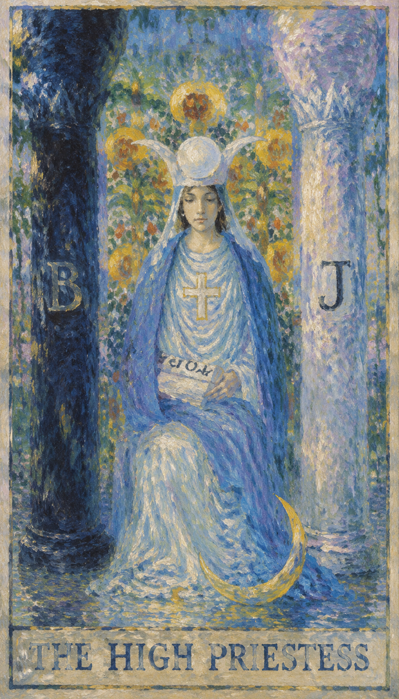

# 塔罗牌女祭司相传是月亮的使者

塔罗牌女祭司相传是月亮的使者，虔诚，静默却又透着十分的警觉和睿智，是智慧与直觉的象征。相对于魔术师的激情和主动，女祭司只是在深夜中手捧经书默默地祈祷着，似乎是中国传统文化中的阴阳。

由图中可以看到，女祭司端坐于石凳之上，手上的卷宗上书写着 Tora，乃律法之一，代表她内心的知性和洞察力，长短分明，善恶明暗，也代表神秘的魔法，静静等待适合行动的时机，并给于明确的指示。身侧的柱子一黑一百，也暗示了她阴阳的强烈观念，理性的思考和判定。白色的头冠和白色的长裙，象征了她内心的纯洁和对洁净的要求。背后的绿叶和果实，既象征她的女性形象，慈爱和娴静，同时也暗示了她具有强大的直觉力和判定力。石榴暗示着希腊神话中的灵后（Persephone）吞下的婚姻不中断的石榴子。她裙角边的月亮，也是智慧和直觉的象征，石榴的含义有欲望和剥开自我的思考力和洞察力。

假如说魔术师散发着阳刚的话，那么女祭司则是阴柔的代表，于静寂中凸现沉稳，与寡言中凸显睿智。也有人说，女祭司内心是矛盾的，就像其坐在两根黑白分明的廊柱之间那样，静默却又波涛汹涌，在黑与白，日与夜，正义与邪恶的徘徊中体验生存的意义，感悟人世沧桑。

**原型：珀耳塞福涅 (Persephone)**  
来自古希腊神话，是冥界之后与生命循环的象征。关联牌面中象征生命与秘密的石榴，并代表在沉默与被动中孕育的内在力量与智慧。

## 基础要素

1.  女教皇 (The Papess)
2.  数字编号：II (2号牌)
3.  星座或行星：双鱼座·月亮
4.  元素：水
5.  希伯来字母：第三个字母 Gimel
6.  象征符号：骆驼
7.  代表意义：智慧
8.  生命树路径：第三条，在王冠 (Kether) 与美 (Tiphareth) 之间

## 提问：数一数女祭司上面一共有几种色彩？

| 要素 | 解释 |
|------|------|
| 蓝色披风 | 蓝色常与智慧、深思和冷静联系在一起，可能暗示深内省和直觉。 |
| 黑色与白色的柱子 | 代表对立和极性的平衡，如阴阳、积极与消极，或物质与精神。 |
| 十字牌头饰 | 十字可能代表平衡、信仰和神性。它也可以象征心智和物质世界的交汇。 |
| 月亮图案 | 月亮常与女性能量、直觉和潜意识相关联。 |
| 背后的帷幕 | 可能代表隐藏的秘密或更深层的真理，需要进一步的内省才能揭开。 |
| 卷轴 | 学习和知识的象征，代表寻求或拥有的智慧、自然的律法、自然之道。 |
| "B" 和 "J" 字母 | 代指《圣经》中的柱子——波阿斯（Boaz）和雅挺（Jachin），B：力量，J：树立和建设光明无限。阴阳平衡。 |
| 满月和新月的图案 | 指明周期、变化、时间流逝和直觉的循环。 |
| 白色的长裙 | 白色一般是纯洁、无罪和启示的颜色，可象征内在的光明与真理。 |
| 纹章十字 | 表示宗教信仰、神圣保护以及可能的神圣使命。 |
| 黄色地面 | 可能代表意识和智能，黄色关联着阳光、活力和快乐。 |
| 十字胸前束带 | 可能是参与者的忠诚于某种宗教或精神信念的标识。 |
| 横跨的蓝色帷幕 | 表示知识和神秘事物的隔离，一种进入深层直觉和高意识状态的象征。 |
| 高级祭司的头饰 | 表明其地位高高在上、与神圣领域的直接联系，三相女神。 |
| 植物图案 | 常见于生长和繁荣的象征，可能表示自然和直觉。 |

## 提问：你对女祭司的感受什么？

## 数字 2

**数字 2 的关键词：** 依赖、细心、配合、情绪

**数字 2 金钱关键词：** 学习力强、直觉敏感、喜欢团队合作和人互动

**数字 2 感情关键词：** 浪漫多情、喜欢温柔体贴、双重性格、情绪化、优柔寡断

**数字 2 的人：** 很细心、喜欢有人陪伴她，内在性的数字、心思细腻，感情害怕孤单一定要人陪伴、依赖别人、没有主体性

**塔罗牌：女祭司 (阴性能量)**  
所有带有 2 的牌能量倾向特质：依赖【吸收别人的能量和受到别人的干扰】

- 2 数和 1 数相反，代表接收能量。
- 2 数的人对份量均衡非常敏感，生怕吃亏，深谙图利之妙，旁人不易占他的便宜。
- 2 数意识到一体存在着两面，故擅长分析和解决问题，看事情较为透彻。因此天赋有写作、说故事、戏剧表演，甚至有双重人格。
- 2 数人也擅长比较搭配，对穿着及生活极有品味。
- 2 课题：如何在和他人互动时也可以独处、不要当别人的负面接收器、不要过度共情别人、管控自己的高需求和情绪化。

【2】是二元对立，也是一种分化，代表了精神与物质、灵与肉、生与死、正与反的分别与相对，以及两端相互辨证的思考方式。

## 女祭司的正位牌意

**关键词：** 冷漠、袖手旁观、神性、宗教

**正位关键词：** 有知己的，文静的，知性的，理性的，富有研究精神，具备敏锐的洞察力，有正确的时机或人将出现的预感，直觉，第六感，天启，启示，天象，圣女，气质，女神，潜意识

你应该要相信你的直觉，因为在这一点上，有些东西你可能看不见。高位的女教皇是一张代表精神和心灵发展的牌。它代表了向内心探索的一段时期，以便为你人生的下一个阶段播种，或者去消化你在肉体的层次上所处理的事情。

### 爱情婚姻

**关键词：** 柏拉图式的恋情，高冷，不食人间烟火，对俗事无趣，喜欢精神交流，喜欢探讨人性

女祭司正位表明在爱情中你可能处在一个需要倾听直觉和感受的阶段。这是一个探索深层情感联系和内在情感世界的时期。

你与另一半将保持一种理智的感情状态，两个人更重视精神方面的结合，拥有高度精神或心灵发展的关系，你们俩人可以一同学习，成长和发展。对方是能够为你消除烦恼的对象，对你的爱意深藏内心。你们是介于友人与恋人之间的关系，经常会以诗篇或文章来表达爱意。

- **现况：** 感情进入到稳定的阶段，两个人都过了热恋期的积极，虽然表面看起来有些冷清，还是有很深的感情存在。
- **桃花：** 现在并没有新恋情出现，目前是一段适合你休息的时间，与其把心思花在新对象上，不如利用时间多充实自己。
- **看法：** 在内心有很深的联结，即使两个人有很多的不同点，但是都可以努力达到平衡与和谐，这是个学习的过程。
- **复合：** 这段感情并没有复合的可能，保持距离才是最好的办法，你需要更多的时间来反省这段感情对你的意义。

### 事业学业

**关键词：** 考运佳，有责任感，蒙的很多，感觉很准，优秀的判断力和洞察力，擅长精神方面的研究

工作方面，你对待工作很有责任感，拥有明确的目标明确，会苦心钻研各种工作技能，能够拥有展现自身潜力的机会，具备评论才能，适合从事与教育相关的职业。学业方面，你的求知欲非常旺盛，对于各种知识都想要去了解和学习，具有很好考运，通常能在考试中取得好成绩。

**工作职业：** 助理、光看不说的职业、绘画师、作家、编剧、作曲家、心理咨询师、护士、精神教育者、保姆、科研研发、幼师、服务行业、全职太太、会计、银行柜员。

- **现况：** 工作情况十分稳定，也不会有什么变化，这个时候不宜太过积极，只要把事情依照原来的方式按部就班地完成即可。
- **建议：** 问题还没完全显露出来，这时候应该要耐心等待，或是先查阅各种的文件和规定，为解决问题做好万全的准备。
- **人际：** 人际关系在这个工作当中并不是很重要，所以与别人的互动也不太多，要注意不可以随意谈论工作中的秘密。
- **发展：** 这个工作的未来发展还不明朗，但是维持现状的可能性比较高，不要对这个工作有太大的期待，要比较保守地看待。

### 人际财富

**关键词：** 待人体贴，善于理财，不会冲动消费，对物质没什么喜好，独立自主，有知己，善于交流，意志紧强

人际关系方面，你性格温和，为人低调，不喜欢张扬，对待朋友非常宽容，可以结交不少知心好友，而且与朋友能免互相体谅，人缘不错。财运方面，很少会盲目消费，善于理财。具有谈判的口才和能力，可以凭自己之能力，得到好的赚钱机会，并获得丰厚利润。

- **现况：** 你并不积极参与各种社交活动，自己的活动空间相对自由，人际关系上保持现状对你来说比较好些。
- **建议：** 当两个人有不同意见时，可以寻求公正的第三方来仲裁，如果两个人自己吵来吵去，反而会使彼此的误会更加深。
- **财运：** 现在处于稳定的状态，不需要太担心钱的问题，但是也没有什么发展空间，把自己分内该完成的事情做完就好了。在财富方面，女祭司鼓励你通过直觉和智慧来做出投资决策。可能不是进行大额投资的最佳时机，而是应该谨慎行事，了解背后的真相和细节，喜欢闷声发财。
- **建议：** 现在应该要保守一点，不要做太大的变动，对于所有新的投资机会不要太冲动，而是应该要理性地评估其可行性。

### 健康生活

**关键词：** 着装朴素简洁，善待身体，注重自身卫生，坐骨神经、妇科、宫寒，手脚冰凉、体内循环不太好

在健康方面，她的个人特质尚不明显，因而她必须时时倾听身体的需要，注意生活中的种种暗示，以获得身心健康容易得心理疾病、因为容易情绪化。

### 其它牌意

制作手工艺品，知性的娱乐方式，脑力游戏，无须外出的活动方式，出众的理解力，同冷静的女性商洽可获得新知，善于洞悉他人。

## 女祭司的逆位牌意

**关键字：** 坐不住、失去平衡、冲动

**关键词：** 粗心大意，易紧张，神经质，意气用事，因精神压抑以致歇斯底里，缺乏理性思维能力，秘密，机密，诀窍，秘诀，奥秘，奥妙，没感觉，撤走，收回，取回，不再参加，退出，提款，取款，寂静，安全，无声，沉默，缄默，默不作声，缄口不谈，拒绝回答，压制，冷场

你没有办法倾听你内在的声音，或你内在的知识没有办法转化成行动。这个时候应当出去走走，认识新朋友，因为刚认识的人可以帮你介绍新的可能以及机会。例如，你可能会因此而找到新工作或新伴侣，或者得到崭新的理解。

### 爱情婚姻

**关键词：** 面对心仪的对象却不主动，在心仪对象面前脑袋空白，傻傻的看着，六神无主，与女性朋友争执，单相思，晚婚或独身主义

女祭司逆位暗示在爱情中可能存在秘密或未被理解的情感。可能有人在隐藏情感或不愿意沟通，导致关系中的误解或距离。

你的内心过于封闭，性格有些被动，即使有了喜欢的对象也不愿主动追求，而是会采取暗恋的方式默默喜欢对方，最终容易因此而错过好的缘份。假如走入婚姻，容易因为自己不善于表达内心情感，与另一半缺乏沟通，而让对方感觉你太过冷漠，对你产生误会，抱有成见。不适合早婚，容易率性妄为。

- **现况：** 两个人的感情整体来看还算是稳定，但是仍然有很多分歧还没化解，如果无法好好沟通，将会演变成冷战的状态。
- **桃花：** 现在也许有新恋情出现，但是并不合适，如果只是一时冲动开始一段感情，反而会带来更多的问题。
- **看法：** 两个人仍然有一些问题需要解决，保持热情去处理各种冲突，只要能够好好应对关系就会很和谐。
- **复合：** 这段感情仍然有一丝复合的可能，但是若无法克服两个人之间的问题，再在一起只是更痛苦而已，并不值得鼓励。

### 工作学业

**关键词：** 固执，学习能力差，想不通，考核紧张，粗心大意，无知，缺乏理解力

工作方面，性格固执，认知肤浅，不喜欢学习新事物，却又自以为是，工作上不能集中全力，遇到压力时容易感到焦虑，也容易因为自己的犹豫不定而错过良机。适合从事一些轻松无压力，对工作技能要求不高的工作。学业方面，比较懒惰，不喜欢用功，对所学知识没有办法学以致用，考试容易失利。

这张牌的逆位可能意味着在财务决策中缺乏直觉的指导，或许是盲目跟随他人而非自己的直觉。需要警惕可能的欺诈或隐藏的财务问题。

- **现况：** 虽然工作看似已经很长一段时间保持稳定，但是在台面下去是暗潮汹涌，一个不小心可能就出现大纰漏。
- **建议：** 重要的是要把不同意见整合在一起，或是在不同立场之间取得平衡，如果倒向任何一方都有可能会血本无归。
- **人际：** 不论是对你好或是不好的人，对你的工作都没太大的帮助，甚至有时候刻意逢迎你的人，反而是想要害你的人。
- **发展：** 这个工作未来还会有很多变化，从现在开始已经慢慢可以观察到了，若是想在这里待下去，就要做好应变的准备。

### 人际财富

**关键词：** 人缘差，花钱无节制，神经质，有洁癖，对人冷淡，自我封闭

人际关系方面，因为太过封闭自我，不善于与人沟通交流，所以容易受到别人的冷落对待，有时又容易因过于激动而得罪人，从而被人中伤，人缘较差。财运方面，赚钱机会不多，且不善于理财，消费缺乏计划性，浪费成性。应养成储蓄的好习惯，尽量控制自己的消费欲望。

- **现况：** 喜欢你的人非常喜欢你，讨厌你的人也非常讨厌你，整体来说是个比较有争议的人，应该好好把握欣赏你的朋友。
- **建议：** 寻找误会发生的原因，以此为基础好好去讨论，也许在经过沟通后，会发现引发冲突的只是一个小误会。
- **财运：** 现在已经出现财务上的亏空，如果不能及时处理的话，小问题可能会发展成大问题，所以要诚实面对以防微杜渐。
- **建议：** 现在并不宜冲动投资，如果有赚钱的投资也要快点获利了结，如果放在原地不去处理，会发生很大的变化。

### 健康生活

**关键词：** 精神紧张，歇斯底里，错误的减肥计划，贫血，淋巴、因率性而倍感孤独，嘲笑他人，心胸狭隘

由于你的态度傲慢，个性好强，给自己的生活造成很大的压力，因而引发肠胃病，以及贫血等健康问题。

### 其它牌意

无心读书、吵闹的环境使得身心倍感疲惫。