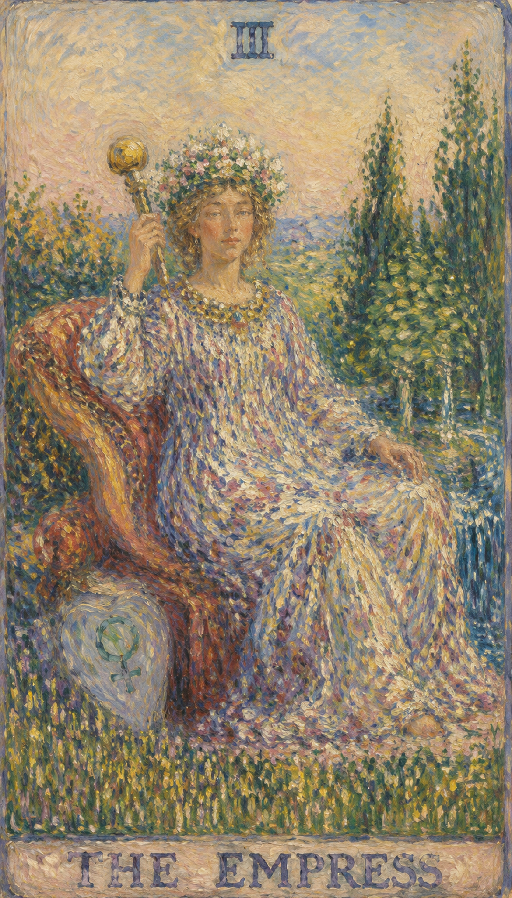

# 皇后

皇后代表生命自然生长的力量。她以滋养、接纳、审美与耐心推动万物，使种子在适宜的环境里慢慢结成果实。若说女祭司是身具智慧的文静淑女，那么皇后便是热情与高贵的化身——舒适的坐垫、雍容华贵的衣饰，都在无声地宣告着她的富足与权威。

当这张牌出现，往往意味着关系、创作、身体或现实生活正在进入可以开花结果的阶段。皇后代表着一条经由感官通往心灵的途径，她是激情甚于理想主义的存在。她的手腕与分享性都相当务实，因为她深知：无论必须付出什么，此刻都是付出的最佳时机。这正是占星学上天秤座所要学习的课题——爱并非一种理想主义或知性上的练习，而是身体、情感与感觉上的分享，是日常生活中所亲历的喜悦。

皇后坐在丰盛的自然之中，身边环绕着麦田、河流、树木与金星符号。她和魔术师一样右手高举权杖，但她的权杖少了几分锐气，多了几分生机，因为那是天地间掌管生命的法器。红色座椅下方刻着金星与维纳斯的心形标记——她是天秤座与金牛座的守护神，这个符号代表透过爱使心灵与物质世界彼此交流，常被用来象征女人、母爱天性与皇后包容子民的富足。长裙上的果实象征生养，身后的森林与流水代表大地的复苏与盎然生机，因为母亲就是大地，孕育万物；金黄的谷物代表丰收，豪华的靠椅与红丝绒坐垫则映出皇后的高贵与繁荣的物质景象。她的姿态安稳而柔软，象征物质世界中的美、爱与孕育，也象征懂得照顾、等待与滋养的智慧。

## 基础要素

1. 牌名：皇后 (The Empress)
2. 数字编号：III / 3 号牌
3. 核心主题：丰饶、滋养、创造、感官与母性
4. 元素：水 / 土的丰饶感
5. 星座或行星：金星
6. 希伯来字母：Daleth（达列斯）
7. 代表意义：让爱、美与创造力进入现实生活

## 牌面要素

| 要素 | 含义 |
|------|------|
| 十二星冠 | 冠上的十二颗星通常对应宇宙的十二星座，象征自然周期、四季节律与宇宙中的女性智慧，也代表精神的高度。 |
| 麦田 | 土地的丰饶与丰收，关联着身体、物质丰盛与可见的成果，是生活中富足与物质回报的写照。 |
| 河流 | 水流象征情感、直觉与潜意识的流动，也滋养着生命的延续。 |
| 金星盾牌 | 心形盾牌上的金星符号，代表爱、美、吸引力、关系与女性创造力，是维纳斯的标志。 |
| 心形图案 | 与爱情、情感及人类的善良相联系，是情感丰富与慷慨的表示。 |
| 柔软坐垫 / 红枕头 | 舒适、感官享受与安全感的象征，也代表物质财富、稳定与安逸。 |
| 森林背景 | 自然世界的一部分，象征自然力量、孕育环境、生长、丰饶与生命循环。 |
| 权杖 | 手中的权杖是权力与统治的象征，也代表生命力与能量。 |
| 柳树枝 | 柳树常与灵活性和女性能量联系在一起，象征女性的直觉与柔韧。 |
| 石榴图案 | 白袍上的石榴是生育与丰饶的象征，与女性的生命力和创造力相关。 |
| 鲜艳的花朵 | 众多颜色鲜明的花朵表示美丽、生命力与生长的喜悦。 |
| 金色胸甲 | 其颜色与材质代表财富与精神性的保护。 |
| 缎面衣裳 | 富有与优雅的象征，表示细心的关照与舒适。 |
| 大自然的颜色 | 牌面中的自然元素色调代表从地球而来的生命力与能量。 |
| 皇冠与星星联合的符号 | 象征神性的指引，以及穿越物质与灵魂世界之间的力量。 |
| 胸前的印记 | 肥沃与奉献的象征，可能代表女性的身份符号或生育力量。 |

## 塔罗灵数

数字 3 是创造后的表达，是一与二结合后产生的新生命。它代表扩张、孕育、艺术、社交与成果显现。

皇后作为 3 号牌，强调生命的推进需要关系、身体、资源和环境共同参与。真正的丰盛常常来自持续照顾，来自日复一日的温柔经营。

## 牌面解读重点

皇后描述的是具有女性外在特质的人事物，并不一定单指某个人。正位代表具有母性光辉的独立女性品质——懂得滋养、能够创造、内在富足；逆位则指向不具备传统道德观念、缺乏独立性的女性特质，容易依赖、被动或放纵。在事物层面，这张牌也可以用来刻画一个人的行事风格：是经由感官与情感去经营生活，还是停留在被宠溺、被消耗的状态。

## 正位牌意

**关键词**：丰盛，怀孕，创作，滋养，魅力，舒适，关系成长，物质稳定，优雅，富贵，女权主义，女性化，女人味，女性特质，美人，美物，好榜样，典型范例，自然界，自在坦然，天性，本性，养育，养护，培养，扶持，支持，助长，量产，充裕，丰富，母性，创造力，丰饶，和谐，照顾

正位的皇后说明事情有自然成长的条件。你只需照顾它、喂养它，并允许成果按自己的节奏成熟。这是一张代表母性与丰饶的牌，象征创造力与生命力，示意慈爱、温暖与舒适，也代表懂得享受生活、照顾与呵护他人，带来安慰与满足，是女性力量最丰润的展现。

### 爱情/婚姻

感情中代表温柔、吸引力、亲密感与关系成长，是一段浪漫、热情而忠诚的关系。皇后正位常带来异性缘旺盛的时期，你容易散发魅力、成为异性瞩目的焦点，能够收获一段充实而美好的恋情，并轻松顺利地一路发展到谈婚论嫁。你和伴侣是透过感情与欢乐来贴近人生，而非经由思想——这是一段慈爱、关怀、感性而幸福的婚姻，有温馨的家庭、恩爱的夫妻与体贴的关怀。若询问婚育，也常有怀孕、备孕、家庭扩张的象征。

- **现况**：这是一段重视享乐的关系，两个人都十分看重生活品质，能从对方身上得到许多快乐，彼此关系非常和谐。
- **桃花**：眼下很可能发生新恋情，而且对象或许不只一个，若主动出击必定会成功，只是该如何取舍反而成了甜蜜的烦恼。
- **看法**：这是一段很有建设性的感情，现在已经相当美满，却仍有许多值得期待之处，未来的甜蜜无可限量。
- **复合**：这段感情仍有情分在，能否复合要看你自己的主观意愿；若由你主动提出重修旧好，成功的可能性相当高。

### 事业学业

事业学业上适合创作、设计、教育、疗愈、餐饮、美业、内容生产，以及一切需要审美与照顾能力的工作。项目有成长潜力，正要进入成熟与丰收的阶段，需要持续投入，耐心会比急切更有力量。这是一张代表创新思维与成功事业的牌，意味着体面的工作、优雅的生活、富有成效的努力与有益的合作；学业上则有优秀的成绩、良好的学习环境与丰富的知识积累。皇后也常象征公众人物，以及事业中那份母性般的关怀。

- **现况**：现在工作正要进入丰收阶段，之前付出的努力已开始看到回报，只要继续努力就能达成预定目标。
- **建议**：做事前要有周详的计划，再在适当时机主动积极地处理相关问题，对于计划之外的状况则要小心应对。
- **关系**：你在这份工作中的人际关系很好，也会对工作本身有极大帮助，目前只要继续维持这份和谐即可。
- **发展**：这份工作的未来有很不错的发展空间，一步一个脚印把事情做好，静待机会到来就可以了。

### 人际财富

人际关系上容易获得支持，也适合用温和的方式连接资源。你性格开朗、感情丰富、心胸开阔，待人亲切，常以母亲般的关怀照顾他人，因而拥有和谐的人际关系，能建立持久的友情，营造出友好的氛围与有爱的社区。财富方面代表收入增长、生活条件改善、资源增加，常有意外之财与不错的财运，但也提醒你把钱花在真正滋养生活的地方。

- **现况**：现在你正处于人际关系的高峰，受到众人欢迎，足以达成你想通过人际所实现的目的。
- **建议**：解决问题并不困难，关键在于你能否主动去了解问题的成因——事情仍在你的掌握之中。
- **财运**：眼下财务算是宽裕，但花费也会多一些，若能在收支之间取得平衡，便能让自己过得更从容；此刻正是可以有所收获的时间点，不妨投入新的投资，相信自己的判断，未来会有更多收获。

### 健康生活

健康上关注身体、荷尔蒙、饮食、睡眠、皮肤、女性系统与整体舒适度。温和、自然、长期的调养方式，会让身体逐渐恢复丰盈。皇后鼓励你善待自己的身体，用感官的喜悦与生活的丰润去滋养自己，让身心回到舒适、安定而充满生命力的状态。

### 其它牌意

可能代表母亲、妻子、创作者、照顾者、园艺、艺术、怀孕、丰收与舒适生活。皇后也喜爱逛街购物，热衷远足、派对等集体活动，享受人群与生活带来的丰盛感。若问事情发展，正位多表示环境有利，适合顺势培育。

### 情境指引

- **过去**：曾是一段充满爱与关怀的时期，或许有一位女性或母性人物给予了你许多支持与鼓励。
- **现在**：一个充实而满足的时刻，你能感受到生活中的丰富与繁荣。
- **未来**：可能带来新的生命力，也许是新的关系、项目或想法正顺利地萌发与成长。
- **挑战**：如何保持现有的丰富状态，并在生活的各个方面维持平衡。
- **障碍**：过度纵容或依赖，需要留意不要忽视个人的成长与独立性。
- **环境**：周遭环境支持而充满爱，提供了充足的资源与经济上的安全感。
- **支持**：支持可能来自家庭成员、朋友或生活中的母性角色，他们给予你力量与鼓励。
- **建议**：欣赏并珍惜生活中的美好事物，同时留意对感官享受与物质事物的过分依赖。
- **优势**：在创造与维持和谐关系上的能力，以及物质与情感上的双重富足。
- **弱点**：过于舒适或自满，忽视了成长的必要性与外部挑战。
- **正面影响**：感受到生活的美好与丰富，并通过创造与分享来提升生活品质。
- **负面影响**：因过分依赖他人或物质资源，而失去自我成长的机会。
- **希望发生**：希望继续享受生活中的美好，并盼望关系与项目能够稳定发展。
- **害怕发生**：担心失去现有的稳定与丰富，或害怕无法维持目前的生活状况。
- **你如何看对方**：把对方看作一个充满爱心与关怀的人，他们的支持让你感到充实而满足。
- **对方如何看待你**：对方将你视为慷慨、有创造力、能提供支持的人，一个能带来安全感的伴侣。
- **关系当前状态**：关系正处于和谐而滋养的阶段，双方都在为彼此的成长与幸福付出。
- **关系未来发展**：若维持目前的状态，关系很可能继续成长，并在物质与情感上都获得丰富。
- **结果**：可能是一个稳固而富饶的未来，前提是能够守住当下的和谐与平衡。

## 逆位牌意

**关键词**：过度依赖，创作停滞，溺爱，懒散，物质放纵，自我忽略，困惑，轻浮，损失，缺乏上进心，爱慕虚荣，无灵感，依靠，依存，上瘾，堕落，附庸，跟班，被动，过度保护，自私，被宠坏，失去创造力，不育，贫瘠

逆位的皇后提醒你分辨滋养与纵容。过度给予、过度享受或忽略自身需求，都会使丰盛变成消耗。它常意味着依赖性过强、过度的享乐、滥用权力或缺乏自控力，也可能是冲动行为、忽视责任、过度保护、过分依赖他人，从而失去平衡、流于自我中心。

### 爱情/婚姻

感情中可能出现过度依赖、情绪勒索、溺爱或母子式关系。一方不断付出，另一方习惯接受，关系便会失去平衡，也可能代表魅力受阻、亲密感下降或对爱缺乏安全感。逆位的皇后常显示优柔寡断、内心动摇、任性与迷惑，关系容易紧张、疏远，缺乏理解、信任与热情，争吵不休，甚至出现忽视伴侣感受、爱情冷淡乃至婚姻中的不忠；若问婚育，也可能暗示不孕或流产的隐忧。

- **现况**：目前正处于热恋期，两人都深爱着对方，却也因此变得盲目，常常忽略客观的限制与他人的意见。
- **桃花**：眼下确实有新恋情的机会，但主动出击成功的可能性并不高，不妨耐心等待，接受他人追求而来的感情。
- **看法**：这段感情带来许多快乐，也让人深深沉迷，为了它你愿意付出一切，即便所有人反对也会坚持到底。
- **复合**：这段感情复合的可能性很高，但不要操之过急；若是由对方主动提出复合，你只要接受提议便好。

### 事业学业

事业学业上可能灵感枯竭、拖延、舒适区太强，或因过度追求完美而迟迟无法产出。逆位的皇后也常显示懒惰、浪费时间、不思进取与平庸，计划被搁置，工作中陷入困惑与困境，学业上遭遇困难、缺乏创新，动力不足、专注涣散，知识与技能都显得匮乏，令人疲惫而挫败。重新建立节奏、减少无意义的消耗，会让创造力慢慢回流。

- **现况**：工作上开始有不错的成果，但你本身对工作缺乏足够的冲劲，因逐渐怠惰而使工作陷入停滞。
- **建议**：困境的关键藏在人际关系里，身边必然有人知道该如何处理，不妨透过周围的关系找出这位关键人物。
- **关系**：工作中的人际关系其实不错，但不要太过依赖它；若不小心卷入派系斗争，最先受伤的就是你自己。
- **发展**：这份工作未来的发展还不够明确，但对你而言是一个能学到东西的地方，不妨把它当作充实自己的跳板。

### 人际财富

人际上容易因为太想照顾别人而被消耗，也可能因爱慕虚荣、自负傲慢、任性而使关系紧张、冷淡、自私，难以建立深厚的友情，甚至被他人利用。逆位的皇后常显示关系紧张、冲突频繁、不被接纳的孤独感，以及忽视他人感受、缺乏信任、交往困难的处境。财富方面要注意享乐消费、虚荣消费，浪费渐成习惯，或把金钱安全感寄托在别人身上——真正的丰盛需要自我价值与现实能力一同成长。

- **现况**：你的人际关系不错，也能好好享受与大家相聚的欢乐时光，但因为太过讨好他人，有点失去了自我。
- **建议**：其实并没有太大的问题，但误会仍需靠你的朋友居中帮忙，直接与对方沟通未必会有好的效果。
- **财运**：现在的财务状况还算不错，但即将出现大笔花费，若不趁现在多存一点钱，到时便会措手不及；此刻也是该让投资收手的时候——有赚固然好，即使亏损也应认赔出场，再等下去只会白白卡住大笔资金。

### 健康生活

健康上可能与饮食失衡、懒散、内分泌、妇科、体重和身体循环有关。也可能表示你长期照顾别人，却忘了照顾自己。逆位的皇后提醒你重新连接身体与自然，把对自己的滋养重新放回生活，否则丰盈会在不知不觉中流失。

### 其它牌意

事情可能有资源却缺乏管理，有爱却缺乏边界，此时不妨先问自己：我是否也被滋养到了？这张牌也常描绘处事犹豫未定、爱好众多却难以取舍、谈吐轻浮，以及金玉其外、败絮其中的表象——先看清虚实，再决定取舍。

### 情境指引

- **过去**：过去曾有一段财富与情感支持都很丰富的时光，但这些可能已经消退。
- **现在**：可能感觉生活不再充满生机与活力，缺乏灵感与动力。
- **未来**：若持续当前状况，未来可能变得更加贫瘠，关系与事业都可能遭遇挑战。
- **挑战**：找回那种滋养自己与他人的方式，以及如何重新发挥内在的创造力。
- **障碍**：环境中的生产力下降，或在关系中缺乏彼此之间的支持。
- **环境**：当前环境可能缺少支持与滋养，让人感觉不那么安全与丰富。
- **支持**：可能需要向外寻求更多支持，尤其是在找回自我价值与创造力方面。
- **建议**：重新连接自然与你内在的女性能量，找回滋养自己与他人的方法。
- **优势**：即便逆位，仍有机会从生活的困境中汲取教训，并重新建立起生产力。
- **弱点**：在情感或物质层面感到不满足，可能忽略了对自我的照顾。
- **正面影响**：意识到什么才是真正重要的，从而重新发现自己的价值与潜能。
- **负面影响**：感到失落、缺乏方向感，或觉得生活中缺乏丰富与成长的质感。
- **希望发生**：希望能够克服目前的不育或稀缺，重新找回生活的繁荣。
- **害怕发生**：害怕失去更多，或担心无法找回曾经拥有的丰富与滋养。
- **你如何看对方**：可能觉得对方没有给予你所需要的关怀或支持，或你们之间的关系缺乏生长。
- **对方如何看待你**：对方可能觉得你不够分享或给予，或感觉你不再是那个曾经充满爱的人。
- **关系当前状态**：关系在目前阶段遇到挑战，需要双方共同努力找回关怀与成长。
- **关系未来发展**：若继续保持当前状况，关系可能变得更加脆弱，需要留意修复与重新开始。
- **结果**：可能是需要重新评估与调整的时期，以恢复生活与关系中的丰满和平衡。
