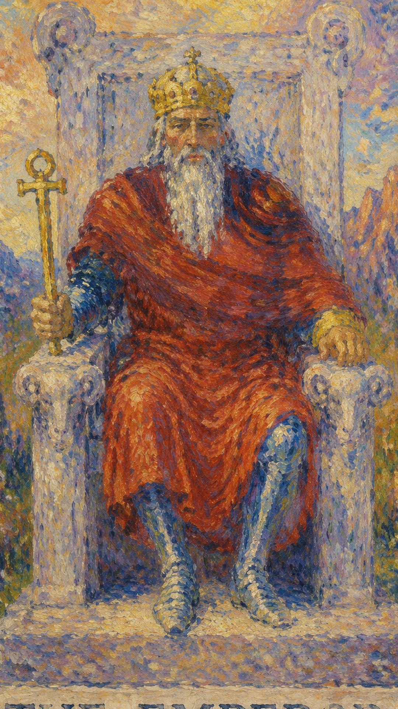

# 皇帝

皇帝是现实世界的建制者。他关心规则、责任、疆界和长期稳定，代表把混乱整理成秩序的能力。

当皇帝出现，问题往往不在于缺乏情绪，而在于是否有足够清晰的原则和执行力。

皇帝坐在石质王座上，王座饰有公羊头，背景多为荒山。画面坚硬、稳定，表现出经验、控制力与保护性的权威，也显示出他建立边界、规则和方向的能力。

## 基础要素

1. 牌名：皇帝 (The Emperor)
2. 数字编号：IV / 4 号牌
3. 核心主题：秩序、权威、边界、责任与结构
4. 元素：火
5. 星座或行星：白羊座 / 火星
6. 希伯来字母：Heh（赫）
7. 代表意义：把意志落实为制度、计划和可执行的现实结构

## 牌面要素

| 要素 | 含义 |
|------|------|
| 石王座 | 稳定、制度与不可轻易动摇的基础。 |
| 公羊头 | 白羊座的开创力、战斗精神和主动性。 |
| 权杖 | 统治权、决策力和掌控方向的能力。 |
| 盔甲 | 保护、警戒和现实压力。 |
| 荒山 | 经过考验后的坚韧，也代表不易亲近的环境。 |
| 红色衣袍 | 行动力、热血和权力意志。 |

## 塔罗灵数

数字 4 是方形、秩序与结构，代表把想法落地为制度、边界、责任和可持续的安排。

皇帝的 4 号能量说明稳定来自规划、执行、限制和承担。缺少结构时，再强的热情也容易散入风中。

## 正位牌意

**关键词**：权威，领导，秩序，父性，责任，边界，规划，稳定

正位的皇帝要求你拿回主导权，用清楚规则和长期规划处理问题。

### 爱情/婚姻

感情中代表承诺、责任和稳定关系。对方可能成熟、可靠、有事业心，也可能带有强烈保护欲。关系适合讨论现实安排，例如婚姻、家庭、边界、金钱和未来规划。

### 事业学业

事业学业上非常适合管理、领导、制度建设、考试规划和长期目标执行。若你正在负责团队或项目，皇帝强调流程、分工和权责，让热情拥有可以承载它的骨架。

### 人际财富

人际上适合和有经验、有资源、有权威的人合作，但要保持清楚边界。财富方面代表稳健规划、资产管理、长期投资和有纪律的预算。

### 健康生活

健康上适合建立规律：固定运动、作息、饮食和检查。皇帝也提醒你注意压力、头部、血压、肌肉紧绷，以及因过度控制造成的身体僵硬。

### 其它牌意

可能代表父亲、老板、领导、丈夫、制度、政府、法律和组织架构。若问事情结果，正位通常表示可以稳定下来，但需要服从规则和承担责任。

## 逆位牌意

**关键词**：专制，僵化，控制欲，失序，逃避责任，权威冲突

逆位的皇帝表示权力失衡：可能是过度控制，也可能是缺少承担责任的人。

### 爱情/婚姻

感情中可能出现控制欲、父权压迫、冷漠、命令式沟通，或一方拒绝承担责任。也可能代表关系缺乏安全结构，承诺说不清、未来没规划。

### 事业学业

事业学业上可能遇到强势上级、僵化制度，或自己因为过度追求控制而失去弹性。也可能代表计划混乱、执行力不足，需要重新建立基本秩序。

### 人际财富

人际关系中要留意权威压迫，也要避免过度对抗权威。财富方面适合减少独断投资，避免因面子或控制欲做出失衡的资源安排。

### 健康生活

健康上可能与压力、僵硬、紧绷、过劳和长期压抑有关。逆位皇帝提醒你：真正的纪律会形成可持续的秩序，而非把自己逼到崩溃。

### 其它牌意

事情可能卡在规则、审批、权责不清或领导问题上。此时需要厘清谁负责、按什么规则负责，以及哪些控制其实已经阻碍发展。
