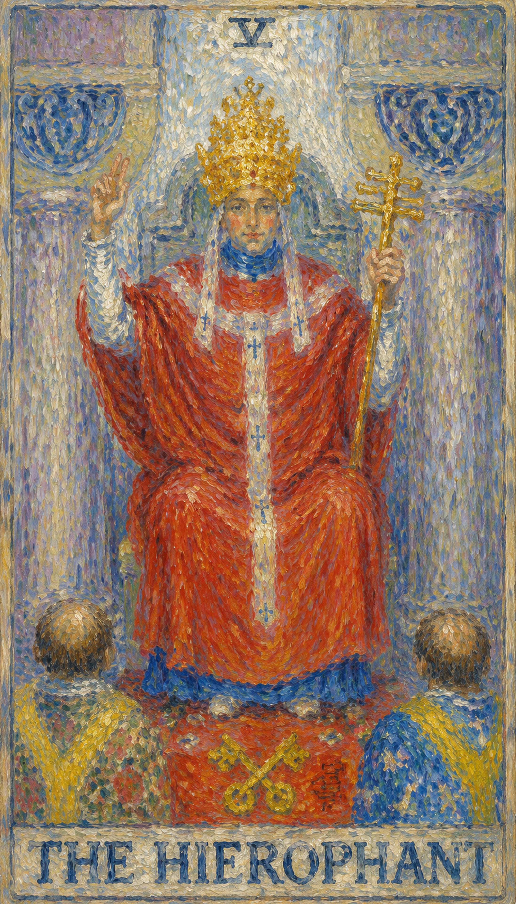

# 教皇

教皇，也被称为教宗，是塔罗牌中代表宗教与精神层面的一张牌。他承载着被社会认可的知识、仪式与价值系统，把经过漫长时间保存下来的经验与秩序传递下去，使每一个个人经验都能够接入更大的传统。皇帝负责提供物质条件，而教皇的责任是提供心灵上的指引与引导——在有组织的宗教或教堂之中，他向普通人展示了满足心灵需求的方法，让那些尚未生出探索灵性之心的人，也不至于在世间迷失方向。

教皇和女祭司同样关乎宗教精神与内心世界，但两者的姿态截然不同。女祭司坚守传统的法则与隐秘的知识，将宗教智慧默默融入自身修行，注重个人的内在体悟而不张扬；教皇则代表着耶稣传道般的精神，把智慧视为真理并广泛传播，关心世间一切痛苦，以身作则，用智慧去引导无知的众人。这张牌出现时，常常指向学习、认证、师承、组织规则，或一段关系中共同价值观的分量。

然而教皇（第五张牌）也悄悄提醒：当你把心灵成长的责任完全交给他人，你的心胸反而可能变得狭窄。因为只有通过直接的体验，你才能亲身感受到神，确定何者为真。若我告诉你我所体验到的神，你需要的只是信仰；可一旦你亲自去触碰，你便获得了一段足以带来理解的经验。相信未知是冒险的，而亲身经历能够提供证据，消除对盲信的依赖。教皇的最高境界，正在于"润物细无声"。

牌面中的教皇身穿红袍，端坐在信众面前，头戴象征权力的三层皇冠，分别代表物质、精神与道德三个层次的世界认知。他的右手食指与中指指向天空，象征祝福；左手握着主字形的权杖，象征神圣与权力。耳边垂下的白色挂饰，代表他聆听信众心声的使命。

在教皇脚下，有一对交叉放置的钥匙，一把金色、一把银色，代表阴与阳，据说是能够开启智慧与神秘之门的日月之匙。坐在他面前的两位信众，左边身着红色玫瑰袍，代表热情与爱心；右边披着白色百合外衣，代表内心的纯洁与灵性的成长。整幅画面表现出神圣知识被传授、被保存、被制度化的过程——教皇像一座桥梁，把个人经验稳稳连接到更大的传统之中。

## 基础要素

1. 牌名：教皇 (The Hierophant)
2. 数字编号：V / 5 号牌
3. 核心主题：传统、教导、信仰、制度与传承
4. 元素：土
5. 星座或行星：金牛座
6. 希伯来字母：Vav（瓦夫）
7. 代表意义：通过传统、规则和师承获得稳定的精神与现实支持

## 牌面要素

| 要素 | 含义 |
|------|------|
| 双柱 | 传统体系中的门槛与秩序，象征步入一个新的精神领域或知识境界。 |
| 三重冠 / 金冠 | 物质、精神与道德三层世界的认知，象征精神、伦理与社会权威，也是领导者身份与统治能力的标志。 |
| 权杖 | 主字形权杖象征宗教权威与精神领袖的地位，是权力与统治的象征。 |
| 祝福手势 | 右手两指指天，与宗教仪式或祝福相关，代表教导、认可、分享知识与智慧。 |
| 交叉钥匙 | 一金一银的日月之匙，代表阴阳，可解答宗教或精神难题，开启知识与信仰之门，也代表制度许可。 |
| 白发 | 与智慧和经验相联系，象征成熟而稳重的思考。 |
| 红袍 | 代表热情、力量与权力，红色也与物质世界相关联。 |
| 白色长袍 | 象征纯洁、精神上的清洁与真理。 |
| 三角形披肩 | 三角形与三位一体及精神的三重面相相联系。 |
| 宝座 | 代表稳定的权力与统治地位，也是威严与尊严的象征。 |
| 两位信徒 / 下属的两人 | 追随者或学徒的出现，象征导师与指导、学习与归属的师生关系。 |
| 基督教徒的玫瑰 | 象征爱与纯洁，以及灵性的追求。 |
| 黑暗与光明的背景 | 明暗对比代表知识与无知、启发与未知的并存。 |
| 两名追随者的剃头 | 象征灵修，以及放弃物质主义的追求。 |
| 足前的十字 | 十字象征基督教，代表宗教的教义与信仰。 |
| 宗教服饰 | 仪式、规范与集体信念。 |

## 塔罗灵数

数字 5 是稳定结构中的挑战，也是人进入社会规则后的学习。它既带来冲突，也带来通过规范成长的机会。

教皇的 5 号能量说明：个人终会走入更大的知识系统，学习群体如何保存经验、传递信念，并在规范之中获得成长。

## 牌面解读重点

教育的最高境界是润物细无声。这张牌描述的是带有男性外在特质的人事物，并不一定单指人。正位表示具有智慧胸怀的成熟男性品质——稳重、宽广、值得信赖；逆位则表示心胸狭隘、小黠大痴的男性品质。落到具体事物上，它也可以代表一个人行事与处世的风格。

## 正位牌意

**关键词**：值得信赖，得到援助，良好的建言者，有贡献，心胸宽广，宗教情绪，精神内在，智慧，才智，精明，明智，知识，学问，修士，修女，出家人，宗教信仰，遵从，遵守，慈善机构，传统，宗教，教育，权威，指引，导师，学习，认证，婚姻，制度，共同价值

正位的教皇代表规则与传统，象征精神导师，表示你正接受教育或指导。它暗示着顺从与忠诚，指向道德与伦理层面的抉择，也表达着对真理与智慧的追求。这张牌提醒你保持一致性与纪律，暗示社群或团体的参与，表现出对稳定与秩序的需求，并强调信仰与信任的重要。简而言之，它建议你尊重成熟经验，向可信的老师、制度或传统方法学习。

### 爱情/婚姻

正位教皇下的感情，是值得信赖、稳定而正统的。它象征传统意义上的婚姻，预示着稳定与长期的关系，表示对伴侣的忠诚，暗示对婚姻的尊重与珍视。关系中常有一种精神层面的连接，伴侣之间彼此理解、彼此支持，关系和谐，感情有深度也有真实性。你可能以谨慎而郑重的态度对待这段感情，乐于博爱，也希望有媒人牵线、长辈祝福；对象往往是能够安全交往的人，可能是年长的异性，恋情会随时间逐渐加深、长久持续，并有走向订婚或婚嫁的可能。关系不一定最热烈，却重视稳定、责任与社会认可——若双方理念相近，感情会因为共同规则而更加安心。

- **现况**：信仰或三观的因素，对这段关系有很大的影响。有时它表示两个人已经结婚，或者这段关系正稳稳朝着婚姻的方向发展。
- **桃花**：现在会有新的感情对象出现，最可能是通过相亲或长辈介绍而来。这段时间不妨多参加未婚男女的联谊活动，机缘往往藏在这些正式的场合里。
- **看法**：你是以结婚为前提在认真考虑这段感情，态度绝对是十分郑重的，同时也希望能够得到大家的祝福与认可。
- **复合**：这段感情若能复合，那一定是有好朋友在当中穿针引线、从旁撮合；否则以两个人现有的情分，要重修旧好恐怕没那么容易。

### 事业学业

事业学业上，正位教皇适合考试、培训、考取证照、接受正规教育、拜师，进入机构或遵循既定流程。它表示在工作中遵守规则，象征着接受新的学习或培训，暗示对事业的忠诚与对职业道德的尊重，指出团队合作的重要，展现出对事业的承诺。你耐力十足，思想偏向守旧稳健，懂得多听他人劝告、从善如流，常因碰到良师而使成绩进步，也会出现真正帮得上忙的贵人。这类能量适合顾问、医学，以及以谈话、咨询为主的工作；它常代表老师、顾问与上级制度，提醒你先把基础规范学扎实，循着规则与计划稳步前行，往往能换来工作出色、贡献突出的精神满足与稳定成功。

- **现况**：工作之中有很多贵人在帮助你，所以即使自己仍有不足之处，也会得到许多支持，正是你可以放手发挥的地方。
- **建议**：遇到自己解决不了的问题，应该寻找更高层的人来决定，或是依现有的秩序与规则来处理；这种时候保守一点不会错。
- **人际**：工作当中的辈分十分重要，凡事都有先来后到。只要你能够顺应这样的规则，人际关系自然就会顺畅而融洽。
- **发展**：这份工作的未来有很大的发展空间，而且是一个有很多人愿意帮助你的地方。应该先把人混熟，长久待下去对你是有利的。

### 人际财富

人际上，正位教皇适合依靠团体、组织、家族与传统资源。它表示人际关系中的公正与公平，暗示彼此尊重与理解，展示团队合作的重要，代表对朋友的忠诚，也提醒尊重他人的观念与信念。你事事为朋友着想，懂得遵循社会规则、合群处世，受人依赖，与年长的异性有缘，也容易获得学长的建言或父母的资助（不过要留意别轻易遗失钱包）。财富方面宜采用稳健、合规、经过验证的方法，循传统途径获得稳定收入，如固定工作或经过规划的投资，而不适合投机或挑战规则底线。

- **现况**：现在你的人际关系算是稳定，也许会因为三观或信仰而交到不少知心的好朋友，这份缘分应该要好好把握。
- **建议**：你应该对朋友多一些宽容，发自内心地去原谅对方；如果对方不愿原谅你，则可以请一位值得信任的朋友来当和事佬。
- **财运**：现在因为有其他的支持在，你的财务状况看起来还不错，但并不算很独立健全，仍需努力成长。若是相熟的朋友找你帮忙，多少可以投资一点，但其他情况就要慎重考虑。

### 健康生活

健康上适合听取专业建议、遵从医嘱、建立规律的生活节奏。教皇鼓励一种循序、稳定、可持续的养生态度，让身心在秩序中安顿下来。也可能提示与喉咙、颈部、饮食习惯与身体稳定性相关的状况，提醒你别忽视这些与金牛、与土元素相应的部位，把基础保健做扎实。

### 其它牌意

观赏一场音乐会或看一部片子，前往寺庙上香许愿，或是去拥抱自然，都与这张牌的气质相合。它也可能代表老师、宗教人士、长辈、制度、学校、公司、婚礼、证书与传统仪式。若问建议，正位通常表示：先理解规则，再决定是否开辟新路。

### 情境指引

- **爱情运势**：通常象征传统的价值观与稳定的关系，可能意味着一段基于共享信仰与道德观念的感情，甚至指向婚姻或其他正式的承诺。
- **财富运势**：象征传统方法的成功，可能暗示通过传统途径获得稳定收入，如固定工作或投资，建议遵循传统的财务规划与投资策略。
- **当前情况**：目前你可能正遵循既定的规则与体系，或正在寻求知识与智慧，身处一个需要遵守特定社会或宗教规范的环境之中。
- **过去**：过去可能受到传统教育或宗教信仰的深刻影响，曾有一个强烈的道德或宗教框架在支撑着你的生活。
- **现在**：目前可能正处于需要指导、寻求精神支持的阶段，或者正在考虑加入某个团体以获得归属感。
- **未来**：未来可能会有更多遵循传统或寻求精神成长的机会，你或许会更深入地投入到自己的精神实践或宗教信仰之中。
- **挑战**：当前的挑战，可能在于寻找个人信仰与外部规范之间的平衡，或是如何在尊重传统的同时发展个人的独立性。
- **障碍**：面临的障碍，可能是过度的固执与对传统的盲从，或是受到限制性信念与教条的压迫。
- **环境**：你所处的环境可能充满规则、传统与期望，把你置于一个需要顺从权威的位置。
- **支持**：支持可能来自宗教领袖、导师或传统的学习环境，以及那些尊重并理解你信仰的人。
- **建议**：建议你既寻求内在的智慧，也接受外部的指导，保持开放心态，同时遵循那些真正有助于你成长的传统。
- **优势**：你的优势在于拥有坚定的信仰与价值观，以及在困难时刻寻求并遵从智慧指引的能力。
- **弱点**：可能的弱点是对既定体系依赖过重，有时难以接受新思想，或难以面对对传统的挑战。
- **正面影响**：包括精神成长、道德支撑与对知识的追求，以及对社会秩序的尊重。
- **负面影响**：可能是对创新与变革的抵抗，或是过度依赖传统而限制了个人的自由发展。
- **希望发生**：你可能希望得到更多的指导与明确的方向，或希望更深入地了解并实践自己的信仰。
- **害怕发生**：你可能害怕失去信仰的支持，或面临道德与精神上的不确定性。
- **你如何看对方**：你可能把对方看作一个守规矩的人，认为他们的行为受到传统或规则的约束。
- **对方如何看待你**：对方可能视你为一位很好的导师，或是一个尊重传统与规则的人。
- **关系当前状态**：当前关系可能建立在共享的信念与传统价值观之上，存在明确的结构与角色划分。
- **关系未来发展**：关系可能会继续沿着传统的道路发展，进一步巩固，也可能涉及宗教或精神上的连结。
- **结果**：结果可能是对传统的深化理解，或是在精神上找到更深的意义与目的。

## 逆位牌意

**关键词**：失去信赖，多管闲事，过于依靠他人，心胸狭隘，被强迫倾销，孤立无援，个人信仰，看法，想法，自由，质疑权威，挑战现况，改变现在，打破传统，不遵守规则，追求自由，反传统，教条，束缚，盲从，价值冲突，权威失当

逆位的教皇意味着反抗传统与规则，忽视或拒绝接受指导。它可能表示道德或伦理上的困境，表达对自由的需求与对现状的不满，也可能呈现出对权威的挑战、独立思考的觉醒，或个人信仰正在发生变化。有时它暗示一个人不适应社群或团体，有时又透露出过于固执、顽固的另一面。它提醒你保留判断力：合群若吞没了真实，反叛若变成了新的固执，都会让人远离真正的信念。

### 爱情/婚姻

逆位教皇下的感情，常显得缘分浅薄、步调缓慢，彼此不够体贴。它可能表示对传统婚姻的反抗，也可能暗示感情不稳定、走向分手，或对伴侣的不忠与误解。关系中容易出现占有欲过重、因固执己见而令人反感、遭父母反对，或关心过度反成负担的情形，往往是一段不被认同的、非正统的恋情，存在离婚或分手的隐患。当事人可能不满足于现状、想追求新的可能，感情上渴望独立，却又陷入不和谐与困惑之中。这也可能代表一方用道德与传统去压迫另一方，或双方都不愿走传统路线，需要重新定义彼此的承诺。

- **现况**：其中一方付出比较多，两个人的关系并不平等。如果能够心甘情愿地付出，倒也算是一段在稳定中发展的关系。
- **桃花**：现在会有一些新恋情发生，但多半是同侪之间介绍而认识的，所以应该多参加朋友的社交活动，机会就在其中。
- **看法**：你觉得自己付出很多，得到的回报却少了许多，心里难免有些不平衡的情绪，但仍然很想去保护和照顾对方。
- **复合**：这段感情其实并没有复合的可能性，最好不要往这个方向去想。先让自己好好休息一下，等待更好的机会重新来过。

### 事业学业

事业学业上，逆位教皇可能让人受困于僵化流程、无效课程或权威压制。它可能表示对工作的不满，暗示工作上的矛盾与冲突、对现有规则的反抗，或是事业上的不确定、不稳定与变动。学业方面，容易因轻视而尝到苦果，因厌恶老师而对课业失去兴趣，过分依赖同学的笔记、得到错误的情报，以致成功无望。这类能量提示你或许并不喜欢按部就班，可能正酝酿着学习或工作方式上的改变、突破甚至创新——也可能意味着你并不适合当前的制度，需要去寻找更自由的学习与工作方式。

- **现况**：工作中充满各种繁复的规则，还有一些是没有明文规定的潜规则，一不小心就会触到禁忌，要花很多时间才能真正进入状态。
- **建议**：工作里的问题很难单靠自己解决，应该由同事之间共同合作来处理，利用大家不同的经验与能力集思广益。
- **人际**：这份工作中人际关系的影响很大，如果不能和大家良好相处，就容易受到排挤，严重时甚至连工作都难以为继。
- **发展**：这个工作的发展还算不错，但要小心人际关系的影响，尤其是同事对你的影响更大，应该尽量与大家和平相处。

### 人际财富

人际上，逆位教皇要小心盲目听信长辈、专家或团体的意见。它可能表现为干涉他人、令人困扰的好意、自以为是、没有必要的义气，也可能因助人而损失金钱、因冷漠或太啰嗦而无人援助。这是一种容易招来人际困扰、冲突与疏远的状态，常伴随反抗、不合群，甚至想要挑战社会规则、追求个体自由的冲动。财富方面，需要看清建议背后的利益关系，避免被"大家都如此"的声音推着走。

- **现况**：你的人缘其实还不错，但太容易受到别人影响，反而失去了自己的主见，有时还会因为要帮助朋友，结果让自己受了伤害。
- **建议**：把自己的立场说清楚，不要让朋友觉得无论如何你都该让着他；只要你说得有理，就不必一味退让。
- **财运**：如果在金钱上不够务实，财务状况就很难好起来——要记得物质世界的规则非常现实，付出才会有收获。此时并不适合投资，尤其听信小道消息的投资特别危险，最好保守务实一点，维持现状就好。

### 健康生活

健康上，逆位教皇可能代表抗拒专业建议，或过度依赖单一理论而忽略身体的真实反应。需要在传统方法与个人感受之间取得平衡，既不盲从权威，也不轻率推翻所有医嘱。情绪上也要留意因价值冲突或孤立感带来的低落，为自己重新找回内在的秩序与节律。

### 其它牌意

逆位的教皇带有恐高、喜清静、不宜乘坐飞机旅行的意味。事情也可能被规则、证照、审批或价值观卡住。此时要分辨清楚：究竟是规则真的在保护着你，还是它早已变成限制成长的外壳。

### 情境指引

- **爱情运势**：可能代表对传统观念的挑战——你或你的伴侣正试图打破旧有的规则与期望，寻找更自由的爱情表达方式。
- **财富运势**：可能意味着需要采用非传统方法来解决财务问题，或者传统投资策略并未带来预期回报，需要重新评估你的财务规划。
- **当前情况**：你可能感到受限于现状与传统的桎梏，觉得需要打破常规来实现个人成长，或寻求新的方向。
- **过去**：过去可能曾被过于严格的规则与限制束缚，这些限制可能抑制了你的个人表达与成长。
- **现在**：目前你可能对某些传统或规则感到失望，正在寻找更多自我表达的空间与自由。
- **未来**：未来可能将迎来打破常规的时机，可能会出现重新评估传统价值与信仰的情况。
- **挑战**：当前的挑战可能是如何在尊重传统的同时发展个人独立性，以及如何处理那些与传统不符的观念。
- **障碍**：障碍可能是来自社会或他人的压力，以及那些难以摆脱的传统观念与期望。
- **环境**：你所处的环境可能要求你遵守既定规则，但你内心可能感到不满或被压抑。
- **支持**：支持可能来自那些鼓励你打破传统、追求创新与个人自由表达的人。
- **建议**：建议你质疑常规并寻找自己的道路，不要害怕探索新的可能性、表达个人的观点。
- **优势**：你的优势可能在于愿意探索并接受新思想，以及在面对传统压力时依然保持独立性。
- **弱点**：弱点可能是对抗传统所带来的不确定性与可能的社会排斥，以及在逆流而动时感到孤立。
- **正面影响**：可能是对个人自由与创新的追求，以及打破束缚所带来的个人成长。
- **负面影响**：可能包括与传统社会的冲突，以及更多的不确定性与混乱。
- **希望发生**：你可能希望能够突破现状，寻找新的生活方式或信念体系。
- **害怕发生**：你可能害怕因抵制传统而造成的孤立感，或被社会边缘化。
- **你如何看对方**：你可能视对方为过于固守传统，或感觉对方并不理解你追求变革与自由的需求。
- **对方如何看待你**：对方可能认为你不尊重传统，或者觉得你是一个挑战现状的叛逆者。
- **关系当前状态**：关系中可能存在抗拒传统价值观的紧张与冲突，或者一方正试图挑战既定的关系模式。
- **关系未来发展**：关系的未来可能会经历变革，探索新的互动方式，或对传统角色进行重新定义。
- **结果**：结果可能指向打破规范、找到新的信仰路径或生活方式，尽管这或许会带来一段不确定与动荡的时期。
