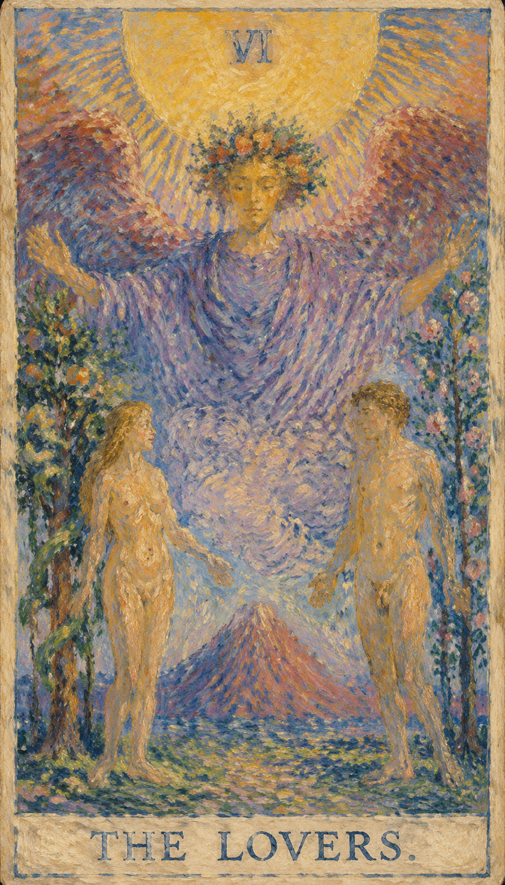

# 恋人

恋人不仅是一张爱情牌，更是一张关于选择与沟通的牌。它要求人看清自己真正认同什么，并在诱惑、关系与责任之间做出诚实的决定。许多人一看到"恋人"二字便联想到恋爱，然而恋人牌所指的，往往不是已经成形的恋爱关系，而更像是一段关系的前奏——真正的关系尚未开始，当事人或许已在心里描摹爱情的轮廓，却还没有真正陷落其中。

作为单张牌出现时，恋人最常见的含义其实是"选择"与"沟通"。恋爱本身就是在众多人之中择一为伴，因此这张牌带着极强的抉择意味：每当人立于岔路口，恋人便会现身。在二选一的牌阵里，它常落在起点之上，代表"面临选择"的状态——在抉择落定之前，事情不会朝任何方向流动，因此它本身无法给出吉凶的判语。恋人是一个转折点，但在你真正转身之前，它仅仅是一个点。

当恋人出现，真正需要审视的，是感情、道路与自我之间能否保持真实而一致。

牌面描绘了伊甸园中亚当与夏娃的爱情故事，传达着爱的真谛。男女各立两侧，脚下是肥沃而生机盎然的土地，他们沐浴在天使的祝福里，感受着爱的浪漫与温馨。天使身着紫袍，象征爱的忠贞，微微张开的双臂预示着沟通在爱情中的分量。亚当专注地凝望着夏娃，夏娃仰望着天使，而天使俯视着这一对璧人——这一道由下而上、又由上而下的视线循环，象征潜意识、意识与超意识，以及物质、精神与道德之间的层次流转，也暗含理性与感性之间的传导。

夏娃身后是知识之树，树上结着五颗苹果，对应五种感官，缠绕其上的蛇在此代表潜伏的智慧；亚当身后是生命之树，燃着十二团火焰，象征十二星座与欲望之火。整幅画面像一面镜子，把人带到自己面前：你选择什么，也就在成为怎样的人。

## 基础要素

1. 牌名：恋人 (The Lovers)
2. 数字编号：VI / 6 号牌
3. 核心主题：爱、选择、沟通、价值一致、关系中的真实
4. 元素：风
5. 星座或行星：双子座 / 水星
6. 希伯来字母：Zayin（扎因）
7. 代表意义：在关系与选择中确认真正的自我，并以沟通让爱与决定彼此对齐

## 牌面要素

| 要素 | 含义 |
|------|------|
| 天使 | 高层祝福、良知与神圣见证，俯视着这对恋人，给予爱的指引。 |
| 天使翅膀 | 表明天使具有超自然的保护与指导，象征自由与灵魂的升华。 |
| 天使的红色衣服 | 红色与激情、力量和欲望相连，是爱中炽热的生命力。 |
| 男人与女人 | 互补、吸引与自我的两面；裸体代表诚实、脆弱与人天真无邪的本真状态。 |
| 男人和女人看向不同方向 | 表达选择的主题，其中潜藏着矛盾，也暗示决断的必要。 |
| 太阳 | 代表理解、光明与活力，是坦诚、开放与意识的照明，通常关联积极的能量。 |
| 云彩 | 可能象征未知，或做出决策时的阴影部分，也可指向精神的启示。 |
| 山峰 | 障碍、挑战与需要克服的难题，也可象征关系或选择带来的稳固与耐久。 |
| 树 | 象征生命、生长与发展，关联个人发展的不同阶段。 |
| 女人面朝的树（知识之树） | 连结天地及以下，结有五颗苹果对应五感，可代表智慧与生命力。 |
| 男人面朝的火焰（生命之树之火） | 燃着十二团火焰对应十二星座，象征对激情、冲动与创造力的关注与吸引。 |
| 水果 | 树上的果实象征结果与丰收，也表示成熟的爱或需要做出的选择。 |
| 蛇 | 常象征诱惑、智慧或更新（借由蜕皮），在此亦代表潜伏的智慧。 |
| 火焰 | 可能代表激情、变化或净化的力量。 |
| 地面植物的颜色与多样性 | 表明多样性与选择的范围，也象征生活中丰富的可能性。 |
| 树干上的叶子 | 象征生命的持续与繁荣，也可代表季节与变化。 |
| 女人旁的小溪 | 水流象征情感、直觉与生命的连续，也表示感情与选择的流动。 |
| 生命树 | 生命力、成长与关系中的自然能量。 |

## 塔罗灵数

数字 6 代表和谐、关系、责任与美感。它引导个体从纯粹的个人欲望走向关系中的平衡、协调与照顾，也意味着在给予与接受之间寻得恰当的尺度。

恋人的 6 号能量说明：真正的选择来自内在价值与外在决定的相互照应。当心之所向与行之所往彼此呼应，关系才会安放在和谐之上。

## 牌面解读重点

自人类有阶级以来，纯粹的恋爱关系世间鲜有。恋人正位表示这段关系不受世俗世界阶级关系的影响，逆位则表示这段关系受到世俗划分的阶级所牵制。这种受影响的关系，属于一种"交付性"的关系——因为有你，所以有我，古人也称之为"缘"：当你成为妻子的那一刻，你的丈夫也随之出现；单独的你，不可能独自成为妻子或丈夫。这种你与客体之间的关系同时产生，也同时消失。

此外，恋人对应的星座是双子座，其守护星水星亦是魔术师所对应的行星，因此它常常带着双子座式的特质——多才多艺、聪明善变，却也略显轻浮；关于水星的更细层面，可参照魔术师牌的解释。

## 正位牌意

**关键词**：幸福的相遇，同心协力，情投意合，感情丰富，前途光明，坠入爱河，整理思绪，爱，热爱，慈爱，爱情，恋爱，喜好，喜爱，喜欢，很愿意，融洽，和睦，和声，和谐，协调，关系，联系，情爱关系，性爱关系，价值观，价值取向，选择，挑选，抉择，选择权，入选者，被选中，伙伴关系，结合，磁性吸引，均衡，承诺，契合，合作，真诚

正位的恋人，意味着关系或选择正在进入关键阶段，诚实面对内心远比讨好外界更重要。它代表关于爱情与亲密关系的决定，关于吸引力与爱情的取舍；它象征浪漫的爱情、两性之间的关系与美满的婚姻，也代表对爱与亲密的承诺，以及由此而来的忠诚与诚实。此刻往往需要你做出一个重要的选择，而真正的答案，藏在和谐、平衡与团结之中。

### 爱情/婚姻

感情中代表强烈的吸引、灵魂的契合、彼此理解与重要承诺。你可能有志同道合的朋友，在团体活动中结识进而结为连理，或经友人介绍相识相恋，最终携手步入婚姻殿堂；许多时候，正是那些"朋友以上、恋人未满"的交往，在自由愉快的相处里悄然升温，化作浪漫的爱情。单身者可能遇到极具吸引力的人，甚至预感到一段新恋情即将到来；有伴侣者则适合讨论更深层的价值观、未来方向与关系承诺。爱需要感觉，也需要一次次清醒的选择——这张牌肯定对方很可能正是你的灵魂伴侣，也预示着求婚或结婚之事的临近。

- **现况**：两个人正处在如胶似漆的热恋状态，彼此有着很强的吸引力，无论任何理由与阻碍，都很难把这段关系拆散。
- **桃花**：在很短的时间之内必定会有新恋情出现；若对自己仍有不够满意之处，应趁这个机会改正缺点，以更好的状态迎接新的缘分。
- **看法**：两人的感情已经十分稳定，希望朝着结婚的方向发展；此刻你正疯狂地迷恋着对方，也愿意接受对方的一切。
- **复合**：其实两人对彼此仍有很深的感情，复合的可能性是存在的，只要有一方主动提出，重修旧好并不困难。

### 事业学业

事业学业上可能面临决定前途的大好机会、路线的选择、合作的契机或价值取向的决定。你拥有敏锐的观察力，适合以团队协作赢得成功，身边也常出现得力的好帮手；选择真正符合自己兴趣与原则的方向最为理想，双人合作、沟通型工作与需要协调的项目都很相宜。学业上，你在喜欢的科目上成绩优异，擅长文科或艺术类科目，常因互学互助而稳步进步，前途一片光明。

- **现况**：基本上是一份简单而顺利的工作，本身并不困难，也没有什么大问题。
- **建议**：用最简单的方法去处理，别把问题想得太复杂，只要顺着方向前进，一定可以及时而顺利地通过考验。
- **关系**：这里大部分人都很好相处，因此彼此维持着愉快的关系；但君子之交淡如水，过于亲密反而容易生出问题。
- **发展**：这份工作未来即将面对较大的变动或挑战，虽然你应当能够顺利通过，但这需要你提前做好准备。

### 人际财富

人际方面代表良好合作、彼此欣赏与相互支持：你没有财务上的烦恼，身边出现好的伙伴，人际关系融洽，社团活动顺利，朋友渐多，与他人易于亲近，活泼开朗而幽默，结盟合伙等幸运的合作关系常常水到渠成，机会就摆在眼前。财富方面适合共同计划、合伙或签订互利协议，但必须建立在清楚的价值与公平的规则之上。

- **现况**：你的知心好友并不多，但每一位对你都有重要意义，所以要好好珍惜这些挚友，其余的事不必太过在意。
- **建议**：只要以诚心向对方解释事情的来龙去脉，对方一定会原谅你；千万不要为任何缘由说谎，否则只会使事情恶化。
- **财运**：眼下财务状况算是不错，未来更有很大的发展潜力；从现在起多做准备，为自己争取更多的利益。
- **理财建议**：适度调整投资比重，不宜一下子增加太多新的投资，稳健地布局更为长久。

### 健康生活

健康上强调身心的协调。选择真正适合自己的生活方式，让身体逐渐脱离旧习惯的牵引，使作息、情绪与身体节律彼此呼应。恋人也提醒你，健康同样是一种"选择"——当你愿意为自己做出更接近本心的决定，身心便会回到平衡与丰盈的状态。

### 其它牌意

出门旅行会非常愉快，并带来好运。它也可能代表恋爱、订婚、重要选择、合作、和解与价值观的确认。若问建议，正位恋人要求你选那个更接近真实自我的方向；而当它出现在建议项中时，往往是在提醒：两个人需要通过坦诚的沟通来解决问题。

### 情境指引

- **爱情运势**：正位恋人在爱情中象征着深厚的情感连接，两人之间有强烈的吸引力与高度的兼容性，代表一段健康而富有激情的恋爱关系。
- **财富运势**：财富方面可能指向重要的选择，或需在财务合作伙伴与投资方向上做出决定，预示着通过合作来增进财务状况的机遇。
- **当前情况**：你可能正面临重要的生活选择，需在多个选项中做出决断，这些选择可能影响到你的个人关系与生活方向。
- **过去**：过去可能经历了重要的关系发展或选择，这些经历塑造了当前的情形与你的个人成长。
- **现在**：现在是爱情与关系的和谐时期，你可能正与某人共享美好而浪漫的时光，或正考虑深化现有的关系。
- **未来**：未来可能迎来更深层的承诺与决定，也许是婚姻、同居，或是一种全新的伙伴关系。
- **挑战**：挑战在于如何平衡个人欲望与伙伴关系中的需求，并做出最契合内心的选择。
- **障碍**：可能面临的障碍是情感上的不确定，或对承诺的恐惧，害怕做出错误的选择。
- **环境**：所处环境可能非常支持恋爱关系的发展，你周围也环绕着积极的人际关系。
- **支持**：支持可能来自爱人、朋友与家人，他们鼓励你勇敢地追求爱情与幸福。
- **建议**：聆听内心的声音，做出真正符合本心的选择，不要害怕在爱情里坚持高标准。
- **优势**：你的优势在于强烈的直觉与决断力，以及在关系中保持真诚与透明的能力。
- **弱点**：弱点可能是过于理想化的期望，或在选择面前的犹豫不决。
- **正面影响**：经历一段和谐、满足而成长的关系，并做出带来正面长远影响的选择。
- **负面影响**：可能因情感冲动而做出欠考虑的决定，或因过分关注情感而忽略生活的其他面向。
- **希望发生**：你可能希望找到那个合适的人，建立一段深刻而有意义的关系。
- **害怕发生**：可能害怕因错误的选择而损害现有关系，或因此错过更好的机遇。
- **你如何看对方**：你可能把对方看作理想的伙伴，感受到强烈的吸引与深深的情感牵绊。
- **对方如何看待你**：对方可能感受到你的爱与承诺，认为你正是他们一直寻找的那个特别之人。
- **关系当前状态**：当前关系和谐而充满爱意，两人都在积极地投入并享受这段感情。
- **关系未来发展**：关系的未来可能朝着更深层次的承诺前进，比如订婚、结婚或其他形式的结合。
- **结果**：结果可能是一段幸福而充满爱的长期关系，或是一项对个人成长至关重要的选择。

## 逆位牌意

**关键词**：伤离别，关系结束，无助，遭遇险阻，转移目标，爱好无法持久，无精打采，表里不一，易受诱惑，自爱，自恋，不协调，不和谐，不一致，失衡，不平衡，不公平，价值观不一致，价值观错位，内心冲突，矛盾的选择，不稳定，分离，背叛，犹豫，诱惑

逆位的恋人与正位差异其实并不大，仍然带着"选择"的意味——只不过正位更趋向于"选择的开始"，当事人握有更多主动权；逆位则更趋向于"选择的结束"，当事人多了一层被迫选择、被动接受的色彩。一张牌之所以翻为逆位，往往是外在条件不足带来的迟滞，或当事人内在抗拒所致：本该发生的事没有发生，本该接受的事实没有被接受，塔罗便以逆位的形式将它呈现出来。人在面对选择时常会犹豫、逃避，害怕承担自主抉择所带来的责任，结果反而丧失了主动权。然而无论主动还是被动，承担后果的，永远都是当事人自身。恋人本是一个机会，抓住它、选择自己真正想要的方向，才是明智之人该做的事。

它也代表欲求不满、多愁善感与迟疑不决，意味着任何追求关系新阶段的努力，都只能建立在期待与梦想之上，不如暂时维持原状；有时还暗示一段关系的结束，或一种带有毁灭性的关系，并指向逃避责任与承诺。

### 爱情/婚姻

感情中可能出现关系冷淡、移情别恋、水性杨花、短暂的恋情，乃至分手；也可能是迟迟无法赢得对方芳心，彼此充满戒心、逃避爱情，恋情来得短暂，伴随感情的困扰、分离、背叛与不忠，甚至像飞蛾扑火般做出不理智的选择。它常暗示感情冲突、感情的挫败、无法取舍、感情疏远、不成熟的爱情，以及离婚或分手的可能、情感的不稳定与爱情中沟通的缺失。一方可能只追求感觉，却不愿承担选择之后的责任。

- **现况**：两人对彼此的感情其实都很深，却也积压着许多不满与抱怨；若把问题强行压下不说，反而会累积成更大的问题。
- **桃花**：这段时间很可能出现新恋情，但千万不要成为别人的第三者；务必细细权衡每个人的优缺点，不要太快做决定。
- **看法**：你觉得自己在感情中付出了很多，有时也会感到难受，却依然迷恋着对方，有些迷失了自我。
- **复合**：这段关系也许仍有复合的可能，但若只是因欲望而重新结合，根基便不会稳固，相处时需要更加谨慎。

### 事业学业

事业学业上容易做出错误的决定、缺乏计划、无法持之以恒、注意力涣散、言而不行；学业上则无心用功、效率低下、成绩不佳，状态不稳定也难以持续。这往往源于职业上的冲突、团队的不合、矛盾的选择与热情的流失。也容易因为外界的期待，而选择一条并不适合自己的路；合作方面要警惕理念的不一致，避免因一时好感就忽略长期的风险。

- **现况**：工作中出现许多困难、诱惑与陷阱，稍不留神就会犯下严重的错误，等到想回头时已经来不及了。
- **建议**：先找出各种可能的组合，重新评估这些方案的可行性；若仍以原来的方式推进，必会遇上大问题，一定要做一些优化与改变。
- **关系**：工作中大家把责任推来推去，因此通常各自负责自己的事，难以展开深度合作，人际关系比较疏离。
- **发展**：这份工作接下来的感觉并不妙，也许眼下还看不到变动，但后续状况会很难处理，最好做好离开的心理准备。

### 人际财富

人际上可能开销过大、资金短缺、破财，或意气用事、朋友不愿相帮、意见不合、团队解散，难以结交真正的好朋友；也可能陷入不恰当的合伙或联盟关系，遭遇背叛与不信任，伴随人际冲突、分离、不被理解、矛盾的感情与不和谐的关系。它常意味着人际关系的挫败与疏远、责任感的缺失、沟通的不足，以及被他人误解。财富方面应谨慎选择合作对象——价值观不一致时，深度绑定只会带来长期的消耗。

- **现况**：基本上你的人际关系还算不错，但大家多停留在表面的交往；想在这段时间找到真正交心的朋友，并不容易。
- **建议**：不要被朋友牵着鼻子走，对事情要有自己的判断；若能严正拒绝不当的建议，反而会让你与朋友的关系得到改善。
- **财运**：你正面对财务上的重大决定，其中可能潜藏不少陷阱；若自己想不清楚，应当信任专家的建议。
- **理财建议**：不要轻信高收益的投资，其中暗含的风险也许并非你所能承受；做决定时保守一点，才不至于血本无归。

### 健康生活

健康上可能代表生活选择的前后矛盾，例如明知需要调整，却不断被即时的欲望牵引；情绪上也容易闷闷不乐、萎靡不振、提不起精神。此时需要重新建立身体与心理之间的一致性，把摇摆的注意力收回到稳定的节律之中，让身心重新对齐。

### 其它牌意

见异思迁，做事不能持之以恒，目标不明确，易受诱惑，笨拙，闷闷不乐，情绪萎靡不振。事情往往卡在选择之上——此时的拖延本身也是一种选择，会让局面越来越被动。逆位恋人要求你看清：你到底在忠于谁的价值？

### 情境指引

- **爱情运势**：逆位恋人在爱情中可能意味着关系出现了裂痕，或许源于沟通不良、价值观不合或忠诚度的问题。
- **财富运势**：财富方面可能面临一些不利的选择，投资或财务决策可能因欠缺深思熟虑而带来损失。
- **当前情况**：你可能正遭遇关系冲突，或面临困难的选择，这些状况令你感到不确定与不安。
- **过去**：过去可能经历了一段不和谐或充满挑战的关系，或做出了某些不利的选择，这些都影响着现状。
- **现在**：现在的关系可能正经历不稳定或不确定，或许是因为缺乏清晰的沟通，或双方需求的不匹配。
- **未来**：未来关系可能继续面临挑战，需要额外的努力去化解问题，否则可能导致分手。
- **挑战**：挑战在于如何解决关系内的冲突，学会更好地沟通，并对自己与对方都保持诚实。
- **障碍**：障碍可能是情感或信任的问题，或不愿面对、不愿解决关系中的症结。
- **环境**：所处环境可能缺乏对恋爱关系的支持，或存在围绕这段关系的外部压力。
- **支持**：支持可能有所不足，或许需要寻求外部的帮助，例如咨询或亲友的建议。
- **建议**：直面问题，进行诚实的自我反思，并与伴侣展开开放的沟通，一起寻找解决之道。
- **优势**：优势可能是经历困难后的成长与学习，以及辨识出真正重要的关系价值。
- **弱点**：弱点可能是逃避问题、缺乏沟通，以及面对现实的能力不足。
- **正面影响**：正面影响可能是提供了一个审视与改善关系的机会，或决定放手、走向更适合自己的未来。
- **负面影响**：负面影响可能是持续的不满与冲突，使关系变得更脆弱、更不健康。
- **希望发生**：你可能希望能解决存在的问题，恢复关系的和谐与平衡。
- **害怕发生**：你害怕的，可能是关系的终结，或是面对那些必要的改变与选择。
- **你如何看对方**：你可能对伴侣感到失望或不信任，觉得对方无法满足你的需求，或未能给予足够的支持。
- **对方如何看待你**：对方可能感受到你的不满与疏远，或同样心怀失望与不确定。
- **关系当前状态**：当前关系状态可能充满矛盾、缺乏稳定，双方或许正陷于某种僵局或冲突之中。
- **关系未来发展**：关系的未来可能需要一个重要的决策——是努力改善现状，还是考虑结束这段关系。
- **结果**：结果可能指向重新评估与选择，无论是继续修复关系，还是勇敢放手、走向新的生活道路。
