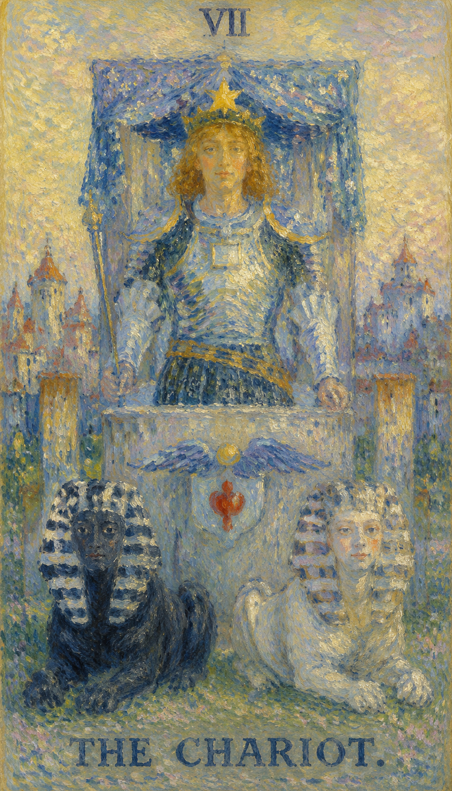

# 战车

战车把奔涌的情绪与未驯的欲望纳入方向感之中。它象征经由自律、专注与对立力量的整合而取得的推进——胜利从来不是天降的礼物，而是意志在阻力中辟出的一条道路。

当这张牌出现，说明目标已经明确，问题不在于"要不要走"，而在于你是否能稳住节奏，不被外界干扰拖走。走过了三分之一旅程的愚者，在这里蜕变成一名成熟、勇敢的战士，披荆斩棘地朝胜利奋勇前进。然而战车的出现并不意味着成功已经到手，它只是郑重地告诉你：成功是可能的。要把这份可能兑现成现实，你需要强大的控制力，因为眼前之事并不简单，而它的成败对你意义重大——无论是事业还是感情，战车始终带着"要自制，不可感情用事"的叮咛。

牌面中，一位头戴八芒星战盔、身着盔甲的勇士驾驶着一辆由两只狮身人面兽拉动的战车，向着胜利勇往直前，威风凛凛、无人可挡。战车左侧的黑色狮身人面兽代表严厉，右侧的白色狮身人面兽代表慈悲，二者并行象征阴阳的调和，也即追求胜利的根本条件——平衡。蓝色车篷由四根柱子支撑，对应火、水、风、土四大元素；篷上的六芒星图案象征天体对战士成功的影响，也预示着"希望"对获得胜利的重要。勇士右手紧握长矛，昭示内心对胜利的渴求；胸前的正方形代表土元素，象征意志的力量。车前一对翅膀相传是古埃及图腾，代表灵感；翅膀下的小盾牌则被认为是古印度预示阴阳结合的符号。

战士身后是城市，意味着他已将物质放在身后，转而展开心灵的旅程。他手上没有缰绳，狮身人面兽身上也没有束缚——真正的控制来自强大的内在意志，而非外部的强迫。这同时暗示着人类的意志与本能：黑与白的力量都被驾驭在车前，唯有方向统一，战车才能前进；倘若无法好好驾驭，它们便会彼此拉扯，让胜利从指缝间溜走。他站在城门外守望，既是守护者，也是防卫者。战车是一张既要劳力又要劳心的牌——它近似于钱币二与权杖骑士的混合体：钱币二"平衡双方"的主题在此被推到极致，黑白二兽明确点出这两端是相互对立的，因此即便是精于驾驭的英雄，也不得不倾尽全力去控制这两匹时刻想挣脱彼此的烈马；而权杖骑士的处境则提醒我们，英雄虽受人爱戴、一路风光，地位却并不稳固，他只能不停奔向下一个战场，靠持续的建功立业来守住自己的位置。

## 基础要素

1. 牌名：战车 (The Chariot)
2. 数字编号：VII / 7 号牌
3. 核心主题：意志、方向、胜利、自我控制
4. 元素：水
5. 星座或行星：巨蟹座 / 月亮
6. 希伯来字母：Cheth（赫特）
7. 代表意义：整合对立力量，以意志推动目标达成

## 牌面要素

| 要素 | 含义 |
|------|------|
| 战车 | 行动平台与人生方向，象征胜利、征服与自我断言。 |
| 黑白斯芬克斯（黑白柱子） | 对立力量、矛盾欲望与需要整合的方向；呼应康德的道德法则，是黑暗与光明的对立，也是必须克服的对立统一。 |
| 动物（狮身人面兽） | 本能、动力，以及驾驭自然力量的需要。 |
| 束带 | 控制两只神兽的束带，象征以精神力量掌控物质世界。 |
| 铠甲 | 自我保护与战斗准备。 |
| 星冠 / 星星兜帽 | 精神目标与胜利信念；星星象征精神向导与高尚追求，暗示与宇宙或更高知识的联系。 |
| 月亮符号 / 月亮肩章 | 情绪潮汐与内在驱动力，代表直觉、潜意识及对隐藏事物的感知。 |
| 正义与魔法方块图案 | 胸前装饰象征有秩序、有逻辑的思维，同时映照神秘与知识。 |
| 红色十字 | 盔帽前方的红十字象征灵魂的平衡，以及物质与精神的融合。 |
| 法杖（长矛） | 主人公手持的法杖象征权威与意志的力量。 |
| 金领 | 金色象征财富、力量与高尚，领子本身寓意权威和地位。 |
| 皇冠 | 象征力量、荣耀与成功。 |
| 城市背景 / 城墙 | 离开熟悉环境走向征服；基座后的城墙代表已被或即将被征服的文明，也是要面对的障碍。 |
| 河流 | 背景中的河流象征情感的流动、直觉与变革。 |
| 背后的群山 | 山脉代表挑战与未来的征程。 |
| 界轮及其上的符号 | 车上的圣甲虫象征埃及太阳神，寓意生命、复兴与永恒的旅程。 |
| 荷花装饰 | 荷花是东方文化中纯净与启蒙的象征，支撑车座，代表精神力量。 |

## 塔罗灵数

数字 7 代表探索、专注、精神试炼，以及胜利前夕的自我约束。它要求人从混杂纷乱的能量中，辨认并走出一条明确的道路。

战车的 7 号能量说明了一件事：胜利来自阻力之中的方向感。当外界的拉扯越大，越需要一个清晰而不动摇的目标，把所有看似对立的力量收拢到同一条前进的轴线上。

## 牌面解读重点

战车所示并非"非对即错"的判断题，而是一道选择题。正位时，无论你选择哪一个，结果都不会差；逆位时，则提醒你——无论选择哪一个，结果都不太理想。差别不在于有没有答案，而在于此刻你的自我控制力，是否足以驾驭已经摆在面前的局面。

## 正位牌意

**关键词**：胜利，前进，自律，控制，目标明确，竞争成功，旅行，突破，高效率，搬家，指挥，掌管，支配，限制，意志，成功，发财，成名，成功的人，决心，果断，坚定，决定，确定，查明，测定，计算，进步，自我控制，自我肯定，坚强的意志，以积极的心态面对事物，把握先机，取得驾照，必须要做，务必完成，坚定的决心

正位的战车说明：只要目标清楚并保持纪律，事情可以快速推进。这是一张鼓励你自我肯定、以坚强意志面对一切的牌——以积极的心态把握先机，主动出击、务必完成，胜利便会向你靠拢。但请记得，它给的是"可能成功"的承诺，而非"必然成功"的保证；能否兑现，取决于你是否拿得出与之相称的控制力与决心。

### 爱情/婚姻

感情中，战车代表主动追求、关系推进与共同目标，是一段热烈、积极、充满决断力的爱情。单身者可能遇到行动力强、目标明确的人；有伴侣者适合一起面对距离、家庭、工作或现实安排，甚至展开一段共同的旅行或冒险。爱需要方向，也需要给彼此留下呼吸的余地——这是辛苦努力才换来的感情，正因来之不易，你会格外珍惜，愿意尽一切努力守护它。

- **现况**：眼下的感情里不可避免地会遇到某种冲突或竞争，这有赖于你主动、积极地去处理与改进，千万不要在此刻轻言放弃。
- **桃花**：现在应该会出现新的感情对象，但你身边也许有不少实力相当的情敌在竞争，宜先掂量自己的心意与能力，再决定如何行动。
- **看法**：这段感情是辛苦努力得来的，因此格外珍惜，你会竭尽全力去维系它，不会被任何外在的事情所动摇。
- **复合**：两人之间的情分其实已所剩无几，复合的可能不大，加之眼前的情敌实力不弱，再存奢望也无济于事。

### 事业学业

事业学业上，战车非常有利于考试、竞赛、项目冲刺、升职争取、出差旅行与目标达成。它要求你集中火力、减少分心，把资源压在最关键的方向上。你目标明确、富有野心、握有指挥权，前进即可制胜，战果常常辉煌；这也可能意味着一个冒险的新项目，或一趟带着使命的商务旅行。

- **现况**：工作上正遇到一些困难和挑战，但对你而言都是力所能及之事，只要再击败竞争对手，最终的胜利便属于你。
- **建议**：此时应当采取强硬手段，绝不可因一时心软而坏了大局，即便引发正面冲突，也要不计代价地撑下去。
- **关系**：你与他人正处在激烈竞争之中，每个人都想把对方比下去，因此不太容易交到真心的朋友，多半得靠自己解决问题。
- **发展**：这份工作未来有很大的发展空间，但需要你主动去拼——只要你够拼，美好的前程就在前方等你。

### 人际财富

人际方面，战车适合主动沟通、争取位置与明确立场。你个性活泼、交友广泛、善于交际，独立自主，遇到挑战便勇往直前，凭着开拓精神击败对手。财富方面可通过纪律、规划与行动获得进展——这是一个很有收获的时候，你更要努力为自己争取最大利益；但不适合情绪化投资，也不该为了"赢"而盲目冒险。

- **现况**：你在人际关系中充满目的性，常对他人有所防备，反而难以放开心胸交朋友，有时也会觉得颇为孤独。
- **建议**：不要太过自以为是，也该听听朋友的说法，综合双方意见之后，或许能找到另一种更好的解决方案。
- **财运**：眼下财务上正值丰收之时，要努力争取最大的利益，几乎没有什么意外能阻止你获得财富；但对事情仍要做细致评估，别被表象欺骗，经过计算与比较后，自能找到最佳的用钱之道。

### 健康生活

健康上适合训练、减脂、制定运动计划，以及恢复一种久违的自律。战车的能量也鼓励户外活动——滑雪、兜风、骑马、踏青都很相宜，甚至适合考取驾照、培养对新鲜事物的爱好，或养成写日记、记录目标的习惯。但要注意过度用力、运动损伤，以及胃部与情绪上的压力，因为战车虽强，也需要稳定的节奏；懂得把握张弛，才不至于把自己逼到熄火。

### 其它牌意

正位战车常代表旅行、车辆、搬迁、比赛、胜诉、突破阻碍，也适合一切需要主动出击、奋勇向前的户外与新鲜尝试——滑雪、兜风、骑马、踏青、考取驾照、对新事物布满热情，乃至以写日记的方式整理方向。若问结果，正位通常表示可以胜出，关键在于全程保持节奏、不中途松懈。

### 情境指引

- **爱情运势**：象征关系中的进展与动力，代表在感情里取得胜利、征服困难的勇气与决心；面对挑战时，两人可能携手共进，共同推动关系向前。
- **财富运势**：果断决策并付诸行动将带来积极成果，可能指向投资或事业上的进展，表明你凭借努力与坚持终将实现财务目标。
- **当前情况**：呈现出积极的前进态势，你拥有明确的目标，也准备好克服任何障碍，这是一个适合主动行动、维持掌控的时期。
- **过去**：你可能经历过一段竞争激烈、需要高度自律的时光，早期的努力与奋斗为今日的成就奠定了根基。
- **现在**：你或许正体验着成功驾驭、掌控生活的感觉，对自己的方向充满自信，正稳稳朝着目标前进。
- **未来**：持续的努力将带来更多成就与胜利，不过你仍需保持自律与决心，不可松懈。
- **挑战**：当前的课题是如何在达成目标的过程中保持平衡与控制，你可能需要妥善处理内在的冲突或外部的阻力。
- **障碍**：潜在的障碍是过度自信或鲁莽行事，保持专注与谨慎，是越过它们的关键。
- **环境**：你所处的环境或许充满竞争与挑战，但同时也为你的成长与成功提供了机会。
- **支持**：支持多半来自认可你决心与能力的人，朋友、家人或导师都可能成为你的助力。
- **建议**：保持自信与决心，同时随情势变化灵活调整策略；不要忽视细节，始终保持战略性的思考。
- **优势**：你的优势在于坚强的意志与明确的目标，有能力驾驭局面，让自己的愿望成真。
- **弱点**：弱点可能是过度自信或容易冲动，这会使计划偏离既定的轨道。
- **正面影响**：增强了自我确立与达成目标的可能，鼓励你勇敢追求胜利与成就。
- **负面影响**：可能带来压力与紧张，因为你或许会为了成功而过度鞭策自己。
- **希望发生**：你希望自己的努力得到认可，能够克服一切障碍，最终取得成功。
- **害怕发生**：你害怕失去控制或方向，或担心因错误的决策而导致失败。
- **你如何看对方**：你看到对方有着坚定的决心与坚强的意志，他们的行动力与决断力令你敬佩，你认为他们目标清晰、方向明确，能够掌控自己的命运。
- **对方如何看待你**：对方眼中的你肯定自我、决心强烈、毅力十足，他们认为你拥有强大的动力与明确的目标，能够冲破阻碍、达成所设定的目标。
- **关系当前状态**：这段关系正处于积极的发展状态，双方都怀着坚定的决心与意志推动它前进，是一个充满活力与动力、彼此都积极求进的阶段。
- **关系未来发展**：前景充满希望与可能，只要双方都能维持现有的动力与决心，便能跨越接下来可能遇到的所有困难，这段关系有着很大的发展潜力，前路一片光明。
- **结果**：结果很可能是成功与成就，只要你继续保持专注、坚定，并适度调整，便很可能达成预期的目标。

## 逆位牌意

**关键词**：失控，方向混乱，冲动，停滞，失败，内耗，强行推进，发生意外，胡作非为，止步不前，固执己见，注意力散漫，遇突发事件而不知所措，自我约束缺失，方向感缺失，反对，反抗，对抗，对手，敌人，竞争者，没有方向，没有领导，挫败，不必要的冲突，目标不明确，行动无法果断，过于冒进，过于激进，混乱而不稳定

逆位的战车提醒你先统一方向，否则越用力越容易偏离目标。它常常意味着目标不明确、行动无法果断、方向感丧失，乃至陷入一种混乱而不稳定的状态——此时若仍一味冒进、激进，缺乏自我约束，便容易遭遇挫折，让局面滑向无法控制的境地，对未来的不确定感也会随之加剧。

### 爱情/婚姻

感情中可能出现拉扯、控制、争强好胜，或双方目标不同却被强行绑在一起。也可能是一方推进太快，另一方还没准备好，导致关系压力骤增。逆位的战车常伴随过于鲁莽、话不投机、因言语直白伤人，或因怯懦而使恋情无法推进；有时还会遭遇强劲情敌、被拒绝、被辜负，从而对爱情采取逃避的态度，最终走向可能的分离。

- **现况**：眼下的感情正面对很大的危机，此时应以家庭与家人的意见作为权衡的基准，否则到头来可能是一场空。
- **桃花**：现在出现的对象都比你强势，甚至可能主动来追你，你主动出击的成功率并不高，不如在原地静候时机。
- **看法**：你觉得在这段感情中受了许多委屈，也没有被对方真正理解，即便内心很想放弃，却仍怀着诸多不甘。
- **复合**：两人复合已几无可能，纵使勉强复合，日后也只会吵得更凶，关系依旧无法和谐。

### 事业学业

事业学业上可能方向不清、计划失控、资源分散，或因太想赢而忽略细节。逆位战车也常对应注意力散漫、泄气、退缩、挂科、丧失斗志，因急性子而失败，或因兴趣缺失、决心与方向不足而招致商业上的失利与竞争中的挫败。此时宜先确认目标、方法和优先级，再重新推进。

- **现况**：工作上遇到一些困难与挑战，同时也牵连出人际关系的问题，须当心，否则自己可能沦为炮灰。
- **建议**：这个问题已非你一人能够解决，多去请教不同的人，把众人的意见综合起来，或许能从中悟出些什么。
- **关系**：这是一个充满竞争的环境，最好还是靠自己比较安全，尽量不要卷入同事的纷争，以免惹上不必要的麻烦。
- **发展**：这份工作的发展其实还不错，但眼下仍有许多问题待解，只要撑过当前的危机，未来仍值得期待。

### 人际财富

人际上容易陷入权力较量，也可能因率性妄为引起他人不满、待人冷淡、怯懦退缩，或面对强敌而争论不休。财富方面要小心损失金钱、不懂节制的花费、赌博失利，以及冲动消费、赛车式投资、借贷扩张或为了证明自己而承担过大的风险。

- **现况**：你在朋友之间处于较弱势的位置，常常无法主张自己的意见，反而被朋友的意见所支配，属于被动交友的人。
- **建议**：此时必须先退一步，才会有和解的空间，可以先向对方道一声歉，接下来的局面你或许便懂得如何处理了。
- **财运**：眼下的财运并不理想，已经没有余粮，要量力而行，切莫太过勉强。眼前不宜大量买入，只该购置少量且必需之物，万不可大量囤积，否则可能酿成重大损失。

### 健康生活

健康上可能与过劳、运动伤害、情绪紧绷、胃部不适有关。逆位战车提醒你：真正的自律包括知道什么时候该停。当注意力散漫、因突发事件而措手不及时，硬撑只会让身体与情绪一同失速；适时减速、重新找回节律，远比一味冲刺更能护住你这副远征的躯体。

### 其它牌意

事情可能出现延误、交通问题、计划变更、竞争失利，也可能伴随固执己见、超速驾驶、注意力散漫、自得忘形，或因遭遇突发事件而措手不及。先检查自己是否同时朝两个方向用力，往往比责怪外部阻力更有效——把分裂的力量重新收拢到一条轴线上，比强行推进更接近转机。

### 情境指引

- **爱情运势**：可能表明关系中存在控制与方向上的问题，或一方过于强势导致双方关系紧张，建议放慢速度，共同寻找平衡点。
- **财富运势**：象征计划中断或财务目标偏离轨道，可能因缺乏明确计划或决策失误而导致财务不稳，需要重新评估目标与方法。
- **当前情况**：目前可能感到失去控制或方向，障碍与挑战使前进的道路不再清晰，需要重新找回正确的方向与策略。
- **过去**：你过去或许曾试图掌控局面，却因各方缺乏协调而努力白费，这段经验可以成为重新审视当前问题的起点。
- **现在**：你可能正面临困难，感到沮丧或难以推动事情前进，此刻需要冷静思考，避免冲动行事。
- **未来**：未来可能遭遇更多挑战，若无法有效管理现有问题，新的障碍便会接踵而至，应注重策略而非速度。
- **挑战**：当前的挑战是找回控制与平衡的方法，你可能需要放下固执，学习妥协，并适应所处的环境。
- **障碍**：主要障碍可能来自内在的抵抗或外部的不利因素，或许需要放弃一些控制，以顺应不断变化的情势。
- **环境**：所处环境可能充满变数，需要灵活适应；其中的混乱或不确定，要求你重新考量自己的立场与行动计划。
- **支持**：支持可能来自愿意与你合作、帮你找回方向的人，亲近之人的理解与建议或许至关重要。
- **建议**：建议是减慢速度，不要过分坚持自己的方法，而应考虑调整方向与策略，虚心听取他人的意见。
- **优势**：优势在于停下来重新评估局面所带来的机会，这有助于避免未来更大的问题。
- **弱点**：弱点可能是固执或缺乏适应性，它会阻碍进步与成功，你需要更开放、更灵活地处理问题。
- **正面影响**：可能促使你重新考虑并调整行动计划，而这往往是走向成功的必要过程。
- **负面影响**：可能包括失败感、挫败感或停滞不前，进而影响你的积极性与自信心。
- **希望发生**：你希望能找到解决问题的新方法，平稳地让一切恢复正常运转。
- **害怕发生**：你担心彻底失去控制，或害怕事情的结果远远低于预期。
- **你如何看对方**：你可能觉得对方眼下的行动有些冲动，缺乏计划与方向，甚至怀疑他们是否有能力实现目标、是否能管住自己的行为。
- **对方如何看待你**：对方可能觉得你目前有些混乱，在决策上犹豫不决，在行动上又显得过于冲动，因而对你的能力或意志有所怀疑。
- **关系当前状态**：这段关系或许正处于一个艰难的阶段，存在着混乱与冲突，双方都在努力寻找正确的方向，却可能因冲动或犹豫而备感困扰。
- **关系未来发展**：若无法改变现状，这段关系的未来恐怕会面临一些困难，唯有双方都能找回方向、克制冲动、做出明智的决策，关系才有望改善与发展。
- **结果**：结果可能是在重新评估与调整之后，重新赢回的平衡与控制；虽然或许需要一些时间，但最终多半能找到更稳定、更有效的前进之路。
