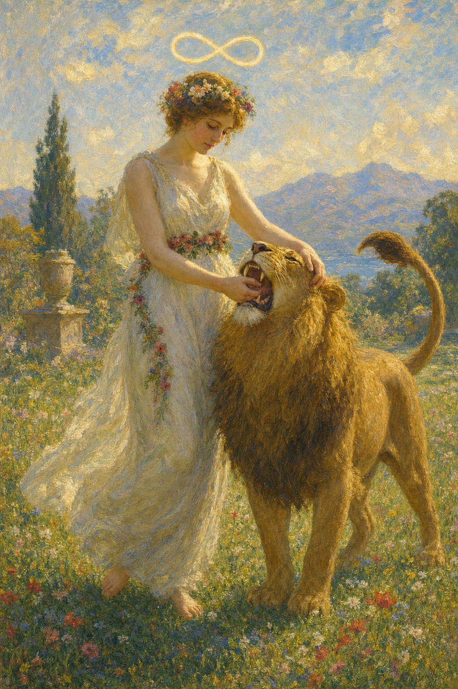

# 力量

力量（Strength）是塔罗牌大阿卡那第九号牌，编号为VIII，对应星象狮子座火元素 。该牌通过白衣女子徒手驯服狮子的图案传递以柔克刚的哲学，头上无限符号象征永恒力量，狮子象征人类动物性，驯服过程体现灵性成长与意志掌控、尾巴下垂体现兽性被驯服。花环与白色礼服分别代表爱的自然流露与纯洁特质。力量讲的是温柔而坚定的勇气。她以宁静的手驯服狮子，使本能不再横冲直撞，转而成为生命深处的守护力量。强调精神力量胜过物理强制 。「战车」的数字「7」是代表「阳性」的魔法，而数字「8」则代表「阴性」。这种象征意义是来自于解剖构造。男性的身体有七个孔窍（鼻子算一个），而女性则有八个。再者，男性的身体有七个端点，双手、双腿、头、中心，以及阴茎。女性则有八个，由乳房取代了阴茎。
第二阶段：转化为内部 随着大阿卡纳的第二列，是“愚人之旅”中历经恋人牌的选择、战车牌的外在胜利后，抵达的“内在成长”关键节点。我们从外在的世界及其对内在自我的挑战迈步向前。隐藏在「战车」强有力形象之内的冲突矛盾，现在必须被直接地面对。小我的面具必须死去，意味着内在的探索无法由小我完成。我们必须去面对，长久隐藏在我们表意识思想乏下的情感与欲望。
希腊神话体系： 赫拉克勒斯（Herakles）希腊著名的英雄之一，也是阿耳戈英雄之一。按照神喻他为欧律斯透斯（Eurystheus）完成了十二件艰巨的任务，十二件只有英雄才能完成的任务。其中包括杀掉九头蛇海德拉（Hydra）、清扫奥革阿斯（Augeas）的牛圈（Augean stable）、征服阿马宗女人（Amazon）、带回冥府的三头狗刻耳柏洛斯等等。因为他患有癔症，所以经常误杀亲友，于是又在翁法勒（Omphale）处服役了三年。最后赫拉克勒斯终于成了奥林匹斯山上的神，并娶了青春女神赫柏为妻。亚历山大大帝一向宣称自己是赫拉克勒斯的后代，以显示自己的英雄本色，他还曾带上狮头，模仿赫拉克勒斯。赫拉克勒斯就是现在的武仙座。塔罗牌的对位，Ⅷ. Strength 力量，代表意志。
中国体系：花木兰，替父从军展现孝道与勇气，战场中以智谋和毅力克服困境，非靠蛮力取胜，完美呼应力量牌“温柔驯服狮子”、以柔克刚、内在坚韧、驯服本能而非暴力压制”。

当这张牌出现，说明你正遇到“温柔的勇气、耐心、自我驯服”的课题。「力量」则允许内在的激情浮现出来，作为超越小我的第一步，它既可能表现为外部事件，也可能是内心正在成熟的一个阶段。与魔术师一样，力量女神的头顶也悬着一个无穷大符号，预示着她无尽的力量。然而与魔术师不同的是，她的力量并非壮汉的蛮力，而是内心的坚韧，透露出一丝怜悯与包容。「力量」的位置——在该行的第一位，以及驯狮女子头上的无限大符号——另一个对数字「8」的指涉，将这张牌连结上了「魔法师」。性别的反转指出了阳性及阴性原型面向的结合。「魔法师」对生命的积极投入，被「女祭司」所蕴含的内在宁静给调和了。「Teth」也指涉着「蛇」；但是希伯来文的「蛇」同时也意指「魔法」。她用慈悲的目光，轻轻合上雄狮的嘴，毫不费力地控制住了百兽之王的兽性——仿佛是在同情狮子的本性，而那象征征服的猛兽，也在女神冷静慈悲的注视下变得温顺可亲。也许，宽容的心才是真正的力量来源。

女性轻抚狮子，头上有无限符号，画面安静却充满力量。她头戴花环、腰束花带，象征高贵圣洁与温柔却坚韧的力量。她无所畏惧，拥有不可战胜的勇气、信心与耐心，散发着自信的光芒，温和中透出一股威仪。这画面提醒我们：要凭借这些优秀的品质去克服内心的野性、恐惧、愤怒与冲动。

力量虽可指身强体壮，但它更倾向于身心、尤其是内心的“强韧”。面对强权不低头、面对困难不退缩的人格力量，才是这张牌的真正意义。牌上的狮子代表人的动物本能，而力量所展示的，正是人对本能的掌控——这种掌控不是生硬的压制，而是因势利导、以柔克刚，颇有修行中“驾驭心性”的意味。对内，具备战士的精神，不畏怯懦与痛苦，不逃避应尽的责任；对外，怀着慈悲之心，待人友善、柔和有道。它与佛家的“行菩萨道”相似，是一种内外兼具的状态，兼有内在力量与无私之爱。此外，许多现代塔罗文献都提到力量牌与“蛇”相关，对应瑜伽中沉睡于脊椎底部的昆达里尼原始能量，它的出现也可能代表这股灵性能量的觉醒。

## 基础要素

1. 牌名：力量 (Strength)
2. 数字编号：08 号牌
3. 核心主题：温柔的勇气、耐心、自我驯服
4. 元素：火
5. 星座或行星：狮子座
6. 希伯来字母：Teth
7.生命树路径：第九条，在力量(Geburah)与仁慈(Chesed)之间
8. 代表意义：通过温柔的勇气理解当前阶段的命运功课
9.脉轮：太阳神经丛，掌管自我
10.方位：北上
## 牌面要素

| 要素 | 含义 |
|------|------|
| 核心画面 | 女性轻抚狮子，头上有无限符号，画面安静却充满力量。 |
| 人物姿态 | 表现当事人面对课题时的心理位置。 |
| 背景环境 | 提示事件发生的精神气候与现实压力。 |
| 主要器物 | 象征这张牌运作能量的工具或门槛。 |
| 光线色彩 | 显示意识清晰度、希望或阴影。 |
| 编号 | 对应此阶段在人生旅程中的功课。 |
| 白色礼服 | 白色象征纯洁与无邪，代表品德上的纯净。 |
| 狮子 | 象征力量、勇气，以及我们内在的野性本质。 |
| 腰带与花朵 | 花朵象征美丽、生命与成长，腰带则是控制与约束的象征。 |
| 尾巴之间的无限符号 | 代表无限与永恒，表明力量是无穷的，或需要持续的努力。 |
| 山脉 | 背景中的山脉代表稳固、障碍，以及即将到来的挑战。 |
| 狮子的开口 | 表示沟通与表达，也象征内心的力量被温柔地引导和控制。 |
| 女性驯服狮子 | 代表以柔克刚，以恩慈与内在力量同野性对话。 |
| 长发 | 常代表自由流动的思维与自然力量。 |
| 黄色背景 | 黄色与活力、优化以及幸福的能量相关。 |
| 蓝色天空 | 代表平静与精神的宽阔。 |
| 绿色土地 | 绿色代表生长、繁荣与自然的再生力。 |
| 裾边的红色装饰 | 红色象征激情、活力与行动，是内心激情的象征。 |
| 狮子的尾巴 | 尾巴朝上翘，表示积极的态度与乐观的精神状态。 |

## 塔罗灵数
数字8

・数字8的关键词:掌控、善于把控全局、权衡利弊

・数字8金钱关键词:经营规划、理财企划、有老板、主管格局

数字8感情关键词:有点霸道、格局很大、不会计较小节、主要把控大方向・数字8的人:具有4双倍的力量、野心加倍、财富数字、最爱钱的数字、也是最具有金钱能量的数字、经商的数字，非常适合经营管理、善理财。缺点就是:喜欢掌控一切、喜欢压制别人。如果是狮子座8号人是最会赚钱的人。

・能量倾向特质:展现成长
8数有圈的人天生有商业头脑及公关能力。

8数想要广结善缘，以便有朝一日出人头地，有名有势。他们看得出人事物的潜能和力量，全力开发，个性讨喜，不把真正的想法说出来。

・8数的权力欲很强，甚至会以手段博取名利，有时因此付出惨痛的代价。*8数的人应该对自己诚实，否则是自讨苦吃。

*8号的课题是:如何控制自己欲望。

数字 8 象征循环、力量与自我掌控。它像一条回环的道路，让人学会把冲动炼成勇气，把欲望化为可被信任的生命力。

力量的课题在于柔中有骨。它让人明白，真正的强大常常安静无声，却能长久地托住关系、身体和人生选择。

## 牌面解读重点

这里的力量并非自身固有的力量，而是自身所能控制的能量。在人事物中，它体现为主体对客体的掌握与否；在关系中，则是是否占据主导地位。力量牌也与四元素牌的特性相近：它表明能量的存在，却不指明能量的具体方向，因此这股能量可能尚未实现。正因如此，它更多揭示当事人的个性与内在选择，而非外在环境本身。其行事风格的关键在于以柔克刚——任何想凭蛮力强行推动事物发展的做法都会失败。值得一提的是，力量牌的能量是内向的、阴性的，因此它的出现常代表女性在关系中占据主导地位；若有其他暗示强势女性的牌相辅（如女皇，甚至女性一方出现国王牌），它甚至可能暗示女性过于强势、强求或强迫对方在一起，形成“女追男”或男方“柳下惠”的局面。

## 正位牌意

**关键词**：勇气，耐心，自信，疗愈，本能调和，柔性掌控，精神抖擞，不屈不挠，意志坚定，潜力十足，胆识过人，信念坚定，体力，力气，强度，毅力，坚强决心，意志力量，勇敢，无畏，胆量，说服力，劝说，影响力，同情，怜悯，控制，权力，坚韧，平衡

正位的力量表示内在能量正在被温柔地统合。你内心充满力量，有很强的自我控制力，充满决心与勇气，具备面对挑战的能力与坚持到底的毅力。你处事沉着冷静，善于理解和接纳他人，能以高度的忍耐力积极面对生活的困难，并拥有较强的恢复力。你可以用耐心化解紧张，用信任安抚本能，用稳定的心穿过挑战。

### 爱情/婚姻

感情中，力量代表关系进入与“温柔的勇气、耐心、自我驯服”有关的阶段。这是一份感情稳定而深厚的关系，两人之间有很强的精神连接，都愿意为对方付出、接纳彼此的缺点，关系有着坚定的基础，也能坦诚面对彼此的问题。恋情发展顺利，婚姻生活充满理解与接纳，是一种健康的相互依赖。整体来看，无论是初次相遇还是已成情侣，这都是一段值得投入、可以做长远规划的关系；即便分手，也有能力恢复，不会受到太大伤害。

- **现况**：感情状态还算稳定，但应主动付出更多的爱，才能让人感觉到这段关系的成长，为彼此带来更多欢乐。
- **桃花**：应该很快就会出现新的感情对象，关键只在于你主观上接不接受——这会是一段值得付出的感情，不妨试着去感受。
- **看法**：这是一个互补的组合，两人虽有许多不同，却能彼此配合；有时你需要扮演导师的角色去引导对方。
- **复合**：两人之间还有复合的可能，也有很多你可以努力的地方，对方同样想与你复合，别急着放弃。

### 事业学业

事业学业上，这张牌提示你用更高层次的眼光处理问题。你有很强的毅力与决心，能直面困难和挑战，具备出色的职业发展潜力与自我控制力，能够专注、积极地面对工作或学习中的难题，热情高涨且恢复力强，前景看好。它可能带来转机、考验、成果或暂停，但核心都是要求你调整策略，学习这张牌所代表的攻坚能力。

- **现况**：工作状况其实还算顺利，也有不少可以表现的机会，应当把握各种彰显自己的机会，才能更上一层楼。
- **建议**：有些事情需要与人相互配合，也要顾及对方的立场，找到双方都能接受的方法，事情才能顺利推进。
- **关系**：每个人都有一定的实力与傲气，应以宽大的心胸接受别人比你强的事实，真心欣赏对方，才能英雄惜英雄。
- **发展**：这份工作未来发展不错，但竞争者也不少，只有比现在更加努力，才能保持眼下的优势。

### 人际财富

人际关系中适合看清彼此的位置，减少表面维持。因为你待人不错，人际上并无大问题；你为别人付出越多，得到的朋友相助也越多。你拥有较强的沟通与社交能力，能理解和接纳他人，在人际中保持冷静，建立健康而稳定的关系。财富方面要结合现实条件与长期影响，做出清醒安排。

- **现况**：因待人友善，人际关系顺畅；付出越多，越能收获朋友的回馈与帮助。
- **建议**：试着站在对方立场想事情，也许就能找到两全其美的方法；若由你主动提出，很快便能化解僵局。
- **财运**：当前财运状况很好，应趁此时多储备一些本钱。即使决定买入某些东西，也要懂得议价——经过谈判，才能在感觉上让各方都满意。

### 健康生活

健康生活上，力量提示身心状态与当前心理课题相连。适合检查压力来源、作息习惯和身体信号，并以更稳定的方式照顾自己。这张牌鼓励你以坚韧而温柔的态度对待身体，用规律与耐心取代极端节制或硬撑，把内在的稳定转化为持续的健康。

### 其它牌意

可能代表兼顾工作与爱好、向往刺激的人生、活跃于社团或派对。若问具体事件，正位多表示事情进入关键阶段。主动理解它的意义，会比单纯等待结果更有力量。

### 情境指引

- **爱情运势**：在爱情关系中存在强大的吸引力与深厚的情感联系，两人可能共同克服障碍，关系中充满激情与承诺。
- **财富运势**：你有能力凭坚韧与毅力增强财务状态，通过努力与坚持实现稳定收入或投资回报。
- **当前情况**：你正依靠内在的力量与勇气面对挑战，信念与决心为你提供了稳步前进所需的支持。
- **过去**：过去的经历已锻炼出你的内在力量与韧性，为现状打下坚实基础。
- **现在**：你拥有稳定的能力来处理生活中的困难，自信与冷静使你在压力下仍保持清晰专注。
- **未来**：展望十分乐观，内在力量将继续支持你克服即将到来的障碍，引领你走向成功。
- **挑战**：如何继续培养并运用你的内在力量，以面对任何外在的压力或挑战。
- **障碍**：障碍可能来自自我怀疑或外界压力，学会保持信心与勇气将帮助你越过它们。
- **环境**：你所处的环境可能要求你展现力量与勇气，人们会依赖你的稳定性与决断力。
- **支持**：支持来自那些认可你内在力量的人，团队合作与相互鼓励是你强大的后盾。
- **建议**：继续保持自信与毅力，面对困难时保持冷静，相信你的直觉与能力。
- **优势**：你能控制情绪，并在面对挑战时展现坚强与耐心。
- **弱点**：你可能倾向于强压自己的情感，而非以更温和的方式处理；学会平衡力量与柔软至关重要。
- **正面影响**：你将成为一个有力的角色，对周围人产生积极影响，给予他们力量与勇气。
- **负面影响**：在保持强大的过程中，可能疏远那些需要更多支持与同情的人。
- **希望发生**：希望自己能够继续坚强、始终保持控制，无论面对怎样的挑战。
- **害怕发生**：害怕失去控制，或担心自己的内在力量不足以应对即将来临的挑战。
- **你如何看对方**：你感到对方拥有一种内在的力量与决心，能克服困难；他/她的吸引力与影响力能激励和鼓舞他人。
- **对方如何看待你**：对方认为你内心坚强、自信而有勇气，能以温和而坚定的方式面对挑战；他们被你的魅力与影响力吸引，也看到你自律自制、能掌控情绪与欲望的一面，总体上非常尊敬你的内在力量与处事方式。
- **关系当前状态**：关系中存在强大的精神联系与相互尊重，双方都展现出勇气与内在力量，可能正共同克服困难或支持彼此成长；它也暗示激情、耐力与坚韧，双方能以成熟平衡的方式处理冲突，以爱与同情心解决问题，正处在增进信任与理解的阶段。
- **关系未来发展**：双方将有足够的勇气与信心面对未来挑战，通过相互支持与鼓励共同克服困难，使关系更坚固稳定；也意味着双方将学会控制情绪、保持耐心，凭团结一致维持并发展这段关系，共同创造更美好稳定的未来。
- **结果**：结果将是一个充满力量与控制的局面，无论在个人层面还是外在世界，你都将展现出强大的影响力。

## 逆位牌意

**关键词**：胆怯，失控，自我怀疑，压抑，暴躁，意志薄弱，精力不足，急躁不安，丧失信心，忍耐力不足，自私自大，自我否定，不自信，精神不振，能力低下，兽性，原欲，靠本能处理问题，做事凭感觉，无力，恐惧，疑虑，软弱，失衡

逆位的力量表示这股能量受阻、失衡或被错误使用。此时你内心缺乏力量，自我控制力不强，缺乏决心与勇气，面对挑战的能力较弱，也缺乏坚持到底的毅力；忍耐力不足，处事容易冲动，理解与接纳他人的能力变弱，对生活的困难消极面对，恢复力也较差。最重要的是先看清自己是否正在抗拒这张牌所要求的功课。

### 爱情/婚姻

感情中容易出现误解、逃避、控制、冷淡或旧模式重复。这往往表现为对感情失去信心、面对爱情懦弱而无法坚持，或渴求爱情却无果而终、经不住诱惑。两人之间缺乏精神连接，都不愿为对方付出，也无法接纳彼此的缺点，关系缺乏基础，恋情发展困难，相互依赖变得不健康。关系若一直无法推进，需要回到双方真实需求。

- **现况**：感情状况有点失控，虽然两人都想让关系更亲密，却因某些变故无法配合而陷入僵局。
- **桃花**：未来出现的对象不在你的掌控之内，不如等别人主动追求，这样反而会遇到更合适的人。
- **看法**：你觉得对方很强势，但自己也不愿事事迁就；你仍需调整，偶尔还得做一些讨好的事。
- **复合**：复合本身并不难，但两人存在本质上的不合，即便复合也难以解决根本矛盾——是否复合，还需自己好好想清楚。

### 事业学业

事业学业上可能有拖延、阻滞、判断偏差或权责不清，常表现为急于求成、没有耐心、一知半解、缺乏实力，乃至下了危险的赌注而招致失败、挫折与放弃。你缺乏毅力与决心，难以专注，对困难消极以对，热情不高，成果不佳，前景不明朗。先修正方向、补足信息，再决定下一步。

- **现况**：工作中遇到比较专制的领导，光是每天应付他就很累；虽也有不少表现机会，却都是听命行事。
- **建议**：要鼓起勇气坚持自己的立场，不要因别人的闲言碎语而退缩；继续以自己的方法推进，终会得到被理解的结果。
- **关系**：工作上的人际关系十分紧张，更要小心处理与他人有关的事，深思自己的做法会影响到哪些人，免得引起不必要的流言。
- **发展**：这份工作未来并不太稳定，但若你能突破挑战，仍会有不错的前景——这取决于你是否肯把功夫真正下到工作中。

### 人际财富

人际方面要小心投射和不公平交换。逆位常表现为任性、自大、蛮干、故弄玄虚，因而亏损、上当、失去自信与他人的信任。人际关系不和谐、不稳定，沟通能力变弱，难以理解和接纳他人，容易冲动，处理能力与恢复力都不足。财富方面适合回到理性评估与长期规划，避免被恐惧推着走。

- **现况**：人际上要格外小心，可能有人想利用你去达成他的目的——未必对你有害，却一定会让你不舒服。
- **建议**：留意流言对你的伤害，当面把问题向对方讲清楚，不要透过第三方传话，否则事情可能越描越黑。
- **财运**：财运还算不错，却未必让你主观满意；要理性一些，好好评估哪些钱该花、哪些不该花。此时买入行为要特别小心，若难以决定，应以品牌、质量等参数为准，贪小便宜反而会吃大亏。

### 健康生活

健康上，逆位常提示压力累积、情绪压抑、作息失衡或身体警讯被忽略。当内在力量受阻，人容易暴躁、内耗或靠本能放纵，把身体当成情绪的出口。建议减少极端做法，重新建立可持续的生活节奏，并以温柔而非压抑的方式照顾情绪与身体。

### 其它牌意

可能代表说服他人、目中无人、狂妄自私、不善配合而喜欢独来独往，或禁不住诱惑。事情可能延迟、反复或暴露隐藏问题。先修正模式，再谈结果。

总结：在占卜时，「力量」牌是指以希望和热忱面对生活的能力，尤其是面临某种困难的问题或是转变的时刻。它显现一个内心坚强的人，热情但却平静地体验人生，不为激情所掌控或冲昏了头。这张牌代表找到力量，尽管怀有恐惧和情绪的压力，仍能展开或继续某种困难的计划。
### 情境指引

- **爱情运势**：可能意味着缺乏自信或在关系中感到不安全，也可能出现控制欲或激烈争吵的问题。
- **财富运势**：财运可能遇到挫折，源于缺乏自律或资金管理不善，建议重新评估财务策略与消费习惯。
- **当前情况**：可能感到无力或容易受到打击，内在的恐惧与不确定正在影响你的行动与决定。
- **过去**：过去可能有一段时间你没有运用自己的力量、被动地生活，这影响了你现在的状态。
- **现在**：你可能正经历自我怀疑、感到力不从心，需要重新找回勇气与信心。
- **未来**：若想避免挫败感，你需要学会更好地与内心的恐惧和不确定作斗争，重新掌握主动权。
- **挑战**：如何战胜内心的软弱，找到重新获得力量与控制的途径。
- **障碍**：情绪上的波动或外界的负面影响，使你难以发挥真正的力量。
- **环境**：所处环境可能不利于展示个人力量，存在压制或限制你自信展现的因素。
- **支持**：你需要寻找那些能鼓励你克服无力感、帮你找回内在力量的支持系统。
- **建议**：透过反思弱点来增强决心，避免被情绪左右，尝试找到重新获得控制感的方法。
- **优势**：你的优势在于自我反思能力强，有机会识别并解决阻碍你的内在问题。
- **弱点**：缺乏自信与自我控制，可能让你在面对挑战时感到无助、犹豫不决。
- **正面影响**：经历逆境后的成长与自我提升，学习从失败中恢复并变得更强。
- **负面影响**：感觉被生活所控制而非主导生活，可能导致抑郁与失落。
- **希望发生**：希望能克服当前的无力感，找回从前的力量与自信。
- **害怕发生**：害怕自己的弱点被人看穿，或害怕在需要表现强大时显得脆弱。
- **你如何看对方**：你在关系中感到缺乏信心或力量，对自己或对方感到不确定，担心自己没有足够的内在力量去处理关系问题；也可能在控制情绪或欲望上有困难，导致过度依赖或施压，感觉被动无力、缺乏话语权，甚至因自身恐惧而对对方过于苛刻、忽略其优点。
- **对方如何看待你**：对方认为你在某些方面不够强大或自信，处理问题时显得犹豫、缺乏决断；可能觉得你情绪化、有控制欲或依赖性，需要更多支持、时间与空间去发展内在力量，或感到你对他们施加了压力、彼此存在不平衡的力量关系，希望你更独立自信，使关系更健康平衡。
- **关系当前状态**：关系中存在不平衡的力量动态，一方可能过于强势或控制欲过强，另一方感到被压迫或无法施展；缺乏自信、恐惧或不安全感影响着关系的稳定，也可能缺乏耐心与理解，或面对挑战时缺乏勇气、逃避责任。
- **关系未来发展**：若不解决力量不平衡的问题，未来可能遇到困难，一方持续感到无力或被控制，从而引发冲突、争执甚至分裂；未来也可能缺乏必要的勇气、决断力或自律来面对挑战，出现逃避行为，或双方都不愿采取改善关系的措施。
- **结果**：结果可能是需要一段时间来重新发现自我与内在力量，这将是一个自我发现与成长的过程。
