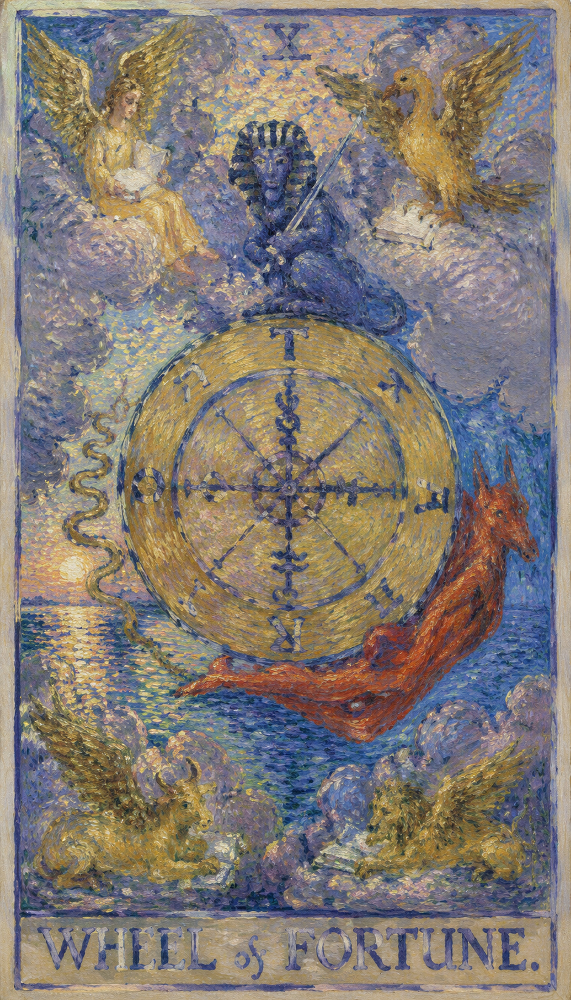

# 命运之轮

命运之轮缓缓转动，把人带过高处与低谷。它显示生命的周期，也显示时机在无声中更替。

当这张牌出现，说明你正遇到“循环、转机、命运、变化”的课题。它既可能表现为外部事件，也可能是内心正在成熟的一个阶段。命运之轮是大牌中少数几张没有人物的牌，牌面却丰富而寓意深刻：天空中悬着一架蔚蓝的命运之轮，与教皇的三层投管相似，它也由三层组成。最内层的圆空无一物，象征万物的创造；中间一层有四个炼金符号，代表西方物质的四要素，象征万物的形成；最外层是物质世界之圈，上、右、下、左四方分别是 T、A、R、O 四个字母，可拼读为 ROTA（轮）、ORAT（说）、TORA（律法）、ATOR（哈托尔女神），组成一句完整的话——“塔罗之轮诉说哈托尔女神的律法”。物质世界圈中另四个方位则是上帝最古老的名字 YHVH。

轮子周围有四圣兽、斯芬克斯与升降的神秘生物，象征宇宙循环。轮盘左侧是埃及神话中的邪恶之神，蛇头朝下预示人生的沉沦；背负命运之轮的阿努比斯预示着背负命运的渴望；顶端的狮身人面像是智慧的象征，其手中的宝剑代表思考——面对人生，思考真谛或许正是获取顺境的方法。牌的四角分别是狮子、飞鹰、天使与神牛，对应四个固定星座与四元素：鹰为天蝎座属水、狮为狮子座属火、牛为金牛座属土、人为水瓶座属风。它们都在读书、汲取智慧，而翅膀赋予它们在变动中保持稳定的能力。

正因这张牌上没有人物，它说到底与个人无关——无论当事人此刻经历高潮还是低谷，主因都不在当事人本身，因此既无需洋洋自得，也不必自我否定，却也无法靠主动行动改变当下。命运之轮展现的是塔罗中少有的“不可抗力”：相信因果者可视之为业报的显现，不信者可视之为上帝掷骰子恰好掷到某个数字。由于它表现的是不可抗拒的天道轮回与自然节律，其影响极为长久。

## 基础要素

1. 牌名：命运之轮 (Wheel of Fortune)
2. 数字编号：10 号牌
3. 核心主题：循环、转机、命运、变化
4. 元素：火
5. 星座或行星：木星
6. 希伯来字母：Kaph
7. 代表意义：通过循环理解当前阶段的命运功课

## 牌面要素

| 要素 | 含义 |
|------|------|
| 核心画面 | 轮子周围有四圣兽、斯芬克斯与升降的神秘生物，象征宇宙循环。 |
| 人物姿态 | 表现当事人面对课题时的心理位置。 |
| 背景环境 | 提示事件发生的精神气候与现实压力。 |
| 主要器物 | 象征这张牌运作能量的工具或门槛。 |
| 光线色彩 | 显示意识清晰度、希望或阴影。 |
| 编号 | 对应此阶段在人生旅程中的功课。 |
| 转轮 | 象征生命的周期性、命运与机遇的变化。 |
| 法老的头像 | 中心的图像代表权力与知识的结合。 |
| 四个生物 | 四角的四个生物分别代表四福音书的作者，象征智慧、力量、美与速度。 |
| TORA／תורה | 旋转中的文字可读作“TORA”，意味着占星术或犹太人的律法。 |
| 狮子 | 与圣马可相应，象征勇气与力量。 |
| 牛 | 象征耐心与牺牲。 |
| 人 | 代表圣马太，象征智力与知识。 |
| 鹰 | 代表圣约翰，象征高飞与灵视。 |
| 化学符号 | 转轮边缘的符号象征炼金术与元素转化的过程。 |
| 同心圆 | 转轮中心的同心圆象征目标与精神的集中。 |
| 云彩 | 四角的云象征超自然的力量与神秘。 |
| 红色的生物 | 可能代表赛特，古埃及的混沌与风暴之神。 |
| 蓝色的生物 | 可能象征智慧与知识。 |
| 金色的转轮 | 金色象征高贵、繁荣与直觉的灵光。 |

## 塔罗灵数

数字 10 象征一个循环的完成，也孕育下一轮开始。它把 1 的开端与 0 的无限相连，提示命运正在换档。

命运之轮的课题在于识时。好运与阻滞都只是轮上的一刻，清醒的人会在变化中调整姿态。

## 牌面解读重点

人事物不以个人意志为转移，既充满偶然性，又拥有必然性。轮子转到何处并非当事人所能左右，因此真正的智慧在于顺势识时、坦然接纳起落，而非执着于“我能否掌控结果”。

## 正位牌意

**关键词**：转机，好运，变化，机遇，周期，顺势而为，把控时机，机会降临，转变期，意外的收获，当机立断，幸运降临，恢复原状，因果报应，善恶有报，生命周期，命运，天理，天命，转折点，运势上升

正位的命运之轮表示转机临近。好运来临，事情有所改变，命运正迎来转折——你可能交上好运、走向成功、得到喜讯，事情逐渐好转、机会随之而来，命运的轮盘开始转动，幸运之神正眷顾着你。机会可能来自外部环境、偶然相遇、政策变化或一段旧循环的自然结束。

### 爱情/婚姻

感情中，命运之轮代表关系进入与“循环、转机、命运、变化”有关的阶段。它常意味着命运的邂逅、一见钟情，或突然遇到心仪的对象、突然的告白；恋情进展顺利，感情生活变得丰富，可能迎来婚姻的机会，整体爱情运势上升。单身者会被相应气质的人或关系吸引；有伴侣者则需要围绕信任、边界、承诺、成长或真实需求进行更成熟的沟通。

- **现况**：感情发展即将进入下一个阶段，应放下不必要的顾虑与担心，与对方一起去面对接下来要发生的事。
- **桃花**：也许会出现一见钟情的爱情；若想谈恋爱，不妨每天把自己打扮得美美的，时刻准备好彼此相遇。
- **看法**：这是命中注定的一段感情，无论如何都想和对方在一起；即便经历风风雨雨，仍很珍惜两人的情分。
- **复合**：两人复合其实是意料之中的事，即使当时撕破了脸，仍有很大机会复合——一切冥冥之中早已注定。

### 事业学业

事业学业上，这张牌提示你用更高层次的眼光处理问题，常带来好运、确定前途、意外的好消息与他人援助；考运佳、升职有望、学业进步，伴随有利的变动。它可能带来转机、考验、成果或暂停，但核心都是要求你顺势调整策略、把握机遇。

- **现况**：目前处在非常幸运的时期，即使你不是很努力，工作上也很得心应手。
- **建议**：很多事情应顺势而为，不要与时代潮流作对；面对问题保持镇定，只要把握正确方向，事情就会自然解决。
- **关系**：你在这份工作中的人际关系不错，也能因此结识许多新朋友，应把握机会，好好建立自己的人脉。
- **发展**：这份工作有不错的发展前景，但除了乐观应对之外仍要努力工作，否则可能错过升迁或调动的机会。

### 人际财富

人际关系中适合看清彼此的位置，减少表面维持。命运之轮带来临时的收入、意外之财，以及意外的贵人相助；你善于随机应变、社交环境有利、人缘佳、朋友运好。财富方面要结合现实条件与长期影响，做出清醒安排。

- **现况**：你属于朋友很多的人，每换一次环境就有新朋友出现，久而久之积累许多好友，成为你的贵人。
- **建议**：很多事是机缘巧合，若真觉得两人缘分已尽，那就不必强求。
- **财运**：现在财运很好，也会有一些偏财，可以赚到不少钱，应把握时机做好长期发展的打算。此刻正是投资可获利之时，若之前没有投资，可以开始试试，但也要留意投资变化的时机。

### 健康生活

健康生活上，命运之轮提示身心状态与当前心理课题相连。适合检查压力来源、作息习惯和身体信号，并以更稳定的方式照顾自己。身体也有自己的周期与节律，顺应它的起落、在状态好时积蓄、在低谷时休养，会比强行对抗更有益。

### 其它牌意

可能代表摄影、绘画等受爱好影响较大的事物，也意味着获得机会、立即行动。若问具体事件，正位多表示事情进入关键阶段。主动理解它的意义，会比单纯等待结果更有力量。

### 情境指引

- **爱情运势**：象征运势的好转与积极变化；单身者可能遇到新的恋情，已在关系中者则可能进入下一个幸福的阶段。
- **财富运势**：可能有意外的好运与机遇，你或会遇到能改善财务状况的机会，如意外的收益或升职加薪。
- **当前情况**：生活正处于变化之中，这些变化将带来积极的结果，是时候抓住机遇、乘风破浪。
- **过去**：过去的行动与决定开始显现其结果，无论好坏，都是生活循环与变化的一部分。
- **现在**：正是转折点，命运之轮正为你展开新的篇章，你可能感到事业或个人生活的动态变化。
- **未来**：未来将有更多机遇与挑战，重要的是保持开放与适应性，以充分利用即将到来的新局面。
- **挑战**：接受并适应这些变化，有时变化带来不确定性，需要你有勇气面对与适应。
- **障碍**：你自己的抗拒可能是主要障碍——害怕变化或过于拘泥旧有方式，会阻碍你的进步。
- **环境**：你所处的环境可能正经历快速变化，多由外部因素推动，需要你迅速适应。
- **支持**：环境与周围的人会提供机遇并帮助你适应变化，可能出现意想不到的助力。
- **建议**：接受变化并积极参与其中，不要害怕未知，而要看到每个转变背后的机会。
- **优势**：能迅速适应新情况，并具备抓住机遇的能力。
- **弱点**：若过于依赖稳定与安全感，这会成为弱点，因为命运之轮的本质是不断变化的。
- **正面影响**：新的开始、增长的机会，以及通过变化学到的宝贵经验。
- **负面影响**：若不愿接受变化，可能体现为失去机会，或感到混乱与不安。
- **希望发生**：希望变化能带来积极效果，如新的关系、事业上的成功或其他形式的进步。
- **害怕发生**：害怕变化打破目前的平衡，带来不确定性与失控的感觉。
- **你如何看对方**：你觉得对方正经历一段好运期，或他们的决策与行为正带来积极结果，能适应生活的变化并从中受益。
- **对方如何看待你**：对方认为你处于积极阶段，对生活充满乐观，能适应并接受生活的起伏，并因此而进步。
- **关系当前状态**：关系可能正经历积极的转变或发展，你们或在享受一些好运、看到积极的改变，并一同适应、从中获得乐趣。
- **关系未来发展**：关系可能持续发展进步，迎来更多积极变化与好运，你们将继续适应并享受这些变化，共同创造更积极愉快的关系。
- **结果**：结果可能是巨大的转变，但最终会导向更好的结果——只要你能勇敢面对并善用这些变化。

## 逆位牌意

**关键词**：停滞，坏运，抗拒变化，反复，失控感，时机不佳，判定错误，情绪低落，运气不佳，左右为难，一时的幸福，倒霉，霉运，拒绝改变，循环终止，循环断裂，运势下降，不顺，挫折，困难，不利的变化

逆位的命运之轮表示这股能量受阻、失衡或被错误使用：运气不佳，事情可能发生逆转，遭遇命运的挫折，发展不顺、失去机会，命运的轮盘仿佛停止转动。此时最重要的是先看清自己是否正在抗拒这张牌所要求的功课。

### 爱情/婚姻

感情中容易出现误解、逃避、控制、冷淡或旧模式重复，常表现为缺乏要领的交往、不稳定的恋情、亲事告吹、短暂的恋情或激情冷却，乃至失恋、错失良机、感情破裂。关系若一直无法推进，需要回到双方真实需求。

- **现况**：在感情上面对很大的变化，你觉得自己两面不是人，也很难抉择，而此刻的决定会对未来产生很大影响。
- **桃花**：现在会出现新的感情，但未必是你理想中的模样，你可以试着接受对方，或选择放弃、再等一等。
- **看法**：这段感情走到现在是一种因缘际会，但接下来怎么办尚无具体想法，虽能感觉到两人的关系正在变化。
- **复合**：两人的关系总是分分合合，即使再复合也很难稳定下来，应想清楚问题之后再做最后决定。

### 事业学业

事业学业上可能有拖延、阻滞、判断偏差或权责不清，常表现为竭尽全力却无功而返、效率低下、被同事或领导误解、希望落空、成绩低落、工作易出错。先修正方向、补足信息，再决定下一步。

- **现况**：目前工作上遇到重大变化，这不是你能控制的事，保持镇定、不必慌乱。
- **建议**：面对必然发生的重大变化，千万不要原地不动；若能跟上变革的脚步，也许就能化危机为转机。
- **关系**：这份工作中的人际关系相当重要，即便彼此不合作也会互相影响，若处不好，会被人在背后使绊子。
- **发展**：这份工作接下来还有很大变化，届时也许会有大麻烦出现，你要先想好是接招还是遁走。

### 人际财富

人际方面要小心投射和不公平交换，逆位常表现为超支、上当受骗、误解较多、人际关系不稳定，竭尽全力却往往白忙一场，与友人意见不和而使情况恶化。财富方面适合回到理性评估与长期规划，避免被恐惧推着走。

- **现况**：人际关系情况复杂，有些朋友看似不那么熟识，却仍会找你出来玩乐或帮忙，让你有点难以应付。
- **建议**：不要急着下判断，先找其他朋友商量，有时需要的是集思广益，要有解决问题的耐性。
- **财运**：你的财运正发生结构性变化，把握得好将带来巨大收益，发生错误也可能不可挽回。不要过度乐观地评估投资，必要时应向专业人士求助，若自己胡来，必定血本无归。

### 健康生活

健康上，逆位常提示压力累积、情绪压抑、作息失衡或身体警讯被忽略。当人抗拒变化、被失控感裹挟，情绪低落与节律紊乱便容易显现。建议减少极端做法，接纳无法掌控之事，重新建立可持续的生活节奏。

### 其它牌意

可能代表暂时的好运、爽约，对事物感到乏味，或生活单一无趣。事情可能延迟、反复或暴露隐藏问题。先修正模式，再谈结果。

### 情境指引

- **爱情运势**：可能表示关系中的停滞或挫折，关系未能如预期般发展，或出现了你们无法控制的问题。
- **财富运势**：财务上可能遇到挑战，如意外的费用或投资回报不佳，此时需小心理财，避免过分冒险。
- **当前情况**：可能面临一段困难时期，感觉生活的方方面面都在对抗你，或许该停下来重新评估情况。
- **过去**：过去可能有一些决定或事件不如预期发展，导致当前的挑战或挫折。
- **现在**：你可能感觉无法控制生活中的变化，或感到自己的努力并未带来期待的结果。
- **未来**：道路可能仍然充满挑战，需要有意识地调整才能改善状况，保持耐心与韧性至关重要。
- **挑战**：接受现状的不满意，并找到改变困境的方式，逆境可能检验你的决心与适应力。
- **障碍**：内在的恐惧或抵抗是主要障碍，难以接受变化或放弃控制可能使状况更加困难。
- **环境**：你的环境可能缺乏支持或正处于混乱中，使得适应与前进更加困难。
- **支持**：需要寻找可以依靠的人或资源，这可能需要主动求助或建立新的联系。
- **建议**：试着放手、接受生活的不完美，寻找在困难中成长与学习的机会，保持耐心、不轻言放弃。
- **优势**：在逆境中培养出的韧性与耐力，将帮助你克服困难。
- **弱点**：抵抗改变可能是弱点，它让你难以看清前路，或错失转机。
- **正面影响**：从困难中学习与成长的机会，以及建立更坚固的内在力量。
- **负面影响**：持续的挫败感、被命运控制的感觉，以及可能的损失或失望。
- **希望发生**：希望找到重回正轨的途径，渴望生活中的秩序与稳定。
- **害怕发生**：害怕事情进一步恶化，或无法摆脱当前不利的局面。
- **你如何看对方**：你觉得对方正经历一段不顺利的时期，或其行为与决策导致了不利结果，仿佛无法掌控自己的命运，你对其处境感到同情。
- **对方如何看待你**：对方认为你正经历挫折或困难，生活处于混乱之中，觉得你无法适应变化，或对自己的处境感到困惑、挫败。
- **关系当前状态**：关系可能正经历一些困难，存在不可预见的挑战或变化，让你们感到不确定或不安，可能有一方或双方都在试图找到平衡或稳定。
- **关系未来发展**：关系可能继续经历起伏与变化，会有更多挑战与困难，但也可能带来新的机遇；重要的是学会接受与适应，而非抗拒或害怕。
- **结果**：结果可能是持续的艰难时期，但也可能是一个学习适应与重建的机会，关键在于如何应对挑战。
