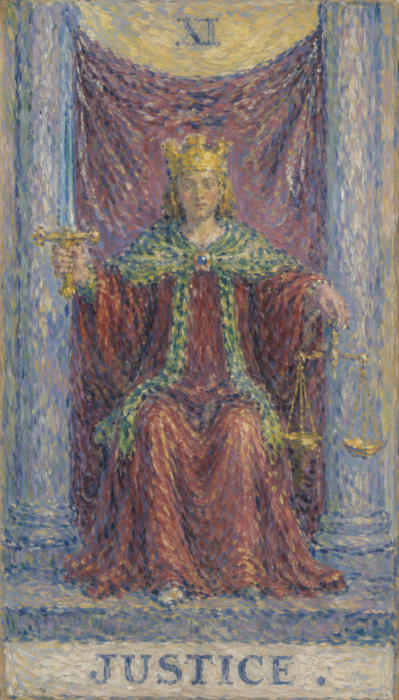

# 正义

正义是一张关于真实后果的牌。它让情绪安静下来，使事实、责任与因果回到应有的位置。

当这张牌出现，说明你正遇到“公平、因果、判断、责任”的课题。它既可能表现为外部事件，也可能是内心正在成熟的一个阶段。牌面上，一位身着红袍、头戴金冠的正义女神端坐石凳之上：左手握天秤，象征她公正判断一切事物的能力；右手高举利剑，代表她纠正世间一切歪曲与虚伪的力量。女神左脚微微外踏，似要起身，右脚却仍隐于袍中，仿佛在为做出公正裁决而犹豫——这预示着维持公正绝非易事，唯有适当协调他人与自己的对立、时刻审视反省，利剑与天秤才能发挥真正的意义。

正义女神一手持剑，一手持天平，坐在帷幕之前审视事实。她披肩上的方形纽扣中央有一个红色圆形，象征大地、物质与自然力量四种元素的和谐；身后紫色的帷幕象征智慧，两旁的柱子象征正负两面的力量。女神维护正义、力求公平，散发出冷静而凌厉的气质。整张牌呈对称构图，女神面容中正，暗示天秤座追求平衡的特性，而她本身也是法律的化身。

正义这张牌主张秉公办事，合乎逻辑、遵守流程是它的基础。无论你所求问的是什么，只要一直遵守规则、做了该做的事、不做不该做的事，就能顺利度过一些小波折——此时正义牌的出现只是提醒你留意细节；否则，就要小心被正义之剑所惩罚了。它对应占星学上的天秤座，尤其与女皇牌、星币皇后及宝剑宫廷牌相关，其课题包括做出公正而美好的决定、为当前处境承担应有的责任，以及思考如何妥善处理这些问题。

## 基础要素

1. 牌名：正义 (Justice)
2. 数字编号：11 号牌
3. 核心主题：公平、因果、判断、责任
4. 元素：风
5. 星座或行星：天秤座
6. 希伯来字母：Lamed
7. 代表意义：通过公平理解当前阶段的命运功课

## 牌面要素

| 要素 | 含义 |
|------|------|
| 核心画面 | 正义女神一手持剑，一手持天平，坐在帷幕之前审视事实。 |
| 人物姿态 | 表现当事人面对课题时的心理位置。 |
| 背景环境 | 提示事件发生的精神气候与现实压力。 |
| 主要器物 | 象征这张牌运作能量的工具或门槛。 |
| 光线色彩 | 显示意识清晰度、希望或阴影。 |
| 编号 | 对应此阶段在人生旅程中的功课。 |
| 皇冠 | 象征权威与公正的法律力量。 |
| 剑 | 手中的剑代表理智与正义的决断力。 |
| 天秤 | 手中的天秤象征平衡、公正、法律与公平。 |
| 红色长袍 | 红色是活力与激情的颜色，代表正义的重要性与紧急性。 |
| 椅子 | 代表权威与稳定的地位。 |
| 垂幔 | 象征重要性与庄严的场合。 |
| 蓝色背景 | 蓝色象征知识、力量与平静。 |
| 鞋子 | 两种颜色的鞋暗示正义的双重性质——宽容与严格。 |
| 柱子 | 象征力量与稳定，是正义的支撑。 |
| 黄色背景 | 象征智慧、乐观与能量。 |
| 绿色瓷砖的地面 | 绿色常与生长、平衡相关，暗示正义的裁决正在生效。 |
| 腰带 | 象征收拾整理，表示控制与约束。 |
| 手腕上的绿色 | 绿色与平衡、成长有关，暗示正义的决定带来生命的和谐。 |

## 塔罗灵数

数字 11 代表此牌所在的灵魂阶段。它指向经验累积后的转折与整合，引导人从事件表层进入更深的精神功课。

在解读时，正义提醒我们：事件表面的顺逆终会变化，真正值得把握的是牌面所揭示的内在功课。

## 牌面解读重点

正义是有前提条件的，没有前提条件的正义并不是正义。例如“法律面前人人平等”，前提是“在法律面前”；“迟到的正义根本不是正义，只有及时的正义才是正义”，前提是“及时”。正位表示在判断人事物是否正义之前，先引入了前提条件；逆位则表示在判断之前不引入前提条件，因而失之偏颇。

## 正位牌意

**关键词**：公平，法律，合同，责任，诚实，因果，理性判断，老实，公正，为他人调解争端，维系平衡，兼顾事业与家庭，爱好和平，公道，合理，司法制度，审判，真相，事实，真理，公平交易

正位的正义表示这股能量正在逐渐清晰。它代表公正的判断、明智的决定与诚实的交流：你正以公平的态度处理事情，追寻真理、坚持正义，进行理智的思考，理解权利与义务，恪守道德的行为与法律的约束。顺着牌面主题行动，事情会显露可被把握的方向。

### 爱情/婚姻

感情中，正义代表关系进入与“公平、因果、判断、责任”有关的阶段。它倾向于理性的交往、与温文尔雅的对象相处，双方在恋情中彼此平衡、表里如一，是一段公正、诚实而和睦的关系，能兼顾学业与恋情。单身者会被相应气质的人或关系吸引；有伴侣者则需要围绕信任、边界、承诺、成长或真实需求进行更成熟的沟通。

- **现况**：两人正在寻找一个平衡点，许多地方需要相互妥协；如何在不同观点与需求间保持平衡，要靠双方共同努力。
- **桃花**：眼下出现新恋情的可能性不高，主要是你太理性、想得太多，即便出现对象也难以把握。
- **看法**：这段关系里双方都有付出，也都收获了很多，感情因此更加坚固，但也许仍有一些事还没决定。
- **复合**：两人并不会复合，最多只是留下一些旧账还没清；若真谈清楚了，其实彼此已无任何关系。

### 事业学业

事业学业上，这张牌提示你用更高层次的眼光处理问题。它代表各科成绩出众、事业与家庭兼顾、以正直处事而获得成功，也适合律师等与法律相关的工作，强调公正的评价、公平的待遇与按规则行事。它可能带来转机、考验、成果或暂停，但核心都是要求你调整策略，依规则与理性行事。

- **现况**：工作处在一个稳定的时期，大部分事情都有明确规则可循，也是你能够胜任的状况，没什么大问题。
- **建议**：应依照成文的法规来处理，否则也要以正式公文或命令为依据；真遇到问题时，宜采取法律途径解决。
- **关系**：由于大家有共同的利益，彼此会建立起良性的互动规范，都会尽力维持良好的人际关系。
- **发展**：这份工作的发展性要看公司的制度，除了制度的保障之外，很少有别的助力，你要学会正确理解公司的制度。

### 人际财富

人际关系中适合看清彼此的位置，减少表面维持。正义代表公平待人、适合担任解决争端的角色，重义气、帮理不帮亲，常因公正而受到交往对象的照顾，也可能贷款获准、得到应有的回报。财富方面要结合现实条件与长期影响，做出清醒安排。

- **现况**：你的人际关系很好，但有时会为小事与朋友争论；只要改掉这个坏习惯，应该会交到更多好朋友。
- **建议**：事情的是非对错不能被颠倒，相信公道自在人心；若是自己对的事就应坚持到底，否则就该道歉。
- **财运**：目前财运稳健而平衡，是一个很好的状况，但不会有太多意外之财，应把握好目前的主业。原先的投资还算不错，但不太适合新的投资，此时可先观望，等情势明朗再做最后决定。

### 健康生活

健康生活上，正义提示身心状态与当前心理课题相连。适合检查压力来源、作息习惯和身体信号，并以更稳定的方式照顾自己。正义讲求平衡与“一碗水端平”，作息、饮食、动静都宜适度有度，把对自己的责任落到实处，便能维持身心的均衡。

### 其它牌意

可能代表音乐相关的事物能够开拓心情。若问具体事件，正位多表示事情进入关键阶段。主动理解它的意义，会比单纯等待结果更有力量。

### 情境指引

- **爱情运势**：代表一段公平而坦诚的关系，现在正是解决任何不平衡或未决议题的时候。
- **财富运势**：理财需要考虑长远的平衡，可能会遇到涉及金钱公正性的情况。
- **当前情况**：必须面对事实，并按照事实做出公正的决策。
- **过去**：过去的行为与选择正带来其结果，无论是好是坏。
- **现在**：你正在处理事情的结果，需要以公平与正直的态度来应对。
- **未来**：将来你的行动会得到相应的结果，提醒你要对自己的选择负责。
- **挑战**：保持诚实与公正，对他人与自己都一样。
- **障碍**：可能遇到法律问题或冲突，需要明智而公正地处理。
- **环境**：你所处的环境强调合法性、道德与正直，可能有法律或官方事务需要处理。
- **支持**：支持可能来自公正的朋友或法律顾问，帮助你做出正确的决定。
- **建议**：保持诚实、开放，准备承担行为的后果，在作决定前要权衡所有选项。
- **优势**：你能看到事物的本质，并以公正无私的方式处理事情。
- **弱点**：可能过于刻板，或在与他人的互动中缺乏灵活性。
- **正面影响**：公正与诚实将带来秩序与稳定。
- **负面影响**：可能面对法律问题或权威挑战，需要依法行事。
- **希望发生**：希望取得平衡的解决方案，使一切公平合理。
- **害怕发生**：害怕不公正的判决或处理，或害怕无法弥补过去的错误。
- **你如何看对方**：你觉得对方公平公正，其决策与行动都基于公正与真理，欣赏他们的诚实，认为他们值得信赖与尊敬。
- **对方如何看待你**：对方认为你公正诚实，决策与行动都基于真理与公正，欣赏你的公正精神，视你为值得信赖、尊敬的人。
- **关系当前状态**：关系处在平衡公正的状态，双方都以公平诚实的方式对待对方，可能正在处理一些需要公平对待的问题，或在寻找一种平衡的关系。
- **关系未来发展**：关系可能继续保持公正与平衡；若双方能继续以公正诚实相待，关系会更稳定和谐，你们将一起为公正与真理而努力，共同创造一段公平、平等的关系。
- **结果**：结果可能是一个公正的解决方案，所有事情都被清晰地解释与理顺。

## 逆位牌意

**关键词**：不公，偏见，逃避责任，合同问题，失衡，欺瞒，不公平，有始无终，以自己的意见去断定，事事不能两全，不均衡，没有责任感，没有义务，不诚实，欺诈，偏见，不公平的交易

逆位的正义表示这股能量受阻、失衡或被错误使用：可能遭遇不公平的待遇、失去均衡，或自己过于主观、判断偏颇、被人误解，也可能出现不诚实的行为、逃避责任、独断专行而失去公正。此时最重要的是先看清自己是否正在抗拒这张牌所要求的功课。

### 爱情/婚姻

感情中容易出现误解、逃避、控制、冷淡或旧模式重复，常表现为不够主动、彼此性格不合、不顾后果地交往，或脚踏两船、第三者插足、与异性暧昧不清、表里不一、无视道德。关系若一直无法推进，需要回到双方真实需求。

- **现况**：两人之间出现不平衡，可能有一方觉得自己付出太多、回报太少，因此产生一些问题与冲突。
- **桃花**：现在有可能发生新恋情，但需要你主动去争取；与其每天思念，不如主动追求喜欢的对象。
- **看法**：你觉得还有很多事没想清楚，因此很难做出重要决定，也许再相处久一点，才能解开心中的疑惑。
- **复合**：两人完全没有复合的可能，只是仍觉得有许多不甘心罢了；还是早点把旧账了结，免得分手后还纠缠不清。

### 事业学业

事业学业上可能有拖延、阻滞、判断偏差或权责不清，常表现为偏科严重、墨守成规以致失败、缺乏能力或自信、行为不检点、考试失误或高估自己，伴随不公的评价与不公平的待遇。先修正方向、补足信息，再决定下一步。

- **现况**：工作中可能遇到与法律或规则相关的问题，并非你一个人能解决——法律问题终究应用法律途径来解决。
- **建议**：面对不公平的待遇，应通过正式途径解决；私下以私人关系处理，不但无法解决，反而会带来更多问题。
- **关系**：工作中分成不同派系，各有利益要维护，此时应理性思考；若不做出选择，你的处境会更加艰难。
- **发展**：这份工作的制度本身对你不利，无论怎么努力都比别人慢半拍或矮半截，可以考虑换其他工作。

### 人际财富

人际方面要小心投射和不公平交换，逆位常表现为缺乏道德观念、当烂好人、左右为难、对朋友过于挑剔，也可能遭遇财务危机或债务纠纷。财富方面适合回到理性评估与长期规划，避免被恐惧推着走。

- **现况**：由于你对人比较严苛，只有极少数好友能容忍你，大部分人对你敬而远之，人际关系并不太好。
- **建议**：人可以糊涂一点，但心不能糊涂。
- **财运**：目前处于赤字状态、苦苦支撑，不要给自己太大压力，慢慢缓解终会缓解。投资不是你该做的事，不要抱不切实际的期待；若有人与人合伙，建议不要答应，否则纷争不断。

### 健康生活

健康上，逆位常提示压力累积、情绪压抑、作息失衡或身体警讯被忽略。当生活失去平衡、在某一方面用力过猛或过度懈怠，身体往往最先发出抗议。建议减少极端做法，把对自己的责任重新摆正，重新建立可持续的生活节奏。

### 其它牌意

可能代表对逛街购物已感乏味，或对任何事物都无法产生长久的爱好。事情可能延迟、反复或暴露隐藏问题。先修正模式，再谈结果。

### 情境指引

- **爱情运势**：可能意味着关系中存在不诚实或不公平，需要重新评估彼此的需求与行为。
- **财富运势**：可能因不公正的财务决策而遭受损失，或有避税、欺诈的倾向。
- **当前情况**：可能受到不公正的待遇或错误的判断，要小心不公的决定。
- **过去**：过去的决策可能没有基于完整的信息或公正性，导致当前的不利局面。
- **现在**：可能正经历不公或不平衡的情况，需要重新找回公正。
- **未来**：未来可能因现在的不公决策而带来不利的后果。
- **挑战**：如何在不利于自己的条件下维持诚实与道德。
- **障碍**：来自他人的不公平对待，或自身偏见导致的不公决策。
- **环境**：所处环境可能包含不公正的制度，或被有偏见的规则支配。
- **支持**：确实需要支持以克服当前的不公，可能需要寻找专业的法律援助或道德指导。
- **建议**：重新审视情况，确保自己的行为基于诚实与公正，不要害怕寻求帮助以纠正不公。
- **优势**：认识到了不公，并有机会去改变现状。
- **弱点**：抵制改变，坚持错误的决策，或被不公正的环境影响。
- **正面影响**：识别并开始纠正不公正的行为或情况。
- **负面影响**：可能遭受不公正的结局，或因不公正的行为蒙受损失。
- **希望发生**：希望恢复公正与平衡，纠正过去的错误。
- **害怕发生**：害怕不公的行为或决定被揭露，或害怕无法摆脱不公的影响。
- **你如何看对方**：你觉得对方在某些情况下不公平或不诚实，对其行为或决策感到失望或生气，认为他们没有遵循公正与真理。
- **对方如何看待你**：对方认为你在某些情况下没有公正地对待他们，对你的行为或决策感到失望或生气，觉得你没有公平相待。
- **关系当前状态**：关系可能正经历一些困难或冲突，存在不公平的行为或决策导致不和谐，你们可能正试图解决这些问题以恢复平衡与公正。
- **关系未来发展**：若能解决目前的问题、重新确立公正公平的原则，关系可能恢复和谐；若问题持续，则可能继续经历冲突与困难，因此最重要的是诚实、公正地对待对方，并努力解决任何可能的问题。
- **结果**：结果可能是揭示了不公正的真相，需要采取行动来改变不平衡的状况。
