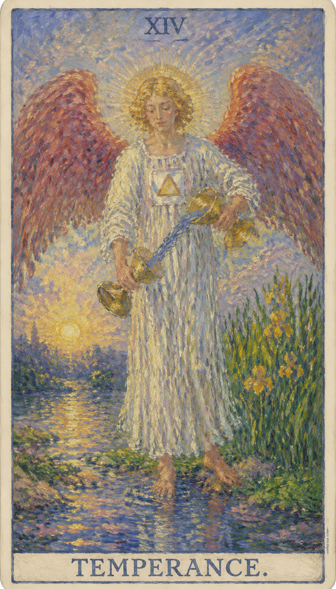

# 节制

节制是一张把不同力量调成合适比例的牌。它不追求极端胜利，而重视长期平衡、耐心混合与自然流动。

当这张牌出现，说明你正遇到“调和、适度、炼金、整合”的课题。它既可能表现为外部事件，也可能是内心正在成熟的一个阶段。

天使一脚在水中一脚在陆地，双杯之间水流不断。

## 基础要素

1. 牌名：节制 (Temperance)
2. 数字编号：14 号牌
3. 核心主题：调和、适度、炼金、整合
4. 元素：火
5. 星座或行星：射手座
6. 希伯来字母：Samekh
7. 代表意义：通过调和理解当前阶段的命运功课

## 牌面要素

| 要素 | 含义 |
|------|------|
| 核心画面 | 天使一脚在水中一脚在陆地，双杯之间水流不断。 |
| 人物姿态 | 表现当事人面对课题时的心理位置 |
| 背景环境 | 提示事件发生的精神气候与现实压力 |
| 主要器物 | 象征这张牌运作能量的工具或门槛 |
| 光线色彩 | 显示意识清晰度、希望或阴影 |
| 编号 | 对应此阶段在人生旅程中的功课 |

## 塔罗灵数

数字 14 代表此牌所在的灵魂阶段。它指向经验累积后的转折与整合，引导人从事件表层进入更深的精神功课。

在解读时，节制提醒我们：事件表面的顺逆终会变化，真正值得把握的是牌面所揭示的内在功课。

## 正位牌意

**关键词**：平衡，节制，疗愈，合作，整合，耐心，适度

正位的节制表示这股能量正在逐渐清晰。顺着牌面主题行动，事情会显露可被把握的方向。

### 爱情/婚姻

感情中，节制代表关系进入与“调和、适度、炼金、整合”有关的阶段。单身者会被相应气质的人或关系吸引；有伴侣者则需要围绕信任、边界、承诺、成长或真实需求进行更成熟的沟通。

### 事业学业

事业学业上，这张牌提示你用更高层次的眼光处理问题。它可能带来转机、考验、成果或暂停，但核心都是要求你调整策略，学习这张牌所代表的能力。

### 人际财富

人际关系中适合看清彼此的位置，减少表面维持。财富方面要结合现实条件与长期影响，做出清醒安排。

### 健康生活

健康生活上，节制提示身心状态与当前心理课题相连。适合检查压力来源、作息习惯和身体信号，并以更稳定的方式照顾自己。

### 其它牌意

若问具体事件，正位多表示事情进入关键阶段。主动理解它的意义，会比单纯等待结果更有力量。

## 逆位牌意

**关键词**：失衡，过度，急躁，不协调，消耗，缺乏耐心

逆位的节制表示这股能量受阻、失衡或被错误使用。此时最重要的是先看清自己是否正在抗拒这张牌所要求的功课。

### 爱情/婚姻

感情中容易出现误解、逃避、控制、冷淡或旧模式重复。关系若一直无法推进，需要回到双方真实需求。

### 事业学业

事业学业上可能有拖延、阻滞、判断偏差或权责不清。先修正方向、补足信息，再决定下一步。

### 人际财富

人际方面要小心投射和不公平交换。财富方面适合回到理性评估与长期规划，避免被恐惧推着走。

### 健康生活

健康上，逆位常提示压力累积、情绪压抑、作息失衡或身体警讯被忽略。建议减少极端做法，重新建立可持续的生活节奏。

### 其它牌意

事情可能延迟、反复或暴露隐藏问题。先修正模式，再谈结果。
