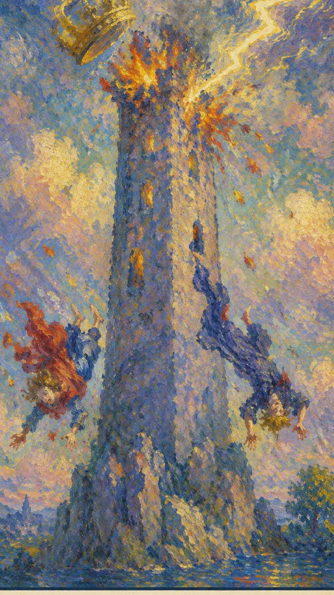

# 高塔

高塔是突然而剧烈的觉醒。原本坚不可摧的塔，被一道突如其来的闪电击中，瞬间崩溃并燃烧起来。这雷鸣电闪，是神的愤怒与制裁的象征：它击碎虚假的安全感，让被隐藏的问题再也无法继续伪装。

当这张牌出现，说明你正遇到“崩塌、突变、真相、旧结构瓦解”的课题。它既可能表现为外部事件，也可能是内心正在成熟的一个阶段。在全部 22 张大牌中，高塔无疑是最令人不安的一张——它几乎是唯一一张无论正位还是逆位、从任何角度看都只引出负面结论的牌，区别只在于负面的程度，以及当事人对它的接受程度。然而很多时候，高塔的出现并不真的代表毁灭，而是我们内心对毁灭的恐惧被无限放大。所以抽到它也不必过于惊慌，尤其当牌阵中其他牌并无明确的毁灭意味时——这个世界或许不像我们想象的那么美好，但也绝不像我们害怕的那么糟糕。

雷电击中高塔，王冠坠落，人物从塔中跌出。高塔代表物质，塔顶的皇冠象征统治与成就；皇冠被雷击落，预示权力、财富与功名在突变中尽数化为乌有。塔中坠落的两人，似是君王与圣职者，他们头朝下、面带惊恐——预示灾难临头时，无论身份与财富都无法幸免。高耸的塔与皇冠象征人类的高傲与自满，这恰是毁灭的根源，令人联想起圣经里的巴别塔。图中闪电溅起的火花共有 22 点，对应塔罗的 22 张大牌；灰色的云象征灾难，黑色的背景预示一段黑暗的时期。倘若运气真的存在，那么厄运与好运的降临，对任何人都是同样公平的。

## 基础要素

1. 牌名：高塔 (The Tower)
2. 数字编号：16 号牌
3. 核心主题：崩塌、突变、真相、旧结构瓦解
4. 元素：火
5. 星座或行星：火星
6. 希伯来字母：Pe（口）
7. 代表意义：通过崩塌理解当前阶段的命运功课，在废墟中看见真相与重建的契机

## 牌面要素

| 要素 | 含义 |
|------|------|
| 核心画面 | 雷电击中高塔，王冠坠落，人物从塔中跌出。 |
| 塔 | 这张牌的主要符号，象征坚固的结构或信念体系正遭遇突如其来的改变或破坏。 |
| 闪电 | 描述突发的启示或灾难，代表突然的、无法预测的变化。 |
| 倒塌的顶端 | 塔顶的崩落表示即使最强大的事物也可能崩溃。 |
| 火焰 | 象征毁灭与净化，旧的被烧毁，使新的得以诞生。 |
| 掉落的人物 | 代表被改变强行带走的个人，或旧理念与计划的失败。 |
| 人物的表情 | 恐惧与震惊的神情，强调改变的突然与猛烈。 |
| 岩石基座 | 塔建立在不稳定的基础上，象征一种脆弱的状态或不稳的处境。 |
| 黑暗的背景 | 代表不确定与混乱，意味着不稳的未来。 |
| 外部的云彩 | 多变的环境，提醒我们即便外部条件无常，也要寻找内在的稳定。 |
| 橙色和黄色 | 代表能量与力量，常与阳性能量相关，在此可能指代破坏的力道。 |
| 蓝色服装 | 蓝色象征沟通与知识，在这里指即将失去的安全感与理解。 |
| 红色服装 | 红色代表激情与行动，坠落者的红衣象征其生活中主动力的消散。 |
| 塔冠的形状 | 塔顶设计似王冠，象征权力与控制的失落。 |
| 塔上的金色元素 | 金色关联财富与高尚，此处金色被破坏，提示重要的损失。 |
| 编号 | 对应此阶段在人生旅程中的功课。 |

## 塔罗灵数

数字 16 是 1 与 6 的相遇，约化为 1+6=7（战车）。它承接了恶魔牌的束缚之后那一记惊雷——当人长期被虚假的结构囚禁，迟早会有一道闪电劈开高墙。16 指向经验累积后的剧烈转折与重整，引导人从事件表层进入更深的精神功课。

在解读时，高塔提醒我们：事件表面的顺逆终会变化，真正值得把握的是牌面所揭示的内在功课。塔的崩塌固然痛苦，却也清出了一片空地，让更真实、更稳固的东西有机会从废墟上重新生长。

## 牌面解读重点

引发剧烈动荡的原因，往往是不可预料的，且来自系统运行体系之外——它不以系统内部成员的意志为转移。所有身处剧烈动荡中的人事物，都无法改变那个引发动荡的源头。这正是高塔最难处之处：它不是你能谈判、修补或拖延的危机，而是一记从天而降、必须承受的雷击。正逆位的差别，仅在于你是迎面接受这场崩塌，还是试图逃避、延迟它的到来。

## 正位牌意

**关键词**：突变，崩塌，危机，真相揭露，震动，重建前的破坏，麻烦不断，遭遇逆境，遭受打击，原有信念崩溃，突发事件，骤变，剧变，动乱，动荡，没有征兆，混乱，启示，内幕显现，揭露秘密，醒悟，觉醒，开悟

正位的高塔表示这股能量正在以最直接的方式爆发出来。它的提示语是：突发变故、破旧立新、混乱的状态、颠覆现状、意料之外的打击、灾难的预兆、痛苦的经历、人生的低谷、突如其来的坏消息、重新开始的信号。顺着牌面主题去面对，你会发现崩塌之中其实藏着一个被强行揭开的真相——与其抗拒，不如认清它，事情会显露出可被把握的方向。

### 爱情/婚姻

感情中，高塔代表关系进入与“崩塌、突变、真相、旧结构瓦解”有关的阶段：意外的分手、与爱人的激烈争执、突如其来的感情变故，或一段得不到亲友祝福、纷扰不断的关系。它常意味着震惊的发现或真相大白，导致关系的根本改变。单身者会被带有强烈张力的人或关系吸引；有伴侣者则可能面对外部压力的冲击，需要围绕信任、边界与真实需求进行更成熟的沟通。

- **现况**：感情上遭遇了重大的挫折，而这并非你们所能控制，也许还要面对来自外界的强烈反对，使关系难以为继。
- **桃花**：此时不会有新恋情发生，把自己该做的事做好，还需要再等一段时间。
- **看法**：这是一段看不到希望的感情，即便两人真心想在一起，也会被外部种种不利因素拆散。
- **复合**：复合也无法平息外界的反对声音，多半是白费力气。

### 事业学业

事业学业上，这张牌提示事态可能急剧恶化：突发的瓶颈、意外事故、对上司的不满却苦无对策，乃至成绩骤降、辍学或落榜。它要求你用更高的眼光去看待这场动荡——很多变故并非人力可控，却偏偏要你来承担。不破不立，与其死守已经不再适用的旧结构，不如做好从头再来的准备。

- **现况**：工作上遇到突发意外，并非人为可控，却又要你来承担主要责任，无辜又倒霉。
- **建议**：不破不立，要做好从头再来的准备；若问题实在无解，选择放弃也无妨，不必硬撑。
- **关系**：这些人只能共享乐而不能共患难，关键时刻还是得靠自己。
- **发展**：这份工作未来没有什么发展，等着你的只可能是更糟的状况，应该早些离开这个地方。

### 人际财富

人际关系中适合看清彼此的位置，减少表面的维持。高塔正位常伴随损失金钱、财政赤字、破产、受人连累，以及因口角与人绝交、急躁伤人。财富方面可能预示经济上的剧变——意外的金融危机、投资失败或突如其来的失业，是一个不稳定且不可预测的时期，要结合现实条件与长期影响，做出清醒的安排。

- **现况**：你在人际关系上遇到重大困难，多半是因为坚持了错误的做法，从而招致大家的排斥。
- **建议**：让人误会之处就向大家讲清前因后果，该改变就改变；若仍无起色，放弃也未尝不是一种选择。
- **财运**：最近亏得有点严重。
- **再一层提醒**：当机立断，不要再试图去拯救什么了。

### 健康生活

健康生活上，高塔提示身心状态与当前的心理课题相连，常对应突如其来的健康警讯或长期压力的总爆发。此时尤其要留意意外伤害与急性状况，把身体安全放在第一位——若牌阵中同时出现死神、宝剑十一类的危险牌，更应保持平静、不要冒险。适合检查压力的来源、作息的习惯与身体信号，以更稳定的方式重建生活节奏。

### 其它牌意

遭遇意外，多管闲事，卷入纷争。若问具体事件，正位多表示事情进入剧烈动荡的关键阶段。主动去理解它的意义、接受已经发生的改变，会比单纯等待结果更有力量。

### 情境指引

- **过去**：可能有过一段稳定却未必真实的时期，如今这种稳定被打破，潜藏的问题随之暴露。
- **现在**：正经历剧烈的震荡与改变，可能感到困惑与不安；但这也是清除旧结构、为新事物腾出空间的时机。
- **未来**：可能面临重建与恢复的过程；在高塔带来的破坏之后，有机会建立起更稳固、更真实的基础。
- **爱情运势**：可能代表关系中突然的冲突、分离或揭露，意味着震惊的发现或真相大白，导致关系的根本改变。
- **财富运势**：可能预示经济上的剧烈变动，如意外的金融危机、投资失败或突如其来的失业，是一个不稳定、不可预测的时期。
- **当前情况**：是混乱与突然的改变，可能感到不稳定与紧张，生活中发生了不可预见的事件，使原有秩序崩溃。
- **挑战**：如何处理这些突如其来的变化，如何在废墟中寻找重建生活的机会。
- **障碍**：对变化的恐惧、不愿接受现实，或试图维持已经不再适用的旧结构。
- **环境**：你所处的环境可能充满不确定与动荡，旧的安全感可能已经消失。
- **支持**：可能来自那些愿意帮你面对现实、一起重建的人——朋友、家人或专业顾问。
- **建议**：先接受已经发生的改变并学会适应，再着手建立更真实、更契合当下的生活方式。
- **优势**：有机会摧毁不健康的结构、清理不再适用的模式，为更正面的改变腾出空间。
- **弱点**：处理变化的能力不足，难以面对真相、接受新的现实。
- **正面影响**：提供一个彻底清除旧有结构与制度的机会，让真相大白，促使成长。
- **负面影响**：可能带来精神上的痛苦、焦虑与恐慌，以及物质上的损失。
- **希望发生**：希望在混乱之后能够建立起更坚实的基础，发展出更强大的自我。
- **害怕发生**：害怕无法承受这些剧变，害怕生活彻底崩塌且无法恢复。
- **你如何看对方**：你可能觉得对方正经历一种痛苦的转变或重大的冲击，面临突发的改变或挑战，令你为之担忧。
- **对方如何看待你**：对方可能觉得你正经历一场剧变、面临重大的冲击或挑战，并对你的处境感到担忧。
- **关系当前状态**：关系可能正经历一种剧变，或因突发事件、或因深层问题，使彼此变得不稳定。
- **关系未来发展**：可能还要经历更多改变，这是需要双方共同适应的挑战；只要愿意面对，关系仍有望找到新的平衡。
- **结果**：经过一段动荡与重建之后，可能抵达一个更清晰、更真实、更稳定的生活状态。

## 逆位牌意

**关键词**：逃避危机，延迟爆发，余震，侥幸，害怕改变，悬崖勒马，遭遇口舌之灾，内部纠纷，风暴前的寂静，个人转变，避灾，远离是非之地，不立危墙之下，择良木而栖，情况紧急

逆位的高塔表示这股崩塌的能量被压抑、被延迟，或被勉强按住。它的提示语是：未能看清现实、拒绝改变、逃避问题、拖延决定、害怕挑战、压抑情绪、自我欺骗、持续的痛苦、无法释怀的过去、挣扎在旧有的模式中。此时最重要的是先看清自己是否正在抗拒这张牌所要求的功课——你或许暂时躲过了那记惊雷，但潜藏的问题仍在，迟早需要直面。

### 爱情/婚姻

感情中，逆位的高塔常表现为对必要改变的逃避或拒绝：拖延分手、忽视已经存在的裂痕、害怕改变现状，或对一段早已不合适的关系抱有不切实际的幻想。可能没有经历彻底的、痛苦的分离，但未解决的问题与紧张始终都在。关系若一直无法推进，需要回到双方真实的需求。

- **现况**：这段感情其实已经无法继续，再怎么努力也难以改善，应该尽快放手。
- **桃花**：眼下不会出现好的对象，先走出旧的创伤再说；想用一段新感情去治愈旧伤，多半行不通。
- **看法**：这段感情带来太多痛苦，看不到未来与希望，早些结束对两人都是一种解脱。
- **复合**：不会复合了。

### 事业学业

事业学业上，逆位的高塔常表现为面对困难听天由命、因紧张而功亏一篑，或大意失荆州。它指向对失败的逃避：拖延决策、害怕接受新挑战、忽视学业问题、仍坚持错误的方向，或过度依赖他人的评价。先正视问题、修正方向、补足信息，再决定下一步，比一味回避更稳妥。

- **现况**：有可能是突然被解雇，或因莫名其妙的原因遭到处罚。
- **建议**：克服对未知的恐惧，勇敢地放手去做就好。
- **关系**：工作里缺乏人与人之间的良性互动，彼此又陷于内斗，一切都要靠自己努力，还得提防同事挖坑。
- **发展**：这份工作最糟也就是眼下这个样子，未来不会有太大改变，若实在无法忍受就离开吧。

### 人际财富

人际方面要小心投射与不公平的交换。逆位的高塔常表现为关系陷入僵局的前兆、与朋友纠纷不断、逞强好胜不知退让，或表面富有实则捉襟见肘、濒临破产。财富方面适合回到理性评估与长期规划，避免被恐惧推着走，眼下并不适合进行任何投资。

- **现况**：你在人际上过于保守，又难以适应环境，交不到新朋友，旧友也在渐渐离去。
- **建议**：把做事的风格转变一下试试看。
- **财运**：财运很差，处处都有意外让你吃亏，运气相当不顺。
- **再一层提醒**：现在并不适合进行任何投资，合伙的事业正面临散伙的危机。

### 健康生活

健康上，逆位常提示压力被长期累积、情绪被压抑、身体的警讯被刻意忽略——就像风暴来临前那种令人窒息的寂静。问题被一再拖延，反而可能酝酿成更大的危机。建议减少极端做法，正视那些一直被回避的身心信号，重新建立可持续的生活节奏，给自己一个温和释压的出口。

### 其它牌意

后悔的出行或聚会，狂风暴雨来临前的压抑，令人震动的事情。事情可能延迟、反复或暴露隐藏问题——先正视并修正模式，再谈结果。

### 情境指引

- **过去**：可能经历过一段不稳定的时期，并以某种方式暂时避开了彻底的崩塌，但问题并未真正解决。
- **现在**：可能正处在一个压抑或拒绝变化的时期，努力维持现状，内心却清楚这并不可持续。
- **未来**：可能仍需直面问题、采取必要行动去解决悬而未决之事；否则长期的回避会酿成更大的麻烦。
- **爱情运势**：可能指示关系中的逃避或拒绝面对必要的改变；也许没有经历痛苦的分离，但未解决的问题与紧张仍在。
- **财富运势**：可能意味着经济危机被延迟或暂时避免，但潜在的问题依然存在，需要在未来某个时点解决。
- **当前情况**：可能在回避一场必要的崩溃或改变，或试图修补已破碎的局面，却缺乏根本性的解决方案。
- **挑战**：克服对变化的恐惧，勇敢去面对那些可能带来痛苦但最终有益的改变。
- **障碍**：对失败的恐惧、不愿离开舒适区或对未知的畏惧，都在阻碍你前进与成长。
- **环境**：你所处的环境表面看似稳定，实则暗藏未解决的问题与隐患。
- **支持**：可能来自愿意和你一起面对困难、帮你寻找长期解决方案的人。
- **建议**：开始正视问题，不要再逃避或推迟必要的决定；短期或许痛苦，长期看却是为了更好的发展。
- **优势**：对当前状况有更深的认识，这能让你更谨慎地处理问题、避免不必要的损失。
- **弱点**：可能缺少采取行动的勇气，或在改变面前感到无力，导致问题持续存在。
- **正面影响**：可能给了你更多时间去准备和处理问题，避免了突如其来的灾难。
- **负面影响**：问题被拖延，可能累积成更大的麻烦，最终带来更多痛苦与混乱。
- **希望发生**：希望能找到温和的解决途径，既避免痛苦与损失，又能解决根本问题。
- **害怕发生**：害怕最终仍无法逃避问题，且结果比直面时更糟，造成更大的损失。
- **你如何看对方**：你可能觉得对方正在回避一些必要的改变，逃避问题或拒绝接受某些事实。
- **对方如何看待你**：对方可能认为你在逃避必要的转变，回避面对问题或拒绝承认某些事实。
- **关系当前状态**：关系可能处于一种停滞状态，双方在回避必要的改变，或拒绝面对一些问题。
- **关系未来发展**：若持续逃避与拒绝，关系可能陷入困境而停滞；但只要愿意面对这些问题，仍有望改善。
- **结果**：可能继续维持现状，但内心深知变化不可避免，需要做好准备，迎接未来可能突然到来的挑战。
