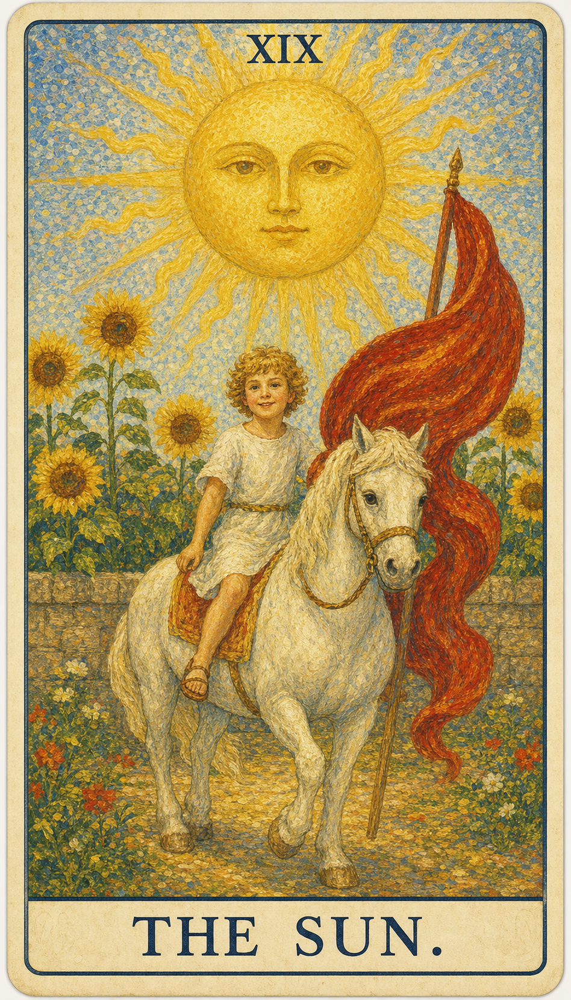

# 太阳

太阳是生命喜悦的象征，是清楚、温暖与生命力的源泉，万物因它而生。它让隐藏的事物显现，也让人重新感到简单、直接与快乐。金色的太阳散发出二十一道光芒，象征除愚者之外的二十一张大阿尔卡那牌。

当这张牌出现，说明你正遇到“喜悦、成功、清晰、生命力”的课题。它既可能表现为外部事件，也可能是内心正在成熟的一个阶段。太阳牌的解读相对单纯，几乎可以用一个字概括——“吉”：无论问及何事，答案大多吉利。而吉利的根源在于当事人自身：性格开朗、心态积极、待人友善、言谈活泼，和这样的人在一起，仿佛阳光普照、温暖无比。周围的人都愿意亲近他，他的身价自然上升，好事也接踵而至。不过太阳与星星、月亮一样，有时只反映当事人的主观感受而非客观事实——这组高悬天际、人类难以企及的星体，其形而上与心理的意义，往往大于现实的意义。值得一提的是，太阳牌还藏着一层鲜为人知的古老含义“同性之爱”：早期塔罗的太阳牌曾绘有两个男孩并立，由此引申出兄弟般的、亲情友情乃至爱情的情谊。

一名满面童真、笑容灿烂的孩子骑在马背上，从灰色的围墙中跃然而出，预示着解脱束缚、向自由前进。孩子头戴雏菊花环，插着一根熟悉的红色羽毛——那与愚者、死神头上的羽毛一模一样，据说象征超越死亡与新生。灰墙之后，金色的向日葵簇拥而生，如同一座人造的花园；但孩子并不偏爱这人工的美景，而是追逐毫无修饰的自然世界，就像他裸露的身体一样真实、自然、纯真。太阳下方的四朵向日葵代表四元素，也代表四张牌主；它们都面向孩子而非太阳，仿佛在说：纯净、自然、真实的个体凌驾于太阳之上，是一种远超权力与财富的境界，也是快乐的源泉，正如孩子脸上洋溢的喜悦。

## 基础要素

1. 牌名：太阳 (The Sun)
2. 数字编号：19 号牌
3. 核心主题：喜悦、成功、清晰、生命力
4. 元素：火
5. 星座或行星：太阳
6. 希伯来字母：Resh（头）
7. 代表意义：通过喜悦理解当前阶段的命运功课，让生命力与真实的自我重新照亮道路

## 牌面要素

| 要素 | 含义 |
|------|------|
| 核心画面 | 孩子骑白马，太阳高照，向日葵盛开，画面天真明亮。 |
| 太阳 | 象征生命力、活力、成功与驱动力，它的光芒照亮道路，带来清晰与认识。 |
| 骑士（孩子） | 代表前进与胜利，骑在马上象征对自己行动的控制与决断力。 |
| 红色旗帜 | 行动、能量与激情的象征，揭示积极主动、自信的态度。 |
| 马 | 代表力量、忠诚与坚韧不拔的精神；骑士驾驭它，表明对力量的掌控与运用。 |
| 向日葵 | 常与太阳相连，象征敬仰与忠诚；朝向太阳也象征成长与积极向上。 |
| 白色的马 | 白色代表纯洁与精神上的显著提升，以及正直、高尚的品质。 |
| 山脉 | 常象征障碍或将要克服的挑战，此处远在天边，暗示那些挑战已被克服。 |
| 围墙 | 过去的限制或约束，如今因成长与了悟而不再是障碍。 |
| 大地的颜色 | 深黄或橙色的地面代表丰盛而稳固的基础。 |
| 骑士的姿态 | 孩子轻松愉悦地骑行，表示他在旅程中感到自信与享受。 |
| 花朵纹样 | 地面上的花朵象征美与丰盛。 |
| 太阳光芒 | 太阳放射出直线与波浪线，代表阳性能量与生命的温暖。 |
| 太阳的位置 | 太阳高挂天空，象征启迪与普遍的真理。 |
| 马的四蹄都离地 | 被视为一种特别的吉祥象征，表示正在发生的事有着格外好的吉兆。 |
| 太阳冠 | 象征成就与成功，置于太阳的中心，是复兴与精神活力的标志。 |
| 编号 | 对应此阶段在人生旅程中的功课。 |

## 塔罗灵数

数字 19 是 1 与 9 的组合，约化为 1+9=10，再化为 1（魔术师）——它既是一段旅程的圆满收束，又预示着以全新姿态回到起点。它紧随月亮的迷雾之后，象征夜尽天明、阳光重新洒满大地。19 指向经验累积后的转折与整合，引导人从事件表层进入更深的精神功课。

在解读时，太阳提醒我们：事件表面的顺逆终会变化，真正值得把握的是牌面所揭示的内在功课。真正的喜悦不来自权力与财富，而来自像孩子一样真实、自然地活着。

## 牌面解读重点

太阳表示人事物的发展正处在后期阶段。正逆位的区别，在于能否度过这个后期：度过了，便收获相应的奖励并圆满中止；度不过，则未能得偿而中止。换言之，太阳的“吉”大多已水到渠成，关键只在最后这一程能否善始善终。

## 正位牌意

**关键词**：成功，快乐，清晰，活力，公开，丰盛，自信，好消息，远景明朗，活力充沛，欲望强烈，得贵人相助，阳光普照，积极，享乐，乐趣，温暖，热情，友情，胜利，发财，成名，激情，幸福，生命力

正位的太阳表示这股能量正以最明亮的方式照耀着。它的提示语是：喜悦的心情、决定的明确、成功的达成、生活的丰富、活力的展现、潜能的发挥、光明的前景、幸运的降临、积极的态度、希望的照耀。顺着牌面主题行动，尽情发挥这股正能量，事情会显露出可被把握的方向。

### 爱情/婚姻

感情中，太阳代表关系进入与“喜悦、成功、清晰、生命力”有关的阶段：彼此恩爱有加、得到亲友的祝福、梦中情人出现、恋情公开，乃至步入婚礼殿堂。这是一段明亮而稳定的关系，两人相互欣赏、感情日渐亲密。单身者会被开朗温暖、阳光积极的人吸引；有伴侣者则可以围绕信任、诚实的交流与共同的幸福，进行更成熟的沟通。

- **现况**：两人的感情处于十分令人满意的状态，恨不得时时刻刻在一起，只要看到彼此就是最大的幸福。
- **桃花**：即将出现令你满意的对象，此时要把内在与外貌都调整到最好的状态，不要错过这个机会。
- **看法**：两人在一起的感觉十分温馨，也是非常稳定的关系，开始为长久打算。
- **复合**：这段感情分不开，只要一方提出复合，便会很快坠入爱河，更胜往昔。

### 事业学业

事业学业上，太阳提示你正处在实力充分发挥、目标顺利达成的高光时期：积极主动、得遇名师、贵人相助，工作顺利、前途明朗，学业上积极上进、成绩快速进步、考试顺利。它鼓励你尽情施展才能，去实现心中的理想目标。

- **现况**：你在工作上的表现如日中天，给你带来很大的满足感与成就感。
- **建议**：对所有人事物要一视同仁，不可凭个人好恶而偏心，也不要破坏既定的规则。
- **关系**：同事之间具有激励性的关系，可以在彼此的竞争中学习与成长，大家都为共同的目标而努力。
- **发展**：这份工作前途非常光明，你可以充分发挥才能，实现心中的理想目标。

### 人际财富

人际关系中，太阳象征深厚的情谊与日渐亲密的交往——你在朋友间很受欢迎，待人真诚，知心好友众多，彼此尊重、乐于助人。财富方面则财运壮盛、储蓄增加，甚至有意外之财。这是适合投资的时机，看准目标后不要迟疑。

- **现况**：你在朋友之间很受欢迎，也喜欢与朋友相处的时光，待人真诚，知心好友也很多。
- **建议**：继续保持现在的精神面貌。
- **财运**：财务状况很好，获利颇丰；现在挺适合投资，看准目标后不要迟疑。

### 健康生活

健康生活上，太阳提示身心状态与当前的心理课题相连，是一张充满生命力的牌。它象征旺盛的精力、开朗的心境与良好的身体状态，适合多进行户外活动、呼吸新鲜空气来愉悦心情，也常与怀孕、新生命的喜讯相关。适合趁这股阳气充足的时机调养身心、培养健康的作息，让生活更加充实——同时也要避免因过度自信而忽视身体偶尔发出的小信号。

### 其它牌意

适合户外活动，呼吸新鲜空气可以愉悦心情，怀孕，生活充实。若问具体事件，正位多表示事情进入一个明朗、丰收的关键阶段。主动去理解它的意义、把握这股正能量，会比单纯等待结果更有力量。

### 情境指引

- **过去**：可能曾有一段快乐而成功的时期，为当前的局面奠定了基础，你积累的经验与知识正为眼下的成长带来好处。
- **现在**：是一个充满活力与机会的时刻，你可能正享受生活的乐趣，也看到了成功的可能；太阳鼓励你善用这股正能量，采取行动去实现梦想。
- **未来**：可能带来更多的成功与成就，继续保持积极的态度与行动力，会带来更大的快乐与满足，前景光明。
- **爱情运势**：象征明亮而积极的能量，表示恋情中的快乐、满足与成功，也常代表新的爱情开始，或现有关系中焕发新的活力与乐趣。
- **财富运势**：意味着经济繁荣与财务成功，可能有意外的收益，或因努力与积极态度而获得财务增长。
- **当前情况**：可能正充斥着活力与积极性，是一个成长与繁荣的时期，正面的态度与清晰的视野帮你解决问题、迈向目标。
- **挑战**：保持当前的正面态度与活力，并将这股能量转化为具体的成果。
- **障碍**：过度自信或骄傲，可能导致忽视细节或轻视潜在的问题，保持谦逊、脚踏实地很重要。
- **环境**：你所处的环境充满正能量与支持，周围的人都在鼓励你，并为你的成功感到高兴。
- **支持**：可能来自家人、朋友或同事，他们的积极态度与鼓励对你的成长至关重要。
- **建议**：充分享受当前的快乐时刻，同时继续朝目标前进；保持乐观，但也要务实而专注。
- **优势**：能够看到事物的积极面，这种乐观的心态将帮你跨越障碍、实现目标。
- **弱点**：可能过分乐观而轻视问题，记得保持平衡、关注可能出现的挑战。
- **正面影响**：明亮的前景、成功的成就，以及由此带来的快乐与满足，也代表创造力的流露与生命力的提升。
- **负面影响**：可能因过分自信而导致失误或失败，需要保持警觉、不要自满。
- **希望发生**：希望继续在生活中体验快乐与成功，并能与他人分享这些积极的体验。
- **害怕发生**：担心这段成功与快乐的时期无法持续，或害怕未来可能遇到的失败与挑战。
- **你如何看对方**：你可能觉得对方充满活力与乐观的精神，他们的存在带给你温暖与快乐，仿佛是你生活中的一道阳光。
- **对方如何看待你**：对方可能觉得你积极乐观，你的快乐与温暖感染了他们，把你视为他们生活中的一道阳光。
- **关系当前状态**：关系可能充满快乐与积极的能量，双方都对这段关系抱有乐观的态度，互相给予许多鼓励与支持。
- **关系未来发展**：关系可能继续保持这种积极而快乐的状态，彼此持续支持、带来快乐与希望，只要保持乐观，关系便有望持续深化。
- **结果**：持续的积极成果与快乐生活，预示着成功、凯旋与生活的满足。

## 逆位牌意

**关键词**：快乐受阻，过度乐观，延迟成功，疲惫，虚荣，幼稚，意志消沉，约会取消，情绪低落，事事无法持久，性格不开朗，感到无助，生活不稳定，孩子气，消极，慵懒，冷漠，失落，困惑，失真，失败

逆位的太阳表示这股能量受阻、失衡或被错误使用，光被云层遮住了一部分。它的提示语是：低落的情绪、困扰的问题、幸运的缺失、疲惫的身心、困境的陷入、活力的缺乏、失望的情绪、悲观的想法、挫败的感觉、压力的累积。此时最重要的是先看清自己是否正在抗拒这张牌所要求的功课——阳光并未消失，只是暂时被遮蔽，需要你重新找回内在的热度。

### 爱情/婚姻

感情中，逆位的太阳常表现为因冲动致使感情破裂、迟迟无法步入婚姻、有分手的危险，或一段不被祝福的恋情、婚约的取消。它提示感情容易出现冷淡、疏远、争吵或忽视对方感受的状况。关系若一直无法推进，需要回到双方真实的需求，重新点燃彼此的热情与理解。

- **现况**：现在感情的发展遇到一些困难与障碍，其中还夹杂着一些误会，但通常很快就会化解。
- **桃花**：现在也会出现不错的对象，只是不太明显，对方很低调，要擦亮双眼。
- **看法**：两个人都比较冲动，生活的道路上磕磕绊绊很多。
- **复合**：这段感情已没有复合的可能性了。

### 事业学业

事业学业上，逆位的太阳常表现为听不进劝诫、对工作和学业缺乏耐心、原定计划无法实施，或后劲不足、厌学、成绩低落、目标不明确。它提示你可能遭遇瓶颈或一时的停滞。先修正方向、补足信息，全力以赴去克服困难，再决定下一步。

- **现况**：现在工作上的表现其实也很好，但你自己遇到了瓶颈，很难再往前进步。
- **建议**：遇到困难一定要全力以赴，再难的事也是可以完成的。
- **关系**：你是同事们关注的焦点，一举一动都要小心，再小的错误也会被大家关注。
- **发展**：这份工作未来发展很不错，但仍有许多问题与挑战，若能继续努力，会更有收获。

### 人际财富

人际方面要小心投射与不公平的交换。逆位的太阳常表现为因爱慕虚荣而增加开支、被同伴排挤、与旧友绝交，或给人消极猥琐之感、令人难以亲近。财富方面则收入下降、奢侈浪费，运势在逐渐走低。适合回到理性评估与长期规划，避免被虚荣与恐惧推着走。

- **现况**：现在人际关系开始走下坡路，傲慢使你并不好相处。
- **建议**：还是要注意待人接物，不要太虚荣，以免脱离了群众。
- **财运**：财运一般，正在逐渐下滑当中。
- **再一层提醒**：若想投资，应对目标有深刻的认识、充分学习相关知识后再投，不要碰自己不熟悉的领域。

### 健康生活

健康上，逆位的太阳常提示活力的减退、身心的疲惫与情绪的低落，热情仿佛被压力一点点耗尽。性格趋于孤僻，做事难以持久，容易陷入慵懒与冷漠。建议不要让消极情绪占据主导，减少极端的自我消耗，主动去寻找能重新点燃内在激情与活力的方式——晒晒太阳、动一动身体，给生活重新注入光与热。

### 其它牌意

对人和事物都难以持久，被迫外出，性格孤僻，生活窘迫。事情可能延迟、反复或暴露隐藏问题——先修正模式，再谈结果。

### 情境指引

- **过去**：可能曾经历过一段阳光灿烂的时光，但如今感到失落或缺乏方向，需要从过去的经验中学习，找到重回正轨的方式。
- **现在**：可能正面临一些挫折，或难以维持之前的积极态度，需要时间与努力去克服障碍，重新找回乐观与信心。
- **未来**：可能需要克服一些挑战，但不要失去希望；逆境中往往蕴藏着成长的机会，找到解决问题的方法，未来的阳光依旧会到来。
- **爱情运势**：可能意味着感情上的不确定或乐观的减退，会遇到一些小的挑战或误会，需要沟通与努力来重拾关系中的光明与快乐。
- **财富运势**：可能表示经济上的挑战，或难以看到收益的增长，需要重新评估投资策略或工作方向，以找回带来财富增长的路径。
- **当前情况**：可能不如预期，或因过于自信、或因缺乏明确的目标而生出挑战，需要重新找回自己的方向与驱动力。
- **挑战**：如何面对挫折而不失去信念，如何从困境中找到出路、重新点燃内在的光芒。
- **障碍**：内心的不安或外部环境的阻力，可能阻碍你的进展与成长，需要找到克服它们的方法与策略。
- **环境**：你所处的环境可能缺乏支持或鼓励，周围的人目前或许无法提供你需要的积极影响。
- **支持**：在逆境中，支持可能来自那些坚定不移相信你的人，依靠他们，你会找到渡过难关的力量。
- **建议**：不要让消极情绪占据主导，相信自己的能力，并寻找点燃内在激情与活力的方式。
- **优势**：你的优势在于自我反省与从经历中学习的能力，善用这些经验来改善目前的状况。
- **弱点**：对挑战的失望与不安，可能阻碍你看到解决问题的可能。
- **正面影响**：对现状的清醒认识，使你能认清需要改变之处，从而为未来的改善打下基础。
- **负面影响**：失去目标与方向感，以及由此引起的挫败与泄气。
- **希望发生**：希望重新找回曾经的快乐与成功，并期待能够克服当前的难关、重新找到阳光。
- **害怕发生**：害怕事情继续恶化，或无法克服当前的困难，导致更多的不幸与挫折。
- **你如何看对方**：你可能觉得对方的乐观与活力有些过头，甚至让你感到压力或不安，认为他们对某些事过于乐观、忽视了现实中的问题。
- **对方如何看待你**：对方可能觉得你的积极态度有些过头，甚至让他们感到压力，希望你能更现实一些，不要对所有事都过于乐观。
- **关系当前状态**：关系可能正处于一种过于乐观、忽视现实问题的状态；乐观固然是好事，但过度的乐观可能让你们忽略了一些潜在的问题。
- **关系未来发展**：关系可能需要更多的现实考量，找到一个既保持乐观又面对现实的平衡点，才能健康地发展。
- **结果**：经过一段时间的挑战与努力，最终能够重拾信心，并找到新的成功与快乐的机会。
