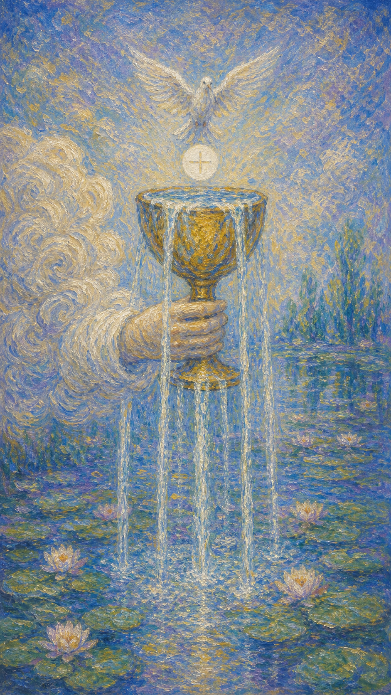

# 圣杯一

圣杯一像一只从云中递来的金杯，杯中水光溢出，像爱、灵感、眼泪与祝福一同涌上心口。

这张牌出现时，情感世界正在打开。它可能是一段爱的开始，一次温柔的和解，一阵创作灵感，也可能是你终于允许自己重新感受生命。

圣杯一的水并不喧哗。它只是满到自然流出，提醒你：真正的爱与灵感，常常先从心里的一点柔软开始。

云中之手托起圣杯，五道水流倾泻而下，白鸽衔着圣饼落入杯中。画面象征情感、灵性与直觉的纯净开启。

## 基础要素

1. 牌名：圣杯一 (Ace of Cups)
2. 数字编号：36 号牌
3. 核心主题：爱、情感新生、直觉、灵感流动
4. 元素：水
5. 星座或行星：水象能量 / 巨蟹、天蝎、双鱼
6. 希伯来字母：无固定传统对应
7. 代表意义：通过情感的开启进入新的内在周期

## 牌面要素

| 要素 | 含义 |
|------|------|
| 云中之手 | 情感与灵性机会的降临。它像来自内在深处或命运的温柔邀请。 |
| 金色圣杯 | 心灵容器、爱与接纳能力。杯子能盛水，也能盛住情绪。 |
| 五道水流 | 感受、直觉、疗愈、创造力与爱的自然流动。 |
| 白鸽 | 祝福、纯净、灵魂讯息与和平。它让情感带有神圣意味。 |
| 莲花水面 | 心灵的开放与潜意识的滋养。水面下还有尚未说出的感受。 |
| 溢出的水 | 情感丰盈，爱意与灵感已经无法继续被封闭。 |

## 塔罗灵数

数字 1 代表起点、种子与纯粹潜能。来到圣杯组，它化作情感世界的第一滴水。

圣杯一的 1 号能量不像火那样催人奔跑，它更像心里忽然融化的一角，让人重新愿意爱、愿意哭、愿意接收温柔。

这张牌的灵数提醒你，所有深刻关系都从内在容器开始。当杯子愿意打开，生命才有地方把祝福倒进来。

## 正位牌意

**关键词**：新爱，情感开启，疗愈，直觉，灵感，祝福，心灵丰盈

正位的圣杯一表示情感正在新生。它带来爱的萌芽、心灵疗愈、创作灵感、直觉增强，也可能代表一段关系或内在状态变得柔软。

这张牌常出现于心门重新打开的时刻。你可能收到善意、表达爱意、感到被触动，或忽然发现自己仍有能力深深感受。

在事件层面，它可能指新恋情、和解、怀孕或生育象征、艺术灵感、灵性体验、情绪释放。它让干涸的地方重新有水经过。

### 爱情/婚姻

感情中，圣杯一是新爱与情感滋养的牌。它像两个人之间第一次自然流出的温柔，使关系带着纯净、心动与愿意靠近的气息。

单身者可能遇到让心变软的人，也可能重新准备好接受爱。缘分未必轰烈，却会让你感觉内在某个地方被轻轻盛住。

有伴侣者则可能迎来关系修复、亲密回暖、重新表达爱意，或一起进入更温柔的阶段。若曾有误解，圣杯一带来愿意和解的水。

它也提醒你，爱需要容器。心动很美，仍要让沟通、尊重与真实相处慢慢托住这份流动。

### 事业学业

事业学业上，圣杯一常带来创作灵感、热爱的方向、适合疗愈、艺术、心理、教育、照护、咨询等与情感有关的领域。

你可能重新发现自己为什么在乎这件事。工作和学习从外在任务里松开，某种内在兴趣开始流动。

如果你正在创作，这张牌表示灵感涌出。适合写作、音乐、绘画、影像、设计，也适合让作品带上更真诚的情感。

它也可能代表职场中的善意支持、新机会或让人感到被滋养的环境。请留意那些让你心里变柔软的方向。

### 人际财富

人际方面，圣杯一带来温柔连接。适合表达感谢、道歉、关心，也适合开始一段更真诚的友谊或合作。

你可能遇到善意的人，或自己成为让他人感到被接住的人。此时的关系重在真诚流动，而非利益交换。

财富方面，它未必直接代表大笔收入，却可能带来因创意、照护、艺术、情感服务而产生的机会。

它也提醒你，金钱安排需要照顾感受。若某个选择让心长期干涸，即使表面收益不错，也值得重新倾听内在。

### 健康生活

健康生活上，圣杯一提示情绪疗愈、身心滋养、睡眠改善、压力释放，也适合补水、休息、亲近水域和温柔照护身体。

若你长期压抑情绪，这张牌像一滴水落入干土。眼泪、倾诉、艺术表达、冥想，都可能成为恢复的一部分。

身体需要管理，也需要被温柔对待。请给自己一些能让心柔软下来的日常。

### 其它牌意

若问具体事件，正位多表示新机会带有情感、创意或疗愈性质。事情刚刚开始，却有清澈的祝福感。

它也可能代表告白、和解、怀孕、出生、灵感、艺术创作、情绪释放、心灵开启。

作为建议，圣杯一说：请让自己接住这份水。心若愿意打开，生命会找到方式把爱送进来。

## 逆位牌意

**关键词**：情感阻塞，心门关闭，自爱不足，失落，灵感干涸，压抑

逆位的圣杯一表示情感流动受阻。杯子仍在，只是水没有顺利流出，或你暂时不敢让任何东西进入心里。

你可能感到空、麻木、难以表达爱，也可能因失望而把柔软收起来。灵感、直觉和亲密感都需要先回到内在滋养。

逆位提醒你照顾自己的杯子。外界的爱再多，若内在容器裂了，也很难真正盛住。

### 爱情/婚姻

感情中，逆位圣杯一可能表示心门关闭、情绪压抑、爱意无法表达，或新关系尚未真正准备好开始。

单身者可能渴望爱，却又害怕受伤；遇到温柔靠近时，心反而先退后一步。请给自己时间，不必责怪这份迟疑。

有伴侣者可能出现亲密感下降、情绪不流动、爱意被日常压力堵住。关系需要温柔沟通，让表面和平之下的真实感受浮上来。

这张牌建议先回到自我照顾。一个人若长期干涸，很难持续把水递给别人。

### 事业学业

事业学业上，逆位圣杯一可能代表创作瓶颈、兴趣下降、情感耗竭，或所做之事与内心热爱渐行渐远。

你可能仍在完成任务，却感觉不到滋养。灵感像被盖住的泉眼，需要休息、体验和情绪释放来重新打开。

若从事照护、教育、心理、艺术等领域，也要留意共情疲劳。你需要补充自己，才能继续给予。

### 人际财富

人际方面，逆位圣杯一可能表示拒绝善意、难以信任、情绪无法表达，或关系里缺少真诚流动。

你可能在别人靠近时本能收缩，也可能一直给予，却没有真正让自己被照顾。

财富方面，需留意因情绪空虚而消费，或为了获得爱与认可而过度付出。钱可以购买舒适，却不能替代真正的情感滋养。

### 健康生活

健康上，逆位圣杯一常与情绪压抑、疲惫、失眠、心口沉闷、泪水堵住有关。身体可能正在替心承受没有流出的水。

适合通过休息、倾诉、写作、艺术、亲近水、心理支持来重新疏通情绪。

请温柔看待自己的麻木。麻木有时是心的保护层，慢慢安全之后，水会再次流动。

### 其它牌意

若问具体事件，逆位多表示情感机会延迟、爱意表达受阻、灵感暂时干涸，或心还没有准备好接收。

它也可能代表失望后的封闭、和解未成、创作停滞、情绪积压、自爱议题。

作为建议，逆位圣杯一说：先把杯子带回自己身边。轻轻修补，慢慢注水，爱会从你愿意照顾自己的那一刻重新开始。
