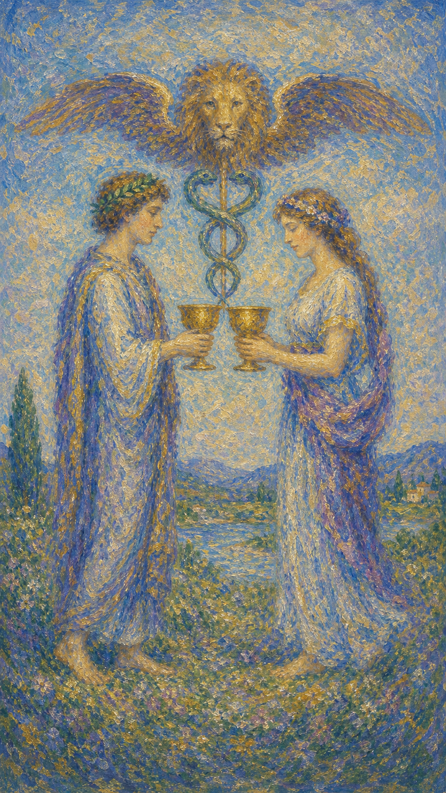

# 圣杯二

圣杯二像两条水流在中途相遇。两个人各自端着杯，愿意把自己的感受递出去，也愿意接住对方递来的心意。

这张牌出现时，关系正在寻找一种平等、温柔、相互回应的形态。它可以是爱情，也可以是友谊、合作、和解，或内在自我与自我的重新握手。

圣杯二的美不在盛大，而在彼此看见。真正的连接往往很安静：我愿意靠近你，也愿意让你如你所是。

男女相对而立，彼此交换圣杯。上方有狮首与双蛇杖，象征情感交流、疗愈结合与关系中的神圣契约。

## 基础要素

1. 牌名：圣杯二 (Two of Cups)
2. 数字编号：37 号牌
3. 核心主题：相互吸引、和解、伴侣关系、情感交流
4. 元素：水
5. 星座或行星：金星在巨蟹座
6. 希伯来字母：无固定传统对应
7. 代表意义：通过真诚回应建立情感连接

## 牌面要素

| 要素 | 含义 |
|------|------|
| 两个人物 | 关系中的双方，也象征内在两部分自我的相遇。 |
| 交换圣杯 | 情感表达、信任、承诺和愿意互相接纳。 |
| 双蛇杖 | 疗愈、平衡与关系中的能量流动。 |
| 狮首 | 热情、生命力和连接背后的神圣见证。 |
| 平视姿态 | 平等、尊重、互相看见。没有一方高于另一方。 |
| 开阔背景 | 关系仍有成长空间，连接刚刚开始扩展。 |

## 塔罗灵数

数字 2 代表关系、对照、回应与平衡。圣杯一的水从内在涌出，到了圣杯二，水开始寻找另一个容器。

圣杯二的 2 号能量让情感从“我感受到”走向“我们彼此感受到”。它关心心意能否被接住、被回应，并在两只杯之间流动。

这张牌的灵数提醒你：真正的亲密需要两只杯。一个人再深情，也无法独自完成一段关系的流动。

## 正位牌意

**关键词**：相爱，契合，和解，合作，互相吸引，平等关系，情感交流

正位的圣杯二表示情感连接顺畅。它带来互相欣赏、真诚交流、关系修复、合作默契，也可能代表一段重要关系的开始。

这张牌的温柔在于回应。你说出的感受有人听见，你递出的杯有人接住；关系不再只是渴望，而开始有真实的往返。

在事件层面，它常指恋爱、告白成功、和好、签订合作、建立伙伴关系、彼此承认心意。

### 爱情/婚姻

感情中，圣杯二是非常积极的牌。它代表双向吸引、彼此喜欢、情感契合，也常指恋爱开始、关系确认或伴侣之间重新靠近。

单身者可能遇到愿意真诚回应你的人。这段缘分带着有来有回的流动，像两只杯之间的水自然交换。

有伴侣者适合和解、谈心、重新表达爱意。若之前有误会，这张牌带来愿意听对方说话的空间。

它也提示关系需要平等。爱需要双方都愿意拿出自己的杯，彼此靠近，也彼此保有完整。

### 事业学业

事业学业上，圣杯二适合合作、签约、结盟、师生互信、双人项目、咨询关系和需要默契的工作。

你可能遇到合适的伙伴，或与某个团队、老师、客户建立良好互动。情感上的信任会让事情推进得更顺。

在学习中，它代表互相支持、结伴学习、导师认可，也适合寻找能与你共同成长的人。

工作里，这张牌提醒你重视关系质量。真正好的合作需要利益一致，也需要彼此尊重和倾听。

### 人际财富

人际方面，圣杯二带来和解、友谊、互相理解和真诚沟通。它适合道歉、表达感谢、修复裂痕，也适合开启新的信任关系。

财富方面，它可能代表合作收益、合伙机会、客户关系改善、伴侣共同理财。金钱在这里与信任密切相关。

若涉及合同或合作，除了条款，也要观察对方是否愿意坦诚沟通。水流顺畅，关系才经得起现实考验。

### 健康生活

健康生活上，圣杯二强调支持系统。你可能通过伴侣、朋友、治疗师、医生、咨询师或照护关系获得帮助。

情绪有人承接时，身体也更容易放松。适合谈心、心理咨询、关系修复，以及任何让你感到被理解的疗愈方式。

它也提醒你与身体建立合作关系。不要只命令身体改变，试着听见它真正需要什么。

### 其它牌意

若问具体事件，正位多表示双方愿意靠近、合作或达成共识。关系中的水正在顺畅交换。

它也可能代表恋人、好友、伙伴、和解、合作协议、疗愈关系、互相承诺。

作为建议，圣杯二说：请真诚递出你的杯，也温柔接住对方的杯。连接会在平等回应中自然形成。

## 逆位牌意

**关键词**：失衡，误解，分离，沟通阻塞，不平等，自爱不足

逆位的圣杯二表示关系中的水流受阻。可能是一方给得多，一方接得少；也可能彼此都有感受，却无法正确传达。

它常指出误会、冷淡、分离、合作破裂、信任下降，或在关系里过度依赖对方来确认自我价值。

逆位提醒你先看见杯子之间的距离。若连接失衡，需要修复的可能不仅是对方的态度，也包括你如何对待自己的心。

### 爱情/婚姻

感情中，逆位圣杯二可能表示沟通不顺、关系失衡、分手危机、暧昧无回应，或双方情感节奏不一致。

单身者可能遇到让自己心动却无法真正互相靠近的人。也可能一再被不回应的人吸引，暴露出内在自我价值的课题。

有伴侣者需要留意冷战、误解、付出不平衡或情感交流减少。关系若只剩形式，水会慢慢变浅。

这张牌建议从诚实沟通开始，也从自爱开始。你值得被回应，不必用过度付出去换取一点温柔。

### 事业学业

事业学业上，逆位圣杯二可能代表合作不顺、伙伴关系失衡、客户沟通误会、师生信任下降，或团队情感基础不足。

工作中，需要重新确认双方目标、责任和期待。若只靠情面维持合作，问题迟早会浮出水面。

学习中，它可能表示结伴学习效果不好，或你过度依赖他人评价。请把学习的重心带回自己。

### 人际财富

人际方面，逆位圣杯二要留意误解、疏远、单方面付出、关系破裂，或因为害怕失去而不敢说真话。

财富方面，合伙、共同理财、伴侣金钱议题容易出现不平衡。请把账目、责任和期待说清楚。

若某段合作让你持续委屈，逆位提醒你重新评估。情感上的和气不能长期替代公平结构。

### 健康生活

健康上，逆位圣杯二可能提示情绪缺少支持、亲密关系压力影响身体，或你与身体之间处在对抗状态。

适合寻求可靠的专业帮助，也适合修复与亲近之人的沟通。被理解本身就能让神经系统松动。

请避免把所有痛苦都独自吞下。水需要流动，情绪也需要安全的出口。

### 其它牌意

若问具体事件，逆位多表示双方难以达成共识、合作失衡、关系疏远，或和解还需要更多时间。

它也可能代表分手、误会、合约不稳、单恋、合作破裂、自我关系失衡。

作为建议，逆位圣杯二说：先把自己的杯扶正。只有你愿意珍惜自己的感受，才更容易分辨谁真正愿意与你交换真心。
