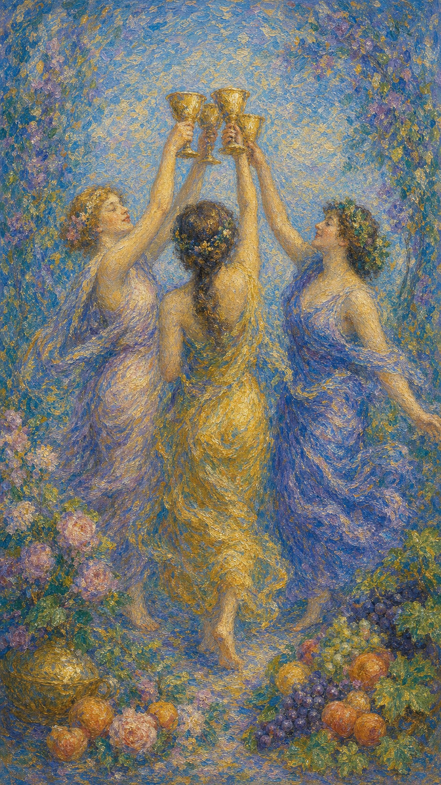

# 圣杯三

圣杯三像一阵从朋友之间升起的笑声。三只杯在空中相碰，水光映着花果、身体和歌声，让人想起被人群温柔接住的时刻。

这张牌出现时，喜悦需要被分享。它可以是友情、庆祝、团体支持，也可以是创作中的共鸣和女性能量之间的滋养。

圣杯三提醒你，人并不总要独自承受生命。快乐被说出来会更亮，悲伤被朋友听见也会变轻。

三位女子举杯共舞，脚边有果实与花朵，象征友谊、庆祝、丰收、情感支持与共同创造的喜悦。

## 基础要素

1. 牌名：圣杯三 (Three of Cups)
2. 数字编号：38 号牌
3. 核心主题：庆祝、友情、社群、共享喜悦
4. 元素：水
5. 星座或行星：水星在巨蟹座
6. 希伯来字母：无固定传统对应
7. 代表意义：通过情感分享获得滋养与归属

## 牌面要素

| 要素 | 含义 |
|------|------|
| 三位女子 | 友谊、姐妹情谊、支持系统与情感共同体。 |
| 高举圣杯 | 庆祝、祝福、彼此认可，以及愿意分享心中之水。 |
| 舞蹈姿态 | 情绪流动、身体愉悦、关系中的轻盈感。 |
| 果实花朵 | 丰收、创造力、生活的甜美成果。 |
| 环形构图 | 归属感与群体联结。每个人都在关系之圆里占有位置。 |
| 明亮氛围 | 快乐、轻松、社交与被欢迎的感觉。 |

## 塔罗灵数

数字 3 代表生长、表达与创造。圣杯二的两人相遇，到了圣杯三，情感开始扩展到社群与共同庆祝。

圣杯三的 3 号能量让水流成圈。它滋养一段关系，也滋养朋友、团体、创作伙伴和彼此见证的生活。

这张牌的灵数提醒你：喜悦需要流通。杯子越愿意相碰，情感越能在分享中变得丰盛。

## 牌面解读重点

圣杯三正位，表示在人际中"潜意识感到被接纳，并自然走进人群一同举杯"；圣杯三逆位，则是"潜意识渴望归属，置身热闹却仍觉得隔着一层"。正逆位的差别，在于这份欢聚是否真正滋养了内心。它们的共同特点是：喜悦的核心在于分享与共鸣，而非独自承受——一切随着情谊的流动而展开，而非随着孤立的紧缩而停滞。

## 正位牌意

**关键词**：庆祝，友情，聚会，社群，支持，丰收，合作

正位的圣杯三表示情感支持与共享喜悦正在增强。它常带来聚会、庆祝、和好、团队合作、朋友帮助，以及一段轻松而滋养的人际时期。

这张牌的重点在“我们”。你开始从独自处理情绪，走向有人愿意听你、陪你、为你举杯的状态。

在事件层面，它常指派对、婚礼前庆祝、生日、毕业、团队成果、朋友聚会、社群活动、创意合作。

### 爱情/婚姻

感情中，圣杯三带来轻松、愉悦、社交和被朋友祝福的气氛。关系可能通过共同朋友圈、聚会或活动变得更自然。

单身者容易在朋友介绍、聚会、兴趣团体中遇见缘分。这样的情感常先从轻松互动开始，再慢慢滋长。

有伴侣者适合一起参加活动、见朋友、庆祝关系中的小成就。伴侣之间需要深谈，也需要一起笑、一起玩、一起进入生活的热闹处。

也要留意关系是否被外界过度介入。朋友的祝福很美，但亲密仍需要两个人自己的空间。

### 事业学业

事业学业上，圣杯三适合团队合作、创意共作、成果庆祝、集体项目、社群经营和人际支持。

你可能在合作中获得灵感，也可能因为团队氛围良好而更愿意投入。情感上的轻松会让创造力流动得更顺。

学业中，它有利于小组学习、同伴支持、社团活动、作品展示。知识在交流中更容易变得鲜活。

工作中，它也提示庆祝阶段成果。适当肯定团队，会让后续合作更有温度。

### 人际财富

人际方面，圣杯三是朋友与社群的牌。它代表被欢迎、被支持、有人愿意与你共享生活。

适合联系朋友、参加聚会、修复友情、加入社群。若你近期孤单，这张牌提醒你主动伸手，世界里仍有愿意回应的人。

财富方面，可能因团队合作、社群资源、朋友介绍、创意活动或女性群体带来机会。

也要注意社交开销。快乐值得庆祝，但预算也需要温柔边界。

### 健康生活

健康生活上，圣杯三强调情绪支持、愉快社交和身体的轻松感。与可靠的人在一起，会让压力自然下降。

适合团体运动、舞蹈、散步聚会、心理支持小组，也适合用音乐、食物、庆祝仪式滋养身心。

如果你长期压抑自己，这张牌提醒你：快乐也是疗愈。不要等所有问题解决后才允许自己笑。

### 其它牌意

若问具体事件，正位多表示庆祝、聚会、团队成果、朋友帮助、共同完成。事情有轻松愉快的气氛。

它也可能代表婚礼派对、生日、毕业、社团、姐妹情谊、创作团队、好消息分享。

作为建议，圣杯三说：请让自己回到人群里。把杯举起来，你会发现许多温暖原本就在身边。

### 情境指引

- **过去**：曾有一段被朋友与社群温柔接住的时光，那份情谊滋养至今。
- **现在**：喜悦正在被分享，你被人群欢迎，有人愿意陪你、为你举杯。
- **未来**：聚会、庆祝或团队合作将到来，情谊会在分享中变得更丰盛。
- **挑战**：如何在热闹中保有真实，分辨哪些连接真正让你恢复。
- **障碍**：过度社交带来的疲惫，或不敢主动伸手走进人群。
- **环境**：周遭氛围轻松友善，有朋友与社群的支持环绕着你。
- **支持**：来自朋友、姐妹情谊或团队的温暖，让你感到被滋养。
- **建议**：让自己回到人群里，把杯举起，温暖原本就在身边。
- **优势**：善于分享与共情，能在群体中创造轻盈而滋养的氛围。
- **弱点**：有时把快乐寄托于外界热闹，忽略了内在的安顿。
- **正面影响**：友谊加深、团队合作顺畅，以及被人群温柔接住的喜悦。
- **负面影响**：若沉溺社交，可能分散了对个人目标与亲密的照顾。
- **希望发生**：希望被朋友与社群接纳，在分享中收获归属与喜悦。
- **害怕发生**：害怕在热闹中仍感孤单，或被群体排斥与冷落。
- **你如何看对方**：把对方视为可以一同欢笑、彼此扶持的朋友或伙伴。
- **对方如何看待你**：对方感到你热情、好相处，愿意与你分享生活。
- **关系当前状态**：处于轻松愉悦、有人见证与祝福的良好阶段。
- **关系未来发展**：预示情谊加深、共享生活，关系在欢聚中继续生长。
- **结果**：通常吉祥，预示庆祝与情感支持，鼓励你回到人群分享喜悦。

## 逆位牌意

**关键词**：社交疲惫，孤立，过度享乐，小圈子，关系混乱，庆祝延迟

逆位的圣杯三表示社群之水不再顺畅。可能是朋友疏远、聚会落空、团体关系复杂，也可能是过度社交让情绪变得混乱。

它有时提示小圈子、八卦、排斥感，或在人群中仍然感到孤单。热闹并不总等于滋养。

逆位提醒你分辨哪些关系真的让你恢复，哪些只是暂时填满空白。

### 爱情/婚姻

感情中，逆位圣杯三可能出现第三方干扰、朋友意见过多、社交暧昧、关系边界不清，或伴侣之间缺少真正独处。

单身者可能在热闹中迷失，遇到暧昧复杂、难以确认的人。需要看清对方是否真诚，还是只享受社交中的情绪。

有伴侣者要留意外界介入、朋友评价、聚会压力或过度娱乐影响关系。关系需要社交，也需要安静回到彼此。

### 事业学业

事业学业上，逆位圣杯三可能表示团队配合不佳、小组内有人不投入、创意合作受阻，或庆祝太早导致后续松散。

也可能是社交活动太多，影响学习和工作专注。人际愉快很重要，但目标仍需要被照顾。

此时适合重新明确分工，减少无效会议或情绪化的小圈子影响。

### 人际财富

人际方面，逆位圣杯三要留意被排斥、朋友疏远、八卦、小团体压力，或为了合群而违背自己感受。

你可能需要从某些过度消耗的社交中退出来。真正的朋友不会要求你不断表演快乐。

财富方面，可能因聚会、娱乐、社交消费而超支，也可能团队资源分配不均。

### 健康生活

健康上，逆位圣杯三可能与过度饮食、饮酒、熬夜、社交疲惫、情绪性放纵有关。

也可能提示孤独感正在影响身心状态。若你在人群中仍觉得空，说明内在渴望更真诚的连接，活动本身已经不够。

建议减少消耗型社交，选择能让你真正放松的人和场合。

### 其它牌意

若问具体事件，逆位多表示庆祝延迟、聚会取消、团队不合、朋友关系复杂，或快乐被某种隐忧打断。

它也可能代表三角关系、小圈子、社交疲惫、过度玩乐、团体排斥。

作为建议，逆位圣杯三说：请把杯从喧闹中收回来，看看哪一种连接真正让你感到被滋养。

### 情境指引

- **过去**：曾在某段社交或团体中受过排挤，或因过度社交而透支了自己。
- **现在**：社群之水不再顺畅，可能朋友疏远、聚会落空，或热闹中仍觉孤单。
- **未来**：若不分辨关系质量，社交疲惫会持续；回归真诚连接则能恢复。
- **挑战**：如何从消耗型社交中退出，找到真正让你恢复的人与场合。
- **障碍**：为了合群而违背自己，或被小圈子、八卦与排斥感困住。
- **环境**：周遭社交氛围复杂，夹杂着比较、疏离或表面的热闹。
- **支持**：需要回到少数真正可靠的人身边，安静的陪伴胜过喧闹。
- **建议**：把杯从喧闹中收回来，看清哪一种连接真正滋养你。
- **优势**：开始懂得分辨真伪情谊，更珍惜深度而非数量的连接。
- **弱点**：容易在人群中迷失，或用过度玩乐掩盖内心的空虚。
- **正面影响**：作为提醒，促你筛选社交圈，把精力留给真心的人。
- **负面影响**：社交疲惫、关系混乱，或在热闹中愈发感到孤立。
- **希望发生**：希望找到真正懂你的人，从消耗的社交中解脱出来。
- **害怕发生**：害怕被群体排斥，或在人群里始终感到无人真正接住。
- **你如何看对方**：可能觉得对方流于表面，或社交中夹带复杂的情绪。
- **对方如何看待你**：对方或许感到你疏离、退缩，不太愿意融入。
- **关系当前状态**：处于社交疲惫或关系复杂的阶段，连接缺乏真诚。
- **关系未来发展**：若不退出消耗型社交，疲惫将持续；回归真心则能修复。
- **结果**：提示把杯从喧闹中收回，待分辨出真正的滋养，关系才会回暖。
