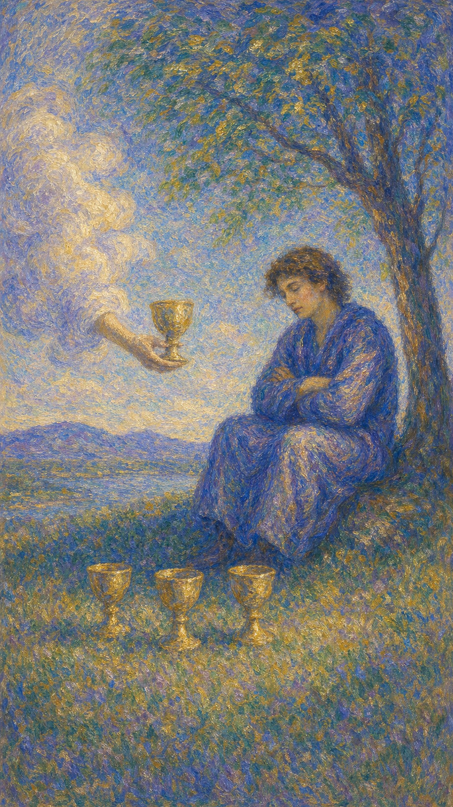

# 圣杯四

圣杯四像一段坐在树影里的沉默。眼前三只杯安静摆着，云中又递来一只新的杯，可人的目光低垂，心像被雾包住。

这张牌出现时，情感可能进入疲倦、迟钝或自我保护的阶段。机会仍会靠近，内在的水却暂时不愿再被打扰。

圣杯四提醒你尊重这份停顿。人在失望、饱和或麻木之后，需要先听见自己的心，才知道下一只杯是否值得接过。

青年坐在树下双臂交叉，面前有三只杯，云中之手递来第四只杯。画面象征情感自省、机会迟疑与内在封闭。

## 基础要素

1. 牌名：圣杯四 (Four of Cups)
2. 数字编号：39 号牌
3. 核心主题：自省、冷淡、倦怠、重新评估情感
4. 元素：水
5. 星座或行星：月亮在巨蟹座
6. 希伯来字母：无固定传统对应
7. 代表意义：通过情感停顿听见真正需求

## 牌面要素

| 要素 | 含义 |
|------|------|
| 树下青年 | 内省、退缩、情绪饱和。人暂时离开外界，回到自己的壳里。 |
| 交叉双臂 | 防御、拒绝、保护边界，也可能是对新机会的不信任。 |
| 地上三杯 | 已有的情感经验、过去的满足或失望。它们仍在眼前，却难以再打动心。 |
| 云中第四杯 | 新机会、新情感或灵性提醒。它在靠近，但尚未被接纳。 |
| 低垂目光 | 注意力向内，外界的邀请暂时无法穿透情绪。 |
| 静止氛围 | 情感停滞，也提供重新认识自己的空间。 |

## 塔罗灵数

数字 4 代表稳定、边界与内在结构。来到圣杯组，它让水暂时停下来，像湖面结出一层安静的膜。

圣杯四的 4 号能量并不热闹。它把情感从流动带入整理，让人看见自己究竟是满足、疲惫，还是已经对旧模式失去回应。

这张牌的灵数提醒你：停顿有时也是疗愈。水若一直被搅动，就很难照见内心真正的倒影。

## 正位牌意

**关键词**：冷淡，自省，倦怠，机会被忽略，情感停滞，重新评估

正位的圣杯四表示你可能对眼前的人事物提不起兴趣。外界仍有机会，但内心暂时不想伸手。

这张牌常出现在情感饱和、失望之后、生活缺少新鲜感，或人需要从关系与社交中退回自己的时期。

它并不急着要求你接纳新杯。它更像提醒你：先看清自己为什么不想接。是因为这只杯不适合，还是因为心仍停在过去的杯影里？

### 爱情/婚姻

感情中，圣杯四可能表示冷淡、倦怠、无回应，或对新的感情机会缺乏兴趣。也许有人靠近，只是心里暂时没有波纹。

单身者可能因过去失望而对追求者无感，也可能觉得所有选择都差不多。此时不必勉强自己热情，但也要留意是否把心门关得太紧。

有伴侣者可能进入平淡期，双方互动变少，亲密感下降。关系表面没有大问题，却少了被滋养的感觉。

这张牌建议温柔地询问自己：我真正缺少的是什么？是新鲜感、理解、空间，还是对这段关系的重新选择？

### 事业学业

事业学业上，圣杯四可能代表倦怠、缺乏动力、对机会无感，或现有环境无法再触动你的热情。

你可能收到邀约或资源，却因为心累、失望或不确定而迟迟不回应。此时需要分辨：这是不适合的机会，还是你正处在低潮中。

学习中，它可能表示兴趣下降、注意力内收，或对成绩和评价暂时麻木。适合暂停一下，重新理解自己为什么要学。

工作中，这张牌也提示你检查情绪耗竭。若心长期没有水，再好的机会也会显得灰暗。

### 人际财富

人际方面，圣杯四可能表现为不想社交、对朋友邀约无感，或在人群中仍觉得隔着一层玻璃。

你需要空间整理情绪，但也要避免把所有关心都挡在门外。有些杯子也许正是来提醒你：世界仍愿意靠近。

财富方面，可能对现有收入、消费或机会感到乏味。也可能因情绪低落而错过值得关注的资源。

此时不适合冲动决定。先让心安静下来，再判断哪只杯值得接过。

### 健康生活

健康生活上，圣杯四可能与情绪低落、精神倦怠、缺乏兴趣、轻微抑郁倾向或长期压力后的麻木有关。

身体和心都在要求暂停。适合减少刺激，给自己安静空间，也适合通过散步、冥想、心理咨询或自然环境慢慢恢复感受力。

如果这种麻木持续很久，请认真对待。水停得太久，也需要有人帮助它重新流动。

### 其它牌意

若问具体事件，正位多表示机会存在，但当事人暂时不愿接纳。事情卡在情绪回应不足的状态。

它也可能代表拒绝邀约、沉思、自我封闭、厌倦、重新评估选择、错过眼前机会。

作为建议，圣杯四说：先坐一会儿也没关系。只是别忘了抬头看看，云中那只杯也许正带着新的水光。

## 逆位牌意

**关键词**：重新开放，走出低潮，接受机会，情绪复苏，结束停滞

逆位的圣杯四表示情感停顿开始松动。你可能从麻木中醒来，重新注意到外界的邀请，也愿意重新参与生活。

它也可能表示你意识到自己封闭太久，开始愿意接触新机会、修复关系、重新听见内在的愿望。

逆位像树影下的人终于抬头。杯子仍在那里，水也还没有离开。

### 爱情/婚姻

感情中，逆位圣杯四可能代表心门重新打开。单身者开始愿意认识新人，也更能分辨什么样的关系真正滋养自己。

有伴侣者可能走出冷淡期，愿意重新沟通、约会、表达需求。关系仍需要耐心，但水已经开始流动。

若曾因失望而退缩，这张牌提示你可以慢慢回来。先允许自己有一点回应，信任会在安全感里逐渐长出。

### 事业学业

事业学业上，逆位圣杯四表示动力回升，机会重新被看见。你可能决定回应邀请、调整方向，或从倦怠中找到新的入口。

学习中，它适合换方法、换环境、重新找回兴趣。工作中，它可能代表愿意接受新项目或重新规划职业路径。

这张牌也提示你不要停留在“我不想要”里。问问自己：我真正想要哪一种水？

### 人际财富

人际方面，逆位圣杯四表示愿意重新社交、接受关心、修复关系，或从孤立中走出来。

财富方面，可能重新注意到之前忽略的机会，也可能开始调整消费和收入方式，让金钱更贴近真实需求。

它鼓励你恢复感知力。机会不一定突然变多，只是你的心重新愿意看见。

### 健康生活

健康上，逆位圣杯四表示情绪复苏，兴趣回到生活里。你可能愿意出门、运动、与人交谈或寻求帮助。

适合循序渐进地恢复节奏，不必要求自己马上充满活力。只要水开始动，就已经是好消息。

请珍惜这些微小的回应：想晒太阳、想吃一顿好饭、想给朋友发消息。它们都是心在回来的迹象。

### 其它牌意

若问具体事件，逆位多表示停滞结束、机会重新被接纳、情绪回应恢复。事情开始从内在松动。

它也可能代表接受邀约、走出冷淡、重新考虑、情绪解冻、机会回流。

作为建议，逆位圣杯四说：慢慢抬头。你不必立刻喝下整杯水，只要愿意看见它，生命就已经开始改变。
