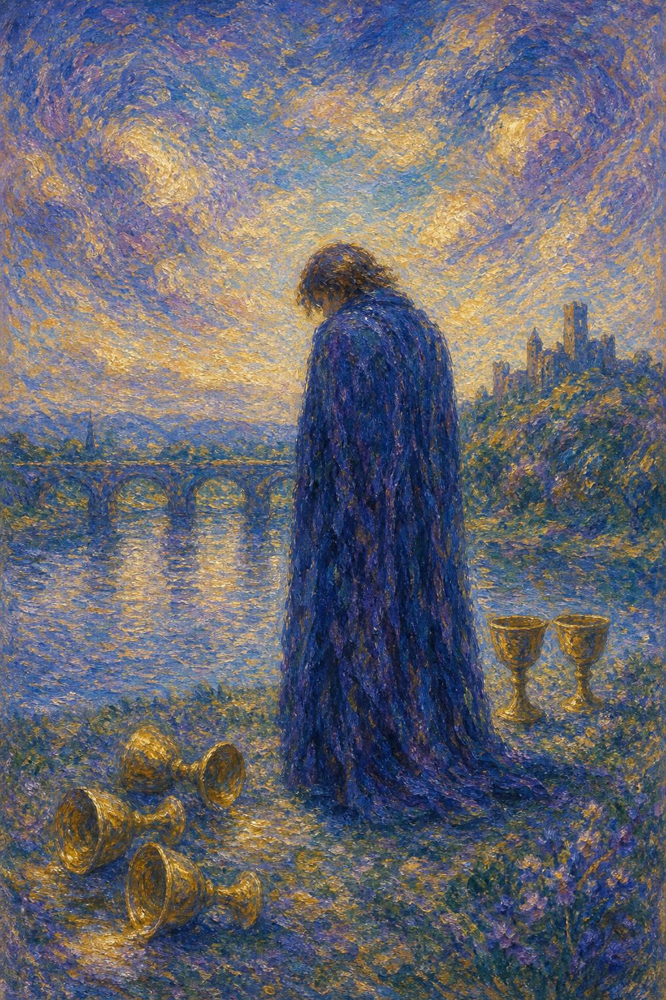

# 圣杯五

圣杯五披着黑色斗篷，站在倾倒的杯前。水已经流走，心也跟着某个失去的地方低垂下来。

这张牌出现时，悲伤需要被承认。它可能是分离、失望、遗憾、背叛，也可能是某个期待破碎后，人在心里反复望着已经倒下的杯。

圣杯五并不急着安慰你。它先允许你哀悼，再轻轻提醒：背后仍有两只杯站着，桥也还在远处等待。

黑袍人物低头看着三只倾倒的杯，身后仍有两只杯完好。远处有桥与城堡，象征失落之后仍存在的支持与归途。

## 基础要素

1. 牌名：圣杯五 (Five of Cups)
2. 数字编号：40 号牌
3. 核心主题：失落、悲伤、遗憾、情感转化
4. 元素：水
5. 星座或行星：火星在天蝎座
6. 希伯来字母：无固定传统对应
7. 代表意义：通过哀悼与接纳重新看见仍在的情感支持

## 牌面要素

| 要素 | 含义 |
|------|------|
| 黑袍人物 | 悲伤、哀悼、自我保护。黑袍像情绪的夜色，把人暂时包住。 |
| 倾倒三杯 | 已失去的关系、计划、期待或情感投入。水流走，象征无法挽回的部分。 |
| 背后两杯 | 仍存在的支持、机会、爱与内在资源。它们暂时没有被看见。 |
| 低头姿态 | 注意力被损失吸住，难以转向未来。 |
| 远方桥梁 | 过渡、修复与重新回到生活的路径。 |
| 城堡远景 | 安全之处仍在远方，说明悲伤之后仍有归属可寻。 |

## 塔罗灵数

数字 5 代表变化、冲击和不稳定。来到圣杯组，它让情感世界经历破裂，迫使人面对失去之后的真实。

圣杯五的 5 号能量像一场雨后的河岸。水曾经泛滥，也带走了某些东西；留下的人需要重新认识空缺。

这张牌的灵数提醒你：悲伤是爱的背面。你之所以痛，是因为曾经认真投入过。

## 正位牌意

**关键词**：失落，悲伤，遗憾，分离，失望，哀悼，仍有希望

正位的圣杯五表示情感上的失落正在占据视线。你可能沉浸在已经发生的失败、分离、错过或后悔中，暂时看不见仍然存在的支持。

它允许你悲伤。塔罗并不要求你立刻转身看见两只杯，因为真正的疗愈需要先承认倒下的三只杯确实重要。

但这张牌也轻轻提示，全部人生并没有随那三只杯一起流走。当你准备好回头，仍有东西在身后等你。

### 爱情/婚姻

感情中，圣杯五常与分手、冷淡、背叛、失望、错过、关系中的伤心有关。你可能还在回看已经倾倒的部分，反复想如果当时不同，结局会不会改变。

单身者可能仍被旧情影响，难以真正迎接新的关系。心里有一个位置仍在哀悼，所以新的杯即使靠近，也暂时无法被接住。

有伴侣者可能经历争吵后的失望，或对关系中的某个裂缝感到深深难过。此时需要允许情绪被看见，让粉饰太平先放到一旁。

它也提醒你，如果关系仍有两只杯站着，就不要只盯着倒下的部分。修复需要双方愿意转身，看见还可以保存的爱。

### 事业学业

事业学业上，圣杯五可能表示失败、落选、项目受挫、成绩不理想、机会流失，或对过去决定感到后悔。

你可能把注意力集中在损失上，暂时看不见仍可利用的资源、经验和后续机会。

这张牌建议先承认失落。失望是真实的，不必强迫自己立刻积极。但在情绪稍稍稳定后，请回头整理剩下的两只杯。

学习中，它可能是考试失利、申请失败、方向选择后的遗憾。经验仍有价值，它会教你下一次如何更深地准备。

### 人际财富

人际方面，圣杯五可能表示友情破裂、信任受损、误会后疏远，或对某个人的期待落空。

你可能觉得自己被辜负，也可能在后悔自己没有好好珍惜。无论哪一种，情绪都需要时间沉淀。

财富方面，可能有损失、退款失败、投资失误、合作破裂或因情感决定带来的金钱后果。

它提醒你面对损失，同时也清点仍在的资源。失去的不能立刻回来，但剩下的东西仍能帮助你重建。

### 健康生活

健康上，圣杯五与悲伤、情绪低落、失眠、食欲变化、心口沉重有关。身体可能正在承载未被充分哀悼的情绪。

适合允许自己哭、倾诉、写下遗憾，也适合寻求心理支持。悲伤需要出口，不能长期被压在身体里。

请温柔对待此刻的自己。你不需要马上好起来，只需要不把自己遗弃在失去里。

### 其它牌意

若问具体事件，正位多表示失望、损失、遗憾、未达预期。事情里确实有让人难过的部分。

它也可能代表分手、道歉未成、错过机会、项目失败、情感创伤、哀悼期。

作为建议，圣杯五说：请先为倒下的杯哀悼。等你有力气时，再慢慢转身，看见仍为你站立的两只杯。

## 逆位牌意

**关键词**：走出悲伤，接受，原谅，疗愈，重新看见希望

逆位的圣杯五表示悲伤开始松动。你也许仍会痛，但已经不再完全被失去吸住，开始看见身后还有可用的爱与支持。

它可能代表原谅、接受、和解、从旧情中走出，也可能是你终于愿意把注意力从遗憾移向未来。

逆位像黑袍人慢慢抬头。倒下的杯不会自动复原，但人可以重新选择要往哪里走。

### 爱情/婚姻

感情中，逆位圣杯五可能表示从分手、争吵或失望中恢复。你开始愿意放下执念，或重新看见关系中仍可修复的部分。

单身者可能从旧情阴影里走出，准备好给新的缘分一点空间。过去仍是故事的一部分，却不再占满整个心房。

有伴侣者可能愿意和解、道歉、重新沟通。若双方都珍惜剩下的两只杯，关系仍有修复可能。

这张牌也提醒你，原谅并不等于否认伤害。真正的原谅，是把自己从反复回望的痛里慢慢带回来。

### 事业学业

事业学业上，逆位圣杯五表示从失败中恢复，开始复盘、重整资源、寻找下一次机会。

你可能接受了某个结果，决定不再用一次失利定义自己。经验开始变成养分，伤口也慢慢结痂。

学习中，它适合重新备考、调整方向、申请新的机会。工作中，它代表从项目挫败或职场失望中重新站起。

### 人际财富

人际方面，逆位圣杯五可能代表和解、放下怨怼、重新建立信任，或从一段失望关系中抽身。

你开始看见谁仍在身边，也更懂得珍惜真正可靠的人。

财富方面，可能从损失中恢复，开始补救、协商、重新规划。虽然无法完全回到从前，但局面正在向可处理的方向移动。

### 健康生活

健康上，逆位圣杯五表示情绪疗愈开始发生。悲伤仍有波纹，但不再淹没你全部生活。

适合继续进行心理支持、哀伤疗愈、规律作息和温和活动。小小的恢复也值得被承认。

当你开始愿意吃饭、睡觉、走出房间、联系朋友，生命已经在悄悄回来。

### 其它牌意

若问具体事件，逆位多表示局面开始从失望中转向修复。损失仍在，但人已能看见其他可能。

它也可能代表接受现实、道歉、补救、原谅、重新开始、从遗憾中学习。

作为建议，逆位圣杯五说：请慢慢转身。你不必遗忘倒下的杯，也可以同时看见身后仍为你保留的水。
