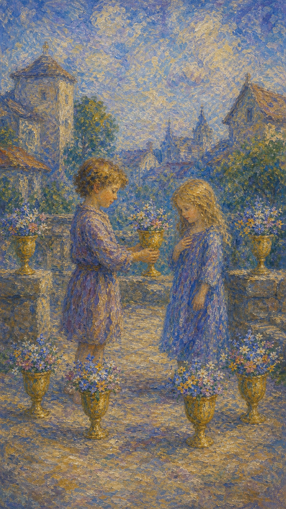

# 圣杯六

圣杯六像一座开着白花的旧庭院。孩子把盛满花的杯递出去，空气里有童年的光、回忆的香气，以及一种久违的安全感。

这张牌出现时，过去正在温柔地靠近。它可能是旧友、旧情、童年记忆，也可能是内在那个仍渴望被保护、被善待的小孩。

圣杯六的水清澈而柔软。它让人怀念，也让人重新触碰心里最单纯的信任。

两个孩子站在庭院中，一人递出装满白花的圣杯。周围六只杯盛满花朵，象征回忆、纯真、馈赠与旧日情感。

## 基础要素

1. 牌名：圣杯六 (Six of Cups)
2. 数字编号：41 号牌
3. 核心主题：回忆、童真、旧情、善意馈赠
4. 元素：水
5. 星座或行星：太阳在天蝎座
6. 希伯来字母：无固定传统对应
7. 代表意义：通过回忆与纯真重新连接情感根源

## 牌面要素

| 要素 | 含义 |
|------|------|
| 两个孩子 | 童真、旧日关系、内在小孩，以及未被复杂欲望污染的情感。 |
| 盛花圣杯 | 温柔馈赠、回忆中的美好、纯净的情感表达。 |
| 庭院空间 | 安全、熟悉、被保护的环境。它像记忆里可以停靠的地方。 |
| 白色花朵 | 纯洁、善意、单纯快乐与心灵恢复。 |
| 远处人物 | 成年世界仍在背景中，提醒人回忆与现实同时存在。 |
| 六只杯 | 情感的和谐、修复与过去经验的温柔整合。 |

## 塔罗灵数

数字 6 代表和谐、修复与情感平衡。来到圣杯组，它让水从失落中慢慢恢复清澈。

圣杯六的 6 号能量像一条流回源头的小溪。它带人回到更早的自己，看见曾经纯粹相信、纯粹给予、纯粹快乐的能力。

这张牌的灵数提醒你：过去可以被怀念，也可以成为疗愈现在的泉眼。

## 牌面解读重点

圣杯六正位，表示在情感上"潜意识从回忆里取回温暖，并让纯真重新滋养现在"；圣杯六逆位，则是"潜意识仍停在旧日的水里，把过去当成现在唯一的归处"。正逆位的差别，在于回忆是滋养了当下，还是成了牵绊。它们的共同特点是：核心都关于"如何与过去相处"——一切随着内在对旧日情感的态度而展开，而非随着眼前事件的新旧而改变。

## 正位牌意

**关键词**：回忆，童真，旧友，旧情，善意，馈赠，内在小孩

正位的圣杯六表示过去以温柔方式回到眼前。它可能带来旧人联系、怀旧情绪、童年记忆、善意礼物，也可能让你重新连接内在小孩。

这张牌的情感很柔和。它从记忆中取回仍有香气的部分，让失去之后的心重新闻到花香。

它也提醒你珍惜简单善意。有些关系不必复杂计算，温柔本身就足够珍贵。

### 爱情/婚姻

感情中，圣杯六可能代表旧情复燃、旧人联系、青梅竹马、熟悉而安心的缘分，也可能是关系里重新出现单纯与温柔。

单身者可能遇到让你感到熟悉的人，或与旧识重新产生情感连接。这种缘分常带着回忆感，让人觉得心不需要太多防备。

有伴侣者适合回忆共同经历、重访旧地、找回最初相爱的感觉。关系中的温柔不一定来自大事件，也可能来自一件小小的贴心举动。

它也提醒你不要只活在过去的甜里。回忆可以滋养现在，但关系仍需要在当下继续生长。

### 事业学业

事业学业上，圣杯六可能与旧项目、老同事、过去学过的技能、熟悉领域或童年兴趣有关。

你可能从过去经验中找到答案，也可能重新拾起曾经喜欢的方向。某个旧资源会以温柔方式回到你手里。

学习中，它适合复习、回顾基础、向曾经的老师或同学求助。工作中，它可能代表老客户、旧团队、历史资料带来的帮助。

这张牌也鼓励你问问自己：小时候真正喜欢什么？那个答案也许仍在指引现在的路。

### 人际财富

人际方面，圣杯六带来旧友重逢、家人关怀、善意馈赠、邻里温情，也可能是你给予别人单纯帮助。

它适合修复旧关系、联系老朋友、整理回忆、参与家庭或儿童相关事务。

财富方面，可能与家族支持、旧资源、礼物、遗产、儿童用品、怀旧产业、老客户有关。

它提醒你，财富不总以新机会出现。有时过去种下的善意，会在多年后开花。

### 健康生活

健康生活上，圣杯六与情绪疗愈、内在小孩、童年经验、家庭记忆有关。

你可能需要回到更早的情绪源头，温柔看见那个曾经没有被完全照顾的自己。

适合通过怀旧音乐、旧照片、书写、心理咨询、照顾儿童或与家人和解来疗愈。心里那个小孩被看见时，身体也会慢慢松开。

### 其它牌意

若问具体事件，正位多表示旧人旧事回归、过去资源出现、善意馈赠、情感修复。事情带有熟悉、温暖和怀旧的气息。

它也可能代表童年、孩子、老朋友、旧情、礼物、回忆、家乡、旧物整理。

作为建议，圣杯六说：请温柔回望。过去可以不再是牢笼，而成为一座开满白花的庭院。

### 情境指引

- **过去**：有一段纯真而温暖的旧日时光，那份善意至今仍在心里开着花。
- **现在**：过去以温柔的方式回到眼前，旧人、回忆或善意正轻轻靠近你。
- **未来**：旧情、旧友或旧资源可能回流，带着熟悉而安心的温暖。
- **挑战**：如何让回忆滋养现在，而不只是停在过去的甜里。
- **障碍**：过度沉溺怀旧，可能让人忽略当下需要继续生长的部分。
- **环境**：周遭氛围熟悉而安全，像记忆里可以停靠的庭院。
- **支持**：来自旧友、家人或往日善意的温暖，是此刻可依靠的泉眼。
- **建议**：温柔回望，让过去成为开满白花的庭院，而非困住你的牢笼。
- **优势**：心怀纯真与善意，懂得珍惜简单而真诚的情感。
- **弱点**：容易理想化过去，把旧日滤镜套在当下的人事上。
- **正面影响**：情感修复、旧谊重温，以及内在小孩被温柔看见。
- **负面影响**：若只活在回忆里，可能错过当下正在发生的连接。
- **希望发生**：希望重温旧日的温暖，让心回到单纯被善待的状态。
- **害怕发生**：害怕美好只属于过去，现在再也找不回那份纯真。
- **你如何看对方**：把对方视为熟悉、安心、让你卸下防备的人。
- **对方如何看待你**：对方感到你温柔、念旧，带着孩子般的真诚。
- **关系当前状态**：处于温馨怀旧的阶段，带着熟悉而柔软的气息。
- **关系未来发展**：预示情谊温暖延续，但仍需在当下继续浇灌成长。
- **结果**：通常温暖，预示旧情或善意回归，鼓励你以回忆滋养现在。

## 逆位牌意

**关键词**：沉溺过去，童年创伤，旧情执着，拒绝成长，回忆失真

逆位的圣杯六表示过去的水停留太久。回忆不再只是滋养，也可能变成牵绊，使人难以真正进入现在。

你可能理想化旧人旧事，或被童年经验、旧关系模式影响。那些曾经熟悉的东西，未必仍适合当下的你。

逆位提醒你：请把过去抱起来看看，也把它慢慢放回原处。现在的你已经长大，可以选择新的生活方式。

### 爱情/婚姻

感情中，逆位圣杯六可能代表旧情难忘、反复比较、沉溺过去，或把现在的人放进旧关系的影子里。

单身者可能因为旧人没有真正离开内心，难以接纳新缘分。也可能被熟悉感吸引，却忽略对方是否真的适合现在的自己。

有伴侣者要留意旧伤、童年模式或过去经验影响当前关系。你可能正在回应很久以前的伤，而眼前的人只是触动了它。

这张牌建议把回忆与现实分开。怀念可以存在，但不要让它替你决定现在的爱。

### 事业学业

事业学业上，逆位圣杯六可能表示过度依赖旧方法、停在过去成就里，或不愿适应新的环境。

你可能一直用曾经有效的方式面对新问题，结果发现水流已经改变。

学习中，它提示你重新更新知识。工作中，它可能代表老关系、旧平台或过去模式已经无法继续支撑成长。

### 人际财富

人际方面，逆位圣杯六可能与家庭旧模式、童年关系、旧友疏远、旧账重提有关。

你可能需要分辨哪些关系仍能滋养你，哪些只是因为熟悉而被继续保留。

财富方面，可能与家族金钱、旧债、遗产、旧资源失效、怀旧消费有关。也要避免因情感记忆而做不理性的支出。

### 健康生活

健康上，逆位圣杯六常提示童年创伤、旧情绪、家庭模式对身心的影响。

你可能需要更深层的疗愈，让放松从表面进入根部。心理咨询、内在小孩工作、创伤疗愈都可能有帮助。

身体有时记得很久以前的事。请不要责怪它反应过度，它只是仍在保护过去的你。

### 其它牌意

若问具体事件，逆位多表示旧事牵扯、过去影响现在、旧人回归带来复杂感受，或需要从怀旧中醒来。

它也可能代表童年课题、旧情执念、家族模式、拒绝成长、回忆滤镜。

作为建议，逆位圣杯六说：感谢过去给过你的花，也允许自己离开旧庭院，走向现在的阳光。

### 情境指引

- **过去**：童年或旧关系留下的模式，至今仍悄悄影响着你的当下。
- **现在**：过去的水停留太久，回忆从滋养变成牵绊，使人难以走进现在。
- **未来**：若一直回望，成长会被拖住；愿意放下则能走向现在的阳光。
- **挑战**：如何把回忆与现实分开，不让旧日替你决定当下的爱与选择。
- **障碍**：理想化旧人旧事，或被童年创伤与旧模式反复牵引。
- **环境**：周遭或许不断勾起旧账与旧伤，让人难以专注于眼前。
- **支持**：需要更深层的疗愈，内在小孩的工作与和解是此刻的依靠。
- **建议**：感谢过去给过的花，也允许自己离开旧庭院，走向现在的阳光。
- **优势**：一旦看清牵绊所在，便有从旧模式中走出的觉察与力量。
- **弱点**：容易沉溺怀旧、拒绝成长，把现在的人放进旧关系的影子里。
- **正面影响**：作为提醒，促你疗愈童年课题，从旧日中真正长大。
- **负面影响**：困在过去、回忆失真，使当下的关系与机会被忽略。
- **希望发生**：希望放下旧情执念，让自己自由地活在当下。
- **害怕发生**：害怕一直被过去绑住，无法真正开始新的生活。
- **你如何看对方**：可能把对方与旧人比较，或将旧伤投射到对方身上。
- **对方如何看待你**：对方或许感到你活在回忆里，难以真正面对现在。
- **关系当前状态**：处于被过去牵绊的阶段，旧模式影响着当下的互动。
- **关系未来发展**：若不放下旧日，关系会被拖住；愿意成长则能更新。
- **结果**：提示从怀旧中醒来，待放下旧庭院，生活才能走向当下的阳光。
