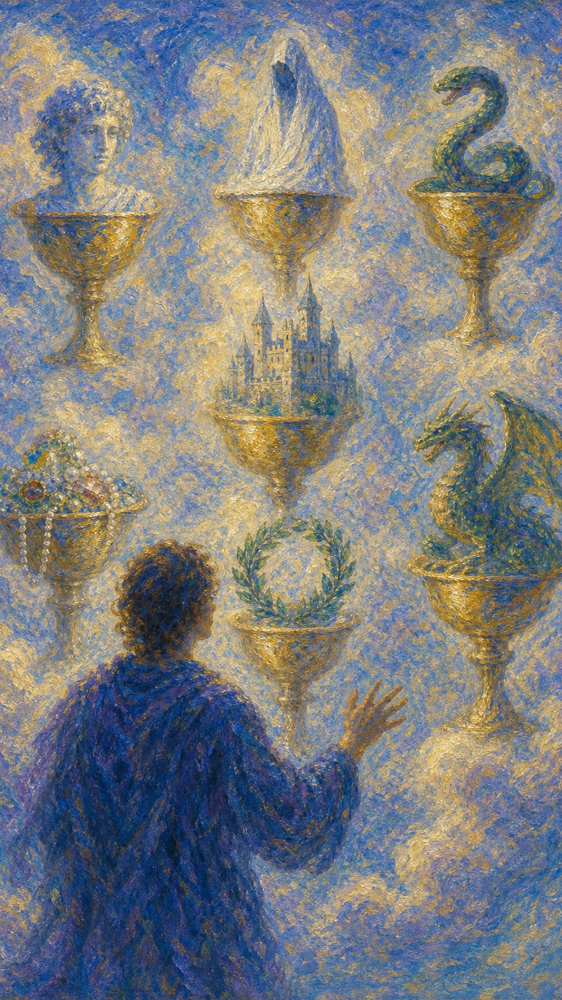

# 圣杯七

圣杯七像一片升起雾气的梦境。七只杯悬在云中，每一只都盛着诱人的画面：欲望、荣耀、危险、爱情、财富、幻象与未知。

这张牌出现时，心里可能有太多选择，也有太多想象。水雾让每一种可能都显得闪亮，却也让人难以分辨哪一只杯真正能被带回现实。

圣杯七提醒你温柔地醒来。梦很重要，它透露欲望的形状；但真正能滋养生命的杯，需要经得起清晨的光。

人物面对云中七只圣杯，每只杯中都有不同象征物。画面呈现选择、幻想、诱惑与情感迷雾。

## 基础要素

1. 牌名：圣杯七 (Seven of Cups)
2. 数字编号：42 号牌
3. 核心主题：幻想、选择、诱惑、愿望辨识
4. 元素：水
5. 星座或行星：金星在天蝎座
6. 希伯来字母：无固定传统对应
7. 代表意义：通过辨认欲望看清真正适合自己的道路

## 牌面要素

| 要素 | 含义 |
|------|------|
| 云中圣杯 | 梦想、幻想、情绪投射与尚未落地的可能。 |
| 七种象征物 | 不同欲望、恐惧和诱惑：财富、权力、爱情、危险、荣耀、神秘与变化。 |
| 背影人物 | 面对选择时的迷惘。人尚未行动，只在想象前停住。 |
| 云雾背景 | 情感雾气、判断不清、理想化。美丽与混乱同时存在。 |
| 闪亮画面 | 诱惑的表面吸引力。越亮的杯，越需要细看里面盛着什么。 |
| 悬浮状态 | 选择尚未落地，现实条件仍待确认。 |

## 塔罗灵数

数字 7 代表试炼、辨识与精神探索。来到圣杯组，它让人进入欲望的迷宫，学习在情感幻象中找到真正的心声。

圣杯七的 7 号能量不急着让你选择，它先让你看见内在有多少渴望。每一只杯都像一面镜子，映出你想拥有、害怕失去或不敢承认的东西。

这张牌的灵数提醒你：直觉需要清澈的水。若情绪太浓，梦会变成雾，遮住真正的道路。

## 牌面解读重点

圣杯七正位，表示在情感上"潜意识被众多想象同时吸引，迟迟停在选择之前"；圣杯七逆位，则是"潜意识开始拨开迷雾，愿意从幻象中筛出真正值得投入的那只杯"。正逆位的差别，在于人是仍困在幻想里，还是已经走向清醒。它们的共同特点是：核心都关于"如何辨认真正的渴望"——一切随着内在对欲望的看清程度而展开，而非随着外界选项的多寡而改变。

## 正位牌意

**关键词**：幻想，选择太多，诱惑，理想化，迷惘，愿望，情感投射

正位的圣杯七表示你正面对许多选择或想象。每一种可能都带着吸引力，却尚未经过现实检验。

它可能出现在感情选择、职业方向、创作构想、人生愿望混杂的时候。心中有很多画面，但脚下暂时没有清楚道路。

这张牌并不否定梦想。它只是提醒你把梦逐一拿到光下看：哪一个来自真心？哪一个只是逃避现实的美丽烟雾？

### 爱情/婚姻

感情中，圣杯七常代表理想化、暧昧选择、幻想中的恋人，或被多种情感可能吸引。

单身者可能同时面对多个对象，或沉浸在对某个人的想象里。你需要分辨自己爱的是现实中的人，还是心里投射出的画面。

有伴侣者可能对关系产生不切实际的期待，或被外界诱惑动摇。若你总幻想“还有更完美的选择”，也许真正需要看见的是自己未被满足的需求。

这张牌建议放慢情感判断。先看对方真实行为，再决定要不要把整颗心交给那只杯。

### 事业学业

事业学业上，圣杯七代表方向太多、计划太散、创意很多但缺少落地步骤。

你可能想学这个、做那个、换方向、开项目，每个念头都很诱人，却让执行力被分散。

创作领域中，它有丰富想象力，适合灵感收集、视觉构想、故事设定。但最终仍需要选择一个方向写下来、做出来。

学业与职业选择上，请把愿望与条件放在一起看。梦需要现实土壤，才不会只停留在云里。

### 人际财富

人际方面，圣杯七可能表示被复杂关系、表面魅力或社交幻想吸引。你可能对某些人抱有期待，却尚未看清真实互动。

财富方面，要小心看似美好的投资、消费、合作机会。诱人的包装可能盖住风险，情绪化决定容易造成损失。

它适合做愿望清单，也适合筛选愿望。把每个选择写下来，问问它需要什么代价，又会带来什么真实后果。

### 健康生活

健康上，圣杯七可能表示信息过多、方案太杂、对身体目标抱有不切实际期待。

你可能被各种疗法、饮食、课程、产品吸引，却迟迟没有稳定执行。身体需要清楚路线，频繁更换幻想只会让它更迷惘。

建议选择一个可信、温和、可持续的方案。让水沉淀下来，身体才会知道如何回应。

### 其它牌意

若问具体事件，正位多表示选择未定、情况模糊、幻想多于现实。事情需要进一步确认。

它也可能代表梦境、愿望、诱惑、选择困难、理想化、幻觉般的吸引力。

作为建议，圣杯七说：请看清每只杯里真正盛着什么。梦可以指路，清醒会帮你把真正的杯带回家。

### 情境指引

- **过去**：曾被多种诱人的可能牵引，沉浸在想象里而迟迟未作选择。
- **现在**：面对许多选项与幻想，每只杯都闪亮，脚下却没有清楚的道路。
- **未来**：若不辨认真伪，可能继续在迷雾中徘徊；看清则能踏实前行。
- **挑战**：如何分辨哪只杯来自真心，哪只只是逃避现实的美丽烟雾。
- **障碍**：理想化、选择困难，被表面吸引盖住了真实的代价。
- **环境**：周遭充满诱惑与可能，情绪雾气让判断变得模糊。
- **支持**：需要回到清醒的直觉，把每个愿望放到现实之光下检视。
- **建议**：看清每只杯里真正盛着什么，让梦指路，让清醒带杯回家。
- **优势**：想象力丰富、内在渴望多元，潜藏着多种创造的可能。
- **弱点**：容易耽于幻想、分散精力，把想象当成了行动本身。
- **正面影响**：作为提醒，促你认清真正的渴望，做出踏实的选择。
- **负面影响**：选择困难、判断不清，可能因诱惑而做出错误决定。
- **希望发生**：希望从纷乱的可能中，找到真正属于自己的那只杯。
- **害怕发生**：害怕被幻象误导，错把烟雾当成可以饮用的水。
- **你如何看对方**：可能把对方理想化，爱上的是心中投射的画面。
- **对方如何看待你**：对方或许觉得你飘忽不定，难以确认真实想法。
- **关系当前状态**：处于暧昧或理想化的阶段，真实互动尚待看清。
- **关系未来发展**：若不回到现实，关系易停在幻想；看清则能踏实推进。
- **结果**：提示先辨认真正的渴望，待迷雾散去，再把真实的杯带回家。

## 逆位牌意

**关键词**：看清现实，做出选择，脱离幻想，清醒，欲望整理

逆位的圣杯七表示迷雾开始散开。你可能终于看清哪些选择只是幻象，哪些才真正值得投入。

它也可能代表从混乱愿望中醒来，决定收束注意力，做出更踏实的选择。

逆位像清晨的光照进梦里。许多杯会在光中淡去，留下的那只会更接近真实。

### 爱情/婚姻

感情中，逆位圣杯七表示从理想化中醒来。你开始看见对方的真实样子，也更能分辨自己真正需要什么关系。

单身者可能结束暧昧混乱，决定选择或放下。你不再只被浪漫画面牵引，而愿意看现实中的相处质量。

有伴侣者可能意识到幻想无法替代沟通。若关系要继续，需要回到真实需求，减少对完美版本的反复比较。

### 事业学业

事业学业上，逆位圣杯七表示方向逐渐清楚。你可能从众多选择中筛出一条可执行路径。

创意开始落地，计划开始被整理。此时适合做决定、删减目标、排优先级。

若你之前一直在想象中消耗能量，逆位提醒你开始行动。选择一只杯，才能知道里面的水是否适合你。

### 人际财富

人际方面，逆位圣杯七帮助你看清关系真相。表面吸引、虚假承诺或暧昧迷雾会逐渐散去。

财富方面，适合重新评估风险，远离不切实际的项目或过度包装的机会。

这张牌支持清醒判断。愿望仍可存在，但它们需要被现实筛过一遍。

### 健康生活

健康上，逆位圣杯七表示你开始从过多信息中收束，选择更适合自己的方法。

它适合建立实际计划，停止频繁更换方案，让身体在稳定里恢复信任。

若曾被焦虑或幻想牵着走，这张牌带来更清楚的自我照顾方向。

### 其它牌意

若问具体事件，逆位多表示真相逐渐清晰、选择即将确定、幻想退去。事情开始从云中落地。

它也可能代表做决定、戒除诱惑、看清骗局、放弃不现实愿望、聚焦目标。

作为建议，逆位圣杯七说：让雾散一散。真正属于你的杯，不需要一直躲在幻光里。

### 情境指引

- **过去**：曾在过多的想象与选项中消耗能量，迟迟无法落地。
- **现在**：迷雾开始散开，你看清哪些选择只是幻象，哪些才值得投入。
- **未来**：方向逐渐清楚，计划开始被整理，幻想退去后能踏实行动。
- **挑战**：如何从众多可能中筛出一条可执行的路径，并真正开始。
- **障碍**：习惯停在想象里，做决定与删减目标仍需要一点决心。
- **环境**：周遭的真相逐渐浮现，过度包装的吸引开始显出本相。
- **支持**：清醒的判断与务实的态度，是此刻把愿望落地的依靠。
- **建议**：让雾散一散，真正属于你的杯，不需要躲在幻光里。
- **优势**：开始能分辨真伪、聚焦目标，把想象转化为行动。
- **弱点**：决断初期仍可能犹豫，需要持续抵抗幻想的回潮。
- **正面影响**：看清真相、做出选择，从混乱愿望中走向踏实。
- **负面影响**：若仍贪恋幻象，可能在该行动时又退回想象。
- **希望发生**：希望看清现实、确定方向，把精力投向真正的目标。
- **害怕发生**：害怕看清后发现选择有限，或不得不放下美丽的幻想。
- **你如何看对方**：开始看见对方真实的样子，不再被表象迷惑。
- **对方如何看待你**：对方感到你比之前清醒、务实，更值得信任。
- **关系当前状态**：处于幻想退去、回归现实的阶段，真相逐渐清晰。
- **关系未来发展**：若回到真实需求，关系能踏实推进；否则仍会反复。
- **结果**：提示迷雾散去、选择确定，待回归现实，真正的杯将留下。
