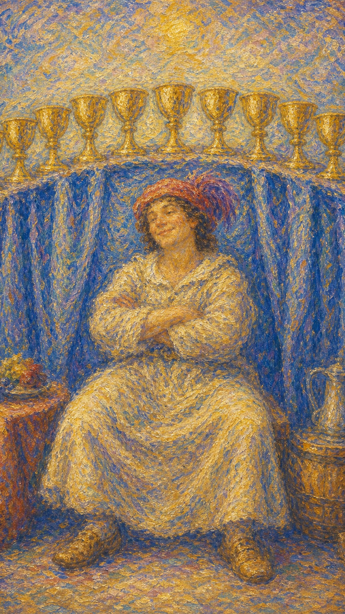

# 圣杯九

圣杯九像一张终于能坐下来微笑的脸。九只杯整齐排在身后，像一排被心愿填满的月亮，照亮人的满足与自我接纳。

这张牌出现时，愿望正在靠近实现。你可能获得情感上的满足、生活中的舒适，或一种“我终于拥有了”的安稳感。

圣杯九的水是甜的。它提醒你享受成果，也提醒你分辨真正的满足与短暂的占有感。

人物双臂交叉坐在九只圣杯前，神情满足而自信。画面象征愿望实现、情感丰盛、自我满足与享受生活。

## 基础要素

1. 牌名：圣杯九 (Nine of Cups)
2. 数字编号：44 号牌
3. 核心主题：愿望实现、满足、享受、自我价值
4. 元素：水
5. 星座或行星：木星在双鱼座
6. 希伯来字母：无固定传统对应
7. 代表意义：通过内在满足体验情感丰盛

## 牌面要素

| 要素 | 含义 |
|------|------|
| 坐姿人物 | 满足、自信、享受成果。人终于允许自己坐在丰盛前。 |
| 九只圣杯 | 情感愿望、成就、快乐与生活中的甜美收获。 |
| 交叉双臂 | 自我满足，也可能带有一点自得与防守。 |
| 布幕背景 | 成果被展示出来，提示愿望实现背后也有未显露的部分。 |
| 红色帽饰 | 愉悦、热情、对生活滋味的享受。 |
| 稳定构图 | 情感丰盛暂时成形，适合享受当前成果。 |

## 塔罗灵数

数字 9 代表完成前的丰盛、沉淀与个人整合。来到圣杯组，它让情感愿望进入接近圆满的阶段。

圣杯九的 9 号能量指向个人内在的满足。它像一个人终于承认：我也可以拥有快乐。

这张牌的灵数提醒你：真正的愿望实现，往往先让心安静下来，让欲望不再急着追逐下一只杯。

## 正位牌意

**关键词**：愿望实现，满足，幸福，享受，情感丰盛，自我接纳

正位的圣杯九表示愿望有望实现，或你正在进入一个情感上更满足的阶段。它常被称为“愿望牌”。

它带来快乐、舒适、成就感、被滋养的生活，也可能代表你终于学会以更温柔的方式对待自己。

这张牌鼓励你享受已经拥有的好。不要急着跳向下一个目标，先让心真正喝到眼前这杯水。

### 爱情/婚姻

感情中，圣杯九代表满足、自信、被爱滋养，也可能表示你在关系中感到快乐和被珍惜。

单身者可能处于自我状态良好的阶段。你不再急着用关系填补空缺，因此更容易吸引健康的爱。

有伴侣者可能享受亲密、浪漫、共同生活的舒适。关系带来愉悦，也让你感到自己值得被好好对待。

它也提醒你，个人满足很重要。一个能照顾自己心愿的人，在关系里更不容易把全部期待压到对方身上。

### 事业学业

事业学业上，圣杯九表示成果令人满意，目标接近达成，或你对当前成绩感到自豪。

它可能代表考试通过、项目成功、作品被认可、工作带来成就感，也可能是你终于进入更舒服的学习或工作节奏。

创作领域尤其有利，灵感与满足感彼此滋养。请允许自己庆祝这一刻。

但也要留意过度舒适。满足是礼物，停滞则会让水慢慢变浅。

### 人际财富

人际方面，圣杯九表示自我状态良好，因此人际互动也更从容。你不必过度讨好，也能享受陪伴。

财富方面，它常代表收入满意、生活品质提升、享受消费、愿望清单实现。适合奖励自己，也适合感恩已经拥有的资源。

请分辨享受与放纵。真正的丰盛会让心安稳，过度填补则会让欲望更空。

### 健康生活

健康上，圣杯九代表身心舒适、情绪改善、生活满意度提升。它适合通过美食、休息、艺术、温泉、按摩等方式滋养自己。

如果你曾长期压抑需求，这张牌提醒你享受也是疗愈。身体需要努力，也需要愉悦。

保持适度即可。甜美的水喝得太多，也会让身体感到沉重。

### 其它牌意

若问具体事件，正位多表示愿望实现、结果满意、个人目标达成。事情有令人开心的走向。

它也可能代表庆祝、享受、礼物、好运、自我奖励、情感满足。

作为建议，圣杯九说：请坐下来，承认这一刻的甜。你已经走了很远，值得好好喝下这杯满足。

## 逆位牌意

**关键词**：空虚，愿望落空，过度享乐，自满，欲望不满足

逆位的圣杯九表示满足感出现裂缝。外在看似拥有很多，内心却仍感到空；也可能愿望没有如预期实现。

它常提示过度享乐、情绪性消费、用食物或物质填补心里的洞，也可能代表自满带来的停滞。

逆位提醒你回到真正需求。你想要的，未必就是你真正需要的水。

### 爱情/婚姻

感情中，逆位圣杯九可能表示关系表面令人羡慕，内在却缺少真正的满足。

单身者可能以为只要遇到某个人就会快乐，却发现孤独感仍来自自己内在。关系无法替代自我接纳。

有伴侣者可能出现自我中心、只顾自己的需求，或把对方当成满足愿望的工具。爱需要分享，不能只围绕一个人的杯。

### 事业学业

事业学业上，逆位圣杯九可能表示目标落空、成绩低于预期，或外在成功无法带来真正满足。

你可能得到想要的位置，却发现心并没有因此更安稳。此时需要重新审视目标背后的动机。

也要避免自满。过去的成果值得庆祝，但仍需要继续学习和成长。

### 人际财富

人际方面，逆位圣杯九可能表示过度关注自我感受，忽略他人需求，或在人际中追求被满足而缺少回应。

财富方面，可能有享乐过度、消费失衡、为了填补空虚而花钱，或愿望实现后仍不满足。

请把注意力从“还缺什么”转向“我真正渴望什么”。答案常常比购物车更深。

### 健康生活

健康上，逆位圣杯九可能与过度饮食、饮酒、放纵、懒散、情绪性补偿有关。

身体可能在提醒你：愉悦需要适度，过量的甜会变成负担。

也可能是情绪空虚通过身体习惯表现出来。请温柔地照看内在需求，让表面行为背后的渴望被听见。

### 其它牌意

若问具体事件，逆位多表示愿望延迟、结果低于期待、满足感不足，或某种快乐背后藏着空洞。

它也可能代表自满、享乐过度、虚荣、情绪性消费、愿望清单带来的短暂快乐。

作为建议，逆位圣杯九说：请问问自己的心，真正想喝的水是什么。欲望可以被满足，灵魂也需要被听见。
