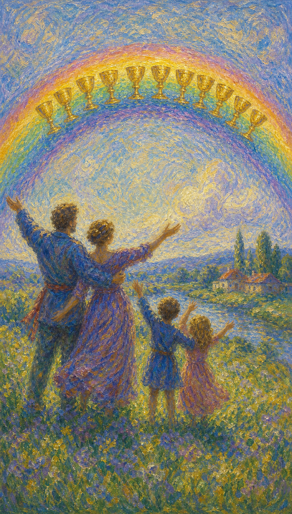

# 圣杯十

圣杯十像一道雨后升起的彩虹。十只杯在天空中排列成弧，地上的人相拥举手，孩子在旁边奔跑，幸福有了可被共同看见的形状。

这张牌出现时，情感不再只停留在个人满足，而进入家庭、归属、共同生活与长久安宁的层面。

圣杯十的水流向众人。它提醒你，真正圆满的幸福会让心有家，也让爱有地方继续生长。

彩虹中排列十只圣杯，地上有相拥的伴侣与欢跳的孩子，远处是家园。画面象征家庭和谐、情感圆满与共同幸福。

## 基础要素

1. 牌名：圣杯十 (Ten of Cups)
2. 数字编号：45 号牌
3. 核心主题：家庭幸福、情感圆满、归属、共同愿景
4. 元素：水
5. 星座或行星：火星在双鱼座
6. 希伯来字母：无固定传统对应
7. 代表意义：通过共享的爱抵达情感圆满

## 牌面要素

| 要素 | 含义 |
|------|------|
| 彩虹圣杯 | 祝福、圆满、情感理想实现。水升上天空，成为可见的幸福。 |
| 相拥伴侣 | 亲密、承诺、共同生活与情感支持。 |
| 欢跳孩子 | 纯真、延续、家庭喜悦与未来希望。 |
| 远方家园 | 安全感、归属地、稳定生活基础。 |
| 开阔河流 | 情感顺畅流动，也象征生命继续向前。 |
| 举手姿态 | 感恩、庆祝、向幸福敞开。 |

## 塔罗灵数

数字 10 代表一个循环的完成，也预示新的阶段。来到圣杯组，它让情感从个人愿望走向共同圆满。

圣杯十的 10 号能量像水最终汇入河流与天空。爱不再只属于一个人的心愿，而成为家庭、社群和生活结构中的光。

这张牌的灵数提醒你：幸福需要共享。真正安稳的爱，会让每个人都在其中找到位置。

## 牌面解读重点

圣杯十正位，表示在情感上"潜意识感到圆满与归属，并愿意把幸福与所爱之人共享"；圣杯十逆位，则是"潜意识仍渴望圆满，外在的和谐之下却藏着未说出口的疏离与失望"。正逆位的差别，在于这份幸福是落到了真实生活，还是只停在表象。它们的共同特点是：核心都关于"共享的爱与归属"——一切随着内在是否真正安顿于关系而展开，而非随着外界看到的圆满与否而改变。

## 正位牌意

**关键词**：家庭幸福，圆满，和谐，归属，长久关系，情感愿景实现

正位的圣杯十表示情感圆满、家庭和谐、关系稳定，或某个共同愿景正在实现。

它是圣杯组中非常幸福的牌，带来归属感、长久爱、共同生活、家人支持，以及心里“终于到家”的感觉。

这张牌的幸福能够与重要的人分享。它让情感从个人满足走向共同安宁。

### 爱情/婚姻

感情中，圣杯十代表稳定幸福、婚姻圆满、家庭和谐、共同生活愿景。它常出现在订婚、结婚、生子、见家人、建立家庭的主题中。

单身者可能遇到适合长期发展的对象，或逐渐看清自己真正想要的关系形态：一份可以安放心的未来。

有伴侣者关系进入更成熟稳定的阶段。双方可能讨论家庭、孩子、住所、长期承诺，或共同庆祝某个重要成果。

它也提醒你珍惜日常。彩虹很美，但真正承载幸福的，是每天愿意彼此照顾的小事。

### 事业学业

事业学业上，圣杯十表示团队氛围和谐、目标达成、工作与家庭更平衡，或你在某个环境中感到被接纳。

它可能代表项目圆满完成、团队共同庆祝、学校或公司带来归属感，也可能表示工作成果能惠及家人和生活。

学习中，它有利于毕业、进入理想环境、得到家人支持。事业上，它提醒你思考成功如何服务于更完整的生活。

### 人际财富

人际方面，圣杯十代表家人支持、亲密社群、稳定友谊和共同价值。你可能在一群人中感到真正归属。

财富方面，它常与家庭财务、房屋、长期稳定、共同资产、婚姻或亲子支出有关。钱在这里服务于安全感和共同生活。

适合规划家庭预算、长期储蓄、住房安排或能提升生活幸福感的投资。

### 健康生活

健康生活上，圣杯十表示情绪稳定、家庭支持、心理安全感提升。幸福的关系会让身体更容易恢复。

适合与家人共度时间、建立规律家庭生活、改善居住环境，也适合通过归属感疗愈长期压力。

身体需要个人管理，也需要一个让心安定的环境。

### 其它牌意

若问具体事件，正位多表示圆满、和谐、幸福结局、家庭祝福。事情会朝着情感上令人安心的方向发展。

它也可能代表婚礼、家庭聚会、孩子、乔迁、团圆、长期承诺、共同愿景实现。

作为建议，圣杯十说：请让幸福有地方落脚。把爱带进日常，让彩虹从天空照进你们共同生活的屋檐。

### 情境指引

- **过去**：曾与所爱之人共建过温暖的连接，那份归属至今仍是你的根。
- **现在**：情感圆满、家庭和谐，某个共同愿景正在实现，心里有"到家"的感觉。
- **未来**：长久关系、家庭幸福或共同生活的愿景将进一步成形。
- **挑战**：如何珍惜日常的小事，让彩虹般的幸福真正落到地面。
- **障碍**：若只追求理想化的圆满，可能忽略需要用心经营的细节。
- **环境**：周遭氛围温馨而支持，家人与亲密社群环绕着你。
- **支持**：来自家人、伴侣与共同价值的力量，是此刻最深的依靠。
- **建议**：让幸福有地方落脚，把爱带进日常，让彩虹照进共同的屋檐。
- **优势**：懂得共享与承诺，能在关系中创造稳定而长久的归属。
- **弱点**：有时把幸福寄托于理想图景，忽略日常的真实经营。
- **正面影响**：家庭和谐、关系稳定，以及被爱接住的圆满与安宁。
- **负面影响**：若只守着完美表象，可能让真实的需要被掩盖。
- **希望发生**：希望拥有长久而圆满的关系，建立可安放心的未来。
- **害怕发生**：害怕圆满只是表象，幸福之下藏着未说出口的裂缝。
- **你如何看对方**：把对方视为可共度一生、一同建立家园的人。
- **对方如何看待你**：对方感到你温暖、可靠，愿意与你共建未来。
- **关系当前状态**：处于稳定圆满的阶段，彼此有深厚的归属与承诺。
- **关系未来发展**：预示关系走向长久与成熟，共同愿景逐步实现。
- **结果**：通常吉祥，预示家庭幸福与情感圆满，鼓励你把爱带进日常。

## 逆位牌意

**关键词**：家庭不和，理想破裂，表面幸福，价值错位，归属感不足

逆位的圣杯十表示理想中的圆满出现裂痕。外界看起来也许仍然和谐，内在却有未说出口的失望、疏离或价值错位。

它可能指家庭矛盾、伴侣目标不同、亲子压力、关系表面圆满而心里孤单，也可能是对完美幸福的执念带来痛苦。

逆位提醒你回到真实。彩虹再美，也需要落回地面，照见屋檐下真正发生的事。

### 爱情/婚姻

感情中，逆位圣杯十可能表示婚姻或长期关系中的不满，家庭意见冲突，价值观不合，或共同未来的图景不再一致。

单身者可能对理想伴侣抱有过高期待，或因害怕无法拥有完美家庭而不敢开始。

有伴侣者需要处理现实裂缝：家人介入、孩子议题、居住安排、生活目标、情感疏离。请不要只维持外界眼中的幸福。

这张牌建议诚实谈论真正的愿望。关系要长久，需要共同面对不完美，让彩虹般的表象落回真实生活。

### 事业学业

事业学业上，逆位圣杯十可能表示团队表面和谐、实际价值不合，或工作与家庭之间出现冲突。

你可能在别人眼中拥有稳定环境，心里却缺少归属感。也可能为了家庭期待选择了并不适合自己的道路。

此时适合重新确认：我正在追求的成功，是否真的支持我想要的生活？

### 人际财富

人际方面，逆位圣杯十可能与家庭不和、亲密社群疏离、共同价值崩解有关。

财富方面，可能因家庭开销、婚姻财务、房屋、亲子责任而产生压力。也可能为了维持表面幸福而过度消费。

请把现实账目和情感需求一起拿出来看。真正的稳定需要诚实，不靠外表撑住。

### 健康生活

健康上，逆位圣杯十可能提示家庭压力、归属感不足、长期情绪委屈影响身心。

一个看似完整的环境，若无法让你感到安全，身体也会记得这份紧绷。

适合进行家庭沟通、伴侣咨询、心理支持，或重新建立让自己安心的生活空间。

### 其它牌意

若问具体事件，逆位多表示圆满延迟、家庭矛盾、表面和谐下有隐忧，或理想结果需要重新调整。

它也可能代表婚姻压力、家人反对、团圆不顺、价值不合、归属感缺失。

作为建议，逆位圣杯十说：请把彩虹带回现实。真正的幸福不怕看见裂缝，因为愿意修补的地方，仍可能长出家。

### 情境指引

- **过去**：曾对理想中的圆满抱有期待，现实却与那幅图景渐渐错位。
- **现在**：表面或许仍和谐，内在却有未说出口的失望、疏离或价值错位。
- **未来**：若不回到真实，裂缝会扩大；愿意修补则仍可能长出家。
- **挑战**：如何放下对完美幸福的执念，诚实面对关系中的不完美。
- **障碍**：维持外界眼中的圆满，使真实的需要与失望被压在表象之下。
- **环境**：周遭或许有家人介入、价值分歧或共同未来的图景不再一致。
- **支持**：诚实的沟通与对真实需要的承认，是此刻修补的依靠。
- **建议**：把彩虹带回现实，正视裂缝，愿意修补的地方仍能长出家。
- **优势**：仍珍视圆满与归属，一旦面对真实，便有修补的意愿。
- **弱点**：容易为维持表象而压抑真实，让不满在沉默中累积。
- **正面影响**：作为提醒，促你回到真实，重建坦诚而稳固的关系。
- **负面影响**：家庭不和、理想破裂，或在看似圆满中暗藏孤单。
- **希望发生**：希望弥合裂缝，让关系从表象回到真实的安稳。
- **害怕发生**：害怕圆满彻底破碎，归属感再也无法寻回。
- **你如何看对方**：可能感到与对方的愿景不再一致，或彼此渐生疏离。
- **对方如何看待你**：对方或许感到你们之间有未解的分歧与隔阂。
- **关系当前状态**：处于表面和谐、内在错位的阶段，真实需要被掩盖。
- **关系未来发展**：若回避裂缝，疏离会加深；坦诚修补则仍有转机。
- **结果**：提示把彩虹带回现实，待愿意面对并修补裂缝，家才能重新生长。
