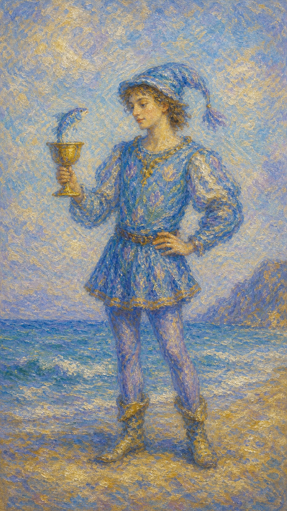

# 圣杯侍从

圣杯侍从像从海风里走来的少年。他低头望着杯中探出的鱼，仿佛第一次听见直觉用奇异又温柔的方式说话。

这张牌出现时，心里有一则细小的讯息正在浮上来。它可能是暧昧、道歉、创作灵感、梦境，也可能是你重新学会用柔软回应世界。

圣杯侍从的水清澈而年轻。它提醒你不要嘲笑自己的敏感，因为许多珍贵的答案，最初都像杯中一尾会说话的小鱼。

年轻侍从手持圣杯，杯中探出一条鱼。海水在身后起伏，象征直觉讯息、情感萌芽与创意灵感。

## 基础要素

1. 牌名：圣杯侍从 (Page of Cups)
2. 数字编号：46 号牌
3. 核心主题：情感讯息、直觉萌芽、创意、温柔表达
4. 元素：水中之土
5. 星座或行星：水象能量的初阶表达
6. 希伯来字母：无固定传统对应
7. 代表意义：通过敏感与好奇接收内在情感讯息

## 牌面要素

| 要素 | 含义 |
|------|------|
| 年轻侍从 | 初学者、信使、敏感的人，或心中刚萌芽的情感能力。 |
| 手中圣杯 | 心灵容器、情感表达、愿意倾听内在声音。 |
| 杯中之鱼 | 直觉讯息、梦境、创意与意想不到的情感回应。 |
| 海水背景 | 潜意识、情绪潮汐和心灵深处的流动。 |
| 柔和衣饰 | 温柔、想象力、艺术气质与情感开放。 |
| 凝视姿态 | 对内在讯息的好奇，也提示需要认真听见微小感受。 |

## 塔罗灵数

宫廷牌中的侍从代表学习、消息与元素力量的初始形态。圣杯侍从让水第一次学会开口。

它的能量像梦醒后仍留在掌心的一点湿意。你可能还无法解释某个感觉，却知道它值得被倾听。

这张牌提醒你，直觉并不总以庄严方式降临。它有时顽皮、羞怯、细小，却能把你带回更诚实的心。

## 正位牌意

**关键词**：暧昧消息，直觉，创意，温柔，敏感，道歉，情感萌芽

正位的圣杯侍从表示温柔的情感讯息正在出现。它可能是一封消息、一次道歉、一个梦、一段暧昧，或突然涌出的艺术灵感。

它鼓励你保持开放。此时不必急着用理性解释所有感受，先让心接住那条小鱼，看看它从哪里游来。

在事件层面，它常代表年轻人、学生、孩子、敏感型人物、创意起点、恋爱萌芽、善意表达。

### 爱情/婚姻

感情中，圣杯侍从带来清新的心动、暧昧消息、温柔示好或带着羞涩的告白。

单身者可能遇到敏感、浪漫、富有想象力的人，也可能在不经意间对某个人产生柔软的好感。

有伴侣者适合表达歉意、写信、制造小惊喜，让关系回到更真诚的情感交流里。

这张牌也提醒你，情感初期需要被温柔照看。不要急着要求它成熟，让它先像小鱼一样自由呼吸。

### 事业学业

事业学业上，圣杯侍从有利于艺术、写作、音乐、影像、心理、教育、疗愈与任何需要想象力的方向。

你可能收到一个小机会，或突然有新的创作念头。它尚未成形，却值得记录。

学习中，它提示你相信兴趣与直觉。某些知识会因为触动心而留下更深印记。

### 人际财富

人际方面，圣杯侍从带来善意、道歉、邀请、轻柔沟通。它适合修复小误会，也适合开启一段温柔的新连接。

财富方面，可能出现与创意、儿童、艺术、情感服务相关的小机会。此时收益未必巨大，但能让心感到被滋养。

也要留意过度理想化。温柔很美，现实边界同样需要被看见。

### 健康生活

健康上，圣杯侍从提示倾听身体细微信号。梦境、情绪、食欲、睡眠变化，都可能在告诉你内在需要什么。

适合通过艺术、写作、冥想、亲近水、温和运动来照顾自己。

若你长期压抑敏感，这张牌邀请你重新允许自己有感受。

### 其它牌意

若问具体事件，正位多表示消息、道歉、暧昧、创意萌芽、孩子相关事务，或直觉给出的提醒。

它也可能代表梦、诗、音乐、灵感、小礼物、情感邀请。

作为建议，圣杯侍从说：请认真听那条小鱼的话。心里的细小波纹，也许正是新故事的开始。

## 逆位牌意

**关键词**：情绪幼稚，逃避感受，消息延迟，敏感受伤，创意阻塞

逆位的圣杯侍从表示情感表达受阻。你可能有感受却不敢说，或用幼稚、回避、试探的方式表达需要。

它也可能提示创意枯竭、直觉被压抑、消息延迟，或情绪太容易被外界触碰。

逆位提醒你温柔地长大。敏感需要被保护，也需要学会更清楚地表达。

### 爱情/婚姻

感情中，逆位圣杯侍从可能表示暧昧不明、情绪化试探、道歉迟迟不来，或一方表达方式不够成熟。

单身者可能被浪漫幻想吸引，却害怕真正靠近。有伴侣者则需要避免用沉默、撒娇、逃避来代替坦诚沟通。

请把真实需求说清楚。爱无法一直靠猜测维持。

### 事业学业

事业学业上，逆位可能代表创意受阻、缺乏信心、情绪影响学习工作，或想法停在想象里没有落地。

适合把灵感写下来，从最小的作品或练习开始。不要因为不完美就让小鱼游回深水。

### 人际财富

人际方面，可能出现误会、玻璃心、道歉困难或沟通含糊。你也可能遇到情绪不稳定、承诺轻飘的人。

财富方面，要小心因情绪消费、浪漫幻想或未经确认的创意项目而花费过多。

### 健康生活

健康上，逆位圣杯侍从可能与情绪敏感、睡眠梦多、压力内化、饮食受心情影响有关。

适合建立稳定作息，并找到安全的情绪表达方式。敏感需要容器，才会从负担变成天赋。

### 其它牌意

若问具体事件，逆位多表示消息延迟、表达不成熟、创意卡住、情绪小波折。

作为建议，逆位圣杯侍从说：请别责怪自己的柔软。给它语言，给它边界，它会慢慢成为真正的直觉。