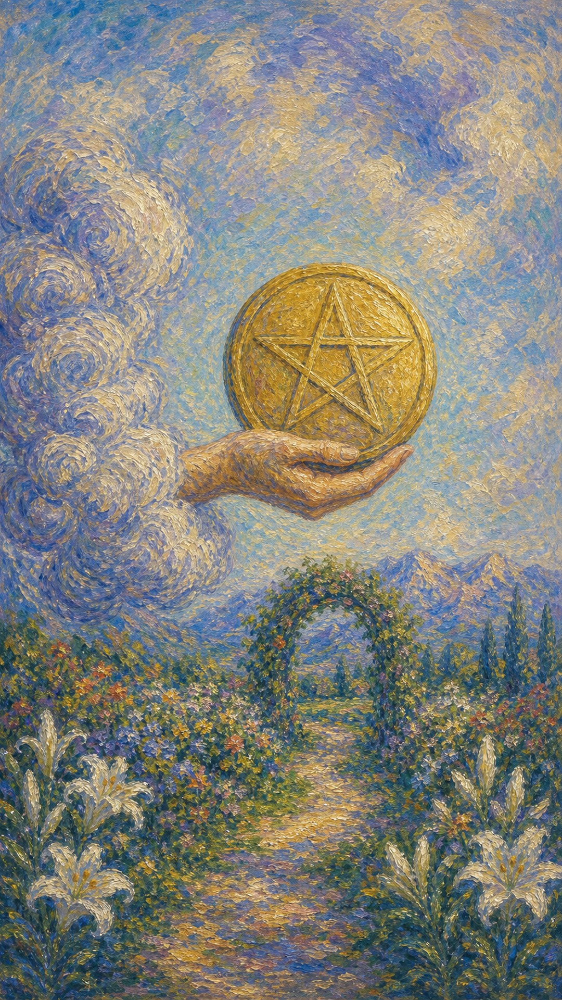

# 星币一

星币一像一只从云中伸出的手，稳稳托起一枚金光熠熠的星币。下方是绿意盎然的花园，一条小径通向远方的拱门与山峦。这是一份来自大地的馈赠——具体、踏实，带着可以生根发芽的承诺。

这张牌出现时，物质世界正向你敞开一扇门。它可能是一份新工作、一笔收入、一个商业机会，也可能是健康、安稳与丰盛的种子，等待你把它种进现实的土壤。

星币一的礼物并不浮华。它不像火那样灼热，也不像水那样涌动，而是沉甸甸地落在掌心，提醒你：真正的丰盛，始于一个被认真对待的开始。

云中之手托起一枚硕大的金色星币，下方是繁花盛开的花园，百合点缀其间，一条小径穿过花拱通向远方的山峰。画面象征物质机会、繁荣的种子与脚踏实地的新生。

## 基础要素

1. 牌名：星币一 (Ace of Pentacles)
2. 数字编号：64 号牌
3. 核心主题：物质机会、丰盛、新的开始、踏实
4. 元素：土
5. 星座或行星：土象能量 / 金牛、处女、摩羯
6. 希伯来字母：无固定传统对应
7. 代表意义：通过把握物质机会开启稳健成长的新周期

## 牌面要素

| 要素 | 含义 |
|------|------|
| 云中之手 | 物质机会的降临，像命运递来的一份礼物。 |
| 金色星币 | 财富、资源、健康与实在的价值。 |
| 繁花园圃 | 丰盛的潜能与生命力，富足的土壤。 |
| 花拱小径 | 通向目标的路径，需要踏实地走过去。 |
| 远方山峰 | 长远的目标与可达成的高度。 |
| 盛开百合 | 纯净的意图，提醒丰盛建立在正道之上。 |

## 塔罗灵数

数字 1 代表起点、种子与纯粹潜能。来到星币组，它化作物质世界的第一颗种子，落进肥沃的土壤。

星币一的 1 号能量不像火那样急于燃烧，它更像一粒被郑重埋下的种子，安静地积蓄着破土而出的力量。

这张牌的灵数提醒你，丰盛始于一个踏实的开始。机会已经递到掌心，剩下的，是你愿不愿意俯身耕耘，让它生根、发芽、结果。

## 牌面解读重点

星币一正位，意味着潜意识里认定眼前是一份踏实、可把握的馈赠，于是愿意俯身去接、去种，把机会当作可以生根的种子；星币一逆位，则是潜意识虽察觉到机会的存在，却隐隐感到它根基不稳、时机未到，于是迟疑观望、急于求成或与之擦肩。正逆位的差别，在于潜意识是否真正相信这颗种子能在现实的土壤里发芽。它们共同的特点是：一切都关乎物质世界里那个最初的开端——这枚被云中之手托起的星币，能否被认真对待，往往决定了日后丰盛的厚薄。星币一也提醒你，富足与安全的另一面是享乐与颓废，唯有把机会种进踏实的耕耘，开端才不会沦为空想。

## 正位牌意

**关键词**：物质机会，丰盛，新开始，财富，稳定，踏实，落地

正位的星币一表示一个实在的机会正在降临。它可能是新工作、新收入、新项目，或健康与生活迈向稳定的契机。

它带来一种脚踏实地的希望。这份机会不是空中楼阁，而是可以握在手中、种进现实的种子，只要用心经营，就有开花结果的可能。

星币一提醒你，抓住它，并踏实耕耘。机会本身只是开始，真正的丰盛，来自你日复一日的投入与积累。

### 爱情/婚姻

感情中，星币一常表示一段稳定、踏实的关系正在萌芽，或现有关系进入更安稳、更务实的阶段。

单身者可能遇到一个可靠、值得长期发展的对象。这份缘分不靠激情速燃，而是建立在真实与稳固之上。

有伴侣者可能迈向更稳定的承诺，如同居、订婚、结婚或共同置业。关系正在从云端落到坚实的地面。

这张牌提醒你，长久的感情需要用心经营。把这颗种子种进日常的相处里，它才会慢慢长成可以依靠的大树。

### 事业学业

事业学业上，星币一是新机会的强力信号。你可能迎来一份新工作、一个新项目、一次创业的契机，或事业迈向稳定。

它适合开始、投入、扎根。机会实在而可靠，提醒你脚踏实地地把握，用扎实的努力让它逐步成形。

学习中，它代表一个新阶段、新领域的开启，或打下坚实基础的好时机。提醒你重视积累，循序渐进。

这张牌建议你认真对待这个开始。把机会种进现实，用持续的耕耘浇灌它，丰盛自会在时间里显现。

### 人际财富

人际方面，星币一可能表示一段务实、互利的关系，或在合作中建立稳固的基础。你重视可靠与诚信。

你可能遇到能带来实际帮助的人，或与他人建立长期稳定的联结。这种关系不浮华，却扎实可靠。

财富方面，这是非常正面的信号，常表示新的收入、投资机会、财务好转或物质丰盛的开端。提醒你稳健经营、量入为出。

它提醒你，财富始于踏实的积累。把握机会的同时，做好规划，让每一分投入都能扎根生长。

### 健康生活

健康上，星币一与身体的稳定、活力的回归、生活步入正轨有关。它常是健康向好的积极信号。

它提醒你为身体打好基础。规律的作息、稳定的运动、踏实的生活节奏，都是滋养健康的肥沃土壤。

请把健康当作值得长期投资的财富。一点一滴的用心，终会汇聚成稳固而长久的安康。

### 其它牌意

若问具体事件，正位多表示实在的机会、稳定的开始、物质的好转，或一个值得把握的契机。

它也可能代表新工作、新收入、置业、签约，或一个踏实落地的计划。

作为建议，星币一说：把握这颗种子，俯身耕耘。机会已在掌心，丰盛的未来，藏在你踏实的每一步里。

### 情境指引

- **过去**：你曾迎来一个踏实的机会或一笔实在的收入，那是日后丰盛的起点，为如今打下了根基。
- **现在**：一份具体而可把握的馈赠正落在掌心，物质世界向你敞开了一扇门，等待你认真接住。
- **未来**：只要俯身耕耘，这颗种子将生根发芽，带来稳定的成长与可见的丰收。
- **挑战**：如何把一时的机会转化为长久的成果，不让它停留在憧憬，而是落进现实的土壤。
- **障碍**：犹豫、拖延或对自身能力的怀疑，可能让你迟迟不敢接住眼前的机会。
- **环境**：周遭的条件务实而有利，资源、人脉或时机正悄然汇聚，为新的开始提供土壤。
- **支持**：身边可能有务实可靠的人或实际的资源助你一臂之力，让你的起步更稳。
- **建议**：抓住这个实在的机会，脚踏实地地投入，把规划落到细处，让种子稳稳扎根。
- **优势**：你拥有踏实的态度与可把握的资源，能把潜能转化为切实的成果。
- **弱点**：可能因贪图速成或缺乏耐心，而错过了让根基扎牢的过程。
- **正面影响**：新的收入、稳固的开端与脚踏实地的丰盛正在生成。
- **负面影响**：若只满足于享有机会而不去耕耘，丰盛便会停留在表面，难以延续。
- **希望发生**：希望这份机会落地生根，带来安稳的物质基础与长久的富足。
- **害怕发生**：害怕机会流失、计划落空，或种子种进了贫瘠的土壤而徒劳。
- **你如何看对方**：你把对方视为可靠、踏实、能带来安稳的人，是值得长期经营的对象。
- **对方如何看待你**：对方欣赏你脚踏实地、值得信赖，认为你是能共建稳固未来的人。
- **关系当前状态**：关系正处在踏实而有潜力的起点，带着可以生根发芽的承诺。
- **关系未来发展**：预示一段稳定、务实、逐步深入的关系，在用心经营中走向安稳。
- **结果**：通常正面，预示一个踏实的开始与可见的丰盛，前提是你愿意俯身耕耘、长久投入。

## 逆位牌意

**关键词**：机会流失，计划落空，财务不稳，急功近利，或根基不牢

逆位的星币一表示机会受阻或根基不稳。你可能错失了一个良机，或计划迟迟无法落地，物质上的承诺没有兑现。

它也可能表示急功近利、贪图速成，忽略了踏实积累；或财务不稳、投资失算，把种子种在了贫瘠的土壤里。

逆位像一颗难以发芽的种子。潜力仍在，却因时机不对、根基不牢或缺乏耐心，迟迟开不出花来。

### 爱情/婚姻

感情中，逆位星币一可能表示关系缺乏稳固的基础，或一段本可发展的缘分因现实因素而搁浅。

单身者可能错过可靠的对象，或被不切实际的期待困住。提醒你，踏实的感情需要时间，急不得也勉强不来。

有伴侣者可能面临稳定性的考验，如经济压力、承诺迟疑或共同规划的分歧。提醒你回到务实的沟通上。

这张牌提醒你，感情的根基比一时的心动更重要。先把现实的土壤打理好，再谈开花结果。

### 事业学业

事业学业上，逆位星币一表示机会流失、计划落空，或新的开始遭遇阻碍。你可能因准备不足或时机不对而受挫。

你可能急于求成，忽略了扎实的积累；也可能空有机会，却迟迟无法落地。提醒你沉下心来，稳扎稳打。

学习中，它代表基础不牢、半途而废，或因贪快而根基不稳。建议放慢节奏，把地基打实。

这张牌建议你别急于求成。错失的机会会再来，但浮躁的心态会让每个机会都难以扎根。

### 人际财富

人际方面，逆位星币一可能表示合作落空、承诺未兑现，或一段关系缺乏务实的基础。提醒你看清对方的可靠程度。

你可能遭遇空头支票，或在合作中因根基不牢而受挫。提醒你重视诚信与落地，别只听漂亮话。

财富方面，要警惕投资失算、财务不稳、机会流失或贪小失大。提醒你量力而行，别被速成的诱惑冲昏头脑。

它提醒你，财富经不起浮躁。稳健、踏实、长远的规划，才是抵御风险的根基。

### 健康生活

健康上，逆位星币一与生活不规律、根基不稳、忽视身体有关。你可能因急躁或疏忽，让健康的基础出现松动。

它提醒你重新打好地基。别为了赶进度而透支身体，规律与踏实，才是健康真正的土壤。

请把身体当作长期的投资。慢一点、稳一点，把根扎牢，活力才会持久地回到你身上。

### 其它牌意

若问具体事件，逆位多表示机会受阻、计划延迟、根基不牢，或一次因浮躁而落空的尝试。

它也可能代表财务不稳、合作搁浅、承诺落空，或一个尚未成熟的开始。

作为建议，逆位星币一说：别急着摘果，先去松土。把根基打牢、把时机等对，那颗种子终会找到破土的力量。

### 情境指引

- **过去**：你或许曾错失一个良机，或把种子种在了贫瘠的土壤里，让本可发芽的潜能落了空。
- **现在**：机会受阻或根基不稳，计划迟迟无法落地，物质上的承诺尚未兑现，让人焦躁。
- **未来**：若仍急功近利、不肯松土，丰盛会继续延迟；唯有沉下心来，转机才会显现。
- **挑战**：如何克制贪快的冲动，在浮躁与务实之间，重新把地基打牢。
- **障碍**：时机不对、准备不足或缺乏耐心，让这颗种子迟迟开不出花来。
- **环境**：周遭的条件尚不成熟，资源紧张或局势未稳，难以支撑一个稳固的开始。
- **支持**：可依靠的实际助力暂时不足，你可能需要独自先把基础理顺、把现实看清。
- **建议**：别急着摘果，先去松土；放慢节奏、看清合同与条件，把根基与时机都等对。
- **优势**：即便受阻，你仍握有潜力与重新开始的机会，及时调整便能转危为安。
- **弱点**：急功近利、根基不牢，容易因一时浮躁而让机会流失、计划落空。
- **正面影响**：有限，但逆位可作为一种提醒，促你停下浮躁、回到踏实的积累。
- **负面影响**：机会流失、财务不稳、承诺落空，或一次因贪快而搁浅的尝试。
- **希望发生**：希望尽快稳住根基、等到对的时机，让停滞的机会重新破土。
- **害怕发生**：害怕良机一去不返，或投入打了水漂、种子终究无法发芽。
- **你如何看对方**：你可能觉得对方不够可靠、承诺难以兑现，或根基不稳、难以托付。
- **对方如何看待你**：对方可能认为你急于求成或基础不牢，对共建稳固未来心存顾虑。
- **关系当前状态**：关系缺乏稳固的根基，或因现实因素而搁浅，处在不稳的边缘。
- **关系未来发展**：若不回到务实的沟通与踏实的经营，关系将持续摇摆、难以扎根。
- **结果**：可能是一段需要重新打地基、等待时机的时期，唯有沉得住气，种子才会再度找到破土的力量。
