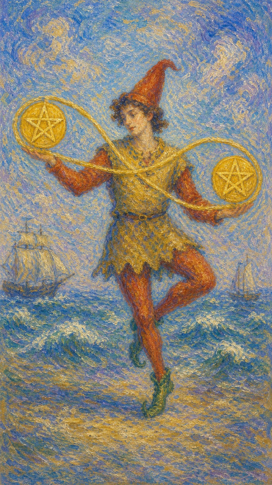

# 星币二

星币二是一个翩翩起舞的人，用一条无限符号般的丝带将两枚星币串连，灵巧地在掌间抛接。身后是起伏的海浪与颠簸的船只，他却在动荡中保持着轻盈的平衡。这是一张关于灵活、权衡与游刃有余的牌。

这张牌出现时，生活正要求你同时照顾多件事。它可能是工作与生活的拉扯，几个任务的并行，几笔开支的调度，也可能是变动中的随机应变。

星币二的平衡不是静止，而是流动。它提醒你，真正的稳定不在于一动不动，而在于像舞者那样，在变化里保持节奏，灵活地让一切各归其位。

人物戴着高帽起舞，双手用一条绕成无限符号的丝带串起两枚星币，身后海面波涛起伏，两艘船在浪间颠簸。画面象征平衡、灵活、多重任务与变动中的从容。

## 基础要素

1. 牌名：星币二 (Two of Pentacles)
2. 数字编号：65 号牌
3. 核心主题：平衡、灵活、权衡、随机应变
4. 元素：土
5. 星座或行星：木星在摩羯座
6. 希伯来字母：无固定传统对应
7. 代表意义：通过灵活的调度在多重事务间保持动态平衡

## 牌面要素

| 要素 | 含义 |
|------|------|
| 起舞人物 | 灵活、轻盈，在变动中保持从容。 |
| 无限丝带 | 周而复始的循环、持续流动的平衡。 |
| 两枚星币 | 需要同时兼顾的两件事或多重责任。 |
| 起伏海浪 | 变动的环境、起落的局势。 |
| 颠簸船只 | 起伏中的事务，提醒风浪可以被驾驭。 |
| 抛接姿态 | 调度与权衡，让一切保持运转。 |

## 塔罗灵数

数字 2 代表二元、平衡与关系。来到星币组，它化作物质世界里的权衡之舞，让人在多重事务间寻找动态的支点。

星币二的 2 号能量像一条流动的丝带。它不强求两端绝对静止，而是让两枚星币在掌间循环往复，在动中维持着巧妙的平衡。

这张牌的灵数提醒你，平衡不是僵立不动，而是灵活流转。当生活同时递来几件事，与其僵持，不如学会像舞者那样，随节奏从容应对。

## 牌面解读重点

星币二正位，意味着潜意识虽感受到生活的动荡与多重压力，却相信自己能在风浪中保持节奏，于是从容地抛接、灵活地权衡，把变动当作可以驾驭的舞步；星币二逆位，则是潜意识被太多事务淹没，隐隐知道已经失衡，却仍勉力硬撑、不肯放下，于是手忙脚乱、顾此失彼。正逆位的差别，在于潜意识是否还保有那份流动的掌控感。它们共同的特点是：都关乎在多重事务、起伏局势中如何安放重心——画面里那个掂量两枚金币的男人，正是整个人生潮起潮落的缩影。星币二也提醒你，面对人生的风浪，韧性与从容才是真正的支点，一个与钱财、抉择相关的决定，往往就藏在这份动态的权衡里。

## 正位牌意

**关键词**：平衡，灵活，多任务，权衡，适应，游刃有余，随机应变

正位的星币二表示你正在同时处理多件事，并努力保持平衡。生活或许有些忙碌起伏，但你能灵活调度，让一切各就各位。

它带来一种动态的从容。你善于权衡、懂得取舍，能在变化中随机应变，像舞者一样在风浪里保持轻盈的节奏。

星币二提醒你，平衡需要流动而非僵持。别想着一次完成所有事，而是灵活地分配精力，让重心在事务间自如地切换。

### 爱情/婚姻

感情中，星币二常表示在关系与其他责任间寻找平衡，或一段需要灵活经营、彼此适应的关系。

单身者可能在感情与生活的多重事务间周旋，需要为爱情留出时间与空间。提醒你别让忙碌挤走了用心。

有伴侣者可能在平衡工作、家庭与感情，或共同应对生活的起伏。提醒你保持沟通的弹性，一起随节奏起舞。

这张牌提醒你，爱需要被有意识地安排。在忙碌中也别忘了把感情放进日程，让它成为平衡里稳定的那一端。

### 事业学业

事业学业上，星币二表示同时兼顾多个任务、项目或角色。你可能正忙于多线作战，需要灵活地调配时间与精力。

它适合需要应变、协调、平衡的场合。你善于切换、懂得分轻重缓急，能在忙乱中保持运转，是高效的多面手。

学习中，它代表兼顾多科、平衡学习与生活，或在压力下灵活调整。提醒你做好规划，避免顾此失彼。

这张牌建议你保持节奏感。别被多重任务压垮，而是像舞者那样轻盈调度，让每件事都得到恰当的照顾。

### 人际财富

人际方面，星币二可能表示在多段关系或多重角色间周旋，需要灵活协调、面面俱到。你善于在不同场合切换自如。

你可能同时扮演多个角色，需要懂得分配精力。提醒你别因兼顾太多而让自己疲于奔命。

财富方面，常表示资金的调度、收支的平衡，或同时打理几笔开支与收入。提醒你做好预算，灵活而不失稳健。

它提醒你，财务平衡靠的是动态管理。量入为出、灵活调配，才能在起伏中守住稳定。

### 健康生活

健康上，星币二与忙碌、多重压力下的平衡有关。你可能在各种事务间奔忙，需要留意别让身心失去节奏。

它提醒你为生活留出弹性。一味连轴转容易耗竭，适合在忙碌中安排休息，让张弛有度成为常态。

请记得，平衡也包括照顾自己。别把所有星币都抛给外界，留一枚给身体的休息与恢复。

### 其它牌意

若问具体事件，正位多表示需要灵活应对、平衡多事，或在变动中随机应变的局面。

它也可能代表忙碌、调度、兼顾、适应变化，或一段需要弹性的时期。

作为建议，星币二说：随节奏起舞吧。别求一次摆平所有事，灵活地让重心流动，你自能在风浪中保持轻盈。

### 情境指引

- **过去**：你曾在多重事务间灵活周旋，凭着随机应变的本事，稳住了一段忙碌起伏的时期。
- **现在**：生活正要求你同时照顾多件事，你在变动中努力保持平衡，像舞者般灵巧地抛接。
- **未来**：只要保持节奏感、灵活调度，你能在起伏的局势里持续游刃有余地前行。
- **挑战**：如何在多线并行中不失重心，既不顾此失彼，也不被忙碌拖垮。
- **障碍**：事务过多或变动太快，可能让你难以兼顾，平衡随时面临被打破的风险。
- **环境**：周遭的局势起伏不定、变数较多，要求你随时调整、灵活应对。
- **支持**：你的适应力与权衡能力是最大的支持，身边或也有人能帮你分担、稳住节奏。
- **建议**：别想一次摆平所有事，分清轻重、灵活分配精力，让重心在事务间自如切换。
- **优势**：灵活、机敏、善于权衡，能在变化中保持从容，是高效的多面手。
- **弱点**：若揽事太多，容易分身乏术，平衡也可能在不知不觉中滑向超负荷。
- **正面影响**：在变动中保持稳定、兼顾多方、把起伏的局势打理得井井有条。
- **负面影响**：忙乱中若失了节奏，可能让某一端被忽略，平衡随之倾斜。
- **希望发生**：希望在多重责任间找到稳定的支点，让一切各归其位、从容运转。
- **害怕发生**：害怕被太多事压垮，或在抛接中让某枚星币失手滑落。
- **你如何看对方**：你视对方为需要与其他责任一同权衡的一端，关系需要灵活地安排。
- **对方如何看待你**：对方欣赏你应变自如、能在忙碌中仍为关系腾出空间。
- **关系当前状态**：关系正与其他事务一同被调度，处在需要灵活经营的动态平衡中。
- **关系未来发展**：若能持续为爱留出节奏与空间，关系会在起伏中稳稳地维系下去。
- **结果**：通常正面，预示你能在多重事务的风浪里保持轻盈，凭灵活与韧性达成动态的平衡。

## 逆位牌意

**关键词**：失衡，手忙脚乱，顾此失彼，超负荷，混乱，或难以取舍

逆位的星币二表示平衡被打破。你可能感到分身乏术、手忙脚乱，被太多事务压得喘不过气，难以兼顾。

它也可能表示顾此失彼、计划混乱，或因揽事太多而超负荷；也可能是面对取舍时犹豫不决，让事情堆积成一团乱麻。

逆位像一个失了节奏的舞者。星币从掌间滑落，原本流畅的循环被打断，让人疲于应付，处处掣肘。

### 爱情/婚姻

感情中，逆位星币二可能表示因忙碌而冷落了关系，或在感情与其他事务间失去平衡，让对方感到被忽略。

单身者可能因生活太满而无暇经营感情，或在多段关系中周旋而陷入混乱。提醒你理清重心，别让自己疲于应付。

有伴侣者可能因压力、忙碌而疏于陪伴，关系出现失衡。提醒你重新分配精力，把感情放回应有的位置。

这张牌提醒你，爱经不起长期的忽略。再忙，也要为关系留一块稳固的地方，别让它在失衡中悄悄滑落。

### 事业学业

事业学业上，逆位星币二表示任务过载、手忙脚乱、难以兼顾，或因揽事太多而效率低下、频频出错。

你可能因不懂取舍而身陷多线作战的泥潭，或因计划混乱而顾此失彼。提醒你学会拒绝，聚焦真正重要的事。

学习中，它代表科目太多难以平衡、时间管理混乱，或因贪多而样样不精。建议理清优先级，删繁就简。

这张牌建议你停下来重新整理。与其勉强抛接所有星币，不如先放下几枚，把重心稳住再说。

### 人际财富

人际方面，逆位星币二可能代表角色过多、难以兼顾，或因分身乏术而得罪了某些人。提醒你别再事事逞强。

你可能被各种关系与责任拉扯得疲惫不堪。提醒你设立边界，把精力留给真正重要的人。

财富方面，要警惕资金链紧张、收支失衡、开支失控，或因调度不当而陷入财务混乱。提醒你尽快理清账目、量力而行。

它提醒你，失衡的财务需要立刻止损。停止盲目周转，先把现金流稳住，再谈灵活调配。

### 健康生活

健康上，逆位星币二与超负荷、过度劳累、身心失衡有关。你可能长期连轴转，已经濒临耗竭的边缘。

它提醒你必须重新找回节奏。一味硬撑只会让平衡彻底崩塌，适合果断减负，把休息排进日程。

请认真对待身体的警讯。放下几件事不是失败，而是为了让你不至于在某天突然倒下。

### 其它牌意

若问具体事件，逆位多表示局面失衡、事务超载、难以兼顾，或一次因贪多而陷入的混乱。

它也可能代表手忙脚乱、顾此失彼、犹豫取舍，或一段身心透支的时期。

作为建议，逆位星币二说：先停下抛接的手。放下几枚星币、理清轻重，重新找回节奏，你才能从混乱里重新站稳。

### 情境指引

- **过去**：你或许曾因揽事太多而失了平衡，手忙脚乱地应付，留下了一段疲于奔命的记忆。
- **现在**：平衡被打破，你感到分身乏术、顾此失彼，被太多事务压得难以兼顾。
- **未来**：若不及时减负、理清重心，混乱会持续累积，让你濒临耗竭的边缘。
- **挑战**：如何学会取舍与拒绝，从超负荷的泥潭里抽身，重新稳住重心。
- **障碍**：贪多、不懂取舍或计划混乱，让你被各种事务拉扯得疲惫不堪。
- **环境**：周遭的局势动荡失序、变数太多，让原本就吃紧的平衡雪上加霜。
- **支持**：你需要主动寻求分担与外援，别再事事逞强，独自硬扛只会让失衡加剧。
- **建议**：先停下抛接的手，放下几枚星币、理清轻重，把休息与边界排进日程。
- **优势**：即便混乱，你仍有重新整理、删繁就简的能力，止损便能重获节奏。
- **弱点**：难以取舍、习惯硬撑，容易因贪多而样样落空、身心透支。
- **正面影响**：有限，但失衡可作为警讯，提醒你及时减负、把重心稳住。
- **负面影响**：任务过载、效率低下、频频出错，身心被拖入耗竭与混乱。
- **希望发生**：希望尽快理清头绪、放下负担，让生活重新回到从容的节奏。
- **害怕发生**：害怕被压垮、某天突然崩盘，或在混乱中失去对生活的掌控。
- **你如何看对方**：你可能因忙乱而无暇顾及对方，觉得关系成了又一项难以兼顾的负担。
- **对方如何看待你**：对方可能感到被冷落、被忽略，认为你总在忙碌中把关系搁置一旁。
- **关系当前状态**：关系因一方的失衡与忙碌而出现裂痕，正被疏于经营地搁置着。
- **关系未来发展**：若不重新分配精力、把感情放回应有的位置，关系会在失衡中悄悄滑落。
- **结果**：可能是一段需要果断减负、重新理清轻重的时期，唯有放下几枚星币，你才能从混乱里重新站稳。
