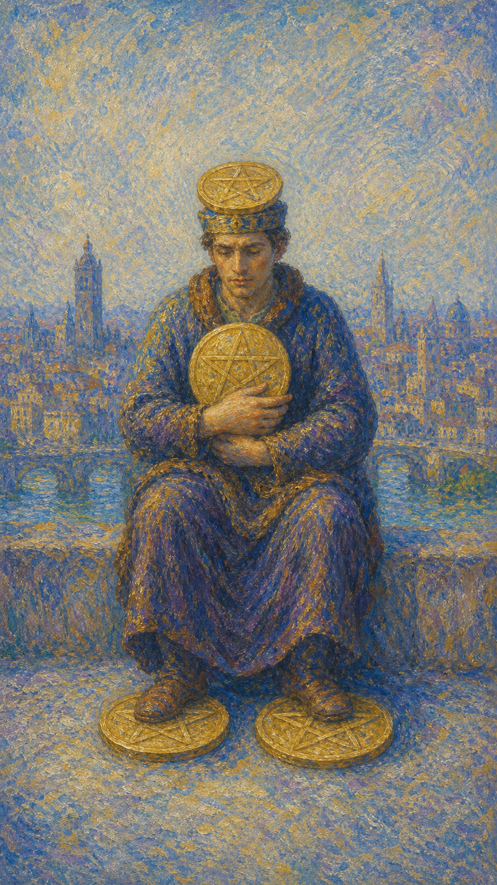

# 星币四

星币四是一个端坐的人，头顶顶着一枚星币，双臂紧抱胸前一枚，双脚各踩一枚，把四枚星币牢牢守在身上。身后是繁华的城市，他却背对着它，神情戒备。这是一张关于占有、保守与紧握不放的牌。

这张牌出现时，安全感成了首要的需求。你可能渴望稳定、害怕失去，于是把拥有的紧紧攥住，无论是金钱、地位、关系，还是某种掌控感。

星币四的紧握既是保护，也是束缚。它提醒你，适度的守护带来安稳，过度的执着却会让人僵硬封闭。问问自己：你是在守护，还是被你想守护的东西困住了？

人物端坐城前，头顶一枚星币，双臂紧抱一枚于胸口，双脚各踏一枚，姿态封闭而戒备，身后是繁华城市。画面象征占有、保守、安全感与紧握不放的执着。

## 基础要素

1. 牌名：星币四 (Four of Pentacles)
2. 数字编号：67 号牌
3. 核心主题：占有、保守、安全感、控制
4. 元素：土
5. 星座或行星：太阳在摩羯座
6. 希伯来字母：无固定传统对应
7. 代表意义：通过审视占有与执着，在守护与开放间找到平衡

## 牌面要素

| 要素 | 含义 |
|------|------|
| 紧抱星币 | 占有欲、对财富或安全感的执着。 |
| 头顶之币 | 被物质或地位主导的思想。 |
| 脚踏二币 | 牢牢守住根基，不愿松动。 |
| 封闭姿态 | 防御、戒备，与外界隔开。 |
| 身后城市 | 被背对的机会、流动的世界。 |
| 端坐不动 | 稳定，也是一种僵化与停滞。 |

## 塔罗灵数

数字 4 代表稳定、结构与守成。来到星币组，它化作对物质的牢牢把守，让人在拥有中筑起一道安全的壁垒。

星币四的 4 号能量像一座关紧门窗的库房。它确实守住了财富，却也挡住了流通；安全有了，新鲜的空气却进不来。

这张牌的灵数提醒你，稳定与僵化只在一线之间。守护是必要的，但若把一切攥得太紧，反而会失去成长与流动的可能。

## 牌面解读重点

星币四正位，意味着潜意识把安全感看得极重，认定唯有牢牢攥住所拥有的，才能抵御失去的恐惧，于是守成、节俭、筑起壁垒；星币四逆位，则是潜意识在两个极端间摇摆——或终于松开紧握的手、学会放手与流动，或把占有与吝啬推向极致、抓得更死。正逆位的差别，在于潜意识是否还能分清"该守"与"该放"。它们共同的特点是：都关乎对物质与安全感的态度——画面里那个把四枚金币顶在头上、抱在怀里、踩在脚下的人，物质上看似富有，却孤零零地背对城市，精神上一贫如洗。星币四也提醒你，过度的紧握往往意味着一段勤俭节约却也封闭隔绝的日子，守护与束缚，常只在一念之间。

## 正位牌意

**关键词**：占有，保守，安全感，控制，稳定，节俭，紧握不放

正位的星币四表示你正紧紧守护着所拥有的东西。这或许带来稳定与安全，但也可能透露出对失去的恐惧与过度的控制。

它带来一种守成的姿态。你重视积累、谨慎理财、不愿冒险，在不确定中为自己筑起一道安全的墙。

星币四提醒你，在守护与开放间找到平衡。适度的稳健是智慧，但若把一切攥得太紧，反而会错过流动带来的成长。

### 爱情/婚姻

感情中，星币四常表示对关系的紧抓、占有欲强，或因害怕失去而过度控制。稳定的渴望，有时会变成束缚。

单身者可能因害怕受伤而封闭自己，或对感情过于谨慎、不愿敞开。提醒你，紧握的双手接不住新的缘分。

有伴侣者可能因占有欲、控制欲而让对方感到压力，或因过度求稳而缺乏新鲜。提醒你给关系一些呼吸的空间。

这张牌提醒你，爱需要信任而非掌控。松开攥得太紧的手，关系反而能在自由中长得更稳。

### 事业学业

事业学业上，星币四表示稳健保守、不愿冒险，或紧守现有的地位与资源。你重视安全，倾向于守成而非开拓。

它适合巩固根基、稳扎稳打，但也提醒你别因过度求稳而错失机会。一味守着旧有的，可能挡住了新的发展。

学习中，它代表固守已知、不愿尝试新方法，或因怕失败而不敢突破。提醒你适度走出舒适区。

这张牌建议你在稳健与开放间权衡。守住根基是对的，但别让保守变成僵化，给成长留一扇敞开的窗。

### 人际财富

人际方面，星币四可能表示防御心重、不易敞开，或在关系中过于谨慎、保留。你可能习惯把人挡在安全距离之外。

你可能因怕被利用或受伤而封闭自己。提醒你，适度的开放与信任，才能换来真正的联结。

财富方面，常表示节俭、储蓄、谨慎理财，或对金钱的紧握。提醒你，守财是美德，但过度吝啬会让财富失去流动的活力。

它提醒你，财富需要在守护与流通间平衡。守得住，也舍得用与投资，才能让它真正为生活服务。

### 健康生活

健康上，星币四与紧张、固执、不愿改变的生活方式有关。你可能因压力或控制欲而身心僵硬，难以放松。

它提醒你学会松弛。一直紧绷、什么都想抓牢，会让身心失去弹性。适度的放手，本身就是一种疗愈。

请允许自己松开一些。不必把一切都攥在手里，给身体和心灵一点自由流动的空间。

### 其它牌意

若问具体事件，正位多表示守成、保守、紧握资源，或一种求稳而不愿变动的态度。

它也可能代表储蓄、节俭、占有、控制，或一段重视安全胜过冒险的时期。

作为建议，星币四说：守护可以，但别攥得太紧。在稳定与流动间找到平衡，你拥有的才不会变成困住你的牢。

### 情境指引

- **过去**：你曾凭谨慎守成积累了稳定的根基，也或许因过度紧握而错过了一些流动的机会。
- **现在**：你正紧紧守护着所拥有的东西，渴望稳定与安全，却也透出对失去的戒备与封闭。
- **未来**：若能在守护与开放间找到平衡，安稳得以保全；若一味紧抓，则会陷入僵化。
- **挑战**：如何分清"该守"与"该放"，让安全感不至于变成困住自己的牢笼。
- **障碍**：对失去的恐惧、过度的控制欲，让你难以敞开，也挡住了成长的空气。
- **环境**：周遭或有变动与机会在流动，而你倾向于背对它们，固守已有的安稳。
- **支持**：你已积累的资源与稳固的根基是后盾，但真正的支持来自适度的信任与开放。
- **建议**：守护可以，但别攥得太紧；松开一些紧绷的手，给成长与流动留一扇窗。
- **优势**：稳健、节俭、善于积累，能在不确定中为自己筑起安全的基础。
- **弱点**：占有欲强、过度保守，容易因僵化封闭而错失流动带来的成长。
- **正面影响**：稳定的根基、谨慎的积累、对资源的妥善守护。
- **负面影响**：因过度控制与吝啬而僵化、孤立，让丰盛失去流动的活力。
- **希望发生**：希望守住已有的安稳，不再失去，让生活稳固而可控。
- **害怕发生**：害怕失去所拥有的一切，陷入不安全与失控的境地。
- **你如何看对方**：你可能把对方紧紧抓牢，渴望掌控，也戒备着关系中的不确定。
- **对方如何看待你**：对方可能感到你的占有与控制，觉得关系缺乏呼吸的空间。
- **关系当前状态**：关系稳定却略显封闭，一方的紧握让彼此都缺少自由流动的余地。
- **关系未来发展**：若能松开掌控、给彼此空间，关系会在信任中长得更稳更自由。
- **结果**：通常指向一种守成而稳定的局面，但提醒你别让紧握变成束缚，在守与放间求得平衡。

## 逆位牌意

**关键词**：放手，松开控制，过度吝啬，财务松动，或学会给予

逆位的星币四有两种走向。积极时，它表示你开始松开紧握的手，学会放手、给予、流动，让被困住的能量重新活络起来。

消极时，它可能表示控制欲或占有欲走向极端，变得极度吝啬、贪婪；或相反，因失去掌控而陷入财务松动、不安。

逆位像一双正在松开或彻底攥死的手。无论是学会放下，还是抓得更紧，关键都在于你能否分清：什么该守，什么该放。

### 爱情/婚姻

感情中，逆位星币四可能表示学会放手、给关系自由，不再过度控制。也可能是占有欲失控，把对方越逼越远。

单身者可能终于敞开心扉、放下戒备，重新向爱开放。也可能因极度的不安全感而难以建立健康的关系。

有伴侣者可能学会信任、松开掌控，让关系重获生机。也要警惕，若占有欲持续升级，会把对方推向窒息的边缘。

这张牌提醒你，爱在放手中才得自由。松开攥得发白的手，你会发现，信任比控制更能留住一个人。

### 事业学业

事业学业上，逆位星币四表示愿意走出舒适区、尝试新机会，或松开对旧有的执着，迎接变化。

你可能终于敢于冒险、勇于革新。也可能相反，因过度保守而错失良机，或因失去掌控而陷入慌乱。

学习中，它代表打破僵化、尝试新方法，或提醒你别因固守旧习而停滞。适度求变，才能突破。

这张牌建议你松开对"安全"的执念。真正的成长，常常发生在你愿意放手、迎接未知的那一刻。

### 人际财富

人际方面，逆位星币四可能代表学会敞开、愿意付出与分享，或相反，因吝啬、占有而让关系疏远。

你可能开始放下防御、真诚待人。也提醒你，若总把人和资源攥得太紧，终会陷入孤立。

财富方面，可能表示愿意花钱、投资、给予，让财富流动起来；也可能是过度挥霍，或因失去掌控而财务松动。

它提醒你，财富的意义在于流动。在守与放之间找到分寸，才能既有安全，又有活力。

### 健康生活

健康上，逆位星币四表示学会放松、释放紧绷，让身心重新流动。也可能提醒你，过度的控制仍在消耗你。

它适合通过放手、舒展、释放压力来恢复弹性。别再什么都想抓牢，给身心松绑，活力自会回流。

请练习松开。无论是紧绷的身体还是焦虑的心，适度的放手，都是通往轻松与健康的路。

### 其它牌意

若问具体事件，逆位多表示松开控制、学会放手，或相反，因极端的占有与吝啬而陷入困境。

它也可能代表给予、流动、释放，或财务的松动与失控。

作为建议，逆位星币四说：分清什么该守、什么该放。把攥死的手松开一些，被困住的丰盛，才能重新流动起来。

### 情境指引

- **过去**：你或许曾因极度紧握而陷入孤立，或已开始尝试松开掌控、让能量重新流动。
- **现在**：你正处在松手与攥死的两极之间——或学会放手与给予，或把占有推向更紧。
- **未来**：若能分清该守与该放，被困住的丰盛会重新流动；若走向极端，则陷入失控或孤立。
- **挑战**：如何在放手与守护之间拿捏分寸，既不挥霍失控，也不吝啬僵化。
- **障碍**：极端的占有或突如其来的松动，让你在贪婪与不安之间难以安定。
- **环境**：周遭或正推动你改变固守的姿态，资源与关系都在要求更多的流动。
- **支持**：当你愿意敞开、给予，外界的善意与机会也会随之回流到你身边。
- **建议**：分清什么该守、什么该放；把攥死的手松开一些，让被困的能量重新活络。
- **优势**：一旦学会放手，你便能释放被困的丰盛，让生活重新有了流动与活力。
- **弱点**：或极度吝啬贪婪，或因失去掌控而慌乱，难以守住内心的平衡。
- **正面影响**：学会给予、流动与释放，让被困住的能量重新焕发生机。
- **负面影响**：占有走向极端而孤立，或失控松动而陷入财务与情绪的不安。
- **希望发生**：希望松开执念、让丰盛流动，或重新夺回对局面的掌控。
- **害怕发生**：害怕因放手而失去，或因攥得太死而彻底孤立、僵化。
- **你如何看对方**：你或学会信任、松开掌控，或因占有失控而把对方越逼越远。
- **对方如何看待你**：对方或感到你终于愿意放手，或被你升级的占有逼到窒息边缘。
- **关系当前状态**：关系正处在松动与紧逼的临界点，掌控与信任在此刻激烈拉扯。
- **关系未来发展**：若能以信任取代控制，关系重获自由；若占有持续升级，则走向破裂。
- **结果**：可能是一段需要分清守与放的时期，唯有松开攥死的手，被困住的丰盛才能重新流动起来。
