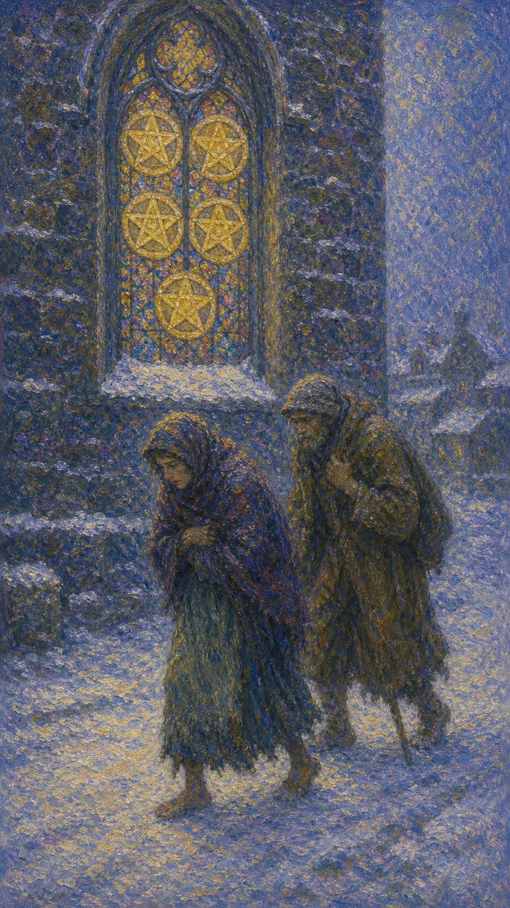

# 星币五

星币五是两个衣衫褴褛的人，在风雪中艰难前行，一人拄拐跛行，一人赤足踏雪。他们经过一扇透着暖光的彩窗，窗上嵌着五枚星币，却没有抬头看见。这是一张关于匮乏、困顿与被忽略的援助的牌。

这张牌出现时，你可能正经历某种缺失。它可能是经济的拮据、健康的损耗、情感的孤立，也可能是一种被世界遗弃的感觉，让人在寒夜里独自跋涉。

星币五的寒冷是真实的，但它身旁那扇亮着灯的窗也同样真实。它提醒你：困顿之中，帮助往往就在近旁，只是你低着头、太专注于自己的苦，而没有抬眼看见那道光。

两个贫病交加的人在雪夜中蹒跚而行，一人拄拐、一人衣衫单薄，身旁是一扇透出暖光、镶嵌五枚星币的彩色教堂窗。画面象征匮乏、困顿、孤立与近在身旁却被忽略的援助。

## 基础要素

1. 牌名：星币五 (Five of Pentacles)
2. 数字编号：68 号牌
3. 核心主题：匮乏、困顿、孤立、被忽略的援助
4. 元素：土
5. 星座或行星：水星在金牛座
6. 希伯来字母：无固定传统对应
7. 代表意义：通过承认困境并抬头求助，找到近在身旁的支持

## 牌面要素

| 要素 | 含义 |
|------|------|
| 褴褛二人 | 物质或精神的匮乏、困顿中的人。 |
| 风雪寒夜 | 艰难的处境、孤立无援的体感。 |
| 拄拐跛行 | 健康的损耗、行走的艰难。 |
| 暖光彩窗 | 近在身旁的援助、被忽略的庇护。 |
| 五枚星币 | 仍存在的资源与希望，只是未被看见。 |
| 低头前行 | 被困境吸住的注意力，看不见出路。 |

## 塔罗灵数

数字 5 代表变化、冲击与不稳定。来到星币组，它化作物质世界的动荡与匮乏，让人在失去与困顿中体会脆弱。

星币五的 5 号能量像一场突如其来的风雪。它打破了原有的安稳，让人暴露在寒冷里，却也逼着人重新看清：什么才是真正的依靠。

这张牌的灵数提醒你，匮乏虽然刺骨，却未必走投无路。那扇亮灯的窗一直在，差别只在于——你是否愿意抬起头，承认自己需要帮助。

## 牌面解读重点

星币五正位，意味着潜意识被失去与匮乏牢牢吸住，低着头在寒夜里独行，认定自己孤立无援、被世界遗弃，于是看不见近在身旁的援助；星币五逆位，则是潜意识或终于愿意抬头、承认需要帮助、走向那扇亮灯的窗，或仍固执地困在自怜里、雪上加霜。正逆位的差别，在于潜意识是否愿意把目光从苦难移开、看见身旁的光。它们共同的特点是：都关乎物质或精神上的匮乏与困顿——画面里那扇只有窗户、没有正门的教堂意味深长，援助分明就在咫尺，两个褴褛的人却视而不见。星币五也提醒你，困顿之中往往也藏着不渝的温情，正如风雪里相互依偎的爱侣，寒夜虽冷，身旁的暖意从未真正消失。

## 正位牌意

**关键词**：匮乏，困顿，经济压力，孤立，健康损耗，被忽略的援助

正位的星币五表示你正经历一段困顿期。它可能是经济的拮据、健康的损耗，或一种被孤立、被遗弃的感受，让人在寒夜里独行。

它带来一种匮乏中的失落。你可能太专注于自己失去的、缺少的，而看不见身旁仍存在的资源与援手——那扇亮着灯的窗，一直都在。

星币五提醒你，困境中更要抬起头。承认自己需要帮助并不可耻，主动求助、看见身边的善意，往往是走出寒夜的第一步。

### 爱情/婚姻

感情中，星币五常表示情感上的匮乏、孤立或被忽略，或关系因现实压力（如经济困难）而备受考验。

单身者可能感到孤独、不被爱，或因自卑而把自己关在情感的寒夜里。提醒你，温暖或许就在近旁，别因低头而错过。

有伴侣者可能共同面对困难时期，或一方感到被冷落、不被支持。提醒你彼此靠近、互相取暖，而非各自承受。

这张牌提醒你，困境中的爱更需要坦诚。把需要说出口、把支持递过去，两个人的寒夜，总好过一个人硬扛。

### 事业学业

事业学业上，星币五可能表示失业、收入减少、机会匮乏，或在工作中感到不被重视、孤立无援。

你可能正经历一段艰难期，感到付出得不到回报。提醒你别只盯着失去的，身边或许有未被注意的资源与机会。

学习中，它代表成绩受挫、资源不足，或感到被边缘化。提醒你主动寻求帮助，老师、同学或许正是那扇亮灯的窗。

这张牌建议你抬头求助。困境是暂时的，但孤立硬扛会让它显得更漫长。承认需要帮助，就是转机的开始。

### 人际财富

人际方面，星币五可能表示孤立、被排斥，或在需要时感到无人可依。你可能因自尊或羞于开口而独自承受。

你可能感到被群体遗忘，或在低谷时看清了人情冷暖。提醒你，主动联结、坦然求助，往往能找到意外的温暖。

财富方面，常表示经济拮据、入不敷出、财务困境。提醒你别因羞耻而回避，正视现状、寻求支持，才能渡过难关。

它提醒你，匮乏时最忌孤立。看见身边的资源、放下面子求助，是走出财务寒冬的务实之道。

### 健康生活

健康上，星币五与身体的损耗、病痛、体力的匮乏有关，也常指因健康问题带来的困顿与孤立。

它提醒你认真对待身体的求救信号，及时就医、寻求照顾。别因硬撑或忽视，让小问题拖成大麻烦。

请记得，你不必独自承受病痛。那扇亮灯的窗——医生、家人、朋友——一直为你敞开，抬头求助并不软弱。

### 其它牌意

若问具体事件，正位多表示困顿、匮乏、压力，或一段需要外援却感到孤立的时期。

它也可能代表经济困难、健康损耗、被忽略，或近在身旁却未被看见的帮助。

作为建议，星币五说：抬起头，看见那扇亮着灯的窗。困境中最重要的，不是独自硬扛，而是允许自己被帮助。

### 情境指引

- **过去**：你曾经历一段匮乏或孤立的时期，或许独自硬扛了某种失去与困顿，留下寒夜般的记忆。
- **现在**：你正处在困顿期，被经济、健康或情感的匮乏吸住目光，感到孤立无援、寒冷难行。
- **未来**：若愿意抬头求助、看见身旁的资源，寒夜终会过去，温暖正在近旁等你。
- **挑战**：如何放下自尊、承认需要帮助，把目光从失去移开，看见仍存在的援手。
- **障碍**：自怜、羞于开口或被困境吸住的注意力，让你错过近在身旁的庇护。
- **环境**：周遭看似寒冷艰难，但那扇亮灯的窗一直在，善意与支持其实就在身边。
- **支持**：医生、家人、朋友或某个群体正向你敞开，只待你愿意抬头、推开那扇门。
- **建议**：抬起头，看见那扇亮着灯的窗；主动求助、接受善意，是走出寒夜的第一步。
- **优势**：困境锤炼出的坚韧，以及一旦愿意求助便能找到出路的转机。
- **弱点**：习惯独自硬扛、羞于求助，容易让暂时的匮乏显得更漫长。
- **正面影响**：承认需要、看见援助，让困顿成为重新联结与获得支持的契机。
- **负面影响**：孤立硬扛、被自怜困住，让匮乏与寒冷在沉默中不断加深。
- **希望发生**：希望走出匮乏、重获温暖与支持，不再独自跋涉于寒夜。
- **害怕发生**：害怕被世界遗弃、求助无门，困顿与孤立没有尽头。
- **你如何看对方**：你或感到与对方一同受困寒夜，或觉得对方未能给你需要的支持。
- **对方如何看待你**：对方可能感到你封闭、不愿求助，或与你一同承受着现实的压力。
- **关系当前状态**：关系正经受现实困境的考验，一方或双方感到被冷落、不被支持。
- **关系未来发展**：若彼此靠近、坦诚求助与给予，关系能熬过寒夜、共得温暖。
- **结果**：往往指向一段困顿期，但提醒你抬头看见身旁的光，承认需要帮助便是转机的开始。

## 逆位牌意

**关键词**：走出困境，恢复，接受帮助，找回希望，或困顿加深

逆位的星币五有两种走向。积极时，它表示困境开始好转，你逐渐走出匮乏，找回希望，或终于愿意接受帮助、看见身旁的支持。

消极时，它可能表示困顿加深、雪上加霜，或仍困在孤立与自怜中，不肯抬头、不愿求助，让寒夜显得更长。

逆位像一个终于抬头看见暖光、或仍固执低头的人。无论是迎来转机，还是继续硬扛，关键都在于你是否愿意走向那扇门。

### 爱情/婚姻

感情中，逆位星币五可能表示从孤立中走出，重新感受到爱与支持，或关系熬过了困难期，重获温暖。

单身者可能放下自卑、敞开心扉，重新相信自己值得被爱。也可能仍困在孤独里，需要主动迈出第一步。

有伴侣者可能一起渡过难关，关系因共患难而更深。也提醒你，若一方仍感被忽略，需要及时把温暖补回去。

这张牌提醒你，寒夜终会过去。当你愿意靠近、愿意接受爱，那扇暖光的窗，就会成为你们共同的归处。

### 事业学业

事业学业上，逆位星币五表示走出低谷、收入回升、重获机会，或终于得到了所需的支持与资源。

你可能熬过了最艰难的阶段，事业开始回暖。也可能仍在困境中，提醒你别放弃求助，转机往往藏在坚持之后。

学习中，它代表从挫败中恢复、找回信心，或终于获得帮助而突破瓶颈。提醒你善用身边的资源。

这张牌建议你抓住回暖的契机。困境正在松动，主动接受帮助、积极行动，能让你更快走回温暖的地方。

### 人际财富

人际方面，逆位星币五可能代表重新被接纳、找回归属，或终于放下面子、接受他人的善意与支持。

你可能走出孤立、重建联结。也提醒你，若仍固守自怜，会让自己离温暖越来越远。

财富方面，可能表示财务好转、走出拮据，或获得援助、找到出路。也可能是困境加深，提醒你尽快正视、求助。

它提醒你，走出财务寒冬的关键，是停止孤立。接受帮助、积极应对，丰盛会慢慢回流。

### 健康生活

健康上，逆位星币五表示从病痛中康复、体力回升，或终于获得了恰当的照顾与治疗。身体正在回暖。

它提醒你继续接受支持、好好调养。也可能是健康仍未好转，提醒你别再拖延，及时求助才是正途。

请允许自己被照顾。康复的路上，接受帮助不是负担，而是让你更快回到温暖与安康的力量。

### 其它牌意

若问具体事件，逆位多表示困境好转、援助到来、希望重现，或仍需面对的困顿。

它也可能代表恢复、接受帮助、走出孤立，或雪上加霜的延续之苦。

作为建议，逆位星币五说：走向那扇亮灯的窗吧。寒夜不会永远，当你愿意推开门、接受温暖，转机就在门内等你。

### 情境指引

- **过去**：你或许刚熬过最艰难的阶段，或仍困在一段迟迟未消的匮乏与孤立之中。
- **现在**：困境出现转折——你或开始走出寒夜、接受帮助，或仍固执低头、雪上加霜。
- **未来**：若愿意推开那扇门、积极行动，温暖会回流；若继续硬扛，困顿则可能延续。
- **挑战**：如何放下自怜、迈出求助的第一步，让自己真正走向那扇亮灯的窗。
- **障碍**：固守的自尊与拖延，可能让本该到来的转机一再推迟。
- **环境**：周遭的寒意正在松动，援助与机会逐渐显现，只待你愿意伸手接住。
- **支持**：身边的善意、专业的帮助与回暖的资源正等着你，接受它们并不软弱。
- **建议**：走向那扇亮灯的窗，停止孤立、接受帮助，积极行动让自己更快回到温暖里。
- **优势**：从困境中恢复的韧性，以及愿意接受支持后迅速回暖的可能。
- **弱点**：若仍固守自怜、拒绝求助，会让自己离温暖越来越远。
- **正面影响**：走出孤立、重获支持，让困顿松动、希望重现。
- **负面影响**：困境加深、雪上加霜，或在自怜中错失了回暖的契机。
- **希望发生**：希望尽快走出匮乏、重获温暖与归属，结束独行的寒夜。
- **害怕发生**：害怕困顿继续加深，或始终走不出孤立与自怜的循环。
- **你如何看对方**：你或重新感到对方的温暖与支持，或仍觉得彼此困在冷淡之中。
- **对方如何看待你**：对方或欣慰你终于愿意敞开，或仍感到你封闭、难以靠近。
- **关系当前状态**：关系正处在回暖或持续受困的分岔口，取决于双方是否愿意靠近。
- **关系未来发展**：若彼此接纳、共渡难关，关系因患难而更深；若仍冷淡，则渐行渐远。
- **结果**：可能指向困境的好转与援助的到来，唯有愿意推开门、接受温暖，转机才会在门内显现。
