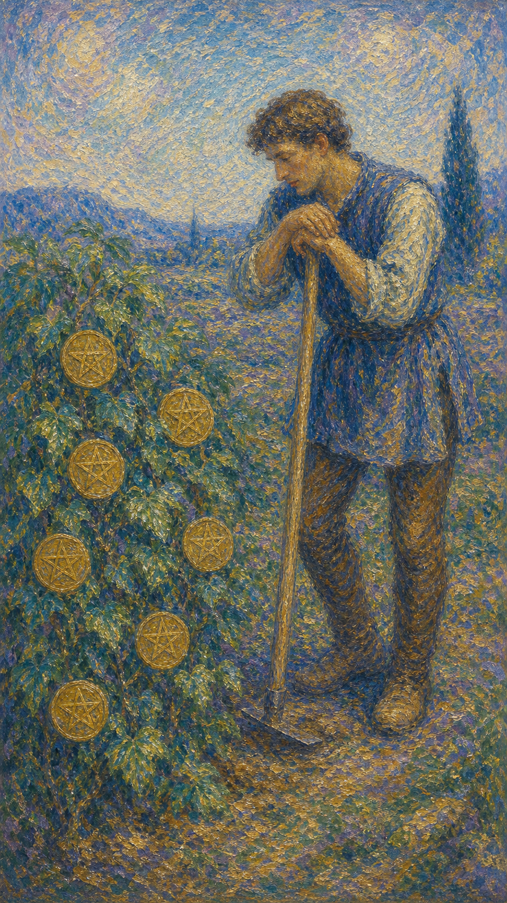

# 星币七

星币七是一个农夫，拄着锄头，凝视着藤蔓上结出的七枚星币。他停下劳作，神情若有所思，似在评估这一季的收成是否值得继续。这是一张关于耐心、评估与等待成长的牌。

这张牌出现时，你来到了努力的中途。你已经付出了许多，作物正在生长，却还没到收获的时刻。它邀请你停下来，看看自己种下的，是否走在对的方向上。

星币七的等待不是停滞，而是沉淀。它提醒你，有些成果急不得——种子有自己的节律，唯有耐心浇灌、适时评估，才能在恰当的季节，收下饱满的果实。

农夫双手拄着锄头，停下劳作，凝视着一丛结满七枚星币的藤蔓，神情沉思。画面象征耐心、评估、长期投入与等待成果成熟的过程。

## 基础要素

1. 牌名：星币七 (Seven of Pentacles)
2. 数字编号：70 号牌
3. 核心主题：耐心、评估、长期投入、等待收获
4. 元素：土
5. 星座或行星：土星在金牛座
6. 希伯来字母：无固定传统对应
7. 代表意义：通过耐心评估与持续投入，等待成果在恰当时机成熟

## 牌面要素

| 要素 | 含义 |
|------|------|
| 拄锄农夫 | 辛勤的投入、暂时的停歇与思考。 |
| 凝视神情 | 评估、反思，衡量付出与收获。 |
| 藤蔓星币 | 正在成长的成果、尚未成熟的回报。 |
| 茂盛枝叶 | 持续投入带来的生机与潜力。 |
| 停下劳作 | 必要的暂停，审视方向是否正确。 |
| 脚下土地 | 踏实的根基、长期耕耘的土壤。 |

## 塔罗灵数

数字 7 代表反思、考验与内在的评估。来到星币组，它化作耕耘途中的驻足，让人停下来衡量付出与所得。

星币七的 7 号能量像一个在田边沉思的农夫。他既不急于收割，也不轻言放弃，而是带着耐心去观察：这片土地，是否值得继续浇灌。

这张牌的灵数提醒你，成长有它自己的时间。真正的智慧，是分清哪些需要耐心等待，哪些需要及时调整，然后在恰当的季节，收下属于你的果实。

## 牌面解读重点

星币七正位，意味着潜意识懂得成长需要时间，于是停下劳作、耐心评估，既不急于收割也不轻言放弃，相信厚积薄发的果实会在恰当的季节成熟；星币七逆位，则是潜意识或被焦躁驱使、急于求成、拔苗助长，或在错误的方向上空耗太久、因一时挫败而过早弃耕。正逆位的差别，在于潜意识能否分清"该等待"与"该调整"。它们共同的特点是：都关乎对未来财务与经济状况的思考与评估——画面里那位拄锄沉思的劳动者，正衡量着付出与收获是否相称，盘算着这片杂草丛生的田地是否值得继续清理。星币七也提醒你，一分耕耘一分收获，朴素的土地与辉煌的果实之间，隔着的正是耐心与审慎的评估。

## 正位牌意

**关键词**：耐心，评估，长期投入，等待，反思，坚持，厚积薄发

正位的星币七表示你正处于努力的中途，付出了许多，成果正在生长，却还未到收获之时。这是一个停下来评估、并继续坚持的阶段。

它带来一种沉淀的智慧。你开始反思已有的投入是否值得，方向是否正确，同时也明白有些成果需要时间，急于求成只会拔苗助长。

星币七提醒你，耐心与评估同样重要。继续浇灌你认定的种子，同时审慎地看清方向；厚积薄发的果实，会在恰当的季节如约而至。

### 爱情/婚姻

感情中，星币七常表示关系正在慢慢培养，需要耐心经营，或正处于评估这段感情是否值得继续的阶段。

单身者可能在等待一段缘分成熟，或反思过往的投入。提醒你别急躁，好的感情如同作物，需要时间才能开花结果。

有伴侣者可能正共同经营长期的关系，或停下来审视感情的走向。提醒你，稳定的爱需要持续浇灌，也需要适时的回望。

这张牌提醒你，爱是一场耐心的耕耘。评估付出是否值得没有错，但也别因一时未见回报，就轻易放弃正在生长的果实。

### 事业学业

事业学业上，星币七表示长期投入正在积累成果，但尚未到收获时。你可能需要耐心坚持，同时评估当前的方向。

它适合回顾与调整。你可能在反思之前的努力是否有效，或衡量是否该继续投入。提醒你既要有耐心，也要有审视的眼光。

学习中，它代表知识的积累、长期的努力，或对学习方向的评估。提醒你厚积薄发，别因短期未见成效而气馁。

这张牌建议你耐心而清醒地坚持。继续耕耘值得的方向，适时调整无效的部分，成果会在该来的时候到来。

### 人际财富

人际方面，星币七可能表示长期培养的关系、需要耐心经营的人脉，或对某段关系投入产出的评估。

你可能在衡量某些关系是否值得继续投入。提醒你，真诚的联结需要时间沉淀，但也别在消耗性的关系里耗费太久。

财富方面，常表示长期投资、稳健积累，或评估某项财务投入的回报。提醒你耐心等待收益，同时审慎评估风险。

它提醒你，财富的果实需要时间。坚持长期的、值得的投入，适时检视成效，丰盛会在持续的耕耘中逐渐成形。

### 健康生活

健康上，星币七与长期的健康投入、耐心的调养有关。你可能正坚持某种健康计划，需要时间才能见到成效。

它提醒你别急于求成。健康如同作物，规律的作息、持续的锻炼都需要时间积累，耐心坚持才能收获稳固的改善。

请相信缓慢而扎实的改变。每一天的用心都在生长，只要方向对了，身体自会在时间里给你饱满的回报。

### 其它牌意

若问具体事件，正位多表示需要耐心等待、评估方向，或一项长期投入正在接近成熟。

它也可能代表反思、坚持、积累、收成在望，或一段需要沉住气的时期。

作为建议，星币七说：耐心浇灌，也别忘了抬头看方向。值得的果实需要时间，而你已经走在收获的路上。

### 情境指引

- **过去**：你曾长期投入、耐心耕耘，那些日积月累的付出，正是如今果实渐熟的根由。
- **现在**：你处在努力的中途，成果正在生长却未到收获之时，停下来评估、并继续坚持。
- **未来**：只要耐心浇灌、方向不偏，厚积薄发的果实会在恰当的季节如约成熟。
- **挑战**：如何在耐心等待与及时调整之间权衡，既不急于求成，也不空耗于错误的方向。
- **障碍**：焦躁、对短期回报的执着，可能让你低估了成长所需的时间。
- **环境**：周遭的局势需要时间沉淀，回报尚未显现，要求你沉住气、稳住节奏。
- **支持**：你已投入的努力与扎实的根基是后盾，时间正站在耐心耕耘者这一边。
- **建议**：耐心浇灌值得的种子，同时抬头审视方向；该坚持的坚持，该调整的及时调整。
- **优势**：耐心、坚韧、懂得评估，能在长期投入中等到饱满的回报。
- **弱点**：若一时未见成效便心生动摇，可能在收获前夕轻易放弃。
- **正面影响**：长期投入接近成熟、方向得到审视、厚积薄发的成果在望。
- **负面影响**：若因急躁而拔苗助长，或因怀疑而中断，反会延误本该到来的收成。
- **希望发生**：希望长久的付出开花结果，在恰当的时机收下饱满的果实。
- **害怕发生**：害怕努力付诸东流，或方向有误让等待变成徒劳。
- **你如何看对方**：你视这段关系为需要耐心培养的作物，正衡量它是否值得继续投入。
- **对方如何看待你**：对方欣赏你愿意慢慢经营、踏实付出，认为你是值得长期相处的人。
- **关系当前状态**：关系正在慢慢培养，处在需要耐心浇灌、尚未到收获的阶段。
- **关系未来发展**：若持续用心、不急不弃，关系会在时间里逐渐深厚、开花结果。
- **结果**：通常正面，预示长期投入正接近成熟，耐心与审慎会带来值得等待的收获。

## 逆位牌意

**关键词**：急于求成，缺乏耐心，投入无果，放弃太早，或评估失误

逆位的星币七表示耐心或评估出了问题。你可能急于求成、缺乏耐心，想立刻看到回报，却忘了成长需要时间。

它也可能表示长期投入却收效甚微，让人沮丧；或评估失误，在错误的方向上耗费了太多；又或是因一时挫败而过早放弃了本可成熟的果实。

逆位像一个焦躁的农夫，要么拔苗助长，要么半途弃耕。关键在于你能否分清：是该多一点耐心，还是该果断止损。

### 爱情/婚姻

感情中，逆位星币七可能表示急于求成、缺乏耐心，或在一段消耗性的关系里投入过多却得不到回报。

单身者可能因急于脱单而错判，或因一时未见结果就轻易放弃。提醒你，感情既不能拔苗助长，也别在无果的关系里耗尽自己。

有伴侣者可能因长期付出无回应而疲惫，或对关系失去耐心。提醒你审视：是需要再多一点时间，还是该重新考虑方向。

这张牌提醒你，爱需要耐心，但不是无止境的等待。分清哪些值得坚持、哪些该放手，才能不辜负自己的付出。

### 事业学业

事业学业上，逆位星币七表示急功近利、缺乏耐心，或长期投入却收效甚微、回报不如预期。

你可能因等不及成果而焦躁，或发现之前的努力方向有误。提醒你重新评估，及时调整，别在错误的田地里继续空耗。

学习中，它代表急于看到成绩、缺乏积累的耐心，或方法不当导致事倍功半。建议沉下心，或果断转换更有效的方式。

这张牌建议你冷静评估投入产出。该坚持的别轻易放弃，该止损的别盲目坚持，把精力用在真正会结果的地方。

### 人际财富

人际方面，逆位星币七可能代表在消耗性关系中投入过多，或因急躁而破坏了正在培养的联结。

你可能在不值得的人身上耗费了太多，或因缺乏耐心而错失深交的机会。提醒你审视关系的投入产出。

财富方面，要警惕急于求成的投资、盲目跟风，或长期投入却血本无归。提醒你耐心与审慎并重，及时止损。

它提醒你，财富经不起焦躁。无论是拔苗助长还是死守亏损，都需要清醒评估，把资源投向真正有回报的方向。

### 健康生活

健康上，逆位星币七与急于见效、半途而废，或长期努力却不见改善有关。你可能因没耐心而中断了调养。

它提醒你，健康没有捷径。别因短期未见成效就放弃，也别因焦躁而尝试激进的方式。规律与耐心才是正道。

请对自己多一点耐心。身体的改变需要时间，稳扎稳打的坚持，远胜过急于求成的折腾。

### 其它牌意

若问具体事件，逆位多表示急于求成、投入无果、方向有误，或因缺乏耐心而过早放弃。

它也可能代表焦躁、徒劳、评估失误，或一项需要重新调整的长期投入。

作为建议，逆位星币七说：先停下焦躁的锄头。看清是该多些耐心，还是该换片田地，别让努力白白耗在错误的等待里。

### 情境指引

- **过去**：你或许曾急于求成、拔苗助长，或在错误的方向上空耗了太多时间与精力。
- **现在**：耐心或评估出了问题，你或焦躁地想立刻见回报，或发现长期投入收效甚微。
- **未来**：若不停下焦躁、重新评估，努力会继续白费；及时调整方向，才能止损转机。
- **挑战**：如何冷静分清"该多些耐心"与"该果断止损"，不在错误的田地里继续空耗。
- **障碍**：急功近利、缺乏耐心或评估失误，让投入与回报严重不成正比。
- **环境**：周遭的回报迟迟不显，局势或已偏离预期，要求你重新审视方向。
- **支持**：你需要的是冷静的评估与及时的调整，把精力转向真正会结果的地方。
- **建议**：先停下焦躁的锄头，看清是该多些耐心，还是该换片田地，别让努力空耗。
- **优势**：一旦看清方向、果断取舍，你便能把资源投向真正有回报的地方。
- **弱点**：焦躁、易放弃或固守亏损，容易让付出在错误的等待里白白流失。
- **正面影响**：有限，但挫败可作为提醒，促你重新评估投入产出、调整方向。
- **负面影响**：急于求成、投入无果、方向有误，或在收获前夕过早放弃。
- **希望发生**：希望尽快看清方向、及时止损，让努力不再付诸东流。
- **害怕发生**：害怕长期投入血本无归，或因焦躁而毁了本可成熟的果实。
- **你如何看对方**：你或对这段关系失去耐心，或觉得在不值得的人身上耗费了太多。
- **对方如何看待你**：对方可能觉得你急躁、缺乏耐心，或难以为长久的关系沉下心。
- **关系当前状态**：关系或陷入消耗，一方投入过多却得不到回应，耐心正被磨尽。
- **关系未来发展**：若不审视是该多给时间还是该放手，关系会在徒劳的等待中愈发疲惫。
- **结果**：可能指向一段急于求成或方向有误的时期，唯有停下焦躁、看清方向，才能避免努力白白耗费。
