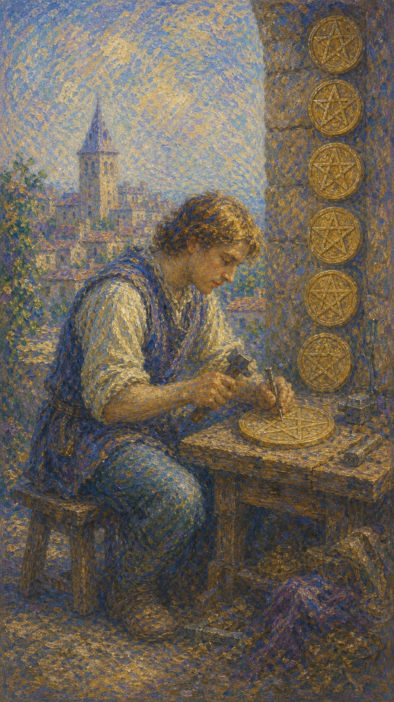

# 星币八

星币八是一位专注的工匠，坐在工作台前，一锤一凿地雕琢着星币。已完成的六枚整齐地挂在身旁，手中一枚正在打磨，脚边还有一枚待做。他全神贯注，一丝不苟。这是一张关于专注、勤勉与精进技艺的牌。

这张牌出现时，你正沉浸在一件值得用心打磨的事情里。它可能是学习一门手艺、深耕一项技能、专注地完成手头的工作，在重复的劳作中不断精进。

星币八的勤勉自有一种安定的力量。它提醒你，精通从不来自捷径，而来自一锤一凿的累积；当你愿意俯身专注，平凡的重复也会慢慢雕琢出非凡的作品。

工匠端坐工作台前，专注地锤凿手中的星币，身旁木桩上整齐挂着六枚已完成的星币，脚边还有一枚。画面象征专注、勤勉、技艺的磨练与精益求精的投入。

## 基础要素

1. 牌名：星币八 (Eight of Pentacles)
2. 数字编号：71 号牌
3. 核心主题：专注、勤勉、技艺、精益求精
4. 元素：土
5. 星座或行星：太阳在处女座
6. 希伯来字母：无固定传统对应
7. 代表意义：通过专注勤勉的投入不断精进技艺、累积成果

## 牌面要素

| 要素 | 含义 |
|------|------|
| 专注工匠 | 全神贯注、投入手中的工作。 |
| 锤凿星币 | 技艺的打磨、对细节的用心。 |
| 已成六币 | 持续努力累积的成果。 |
| 待做之币 | 仍需继续的工作、未尽的努力。 |
| 工作台 | 踏实的劳作、扎根于实务。 |
| 一丝不苟 | 精益求精、对品质的坚持。 |

## 塔罗灵数

数字 8 代表力量、循环与精进。来到星币组，它化作技艺打磨的专注，让人在重复的劳作中不断累积、不断超越。

星币八的 8 号能量像一把不停起落的凿子。它不追求一蹴而就，而是相信日复一日的雕琢——每一次落锤，都让作品离完美更近一分。

这张牌的灵数提醒你，精通是时间的礼物。当你愿意沉下心来、专注于手中之事，平凡的勤勉终将累积成令人惊叹的技艺。

## 牌面解读重点

星币八正位，意味着潜意识沉浸在一件值得打磨的事里，相信日复一日的雕琢自有意义，于是专注、勤勉、一丝不苟地把技艺一点点精进；星币八逆位，则是潜意识或心不在焉、敷衍了事、得过且过，或走向另一极端——陷入吹毛求疵的完美主义，纠结细节而忽略全局。正逆位的差别，在于潜意识是否把专注放在了对的地方、用在了对的力道上。它们共同的特点是：都关乎勤奋工作、注重细节与对技艺的投入——画面里那位为了专注而搬离城镇的工匠，已完成七枚星币、正打磨第八枚，正是一种暗示着对某人或某种情况之承诺的踏实姿态。星币八也提醒你，精通从不来自捷径，而来自一锤一凿、心无旁骛的累积。

## 正位牌意

**关键词**：专注，勤勉，技艺，精益求精，努力，投入，匠心

正位的星币八表示你正专注地投入一件事，通过持续的努力磨练技艺、累积成果。这是一个埋头深耕、稳步精进的阶段。

它带来一种匠人般的踏实。你愿意在细节上用心，在重复中坚持，不求速成，只求把手中的事做到更好。

星币八提醒你，专注本身就是力量。继续这份勤勉的投入，对品质的坚持终会换来认可，平凡的累积终会雕琢出不凡。

### 爱情/婚姻

感情中，星币八常表示用心经营、专注投入的态度。你愿意为关系下功夫，在日常的相处中一点点把感情打磨得更好。

单身者可能正专注于自我提升，或愿意为一段值得的感情认真付出。提醒你，用心经营的态度，本身就很有魅力。

有伴侣者可能正踏实地经营关系，在细节中表达爱意。提醒你，长久的感情靠的不是激情，而是日复一日的用心。

这张牌提醒你，爱也是一门需要打磨的手艺。愿意花心思、肯在细节上用功，关系才会在专注中越来越稳固。

### 事业学业

事业学业上，星币八是勤勉与精进的强力信号。你可能正埋头钻研、磨练技能，或专注地完成手头的工作，稳步提升。

它适合学习新技能、深耕专业、打磨作品。你的努力扎实而专注，提醒你坚持下去，精通就在持续的累积之中。

学习中，它代表刻苦钻研、踏实积累，或在反复练习中提升能力。提醒你重视基本功，用专注换取扎实的进步。

这张牌建议你保持匠心。把每一件事做到精细，把每一次重复当作精进的机会，你的技艺与口碑都会稳步成长。

### 人际财富

人际方面，星币八可能表示因专业、勤勉而赢得尊重，或在专注做事中建立可靠的形象。你用实力说话。

你可能因踏实、用心而获得他人的信赖。提醒你，专注于精进自己，比刻意经营人脉更能赢得长久的尊重。

财富方面，常表示通过技能、勤勉工作带来稳定收入，或靠专业能力提升赚钱的本领。提醒你磨练技艺就是积累财富。

它提醒你，最可靠的财富是你的本事。专注精进、持续投入，你的技能终会转化为稳固而长久的收益。

### 健康生活

健康上，星币八与持续、规律的健康投入有关。你可能正专注地坚持某项锻炼或调养计划，并从中稳步受益。

它提醒你，健康也需要匠心。规律的作息、专注的练习，看似平凡的重复，正一点点雕琢出更好的身体状态。

请把照顾自己当作一门值得精进的手艺。每一天的用心都在累积，专注的坚持，会让你收获扎实的安康。

### 其它牌意

若问具体事件，正位多表示专注投入、勤勉精进、技艺提升，或一项需要用心打磨的工作正在稳步推进。

它也可能代表学习、深耕、磨练、精益求精，或一段踏实努力的时期。

作为建议，星币八说：俯下身，专注打磨手中之事。精通从不靠捷径，你一锤一凿的用心，终会雕琢出不凡的作品。

### 情境指引

- **过去**：你曾沉下心打磨某项技能，那段勤勉专注的累积，正是如今本事的根基。
- **现在**：你专注地投入一件事，通过持续努力磨练技艺、累积成果，稳步精进。
- **未来**：只要保持这份匠心、坚持精进，平凡的勤勉终会雕琢出令人认可的不凡。
- **挑战**：如何在重复的劳作中守住专注与热情，把每一次打磨都做到位。
- **障碍**：枯燥、倦怠或对速成的渴望，可能动摇你埋头深耕的定力。
- **环境**：周遭是一个适合钻研与精进的环境，让你能心无旁骛地打磨手中之事。
- **支持**：你的专注与勤勉本身就是最大的支持，扎实的技艺会为你赢得认可。
- **建议**：俯下身专注打磨，把每件事做到精细，把每次重复当作精进的机会。
- **优势**：专注、勤勉、注重细节，能在持续投入中把技艺锤炼得越来越精。
- **弱点**：若过于埋头，可能忽略了抬头看方向，或在重复中渐生倦怠。
- **正面影响**：技艺稳步提升、口碑逐渐建立、平凡的累积雕琢出不凡的成果。
- **负面影响**：若一味苦干而不思方向，专注也可能变成低效的重复。
- **希望发生**：希望通过专注的投入精进技艺，让努力换来认可与扎实的回报。
- **害怕发生**：害怕付出得不到回报，或技艺停滞、努力难以被看见。
- **你如何看对方**：你视对方为值得用心经营的人，愿意在日常细节中一点点打磨感情。
- **对方如何看待你**：对方欣赏你肯下功夫、用心经营，认为你踏实可靠、值得托付。
- **关系当前状态**：关系正被用心地打磨经营，双方在日复一日的细节中加深联结。
- **关系未来发展**：若持续用心、肯在细节上用功，关系会在专注中越来越稳固。
- **结果**：通常正面，预示专注的投入带来技艺的精进与认可，平凡的累积终成不凡。

## 逆位牌意

**关键词**：敷衍，缺乏专注，得过且过，完美主义，或方向偏差

逆位的星币八表示专注或品质出了问题。你可能心不在焉、敷衍了事、得过且过，让工作失了应有的水准。

它也可能表示走向另一个极端——陷入吹毛求疵的完美主义，纠结于细节而忽略全局；或埋头苦干却方向偏差，投入了努力却用错了地方。

逆位像一个分心或偏执的工匠。要么草草了事、毫无匠心，要么死磕细节、不见森林，让勤勉失去了原本的意义。

### 爱情/婚姻

感情中，逆位星币八可能表示对关系敷衍、缺乏用心，或因怠惰而疏于经营。也可能是过度挑剔，对感情吹毛求疵。

单身者可能因不愿付出而原地踏步，或因过分挑剔而难以走近他人。提醒你，用心与包容，缺一不可。

有伴侣者可能因疏于经营而让感情变淡，或因过度计较细节而消磨了温情。提醒你把心思放回真正重要的地方。

这张牌提醒你，爱经不起敷衍，也经不起苛求。用恰当的专注与包容去经营，关系才不会在怠惰或挑剔中失温。

### 事业学业

事业学业上，逆位星币八表示心不在焉、敷衍了事、品质下滑，或因怠惰而停滞不前。

你可能对工作失去了热情，得过且过；也可能陷入完美主义，纠结细节而效率低下；或埋头苦干却方向错误。提醒你重新对齐目标。

学习中，它代表不用功、走神，或方法低效、白费力气。建议找回专注，并确认努力的方向是否正确。

这张牌建议你审视投入的质量与方向。要么找回认真的态度，要么跳出钻牛角尖的执念，让努力真正产生价值。

### 人际财富

人际方面，逆位星币八可能代表因敷衍、不专业而失了信任，或因过度计较而显得难以相处。

你可能因怠惰而砸了口碑，或因吹毛求疵而让人疏远。提醒你，恰当的专注与适度的宽容，才能赢得长久的尊重。

财富方面，要警惕因工作敷衍、技能荒废而收入受损，或因方向错误而徒劳无功。提醒你重新精进、找对路子。

它提醒你，财富依赖你本事的成色。别让怠惰荒废了技能，也别让偏执耗尽了精力，把功夫下在刀刃上。

### 健康生活

健康上，逆位星币八与三分钟热度、半途而废，或过度执着于某个健康细节有关。

你可能难以坚持健康计划，或因过度纠结某项指标而徒增焦虑。提醒你找回平稳的节奏，专注而不偏执。

请用恰当的态度照顾自己。既不敷衍懈怠，也不苛求完美，规律而宽容的坚持，才是健康真正的根基。

### 其它牌意

若问具体事件，逆位多表示敷衍、停滞、品质欠佳，或因方向偏差、过度完美主义而事倍功半。

它也可能代表怠惰、走神、吹毛求疵，或一段需要重新找回专注的时期。

作为建议，逆位星币八说：要么找回你的匠心，要么放下你的执念。把专注放对地方、用对力道，勤勉才能重新结出果实。

### 情境指引

- **过去**：你或许曾敷衍了事、得过且过，或陷入吹毛求疵的执念，让努力失了应有的水准。
- **现在**：专注或品质出了问题，你或心不在焉、怠惰停滞，或死磕细节、不见森林。
- **未来**：若不找回匠心或放下执念，努力会继续打折，技艺与口碑都难以提升。
- **挑战**：如何在敷衍与苛求两个极端间找回平衡，把专注放对地方、用对力道。
- **障碍**：怠惰、走神或完美主义，让勤勉失去了原本的意义。
- **环境**：周遭或缺乏让你专注的氛围，干扰与分心让你难以沉下心打磨。
- **支持**：你需要重新对齐目标、找回认真的态度，必要时跳出钻牛角尖的执念。
- **建议**：要么找回匠心，要么放下执念；审视投入的质量与方向，让努力真正产生价值。
- **优势**：一旦重拾专注、用对力道，你仍能让停滞的勤勉重新结出果实。
- **弱点**：怠惰敷衍或吹毛求疵，容易让技能荒废、效率低下、徒劳无功。
- **正面影响**：有限，但停滞可作为提醒，促你找回专注或修正方向。
- **负面影响**：品质下滑、停滞不前、徒劳内耗，让努力难以转化为成果。
- **希望发生**：希望重拾认真的态度、把功夫下在刀刃上，让努力重新见效。
- **害怕发生**：害怕技能荒废、收入受损，或在偏执与怠惰中白费力气。
- **你如何看对方**：你或对关系敷衍懈怠，或对对方过度挑剔、吹毛求疵。
- **对方如何看待你**：对方或感到你疏于经营、不够用心，或觉得你太过苛求、消磨温情。
- **关系当前状态**：关系或因怠惰而变淡，或因过度计较细节而失了温度。
- **关系未来发展**：若不找回恰当的专注与包容，关系会在敷衍或苛求中渐渐失温。
- **结果**：可能指向一段敷衍停滞或过度执着的时期，唯有把专注放对地方，勤勉才能重新结出果实。
