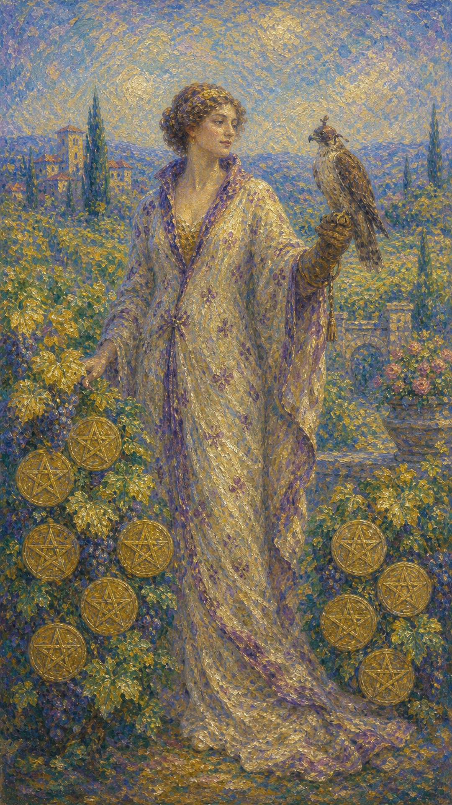

# 星币九

星币九是一位衣着华贵的女子，独自漫步在硕果累累的葡萄园中，一只驯服的猎鹰停在她戴着手套的手上。九枚星币缀满枝头，她神情从容而满足。这是一张关于丰盛、自给自足与优雅独立的牌。

这张牌出现时，你正享受着努力换来的成果。它可能是经济的独立、生活的优渥、内心的自足，也可能是一种"我凭自己的力量，活成了想要的样子"的从容与笃定。

星币九的丰盛带着自律的底色。那只戴手套的猎鹰，是被驯服的欲望与冲动；它提醒你，真正的优雅独立，来自既懂得享受成果，也懂得自我节制——丰盛之中，仍有清醒的掌控。

雍容的女子独立于结满星币的葡萄园中，一只猎鹰驯顺地停在她戴手套的手上，远处是宁静的庄园。画面象征丰盛、自给自足、优雅独立与自律带来的从容。

## 基础要素

1. 牌名：星币九 (Nine of Pentacles)
2. 数字编号：72 号牌
3. 核心主题：丰盛、自给自足、优雅独立、自律
4. 元素：土
5. 星座或行星：金星在处女座
6. 希伯来字母：无固定传统对应
7. 代表意义：通过自律与努力收获丰盛，活出优雅而独立的自我

## 牌面要素

| 要素 | 含义 |
|------|------|
| 雍容女子 | 自足、从容，享受成果的优雅。 |
| 累累星币 | 努力换来的丰盛与物质回报。 |
| 驯服猎鹰 | 被掌控的欲望与冲动，自律的象征。 |
| 葡萄藤蔓 | 成熟的果实、丰收的喜悦。 |
| 宁静庄园 | 稳固的根基、用心经营的成就。 |
| 独立姿态 | 自给自足、不依附他人的笃定。 |

## 塔罗灵数

数字 9 代表接近圆满、累积与成熟。来到星币组，它化作物质与精神的丰盛，让长久的努力开出饱满的果实。

星币九的 9 号能量像一座硕果累累的庄园。它不是凭空而来的幸运，而是自律与耕耘日积月累的回报——每一枚星币，都凝着曾经的付出。

这张牌的灵数提醒你，丰盛与自律相伴而生。手套上那只驯服的鹰说明：真正的从容，来自既能享受成果，也能掌控自己；自由，正建立在自律之上。

## 牌面解读重点

星币九正位，意味着潜意识享受着自律换来的丰盛，既懂得品味成果的优渥，也懂得节制欲望、掌控自己，于是在独立中体会到一种安稳的满足；星币九逆位，则是潜意识或过度依赖他人、缺乏自律、放纵挥霍，或徒有表面的光鲜而内里空虚，自我价值随之动摇。正逆位的差别，在于潜意识是否还驯服得住那只欲望之鹰。它们共同的特点是：都关乎丰盛、独立与自我掌控——画面里那位气质温文的妇人，左手上停着一只听命于她的猎鹰，那是被成功控制住的冲动与欲望，正说明自信且自律将带来成功。星币九也提醒你，真正优雅的独立，来自既能享受成果、也能管住自己，自由始终立于自律的根基之上。

## 正位牌意

**关键词**：丰盛，自给自足，优雅独立，自律，享受成果，从容，安稳

正位的星币九表示你正享受着努力换来的丰盛。无论是经济的独立、生活的优渥，还是内心的自足，你都凭自己的力量活得从容而笃定。

它带来一种自律之后的优雅。你懂得享受成果，也懂得节制欲望；不依附他人，却也不孤单，而是在独立中体会到一种安稳的满足。

星币九提醒你，享受当下的丰盛，也珍惜它背后的自律。这份从容是你应得的，而维持它的，仍是那份对自己的掌控与用心。

### 爱情/婚姻

感情中，星币九常表示独立而从容的姿态。你不依赖关系来获得满足，而是先活成完整的自己，再以从容的心态面对爱情。

单身者可能享受着独处的丰盛，对感情不将就。提醒你，先爱自己、活得精彩，对的人自会被这份自足吸引。

有伴侣者可能在关系中保持独立与自我，彼此欣赏而非依附。提醒你，两个完整的人相伴，远比相互捆绑更长久。

这张牌提醒你，最好的爱建立在独立之上。先成为自给自足的自己，爱情便成了锦上添花，而非生命的全部。

### 事业学业

事业学业上，星币九是成果丰收、独立自主的信号。你可能凭自己的努力获得了成就、独立与认可，享受着应得的回报。

它适合享受成果、巩固地位，也提醒你这份成功源于长久的自律与坚持。你有能力凭实力站稳脚跟。

学习中，它代表努力开花结果、独立钻研有成，或达到了令人满意的水准。提醒你为自己的成就感到自豪。

这张牌建议你享受并珍惜这份成果。它是你自律耕耘的回报，继续保持那份对自己的掌控，丰盛便能长久延续。

### 人际财富

人际方面，星币九可能表示独立而自信的形象，或在关系中保持自我、不卑不亢。你的从容让人欣赏。

你可能因独立、有底气而赢得尊重。提醒你，自给自足让你在关系中更自由，既能享受陪伴，也不惧独处。

财富方面，这是非常正面的信号，常表示经济独立、财务自由、享受丰盛的成果。提醒你这源于自律的积累，值得珍惜与守护。

它提醒你，财务独立带来真正的从容。继续以自律经营财富，享受成果的同时做好规划，安稳便能长久。

### 健康生活

健康上，星币九与自律带来的良好状态、身心的丰盛安稳有关。你可能因规律的自我管理而享受着健康与活力。

它提醒你，这份好状态来自持续的自律。继续善待身体、节制有度，你便能长久地享受健康带来的从容。

请为自己的自律感到骄傲。你用心经营的身体，正以丰盛的活力回报你；继续温柔而坚定地照顾它。

### 其它牌意

若问具体事件，正位多表示丰收、独立、享受成果，或一种自给自足、从容安稳的状态。

它也可能代表财务自由、优雅独立、自我实现，或一段自律换来丰盛的时期。

作为建议，星币九说：享受你应得的丰盛吧。这份从容源于你的自律，继续掌控自己，优雅与安稳便会长伴左右。

### 情境指引

- **过去**：你曾凭自律与努力日积月累，那些坚持的付出，换来了如今丰盛而独立的从容。
- **现在**：你正享受着努力换来的丰盛，经济独立、生活优渥，在自给自足中体会安稳的满足。
- **未来**：只要继续掌控自己、保持自律，这份优雅与丰盛便能长久地延续下去。
- **挑战**：如何在享受成果的同时不失节制，让自由始终立于自律的根基之上。
- **障碍**：一旦放松对欲望的掌控，放纵或依赖可能悄然侵蚀这份来之不易的丰盛。
- **环境**：周遭是一个让你能独立从容、享受成果的环境，你有底气不依附他人。
- **支持**：你的自律与独立本身就是最坚实的支持，丰盛的根基由你亲手筑成。
- **建议**：享受你应得的丰盛，也珍惜它背后的自律，继续温柔而坚定地掌控自己。
- **优势**：自律、独立、从容，既能享受成果，也能管住自己，活得优雅而笃定。
- **弱点**：若沉溺于安逸，可能松懈了那份维系丰盛的自我掌控。
- **正面影响**：经济独立、自我实现，以及自律换来的优雅与安稳。
- **负面影响**：若放松节制，丰盛可能在不知不觉中失去稳固的根基。
- **希望发生**：希望长久地享受自给自足的丰盛，在独立与自律中保持从容。
- **害怕发生**：害怕失去独立与掌控，让来之不易的丰盛与安稳动摇。
- **你如何看对方**：你以独立从容的姿态看待对方，不依附，而是欣赏彼此的完整。
- **对方如何看待你**：对方欣赏你自给自足、优雅笃定，被你独立的气质所吸引。
- **关系当前状态**：关系建立在彼此独立的基础上，双方相互欣赏而非相互捆绑。
- **关系未来发展**：若双方都保持完整与自律，关系会如锦上添花般从容而长久。
- **结果**：通常正面，预示丰收、独立与自我实现，自律换来的优雅与安稳长伴左右。

## 逆位牌意

**关键词**：过度依赖，缺乏自律，挥霍，表面光鲜，或自我价值动摇

逆位的星币九表示丰盛或独立出了问题。你可能过度依赖他人、缺乏自律，或因挥霍、放纵而难以守住成果。

它也可能表示徒有表面的光鲜，内里却空虚不安；或因过度追求物质而忽略了真正的满足；又或是自我价值动摇，难以独立、缺乏安全感。

逆位像一座疏于打理的庄园，或一只挣脱手套的鹰。要么成果在放纵中流失，要么独立的底气在依赖中瓦解。

### 爱情/婚姻

感情中，逆位星币九可能表示过度依赖关系、缺乏独立，或用物质、外在来填补内心的空虚。

单身者可能因害怕独处而急于依附，或在感情中失去自我。提醒你先找回自给自足的力量，别让爱成为唯一的支撑。

有伴侣者可能在关系中过度依赖对方，或因物质、表面而忽略了真正的情感联结。提醒你重建独立与自我价值。

这张牌提醒你，依附换不来真正的安稳。先成为完整的自己，爱才不会变成填补空洞的工具。

### 事业学业

事业学业上，逆位星币九表示缺乏自律、难以独立，或成果不稳、徒有其表。也可能是过度追求物质而忽略了内在成长。

你可能因放纵、懈怠而难以守住成绩，或过度依赖他人的支持。提醒你找回自律，培养独立自主的能力。

学习中，它代表自律不足、依赖性强，或华而不实、根基不牢。建议踏实积累，靠自己的努力站稳脚跟。

这张牌建议你重建自律与独立。表面的光鲜留不住，唯有扎实的能力与自我掌控，才能换来真正稳固的成果。

### 人际财富

人际方面，逆位星币九可能代表过度依赖他人、缺乏独立，或用外在的光鲜掩饰内心的不安。

你可能因依附而失去自我，或因攀比、虚荣而陷入空虚。提醒你回到内在，找回不依赖他人的笃定。

财务方面，要警惕挥霍无度、入不敷出，或徒有表面的富足而根基空虚。提醒你重建自律，量入为出，守住真正的丰盛。

它提醒你，财富经不起放纵。找回对金钱的掌控、培养独立的能力，才能让丰盛不至于在挥霍中流失。

### 健康生活

健康上，逆位星币九与缺乏自律、放纵、生活失序有关。你可能因疏于管理或过度放纵，让身心状态滑坡。

它提醒你找回规律与节制。放纵带来的舒适是短暂的，唯有重拾自律，才能守住身体真正的丰盛与活力。

请重新驯服那只脱缰的鹰。把节制与规律请回生活，你才能重新享受由自律换来的从容与安康。

### 其它牌意

若问具体事件，逆位多表示成果不稳、缺乏自律、过度依赖，或徒有表面的光鲜。

它也可能代表挥霍、空虚、自我价值动摇，或一段需要重建独立与节制的时期。

作为建议，逆位星币九说：先把那只鹰重新驯服。找回自律与独立，别让放纵掏空成果，真正的丰盛才会重新稳固。

### 情境指引

- **过去**：你或许曾因放纵、依赖而难以守住成果，或徒有光鲜的表面而内里渐生空虚。
- **现在**：丰盛或独立出了问题，你或缺乏自律、挥霍放纵，或自我价值动摇、缺乏安全感。
- **未来**：若不重新驯服欲望之鹰、找回自律，成果会在放纵中流失，独立的底气也将瓦解。
- **挑战**：如何重建自律与独立，不让放纵掏空成果，也不让依赖瓦解自我。
- **障碍**：放纵、懈怠或对物质、外在的过度追求，让内心的滋养被忽略。
- **环境**：周遭或充满诱惑与攀比，让你在放纵与虚荣中失了对自己的掌控。
- **支持**：你需要回到内在，重建对金钱与欲望的掌控，找回不依赖他人的笃定。
- **建议**：先把那只鹰重新驯服，找回自律与独立，量入为出，守住真正的丰盛。
- **优势**：一旦重拾自律、回归内在，你仍能让流失的丰盛重新稳固。
- **弱点**：缺乏自律、过度依赖，容易让成果在放纵中流失、根基在依附中动摇。
- **正面影响**：有限，但失衡可作为提醒，促你重建自律、找回独立的力量。
- **负面影响**：挥霍空虚、自我价值动摇，或徒有表面的光鲜而根基松动。
- **希望发生**：希望重拾对自己的掌控，让丰盛与独立重新变得稳固。
- **害怕发生**：害怕成果流失、独立瓦解，在依赖与空虚中失去自我。
- **你如何看对方**：你或过度依赖对方，或用物质、外在来填补内心的空虚。
- **对方如何看待你**：对方或感到你缺乏独立、过度依附，或觉得你的丰盛徒有其表。
- **关系当前状态**：关系或因一方的过度依赖、缺乏自我而失衡，情感联结被外在掩盖。
- **关系未来发展**：若不重建独立与自我价值，关系会沦为填补空洞的工具，难以安稳。
- **结果**：可能指向一段缺乏自律、根基不稳的时期，唯有重新驯服那只鹰，丰盛才会重新稳固。
