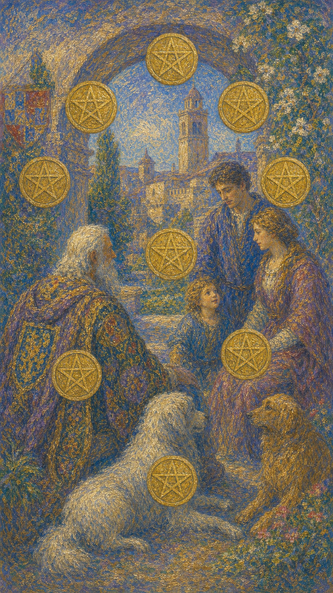

# 星币十

星币十描绘了一个三代同堂的场景：白发长者坐在拱门下，身旁伴着爱犬；一对夫妇在交谈，孩童在一旁嬉戏；十枚星币如生命树般铺满整个画面。这是一张关于富足、传承与圆满归属的牌。

这张牌出现时，丰盛已不只属于个人，而延伸为家庭、根基与长久的传承。它可能是物质的稳固、家族的兴旺、世代的延续，也可能是一种"我属于这里，也将留下些什么"的深沉归属感。

星币十的圆满带着时间的厚度。它提醒你，最长久的丰盛从不只关乎一时的拥有，而关乎你为所爱之人、为后来者留下的根基——那是物质之上，真正能传承的财富。

拱门下白发长者与爱犬相伴，一对夫妇交谈，孩童在旁玩耍，十枚星币如生命树般遍布画面，背景是兴旺的庄园。画面象征富足、家庭、传承与世代延续的圆满归属。

## 基础要素

1. 牌名：星币十 (Ten of Pentacles)
2. 数字编号：73 号牌
3. 核心主题：富足、家庭、传承、圆满归属
4. 元素：土
5. 星座或行星：水星在处女座
6. 希伯来字母：无固定传统对应
7. 代表意义：通过稳固的根基实现物质与家族的长久传承

## 牌面要素

| 要素 | 含义 |
|------|------|
| 白发长者 | 智慧、阅历，家族的根与传承的源头。 |
| 三代同堂 | 家庭的延续、世代的联结。 |
| 嬉戏孩童 | 未来、希望与生命的传递。 |
| 十枚星币 | 圆满的物质丰盛、稳固的财富。 |
| 生命树排列 | 根基深厚、福泽绵延的象征。 |
| 兴旺庄园 | 长久经营的成就、安稳的归属。 |

## 塔罗灵数

数字 10 代表圆满、完成与循环的终点，也孕育着新的开始。来到星币组，它化作物质之旅的圆满，把丰盛沉淀为可以传承的根基。

星币十的 10 号能量像一棵枝繁叶茂的家族之树。它的丰盛不再是个人的果实，而是荫蔽几代人的浓荫——根扎得越深，福泽便延续得越长。

这张牌的灵数提醒你，最圆满的丰盛是能够传承的丰盛。当你为所爱之人、为未来留下稳固的根基，物质便升华为一种跨越时间的、长久的富足。

## 牌面解读重点

星币十正位，意味着潜意识把丰盛理解为可以传承的根基，珍视家庭、归属与世代的延续，于是着眼长远、稳固经营，让物质沉淀为荫蔽几代人的浓荫；星币十逆位，则是潜意识或面临家庭矛盾、财务不稳、传承纷争，或因过度看重物质而忽略情感，又或被家族的期待与传统所束缚。正逆位的差别，在于潜意识能否守住那棵家族之树的根。它们共同的特点是：都关乎坚实的物质基础与长久的归属——画面里那个三代同堂的温馨场景，钱币错列成生命之树的符号，描述着一个财务稳固、子承父业的家庭，也象征着以金钱与成功为目标的家族企业或成功的事业伙伴。星币十也提醒你，最长久的财富从不只关乎一时的拥有，而关乎你为后来者留下的稳固根基。

## 正位牌意

**关键词**：富足，家庭，传承，圆满，长久，归属，根基稳固

正位的星币十表示一种圆满而长久的丰盛。它不只关乎个人的成就，更延伸为家庭的兴旺、根基的稳固，以及可以传承下去的财富与价值。

它带来一种深沉的归属与安稳。你可能正享受着稳固的物质基础、和睦的家庭，或一种"扎下了根、有所归属"的踏实感。

星币十提醒你，珍惜并守护这份长久的丰盛。它是世代经营的成果，提醒你在享受的同时，也思考能为所爱之人、为未来留下些什么。

### 爱情/婚姻

感情中，星币十常表示稳定、长久、以家庭为依归的关系。它指向承诺、婚姻、共建家庭，或一段经得起时间考验的深厚情感。

单身者可能渴望或即将走向安定的关系，或遇到能共建未来的对象。提醒你，你寻求的是长久的归属，而非一时的心动。

有伴侣者可能迈向更深的承诺，如结婚、组建家庭，或与家族的融合。提醒你，这是一段以稳固与传承为底色的关系。

这张牌提醒你，最深的爱通向归属与传承。把感情扎进稳固的根基里，它便能荫蔽你们，也荫蔽未来。

### 事业学业

事业学业上，星币十是长久成就、稳固基业的信号。你可能建立起稳定的事业，或在一个有传承、有根基的领域中获得安稳。

它适合长远规划、建立基业、巩固成果。你的努力正沉淀为可持续的财富与地位，提醒你着眼长远的稳固。

学习中，它代表扎实的根基、长久的积累，或在有传承的领域中深耕。提醒你你正在建立经得起时间检验的基础。

这张牌建议你为长远而建。把眼光放在可持续、可传承的成就上，你所建立的根基，会带来跨越时间的回报。

### 人际财富

人际方面，星币十可能表示家族、团体或长久的人际网络。你拥有稳固的归属与可依靠的联结，或在某个群体中深深扎根。

你可能享受着家庭或团体的支持，或成为他人可以依靠的根基。提醒你珍惜这份长久而稳固的联结。

财富方面，这是最丰盛的信号之一，常表示财务稳固、家业兴旺、长期的富足，或财富的积累与传承。提醒你善加守护与规划。

它提醒你，最长久的财富是能够传承的财富。稳健经营、着眼长远，让丰盛不只属于此刻，也福泽未来。

### 健康生活

健康上，星币十与稳固的身心状态、长久的健康根基有关，也可能涉及家族的健康传承。

它提醒你着眼长远地经营健康。良好的生活习惯如同稳固的家业，需要长期维护，才能福泽自己与家人。

请把健康当作可传承的财富。你今天的用心，不仅滋养自己，也为所爱之人树立起长久安康的根基。

### 其它牌意

若问具体事件，正位多表示圆满、稳固、长久的成果，或一件涉及家庭、传承、根基的好事。

它也可能代表婚姻、置业、家业、继承，或一段安稳富足的时期。

作为建议，星币十说：守护并传承你的丰盛。它是世代经营的果实，在享受归属的同时，也为未来种下长久的根。

### 情境指引

- **过去**：你或家族曾长久经营、稳固积累，那些世代的努力，铺就了如今圆满的根基。
- **现在**：你正享受着稳固的物质基础与和睦的归属，丰盛延伸为家庭的兴旺与长久的安稳。
- **未来**：只要着眼长远、稳固经营，这份丰盛将传承下去，福泽自己也荫蔽后来者。
- **挑战**：如何在享受圆满的同时，思考能为所爱之人、为未来留下怎样的根基。
- **障碍**：短视或只顾眼前的拥有，可能让丰盛难以沉淀为可传承的长久富足。
- **环境**：周遭是一个稳固、有传承、有归属的环境，家族或团体的支持环绕着你。
- **支持**：家庭、团体或长久的人际网络是坚实后盾，你也成为他人可依靠的根基。
- **建议**：守护并传承你的丰盛，着眼可持续、可传承的成就，为未来种下长久的根。
- **优势**：根基深厚、归属稳固，拥有可跨越时间、惠及世代的丰盛。
- **弱点**：若沉溺于现有的安稳，可能忽略了为长远与传承做的规划。
- **正面影响**：圆满的物质丰盛、稳固的家庭归属、可传承的财富与价值。
- **负面影响**：若只顾一时拥有而缺乏长远眼光，圆满也可能难以延续。
- **希望发生**：希望丰盛稳固长久、家业兴旺，为所爱之人留下扎实的根基。
- **害怕发生**：害怕根基动摇、家庭失和，或丰盛难以传承下去。
- **你如何看对方**：你视对方为能共建家庭、共享长久归属的人，关系指向安定与承诺。
- **对方如何看待你**：对方认为你稳重可靠、重视长久，是值得共建未来的归属对象。
- **关系当前状态**：关系稳定而深厚，以家庭、承诺与共同的未来为依归。
- **关系未来发展**：预示走向婚姻、组建家庭或与家族融合，关系扎根稳固、长久绵延。
- **结果**：通常非常正面，预示圆满、稳固与长久的丰盛，以及可以传承下去的归属与价值。

## 逆位牌意

**关键词**：家庭问题，财务不稳，根基动摇，传承纠纷，或短视

逆位的星币十表示丰盛或根基出了问题。你可能面临家庭矛盾、财务不稳、根基动摇，或因传承、继承而起的纷争。

它也可能表示过度看重物质而忽略了情感，或因短视而难以建立长久的根基；又或是被家族的期待、传统所束缚，渴望挣脱。

逆位像一棵根基松动的家族之树。要么外在的丰盛难以稳固，要么内在的联结出现裂痕，让圆满蒙上了阴影。

### 爱情/婚姻

感情中，逆位星币十可能表示家庭矛盾、价值观分歧，或关系缺乏长久稳固的基础。也可能是被家族压力所困扰。

单身者可能因家庭因素、现实条件而在感情上受阻，或渴望安定却难以实现。提醒你看清自己真正想要的归属。

有伴侣者可能面临家庭融合的难题、经济压力，或对长久承诺的犹豫。提醒你正视根基的问题，坦诚沟通。

这张牌提醒你，长久的关系需要稳固的根。若根基出现裂痕，及时修补、坦诚面对，比勉强维持表面圆满更重要。

### 事业学业

事业学业上，逆位星币十表示根基不稳、成果难以持久，或因短视而缺乏长远规划。也可能涉及合伙、传承的纠纷。

你可能面临基业动摇、财务不稳，或在有传承的环境中受到束缚。提醒你既要夯实根基，也要审视是否被旧有框架所困。

学习中，它代表基础不牢、缺乏长远目标，或受困于家族期待。建议厘清自己的方向，建立扎实的根基。

这张牌建议你正视根基的隐患。无论是夯实不稳的基础，还是挣脱束缚的框架，都为的是建立真正属于你的长久成就。

### 人际财富

人际方面，逆位星币十可能代表家庭失和、团体内的纷争，或因利益、传承而起的矛盾。归属感受到动摇。

你可能正经历家族或群体的冲突，或感到被传统、期待所束缚。提醒你在维系联结与忠于自我之间找到平衡。

财务方面，要警惕财务不稳、债务、家产纠纷，或因短视、挥霍而难以积累长久的财富。提醒你着眼长远、稳健规划。

它提醒你，丰盛的根基需要用心守护。理清纷争、夯实基础，才能让财富与归属重新稳固下来。

### 健康生活

健康上，逆位星币十与因家庭压力、根基不稳带来的身心负担有关，或涉及需要留意的家族健康议题。

它提醒你关注长久的健康根基。别因短期的忽视或压力，动摇了身心稳固的基础。也提醒你重视家族健康史。

请在照顾自己与承担家庭责任间找到平衡。稳固的健康根基，需要你不被压力压垮，也不因短视而疏忽。

### 其它牌意

若问具体事件，逆位多表示根基动摇、家庭问题、财务不稳，或因传承、继承而起的纷争。

它也可能代表短视、束缚、不稳固，或一段需要重建根基的时期。

作为建议，逆位星币十说：先稳住松动的根。无论是修补裂痕，还是挣脱束缚，唯有根基扎实，丰盛才能重新长久地传承下去。

### 情境指引

- **过去**：你或许曾经历家庭矛盾、财务动荡，或因传承、继承而起的纷争，留下根基松动的隐患。
- **现在**：丰盛或根基出了问题，你或面临家庭矛盾、财务不稳，或被家族期待、传统所束缚。
- **未来**：若不稳住松动的根，裂痕会延续，圆满蒙上阴影，丰盛难以长久传承。
- **挑战**：如何在夯实根基与挣脱束缚之间权衡，重建真正属于自己的长久成就。
- **障碍**：短视、家庭压力或对物质的过度看重，让稳固的根基出现裂痕。
- **环境**：周遭或充满家族的纷争、传统的束缚或现实的压力，让归属感受到动摇。
- **支持**：你需要坦诚沟通、理清纷争，在维系联结与忠于自我之间找到平衡。
- **建议**：先稳住松动的根，无论是修补裂痕还是挣脱束缚，都为建立真正属于你的根基。
- **优势**：即便根基动摇，你仍有修补裂痕、重建稳固的能力与资源。
- **弱点**：短视、被束缚或重物质轻情感，容易让圆满的根基持续松动。
- **正面影响**：有限，但动摇可作为提醒，促你正视根基、理清纷争。
- **负面影响**：家庭失和、财务不稳、传承纠纷，或被传统束缚而难以舒展。
- **希望发生**：希望尽快稳住根基、化解纷争，让丰盛与归属重新稳固。
- **害怕发生**：害怕家庭破裂、财务崩塌，或被家族期待困住而失去自我。
- **你如何看对方**：你或因家庭、现实因素而对关系存疑，或感到被传统、期待所牵绊。
- **对方如何看待你**：对方或觉得你受家庭羁绊、犹豫不定，或对长久承诺心存顾虑。
- **关系当前状态**：关系或因家庭矛盾、价值观分歧、经济压力而缺乏稳固的根基。
- **关系未来发展**：若不正视根基的裂痕、坦诚沟通，关系会在动摇中难以走向长久。
- **结果**：可能指向一段根基动摇、家庭或财务承压的时期，唯有稳住松动的根，丰盛才能重新长久传承。
