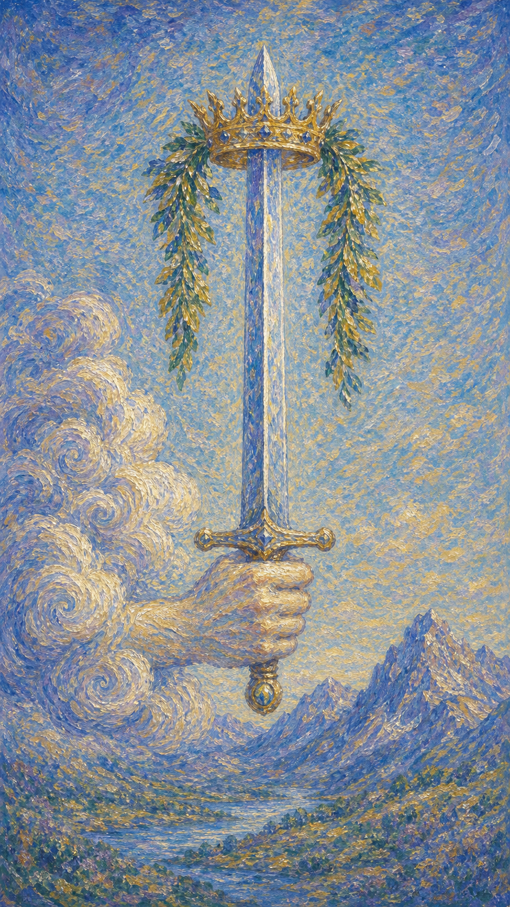

# 宝剑一

宝剑一像一柄从云中升起的利剑，剑尖挑着王冠与桂枝，把混沌的空气一刀划开，露出底下清明的真相。

这张牌出现时，思想正变得锋利。它可能是一个突然清晰的念头，一句说出口便不再含糊的话，也可能是你终于看穿某件事的本质。

宝剑一的风并不温柔。它带来的清醒常常伴随一点凉意，因为真相虽然解放人，却也要求人放下旧有的模糊与借口。

云中之手握住一柄直立的双刃剑，剑尖套着金色王冠，缠绕橄榄枝与棕榈叶。远方是嶙峋的山峰，象征思想的高度与真相的严峻。

## 基础要素

1. 牌名：宝剑一 (Ace of Swords)
2. 数字编号：50 号牌
3. 核心主题：真相、清晰、突破、心智之力
4. 元素：风
5. 星座或行星：风象能量 / 双子、天秤、水瓶
6. 希伯来字母：无固定传统对应
7. 代表意义：通过思想的觉醒进入新的认知周期

## 牌面要素

| 要素 | 含义 |
|------|------|
| 云中之手 | 心智机会的降临，像来自更高处的一道灵光。 |
| 双刃利剑 | 思考的双面性。它能斩断迷惑，也可能伤人伤己。 |
| 金色王冠 | 胜利、成就与心智的至高点。真相带来的加冕。 |
| 橄榄与棕榈 | 和平与胜利的并存，提醒清明应通向建设而非破坏。 |
| 嶙峋山峰 | 理性的高度，也是孤峭与考验。 |
| 直立姿态 | 决断、正直、毫不含糊的立场。 |

## 塔罗灵数

数字 1 代表起点、种子与纯粹潜能。来到宝剑组，它化作思想世界的第一道闪电。

宝剑一的 1 号能量不像水那样缓缓渗透，它更像黑暗中骤然亮起的光，让人瞬间看清原本看不清的东西。

这张牌的灵数提醒你，每一次真正的突破都从一个清晰的念头开始。当心智愿意正视真相，行动才有了正确的方向。

## 牌面解读重点

宝剑一正位，表示心智在"看清之后果断落刀"——潜意识已辨明真相，并愿意为它采取行动；宝剑一逆位，则是"凭着尚未厘清的念头就急于挥剑"，潜意识还在混乱里，判断便先一步出手。正逆位的差别，在于挥剑之前是否真正看清。它们共同的内核是：思想的力量已然升起，区别只在于这股锋利是用来开路，还是用来伤人。

## 正位牌意

**关键词**：清晰，真相，突破，决断，新想法，正义，心智之力

正位的宝剑一表示思想正在穿透迷雾。你可能突然想通某件事，找到关键答案，或鼓起勇气把一直含糊的话说清楚。

它带来一种被解放的清醒。混乱的局面忽然有了焦点，原本纠结的问题露出了核心，你知道该往哪里下刀。

但这把剑是双刃的。宝剑一提醒你，真相虽有力量，使用时仍需带着善意与分寸，否则锋利会变成伤害。

### 爱情/婚姻

感情中，宝剑一常表示一次坦诚的沟通、一个清晰的决定，或对关系真相的看见。你可能终于愿意说出心里话，把模糊的暧昧理清。

单身者可能突然看清自己真正想要什么，不再被一时的心动迷惑。理智回到位置，反而让缘分有了正确的轮廓。

有伴侣者可能经历一次直接而重要的对话。它或许尖锐，却能斩断长期的误会，让两人重新站在真相之上。

这张牌也提醒你，坦诚不等于冷酷。说真话时若能裹上温柔，剑才能成为开路的工具，而非划伤彼此的刃。

### 事业学业

事业学业上，宝剑一是思路打通、方案成形、抓住关键的时刻。你可能想到一个突破性的点子，或在复杂局面里找到清晰的切入口。

它适合做决定、签合约、提出主张、发表看法。你的逻辑此刻格外锐利，表达也更有说服力。

学习中，它代表理解上的豁然开朗，或在考试与论证中头脑清明。难懂的概念忽然连成一线。

这张牌建议你趁清醒果断行动。真相与灵感都有保鲜期，犹豫太久，锋芒会随空气慢慢钝去。

### 人际财富

人际方面，宝剑一可能表示一次直率的交流、一个被澄清的误会，或你在群体中清楚地表明立场。

你说话有分量，也容易成为厘清问题的人。但要留意，过于直接的言辞可能让人感到被冒犯。

财富方面，适合厘清账目、看清合约条款、做出理性的财务判断。被忽略的细节会在此刻显现。

它提醒你用清晰对待金钱。真相也许不总是好消息，但看清现状，永远比活在模糊里更安全。

### 健康生活

健康上，宝剑一与诊断明确、找到病因、思路清晰地面对身体状况有关。模糊的不适可能终于有了答案。

它也提醒你照顾心智健康。过度思虑会让头脑紧绷，适合用清晰的计划取代盘旋的焦虑。

请把这份清醒用在善待自己上。看清问题之后，温柔地行动，比一味苛责更能带来真正的康复。

### 其它牌意

若问具体事件，正位多表示真相浮现、问题被厘清、决定即将做出。事情正朝明朗的方向发展。

它也可能代表一次重要谈话、一份文件、一个突破口、一次正义的伸张。

作为建议，宝剑一说：请看清，然后果断。让你的剑划开迷雾，但记得，它存在的意义是开路，而非伤人。

### 情境指引

- **过去**：曾有一次想通或一句说破的话，为你劈开了某段迷雾，让你第一次看清了事情的核心。
- **现在**：你正处在思想锐利、真相浮现的时刻，适合厘清问题、做出决断、把含糊的话说清楚。
- **未来**：一个清晰的念头或一次坦诚的对话即将到来，为你打开新的认知与行动空间。
- **挑战**：如何在锋利与善意之间拿捏分寸，让真相成为开路的工具，而不是伤人的刃。
- **障碍**：迟疑不决、不敢说真话，或被旧有的模糊与借口拖住，让清醒之光迟迟无法落地。
- **环境**：周遭氛围鼓励直言与厘清，有人欣赏你的逻辑与坦率，真相在这里被允许出场。
- **支持**：清晰的头脑与诚实的勇气是你最大的后盾，身边也有重视事实、愿讲真话的人。
- **建议**：趁着头脑清明果断行动，把握真相与灵感的保鲜期，但出剑时记得裹上温柔。
- **优势**：思路敏锐、判断准确、表达有力，能一刀切中要害，在混乱中找到方向。
- **弱点**：可能过于直接而显得锋利，或因急于求真而忽略了他人的感受。
- **正面影响**：突破性的领悟、被厘清的局面，以及一次正义而果断的决定。
- **负面影响**：言语过于尖锐、真相用错了地方，可能在无意间划伤关系。
- **希望发生**：希望看清真相、做出正确决断，让混沌的局面终于有了清晰的焦点。
- **害怕发生**：害怕真相太过尖锐，或自己的果断变成了伤人的锋芒。
- **你如何看对方**：你觉得对方头脑清晰、坦诚直率，他/她的真诚与锐利让你信服。
- **对方如何看待你**：对方欣赏你思路的清明与表达的坦荡，视你为可以讲真话的人。
- **关系当前状态**：处在一个需要坦诚与澄清的阶段，真话虽利，却能斩断长久的误会。
- **关系未来发展**：预示一次重要而直接的沟通，让关系重新建立在真相与理解之上。
- **结果**：通常正面，真相浮现、决定做出、局面明朗，鼓励你带着善意去使用这份清醒。

## 逆位牌意

**关键词**：混乱，误解，思路不清，滥用力量，残酷，缺乏方向

逆位的宝剑一表示清晰被遮蔽。你可能思路混乱、信息不全、判断失准，或在该说真话时含糊其辞。

它也可能代表把锋利用错了地方——言语过于尖刻，逻辑沦为攻击的工具，真相被扭曲成伤人的借口。

逆位像一把举不稳的剑。力量仍在，却找不到正确的方向，挥动时容易划伤自己与他人。

### 爱情/婚姻

感情中，逆位宝剑一可能表示沟通失败、话说得太重，或因一时冲动说出难以收回的话。误会取代了理解。

单身者可能头脑混乱，分不清心动与执念，或被错误的信息误导对某人的判断。

有伴侣者可能陷入争辩，各执一词却无人愿意先放下剑。此时需要的不是更锋利的言语，而是先让空气安静下来。

这张牌提醒你，真相若用来攻击，就失去了它本来的光。先问问自己：你想要的是赢，还是被理解。

### 事业学业

事业学业上，逆位宝剑一表示思路卡顿、计划不清、决策草率，或被错误信息引向歧途。

你可能急于下结论，却忽略了关键细节；也可能空有想法，却迟迟无法落地成形。

学习中，它代表理解上的混乱、论证的漏洞，或考试时头脑一片空白。需要慢下来，重新梳理逻辑。

这张牌建议你先停下挥剑。在信息不全、心绪不宁时做的决定，往往要花更多力气去弥补。

### 人际财富

人际方面，逆位宝剑一可能代表口角、误传、言语伤人，或因表达不当而引发的隔阂。

你或他人可能把话说绝，让原本可以沟通的事变成对立。此时退一步，比争一句更有智慧。

财富方面，可能因判断失误、信息混乱或冲动决定而造成损失。合约里的模糊条款需格外当心。

它提醒你在混乱中暂缓出手。看不清的时候，不做决定本身就是一种保护。

### 健康生活

健康上，逆位宝剑一与思虑过度、精神紧张、诊断不明或信息让人焦虑有关。头脑像被太多声音占满。

它提醒你为心智松绑。过度分析会让人困在思绪的迷宫里，适合用休息、书写或倾诉为头脑腾出空间。

请对自己温柔些。不是每个问题都要立刻想清楚，有些答案需要先让心安静下来才会浮现。

### 其它牌意

若问具体事件，逆位多表示局面尚不明朗、信息混乱、判断容易出错。此时不宜仓促行动。

它也可能代表误会、争执、计划受阻、真相被掩盖，或力量被滥用。

作为建议，逆位宝剑一说：先收剑入鞘。等空气澄清、思绪归位，你自然会知道该在哪里落下那一刀。

### 情境指引

- **过去**：曾因思路混乱或信息不全而误判，或在该说真话时含糊其辞，留下了未解的结。
- **现在**：你可能正陷入头脑的迷雾，判断失准、沟通不畅，或把锋利用错了地方。
- **未来**：若不先厘清思绪，可能继续被误解、争执或错误信息牵着走，行动容易偏离。
- **挑战**：如何在心绪不宁时按住挥剑的冲动，先看清，再决定该往哪里下刀。
- **障碍**：信息混乱、情绪干扰、固执己见，让清晰的判断迟迟无法回到你手中。
- **环境**：周遭氛围嘈杂、说法不一，容易让人越听越乱，也可能有人用言语相互攻击。
- **支持**：你需要的是安静与梳理，而非更多的声音；可靠的事实与冷静的人能帮你归位。
- **建议**：先停下挥剑，等信息齐备、心绪平稳，再做决定；混乱中不出手本身就是保护。
- **优势**：一旦愿意慢下来重新梳理，你仍有把局面理清、找回方向的能力。
- **弱点**：容易急于下结论、言语过激，或在看不清时硬要行动，反而招致更多麻烦。
- **正面影响**：作为警示，提醒你别在混乱中乱挥剑，先收锋芒，再谈决断。
- **负面影响**：误解、争执、计划受阻、真相被掩盖，或力量被滥用而伤人伤己。
- **希望发生**：希望尽快拨开迷雾、看清真相，让混乱的局面重新有清晰的方向。
- **害怕发生**：害怕因判断失误或一句重话，造成难以收回的后果。
- **你如何看对方**：你可能觉得对方思路不清、言语伤人，或在该坦诚时含糊其辞。
- **对方如何看待你**：对方可能认为你过于尖锐、急躁，或在沟通中显得混乱难懂。
- **关系当前状态**：处在容易误会与争辩的紧绷期，需要的不是更利的言语，而是先让空气安静。
- **关系未来发展**：若任由误解与尖锐持续，关系会越缠越紧；先收剑、再沟通，才有转机。
- **结果**：可能是一段需要澄清与冷静的时期，待思绪归位后，方向自会重新清晰。
