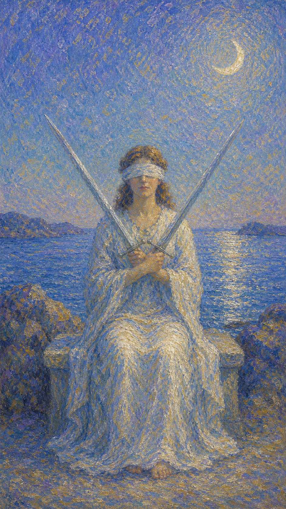

# 宝剑二

宝剑二是一位蒙眼的女子，双手交叉持着两柄剑，背后是平静却暗涌的海。她坐在两难之间，用沉默维持着一种脆弱的平衡。

这张牌出现时，你可能正站在一个不愿面对的抉择前。两个选项都有分量，于是你蒙起眼睛，用拖延换取暂时的安稳。

宝剑二的平衡并不轻松。它提醒你，逃避看见并不能让选择消失，迟早要摘下蒙眼布，让心与理智重新对话。

蒙眼女子端坐石凳，双臂交叉各持一剑，姿态僵持。身后是月光下的海面与礁石，象征被压抑的情绪与悬而未决的内心。

## 基础要素

1. 牌名：宝剑二 (Two of Swords)
2. 数字编号：51 号牌
3. 核心主题：抉择、僵持、平衡、回避
4. 元素：风
5. 星座或行星：月亮在天秤座
6. 希伯来字母：无固定传统对应
7. 代表意义：通过直面两难重新找回内在的清明

## 牌面要素

| 要素 | 含义 |
|------|------|
| 蒙眼女子 | 回避、不愿看见、用屏蔽换取暂时的安宁。 |
| 交叉双剑 | 两种对立的想法或选择，势均力敌地僵持着。 |
| 平静海面 | 表面的平稳，底下却是未被处理的情绪潮汐。 |
| 上弦月 | 直觉的微光，提醒答案其实藏在感受里。 |
| 石凳与礁石 | 防御姿态与内心的坚硬，让人暂时不被触碰。 |
| 白色长袍 | 维持中立的努力，也是一种悬置的纯净。 |

## 塔罗灵数

数字 2 代表二元、对应与关系。来到宝剑组，它化作两种念头的对峙，让人卡在中间动弹不得。

宝剑二的 2 号能量像一架停在半空的天平。两边重量相当，于是指针迟迟不肯落下，时间也仿佛被悬置。

这张牌的灵数提醒你，平衡若靠回避维持，便只是一种紧绷的静止。真正的平衡来自看见之后的选择，而非闭眼之后的拖延。

## 牌面解读重点

宝剑二正位，是"潜意识其实已有倾向，却选择蒙起眼、暂不承认"——心里隐隐知道答案，主观上却不愿看见，用拖延维持表面的平衡；宝剑二逆位，则是"蒙眼布被摘下，天平开始落下"，无论主动还是被推着，悬置的状态都在结束。正逆位的共同特点是：当事人面对的是一个不愿直视的两难，区别只在于他是继续闭眼，还是终于让心与理智重新对话。这张牌提醒人，规避某些话题与场合只是缓兵之计，老实面对内心，事情往往没有想象中严重。

## 正位牌意

**关键词**：抉择，僵持，犹豫，回避，权衡，暂时停滞，需要诚实

正位的宝剑二表示你正卡在一个难以决断的路口。两个选项各有理由，你不愿放弃任何一边，于是选择了暂时不选。

它带来一种紧绷的平静。表面看似稳定，内里却被悬而未决的压力撑着。蒙眼让你免于直视，却也让你看不清真正想要的方向。

宝剑二提醒你，回避只是延后，并非解决。当你准备好摘下蒙眼布，让理智与直觉重新对话，答案往往比想象中更清晰。

### 爱情/婚姻

感情中，宝剑二常表示僵持、冷战，或在两种关系、两个人之间难以取舍。你可能刻意回避某个话题，用沉默维持表面的平和。

单身者可能在心动与理智间犹豫，或迟迟不愿承认自己的真实感受。蒙眼让你暂时不必面对选择的代价。

有伴侣者可能正经历一段彼此回避的时期。问题被搁置，话被咽下，关系停在一种不上不下的悬空里。

这张牌提醒你，逃避对话不会让矛盾消失。当你愿意诚实地看见彼此，僵局才有松动的可能。

### 事业学业

事业学业上，宝剑二表示决策困难、左右为难，或在两个方案、两条路之间迟迟无法定夺。

你可能掌握的信息不全，也可能内心其实有倾向，却不敢承认。于是用拖延为自己争取喘息的空间。

学习中，它代表方向选择上的犹豫，或面对两个机会时的纠结。逃避决定，反而让焦虑持续累积。

这张牌建议你主动收集信息，并诚实面对内心。一旦看清，哪怕选择艰难，也好过永远停在原地。

### 人际财富

人际方面，宝剑二可能表示在两个人或两种立场间为难，或刻意保持中立以避免卷入冲突。

你可能不想得罪任何一方，于是选择沉默。但长期的回避，有时反而让误会越积越深。

财富方面，可能面临两个投资或消费选择的权衡，或因犹豫不决而错过时机。需要理性评估，而非一味拖延。

它提醒你，平衡不等于不动。在该表态时表态，在该决定时决定，才能真正守住自己的立场。

### 健康生活

健康上，宝剑二与压抑情绪、回避问题、身心紧绷有关。你可能假装一切都好，却把真实的疲惫藏在心底。

它提醒你，被屏蔽的感受不会消失，只会在身体里累积。适合用安静的方式，让自己重新感受真实的状态。

请试着摘下心里的蒙眼布。看见疲惫并不可怕，可怕的是长期假装它不存在。

### 其它牌意

若问具体事件，正位多表示事情陷入僵持、决定被搁置、局面停滞不前。需要主动打破平衡。

它也可能代表冷战、回避、中立、悬而未决，或一个被刻意忽略的真相。

作为建议，宝剑二说：请鼓起勇气看见。摘下蒙眼布的那一刻或许刺眼，却是走出僵局的第一步。

### 情境指引

- **过去**：曾面对一个难以取舍的抉择，你选择了暂时回避，用沉默把决定悬置了起来。
- **现在**：你正卡在两难的路口，蒙着眼维持脆弱的平衡，不愿直视真正想要的方向。
- **未来**：迟早要摘下蒙眼布，让心与理智重新对话，那时答案会比想象中更清晰。
- **挑战**：如何鼓起勇气直面选择，而不是用拖延换取表面的安稳。
- **障碍**：恐惧、犹豫与不愿承担选择的代价，让你迟迟停在原地动弹不得。
- **环境**：周遭可能要求你表态或决断，但氛围也容易让你想躲进中立与沉默里。
- **支持**：你内在的直觉其实早有倾向，安静下来倾听，它会为你指出方向。
- **建议**：主动收集信息、诚实面对内心，哪怕选择艰难，也好过永远闭眼拖延。
- **优势**：懂得权衡、不轻率，能在对立中保持冷静，看清两边的分量。
- **弱点**：容易回避、拖延，用屏蔽真相来换取暂时的平静，反而让压力累积。
- **正面影响**：经由诚实的权衡，最终做出让自己心安的选择，重获内在的清明。
- **负面影响**：长期回避让僵局僵化，被压抑的情绪在底下越积越多。
- **希望发生**：希望僵局能被打破，让自己从两难的紧绷中解脱出来。
- **害怕发生**：害怕做出错误的选择，或承担决定之后必须面对的代价。
- **你如何看对方**：你可能看不清对方的真实想法，彼此都隔着一层未说破的沉默。
- **对方如何看待你**：对方可能觉得你犹疑不定、难以捉摸，不知你究竟想要什么。
- **关系当前状态**：处在僵持或冷战的悬空里，话被咽下，问题被搁置，谁都不愿先开口。
- **关系未来发展**：唯有摘下蒙眼布、坦诚相对，僵局才有松动、关系才有流动的可能。
- **结果**：取决于你是否愿意看见——闭眼只会延长停滞，睁眼才能走出原地打转的循环。

## 逆位牌意

**关键词**：打破僵局，做出决定，真相浮现，信息明朗，或持续逃避

逆位的宝剑二有两种走向。积极时，它表示僵局开始松动，你终于摘下蒙眼布，看清局面并做出决定。

消极时，它可能表示信息混乱、左右为难加剧，或长期回避后情绪终于失控。被压抑的潮水开始漫过堤岸。

逆位像一只慢慢落下的天平。无论结果如何，悬置的状态正在结束，你不得不重新面对那两柄交叉的剑。

### 爱情/婚姻

感情中，逆位宝剑二可能表示僵持被打破，你终于愿意坦诚，或在两难中做出了选择。沉默被打破，话开始流动。

单身者可能看清自己真正的心意，不再被犹豫困住。也可能相反，陷入更深的纠结，难以抽身。

有伴侣者可能迎来一次迟来的对话。压抑已久的情绪浮出水面，关系或因此澄清，或因此动荡。

这张牌提醒你，真相浮现时难免有阵痛，但唯有看见，才能让关系走出原地打转的循环。

### 事业学业

事业学业上，逆位宝剑二表示决定终于做出，或被外力推着不得不选。也可能是信息混乱让判断更难。

你可能在拖延许久后被迫行动，也可能终于厘清思路，看清哪条路更适合自己。

学习中，它代表走出选择困难，或在压力下仓促决定。建议尽量在信息清晰时再落子。

这张牌建议你，若已看清就果断行动；若仍混乱，则先稳住心绪，别让焦虑替你做决定。

### 人际财富

人际方面，逆位宝剑二可能代表表明立场、结束中立，或因长期回避导致矛盾爆发。

你可能终于说出搁置已久的话，让关系重新流动。也要留意，积压的情绪一旦释放，需要彼此的耐心去承接。

财富方面，可能终于做出财务决定，或因之前的犹豫付出代价。建议复盘得失，把经验变成下一次的清醒。

它提醒你，逃避的账迟早要还。越早面对，代价往往越小。

### 健康生活

健康上，逆位宝剑二表示压抑的情绪开始释放，或长期回避的问题终于显现。身体在提醒你不能再假装。

它适合直面被搁置的健康议题，寻求帮助，让积压的紧绷有出口。看见，是疗愈的开始。

请温柔地接住浮现的情绪。它们不是来惩罚你的，而是来提醒你：是时候好好照顾自己了。

### 其它牌意

若问具体事件，逆位多表示僵局松动、决定将出、真相浮现，或回避带来的后果开始显现。

它也可能代表打破冷战、信息明朗、做出选择，或情绪的一次释放。

作为建议，逆位宝剑二说：天平正在落下。无论你是主动选择还是被推着前行，请相信，看清之后总好过永远蒙着眼。

### 情境指引

- **过去**：曾长期回避某个抉择，被压抑的情绪与悬置的问题，如今开始浮出水面。
- **现在**：僵局正在松动，蒙眼布被摘下，你不得不重新面对那两柄交叉的剑。
- **未来**：决定终将做出，或被外力推着落子；悬置的状态正在结束，真相即将明朗。
- **挑战**：如何在情绪浮现时稳住心绪，让选择基于清醒，而非被压抑后的失控。
- **障碍**：积压已久的情绪、混乱的信息，可能让本就艰难的判断变得更难。
- **环境**：外在的压力或他人的推动，正迫使你结束中立、表明立场。
- **支持**：一旦愿意看清，理智与直觉会重新合作，帮你接住浮现的真相。
- **建议**：若已看清就果断行动；若仍混乱，先稳住情绪，别让焦虑替你做决定。
- **优势**：终于愿意直面，意味着你有机会走出停滞，重新拿回选择的主动权。
- **弱点**：可能在压力下仓促决定，或因长期回避而让情绪一次性决堤。
- **正面影响**：僵局被打破、真相浮现，让搁置已久的事终于有了流动的出口。
- **负面影响**：若只是被迫面对而未真正想清，决定容易草率，情绪也容易失控。
- **希望发生**：希望终于做出决定、走出两难，让悬而未决的压力得到释放。
- **害怕发生**：害怕真相浮现带来的阵痛，或仓促的选择留下难以收拾的后果。
- **你如何看对方**：你可能开始看清对方的真实态度，过去的模糊正逐渐变得清晰。
- **对方如何看待你**：对方可能感到你终于松动、愿意表态，也可能被你释放的情绪触动。
- **关系当前状态**：冷战或回避正被打破，压抑已久的话开始流动，关系或澄清或动荡。
- **关系未来发展**：迟来的对话会让关系重新流动，但需要双方的耐心去承接浮现的情绪。
- **结果**：无论主动还是被动，悬置都在结束；看清之后的选择，终究好过永远蒙着眼。
