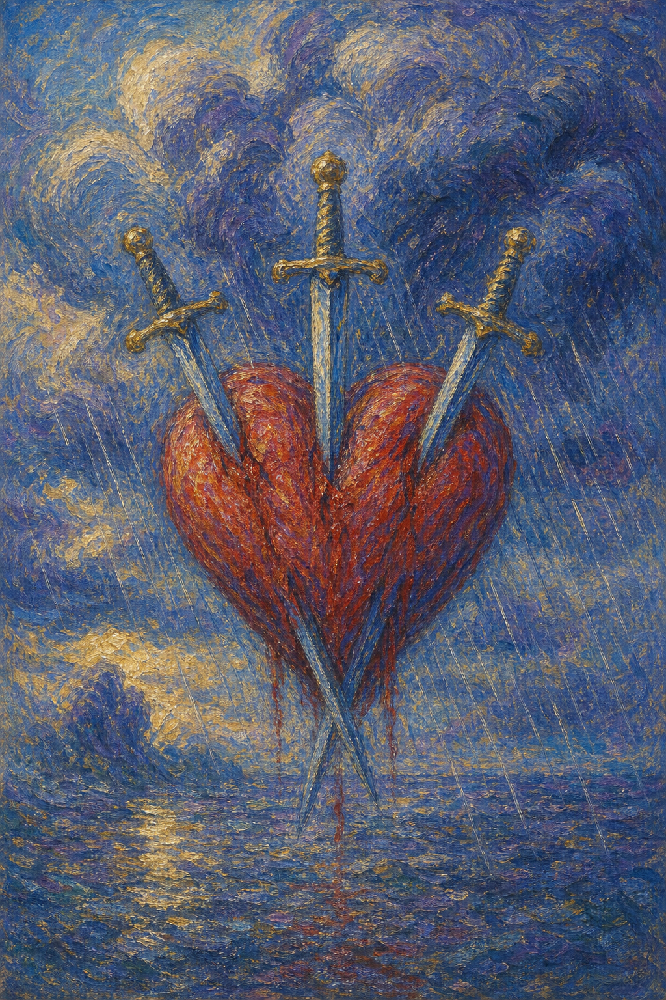

# 宝剑三

宝剑三是一颗被三柄剑贯穿的红心，背景是灰色的云与连绵的雨。它不加掩饰地呈现痛——心碎的那一刻，没有谁能假装不疼。

这张牌出现时，悲伤是真实的。它可能是分离、背叛、失望、被言语刺伤，也可能是某个真相一旦说破，便再也无法回到从前。

宝剑三并不回避痛楚。它让剑明明白白地穿过心，是因为唯有承认伤口的存在，雨才会有停下的一天。

三柄长剑交叉刺穿一颗鲜红的心，背景是阴沉的天空与垂落的雨幕。画面直白地描绘心碎、悲伤与被刺痛的真相。

## 基础要素

1. 牌名：宝剑三 (Three of Swords)
2. 数字编号：52 号牌
3. 核心主题：心碎、悲伤、背叛、痛苦的真相
4. 元素：风
5. 星座或行星：土星在天秤座
6. 希伯来字母：无固定传统对应
7. 代表意义：通过直面伤痛让情绪获得释放与疗愈

## 牌面要素

| 要素 | 含义 |
|------|------|
| 鲜红的心 | 情感的核心，最柔软也最容易受伤的部分。 |
| 三柄长剑 | 言语、思想或事实带来的三重刺痛，往往与误会、争执、真相有关。 |
| 灰色乌云 | 笼罩心头的悲伤与低落，让世界暂时失去色彩。 |
| 垂落雨幕 | 眼泪与情绪的释放，痛苦正在流出而非积压。 |
| 交叉的剑 | 多个因素的叠加，痛常常不是单一原因造成。 |
| 裸露的姿态 | 毫无遮掩的伤口，提醒人无需假装坚强。 |

## 塔罗灵数

数字 3 代表生成、表达与结果。来到宝剑组，它化作思想交锋后留下的伤痕，把抽象的痛具体地呈现出来。

宝剑三的 3 号能量像一场说破之后的雨。话已出口，事已成真，于是云层裂开，把积压的水全部倾下。

这张牌的灵数提醒你，痛苦虽然尖锐，却也是一种释放。雨落下来，是为了让被乌云压住的天空，重新有机会放晴。

## 牌面解读重点

宝剑三正位，是"潜意识终于承认痛已发生，并允许它被看见"——心碎的真相被直视，眼泪得以流出，悲伤因此有了转化为成长的可能；宝剑三逆位，则是"潜意识想绕开痛、把伤口压回暗处"，或相反地反复沉溺旧伤、迟迟不肯让剑拔出。正逆位的共同特点是：伤痛真实存在，区别只在于你是让它流过、还是把它困住。这张牌一再提醒人，悲伤是人人必经的功课，坦然接受它，它便会化作你成长的气力；唯有承认伤口，雨才会有停下的一天。

## 正位牌意

**关键词**：心碎，悲伤，背叛，失望，痛苦的真相，分离，眼泪

正位的宝剑三表示心正在经历一次明确的疼痛。它可能来自分离、背叛、被拒绝、被误解，或一个不得不接受的残酷事实。

它不要求你坚强。塔罗在这里直白地画出穿心的剑，正是允许你承认：这件事真的很痛，你有权为它流泪。

但雨终究会停。宝剑三提醒你，痛苦被看见、被表达之后，乌云才会慢慢散去。压抑只会让伤口在暗处发炎。

### 爱情/婚姻

感情中，宝剑三常与分手、背叛、争吵、失望、第三者或伤人的话语有关。心被某个真相刺穿，疼得清晰而具体。

单身者可能正在经历旧情的余痛，或因被拒绝而心灰。这份痛需要被承认，而非匆忙掩埋。

有伴侣者可能经历一次伤人的冲突，或发现某个令人难过的事实。关系的裂缝被照亮，让人无处躲藏。

这张牌提醒你，允许自己悲伤，是疗愈的前提。把眼泪流出来，比强撑着微笑更接近康复。

### 事业学业

事业学业上，宝剑三可能表示失败、被否定、批评带来的打击，或团队中的冲突与背叛。

你可能因一次落选、一句重话或一个残酷的结果而受伤。这份失落是真实的，不必假装毫不在意。

学习中，它代表成绩的打击、被否定的努力，或合作中的失望。痛过之后，仍要把经验从伤口里捡回来。

这张牌建议你先处理情绪，再处理问题。带着未消化的痛去硬撑，往往让人做出更糟的决定。

### 人际财富

人际方面，宝剑三可能表示友情破裂、信任被辜负、被言语中伤，或一段关系的痛苦决裂。

你可能感到被背叛或被误解，心里像扎了刺。承认受伤，是把刺取出来的第一步。

财富方面，可能因损失、纠纷或失误而心痛，或因金钱牵动了感情的伤。痛苦提醒你某处需要重新调整。

它提醒你，痛是为了让你看见在乎什么。看清之后，你才知道该如何守护那颗心。

### 健康生活

健康上，宝剑三与情绪性的痛、心口郁结、失眠、压力引发的身体不适有关。心理的伤常会在身体上留下回响。

它提醒你认真对待悲伤。压抑的情绪需要出口，适合倾诉、书写、哭泣，或寻求专业的心理支持。

请温柔地对待正在受伤的自己。你不需要立刻好起来，只需要不在痛里独自硬撑。

### 其它牌意

若问具体事件，正位多表示伤心的消息、痛苦的真相、关系或计划的破裂。事情里确有让人难过的部分。

它也可能代表手术、分离、争执、被批评，或一次必要却痛苦的告别。

作为建议，宝剑三说：请允许自己痛。承认伤口，让雨落下，乌云才有散开、阳光才有重回的那一天。

### 情境指引

- **过去**：曾经历一次明确的心碎——分离、背叛或失望，那道伤至今仍在心里留有回响。
- **现在**：你正处在悲伤的雨季，某个真相刺穿了心，疼得清晰而具体，无处躲藏。
- **未来**：痛苦被看见、被表达之后，乌云会慢慢散去，疗愈正在伤口被承认之处悄悄开始。
- **挑战**：如何允许自己悲伤，而不是强撑微笑、把眼泪与伤口一并藏进暗处。
- **障碍**：逃避痛苦、压抑情绪，或反复回望旧伤，让伤口在暗处迟迟无法愈合。
- **环境**：周遭可能弥漫着低落与失落的气氛，或有某件伤人的事正笼罩着你。
- **支持**：愿意倾听的人、可以流泪的空间，以及你自己承认痛的勇气，都是疗愈的依托。
- **建议**：先处理情绪，再处理问题；把眼泪流出来，比硬撑着假装不疼更接近康复。
- **优势**：你愿意直面伤痛、不加掩饰，这份诚实正是让悲伤转化为成长的起点。
- **弱点**：容易陷入痛中无法自拔，或把伤害放大，让悲伤占据了全部的视野。
- **正面影响**：经由承认与释放，痛苦得以流过，心在雨后重新有了放晴的可能。
- **负面影响**：若压抑或沉溺，伤口会在暗处发炎，让低落的情绪久久不散。
- **希望发生**：希望伤痛能被看见、被疗愈，让自己从心碎中慢慢恢复过来。
- **害怕发生**：害怕痛苦无法停止，或这道伤会永远改变自己对感情与人的信任。
- **你如何看对方**：你可能感到被对方所伤，心里像扎了刺，难过中夹杂着失望。
- **对方如何看待你**：对方或许也感受到了这份痛，关系的裂缝被照亮，让彼此都无处躲藏。
- **关系当前状态**：处在心碎或冲突之后的低谷，伤已造成，痛正真实地横在两人之间。
- **关系未来发展**：唯有让痛被表达、被理解，关系才有机会从伤口里慢慢愈合或体面告别。
- **结果**：是一段必经的悲伤功课，痛过之后，那道痕迹终将成为你更懂得温柔的证明。

## 逆位牌意

**关键词**：疗愈，释放痛苦，原谅，走出心碎，或压抑悲伤

逆位的宝剑三有两种走向。积极时，它表示伤口开始愈合，你逐渐从心碎中恢复，愿意原谅、放下、重新让心柔软。

消极时，它可能表示拒绝面对痛苦，把悲伤强行压下，或反复沉溺在旧伤里无法走出。剑插得更深，雨却下不出来。

逆位像一颗正在拔出剑的心。无论是慢慢痊愈，还是迟迟不肯松手，关键都在于你是否愿意让痛真正流过。

### 爱情/婚姻

感情中，逆位宝剑三可能表示从心碎中恢复，伤口慢慢结痂，你重新愿意相信感情。也可能是仍困在旧痛里走不出来。

单身者可能终于放下某段旧情，或相反，仍在反复回想那道伤，难以迎接新的人。

有伴侣者可能从一次冲突中和解、疗愈，重新建立信任。也要留意，若只是把矛盾压下，痛会再次浮现。

这张牌提醒你，原谅首先是放过自己。把心从反复回望的痛里带回来，比强迫自己遗忘更重要。

### 事业学业

事业学业上，逆位宝剑三表示从挫败中恢复，开始疗愈被打击的信心，或重新整理受伤后的思绪。

你可能逐渐接受某个结果，不再让一次失败定义自己。也可能仍困在自责里，需要刻意把注意力转向前方。

学习中，它代表从打击中重新振作，或仍被旧的失败阴影笼罩。建议把经验留下，把痛慢慢放下。

这张牌建议你给恢复一点时间。疗愈不是一蹴而就，但只要方向对了，痛会一天天变轻。

### 人际财富

人际方面，逆位宝剑三可能代表和解、放下怨怼、重建信任，或终于从一段伤人的关系中抽身。

你开始愿意原谅，或至少不再让旧的伤决定你今天的心情。这是一种悄悄发生的释怀。

财富方面，可能从损失中慢慢恢复，开始补救与重整。虽不能回到从前，但局面正向可承受的方向移动。

它提醒你，放下不代表否认伤害。真正的释怀，是带着伤痕仍愿意继续向前。

### 健康生活

健康上，逆位宝剑三表示情绪疗愈正在发生，或提醒你别再压抑悲伤。被忽略的痛，需要被温柔地看见。

它适合继续心理调适、规律作息与温和的自我照顾。每一点小小的恢复，都值得被肯定。

请相信痛会过去。当你愿意让眼泪流过、让心慢慢松开，疗愈就已经在悄悄发生。

### 其它牌意

若问具体事件，逆位多表示伤痛开始平复、局面转向疗愈，或提醒你别让旧伤继续掌控当下。

它也可能代表原谅、和解、恢复、释放，或一次迟来的情绪整理。

作为建议，逆位宝剑三说：让剑慢慢拔出来。痛过的地方会留下痕迹，但那痕迹终将成为你更懂得温柔的证明。

### 情境指引

- **过去**：曾深深受过伤，那道心碎或是正在慢慢结痂，或是仍被你反复回望、不肯松手。
- **现在**：你或在从痛中恢复、重新让心柔软，或仍困在旧伤里走不出来、剑插得更深。
- **未来**：若愿意让痛真正流过，伤口会一天天变轻；若强行压下，痛会以别的方式再次浮现。
- **挑战**：如何在原谅与放下中疗愈自己，而不是把悲伤强压回去或沉溺其中。
- **障碍**：拒绝面对痛苦、反复舔舐旧伤，或假装已经好了，让疗愈停在表面。
- **环境**：周遭或许正提供和解与恢复的契机，也可能仍有未了的旧怨牵动着你。
- **支持**：倾诉、书写、专业的心理支持，以及你愿意放过自己的那份善意，都在帮你恢复。
- **建议**：给恢复一点时间，原谅首先是放过自己；把心从反复回望的痛里带回来。
- **优势**：你正朝疗愈的方向移动，愿意结痂、愿意重新相信，这份韧性会带你走出心碎。
- **弱点**：可能只是把矛盾压下而非真正化解，或迟迟不肯放手，让旧伤继续掌控当下。
- **正面影响**：伤口逐渐愈合，你重新愿意让心柔软，带着伤痕仍能继续向前。
- **负面影响**：若压抑或沉溺，痛会反复浮现，让人困在旧伤的循环里无法翻篇。
- **希望发生**：希望彻底走出心碎、重获平静，让那道伤不再决定今天的心情。
- **害怕发生**：害怕伤痛卷土重来，或自己始终无法真正放下、无法重新相信。
- **你如何看对方**：你或许正学着原谅对方，或仍对那道旧伤心存芥蒂、难以释怀。
- **对方如何看待你**：对方可能感到你正在恢复、愿意和解，也可能察觉你仍困在过去的痛里。
- **关系当前状态**：处在伤后的修复期，或在慢慢和解重建信任，或仍被未解的旧痛牵绊。
- **关系未来发展**：真正的释怀需要让痛被看见而非压下，唯有如此，关系才能走出原地打转。
- **结果**：是一段疗愈与放下的过程，剑慢慢拔出之后，痕迹会化作你更懂温柔的印记。
