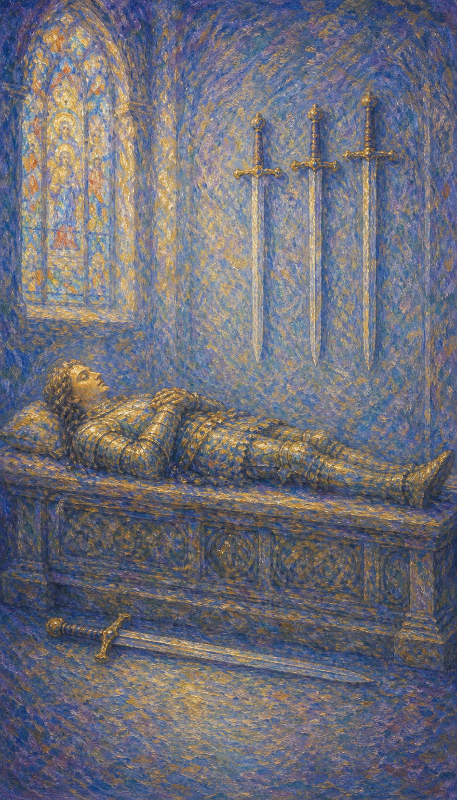

# 宝剑四

宝剑四是一位平躺在石棺上的骑士，双手合十如祈祷，三柄剑悬于墙上，一柄卧于身下。他没有死去，只是在沉睡中休养，让疲惫的身心暂时退出战场。

这张牌出现时，你需要停下来。它可能是一段强制的休息，一次主动的退隐，也可能是大病或激战之后，身体与心灵都在呼唤静养。

宝剑四的安静并不消极。它提醒你，休息不是逃避，而是为了让耗尽的力量重新蓄满，让混乱的思绪在沉默中归位。

骑士雕像般平躺于石棺之上，双手合十安息，三柄剑悬挂墙面，一柄卧于身下。彩绘玻璃窗洒下柔光，象征静养、沉淀与内在的修复。

## 基础要素

1. 牌名：宝剑四 (Four of Swords)
2. 数字编号：53 号牌
3. 核心主题：休息、静养、退隐、恢复
4. 元素：风
5. 星座或行星：木星在天秤座
6. 希伯来字母：无固定传统对应
7. 代表意义：通过暂停与沉淀让身心重新积蓄力量

## 牌面要素

| 要素 | 含义 |
|------|------|
| 平躺骑士 | 主动或被动的休息，从战斗中暂时撤离。 |
| 合十双手 | 祈祷、内省、与自我的安静对话。 |
| 墙上三剑 | 暂被搁置的烦恼与思虑，悬而不用。 |
| 身下一剑 | 仍可调用的力量，休息并非缴械。 |
| 彩绘玻璃 | 灵性的庇护与柔和的光，提示静养中的疗愈。 |
| 石棺造型 | 象征性的"死亡"——旧状态的暂停，而非终结。 |

## 塔罗灵数

数字 4 代表稳定、结构与停驻。来到宝剑组，它化作思绪的暂歇，让奔忙的头脑终于有机会安静下来。

宝剑四的 4 号能量像一间安静的密室。外面的战事仍在，但门一关上，时间就慢了下来，让人得以喘息。

这张牌的灵数提醒你，停下不是软弱。一张拉得太满的弓会断，唯有适时松弦，才能在下一次射出更远的箭。

## 牌面解读重点

宝剑四正位，是"潜意识知道自己已经累了，主动选择停下来积蓄精力"——它并非全然无为，而是在休息中沉淀、计划下一步，等预备完毕便随时一跃而起；宝剑四逆位，则是"潜意识仍想硬撑、不肯停",或相反地被透支后被迫强制停下。正逆位的共同特点是：身心都到了需要休整的时刻，区别只在于你是顺势静养、还是逆着身体硬扛。这张牌的核心牌义，正是"休息是为了更好的工作"——它代表一段隐退及沉思熟虑的时期，暂停手头事物，是为了让耗尽的力量重新蓄满。

## 正位牌意

**关键词**：休息，静养，恢复，退隐，沉淀，内省，蓄力

正位的宝剑四表示你需要、或正在经历一段休整期。前段时间的劳累、压力或冲突，让身心都到了该停下来的时刻。

它带来一种被允许的安静。你不必继续硬撑，可以暂时放下手中的剑，让自己在沉默里慢慢恢复。

宝剑四提醒你，休息是为了走得更远。把这段静养当作一次蓄力，而非停滞。当你重新出发时，会比强撑时更有力量。

### 爱情/婚姻

感情中，宝剑四常表示关系需要一段冷静、缓和的时期。不是分离，而是彼此给空间，让紧绷的情绪沉淀下来。

单身者适合暂时把寻爱放一放，先照顾好自己。把心养好，缘分来时才有余力去接住。

有伴侣者可能经历一段平静甚至略显疏离的时光。这未必是坏事，适当的留白能让两人都缓口气，重新积蓄温柔。

这张牌提醒你，关系也需要休息。在疲惫时强求亲密，反而容易擦枪走火；先各自安顿，再重新靠近。

### 事业学业

事业学业上，宝剑四表示需要暂停、调整与恢复。你可能太久没有休息，思路开始迟钝，效率不如从前。

它适合放慢节奏、整理思绪、把搁置的事先搁置。强行推进只会让疲惫累积，不如先给头脑放个假。

学习中，它代表需要适度休息，避免用力过猛导致 burnout。短暂的停顿，往往换来更清醒的下一步。

这张牌建议你正视疲惫。退一步不是退缩，而是为了在恢复后，能更稳、更准地重新投入。

### 人际财富

人际方面，宝剑四可能表示需要从社交中暂时抽身，给自己独处的空间。过度的人际消耗，需要安静来平衡。

你可能想减少应酬、暂别喧嚣，专注于自我修复。这是健康的边界，而非冷漠。

财富方面，适合暂缓大动作，先观望、休整、整理现状，而非急于出手。沉淀期里，稳比快更重要。

它提醒你，停下来盘点也是一种经营。在安静中看清局面，往往比盲目行动更有价值。

### 健康生活

健康上，宝剑四是非常直接的"休息"信号。它常与康复期、需要静养、身心俱疲后的恢复有关。

身体在请求你慢下来。无论是充足睡眠、减少刺激，还是病后调养，此刻最重要的就是给自己时间复原。

请把休息当成正事。你不是机器，适时停机维护，才能避免更严重的耗损。

### 其它牌意

若问具体事件，正位多表示事情进入暂停、缓冲或休整阶段。此时宜静不宜动，等待时机成熟。

它也可能代表请假、疗养、闭关、冥想，或一次必要的抽离与沉淀。

作为建议，宝剑四说：请安心地休息。把剑暂时挂上墙，让自己睡一觉。养足了精神，战场永远等得起你。

### 情境指引

- **过去**：曾经历一段劳累、压力或冲突，让身心都到了不得不停下来喘息的时刻。
- **现在**：你正处在或需要进入一段休整期，把剑暂挂墙上，让自己在沉默里慢慢恢复。
- **未来**：这段静养会让你重新蓄满力量，待预备完毕，便能更稳、更准地重返战场。
- **挑战**：如何把休息当成正事，允许自己暂停，而不是把停下误认作软弱或落后。
- **障碍**：放不下手头的事、焦虑于停滞，或觉得休息就是浪费时间，让你迟迟不肯松弦。
- **环境**：周遭氛围允许你慢下来，或正以某种方式（如病后、激战之后）要求你静养。
- **支持**：安静的空间、充足的睡眠，以及愿意给你留白的人，都是这段恢复期的依托。
- **建议**：把这段静养当作蓄力而非停滞，先给头脑放个假，恢复后再果断出发。
- **优势**：懂得适时退场、内省沉淀，让你能在下一次出击时比硬撑时更有力量。
- **弱点**：可能因休息太久而陷入消极，或把暂停变成逃避，迟迟不愿重返行动。
- **正面影响**：经由充分的休整，身心重新积蓄能量，思绪也在沉默中归位、变得清明。
- **负面影响**：若该动时仍不动，蓄力会滑向停滞，让原本的暂停变成原地的搁浅。
- **希望发生**：希望好好休息、彻底恢复，让疲惫的身心重新回到轻盈有力的状态。
- **害怕发生**：害怕一旦停下就跟不上，或休息太久错过了该把握的时机。
- **你如何看对方**：你可能希望与对方保持一段平静的距离，让彼此都能喘口气、缓一缓。
- **对方如何看待你**：对方可能感到你暂时退到了一旁，需要空间，而非冷淡或疏远。
- **关系当前状态**：处在一段平静甚至略显疏离的留白期，紧绷的情绪正在慢慢沉淀。
- **关系未来发展**：适当的留白会让两人重新积蓄温柔，待养足精神后再靠近，反而更稳。
- **结果**：是一段必要的休整与沉淀，养足精神之后，你会带着更充足的力量重新出发。

## 逆位牌意

**关键词**：重新行动，恢复结束，倦怠累积，被迫休息，或拒绝休息

逆位的宝剑四有两种走向。积极时，它表示休整结束，你重新积蓄了力量，准备回到生活的战场，重新拿起剑。

消极时，它可能表示该休息却不肯停，倦怠不断累积，或长期透支后被迫强制停下。绷紧的弦终于到了极限。

逆位像一个正在苏醒的人。无论是精神焕发地起身，还是被疲惫硬生生按倒，关键都在于你是否听见了身体的提醒。

### 爱情/婚姻

感情中，逆位宝剑四可能表示冷静期结束，关系重新升温，两人准备好再次靠近。也可能是该停却停不下来的消耗。

单身者可能重新有了寻爱的精力，或相反，仍在硬撑着不肯照顾自己疲惫的心。

有伴侣者可能结束一段疏离，重新投入关系。也要留意，若总是没有喘息地纠缠，关系会被慢慢耗空。

这张牌提醒你，亲密需要节奏。该靠近时靠近，该留白时留白，才能让爱长久不竭。

### 事业学业

事业学业上，逆位宝剑四表示重新投入工作，恢复行动力。也可能是警告：你已透支太久，再不休息就会出问题。

你可能终于结束停滞，重新发力；也可能在该停下时仍咬牙硬撑，让效率与健康一起下滑。

学习中，它代表重返书桌，或提醒你别再用熬夜硬扛。真正的勤奋，懂得在何时给大脑充电。

这张牌建议你诚实评估状态。若已恢复，就果断出发；若仍疲惫，就别用意志力透支身体。

### 人际财富

人际方面，逆位宝剑四可能代表重新回到社交，或提醒你别因过度独处而与人疏远。平衡是关键。

你可能准备好重新连接他人，或仍需要一点独处来恢复。听从内心真实的节奏，而非外界的催促。

财富方面，可能结束观望、重新行动，或提醒你别因迟迟不动而错过时机。休整够了，就该出手。

它提醒你，休息有期限。养精蓄锐之后，仍要回到经营与行动中，才不辜负那段沉淀。

### 健康生活

健康上，逆位宝剑四表示身体逐渐康复，精力回归。也可能是严重警告：长期忽视休息，健康正亮起红灯。

它提醒你别再硬撑。如果身体已经疲惫到极点，请务必停下，必要时寻求帮助，别等崩溃才肯休息。

请把这当作温柔的提醒。恢复中的你值得被善待，疲惫中的你更需要被听见。

### 其它牌意

若问具体事件，逆位多表示停滞结束、重新启动，或提醒你该休息却迟迟未停，需当心透支。

它也可能代表复工、重返、苏醒，或一次被迫的强制停机。

作为建议，逆位宝剑四说：请听身体的话。若已养足，就勇敢起身；若仍透支，就别再逞强，停下来才是真正的负责。

### 情境指引

- **过去**：曾有一段休整或停滞，或是养足了力气，或是该停时仍咬牙硬撑、透支至今。
- **现在**：你或正重新积蓄力量、准备回到战场，或仍在该休息时硬扛，倦怠不断累积。
- **未来**：若已恢复，将精神焕发地重新出发；若仍透支，身体迟早会以警讯逼你停下。
- **挑战**：如何诚实评估状态，分清自己是真的养足了，还是在用意志力硬撑。
- **障碍**：不肯听身体的提醒、迟迟不肯停，或相反地恢复后仍赖在停滞里不愿起身。
- **环境**：周遭或在催促你重新投入，或仍在不断消耗你，让喘息的空间被一再压缩。
- **支持**：身体真实的信号、愿意提醒你的人，以及必要时的求助，都是你的依托。
- **建议**：若已养足就果断起身，若仍疲惫就别再逞强；停下来，有时才是真正的负责。
- **优势**：一旦愿意倾听身体，你既能及时复出，也能避免硬撑到崩溃的透支。
- **弱点**：容易在该停时硬扛，或在该动时拖延，让效率与健康一起下滑。
- **正面影响**：休整结束、力量回归，你带着焕然一新的精神重新投入生活。
- **负面影响**：长期忽视休息，倦怠与透支不断累积，健康亮起红灯。
- **希望发生**：希望尽快恢复精力、重返行动，或终于能名正言顺地停下来好好休息。
- **害怕发生**：害怕休息不够就被迫复出，或硬撑太久让身体彻底垮掉。
- **你如何看对方**：你可能希望结束疏离、重新靠近，或仍在与对方的纠缠中感到疲惫。
- **对方如何看待你**：对方可能感到你正重新投入，或察觉你早已透支、却仍不肯停下。
- **关系当前状态**：处在冷静期的尾声或一段无喘息的消耗中，节奏的失衡正在显现。
- **关系未来发展**：亲密需要张弛有度，该靠近时靠近、该留白时留白，才能让爱长久不竭。
- **结果**：取决于你是否听见身体的提醒——养足则重新有力，硬撑则迟早被迫停下。
