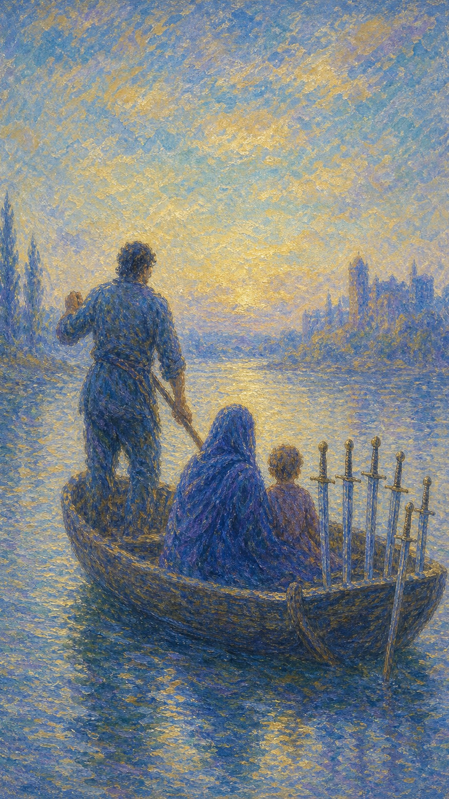

# 宝剑六

宝剑六是一叶载着母子的小舟，由船夫撑篙，驶向远处平静的岸。船头插着六柄剑，水面一侧波涛、一侧安宁，像一段正在被穿越的过渡。

这张牌出现时，你正从动荡驶向平静。它可能是一次搬迁、一段疗愈的旅程，也可能是从痛苦的处境里慢慢离开，向着更安稳的彼岸前行。

宝剑六的离开并不喧哗。它带着一点不舍与疲惫，却也带着希望——剑虽随行，水面已渐趋平缓，最艰难的部分正在身后退去。

船夫撑篙载着裹紧斗篷的母子缓缓前行，船头竖立六柄宝剑，近处水面湍急、远处归于平静。画面象征过渡、迁移与从困境驶向疗愈的旅程。

## 基础要素

1. 牌名：宝剑六 (Six of Swords)
2. 数字编号：55 号牌
3. 核心主题：过渡、迁移、远离困境、平复
4. 元素：风
5. 星座或行星：水星在水瓶座
6. 希伯来字母：无固定传统对应
7. 代表意义：通过离开旧的动荡走向逐渐安稳的彼岸

## 牌面要素

| 要素 | 含义 |
|------|------|
| 渡河小舟 | 过渡的载体，承载着从此处到彼处的转变。 |
| 撑篙船夫 | 引导与支持，或自己内在的方向感。 |
| 裹斗篷母子 | 需要被保护的脆弱，带着伤痛同行的部分。 |
| 船头六剑 | 随身的记忆与思绪，过去的影响仍在，却已不再阻路。 |
| 两侧水面 | 一边湍急、一边平静，象征从动荡驶向安稳。 |
| 远方岸线 | 希望中的目的地，更平和的未来。 |

## 塔罗灵数

数字 6 代表和谐、调整与恢复。来到宝剑组，它化作动荡之后的过渡，让纷乱的思绪开始向平静靠拢。

宝剑六的 6 号能量像一段缓缓划行的水路。它不追求立刻抵达，只是一桨一桨地，把人从风浪里带向逐渐安稳的水域。

这张牌的灵数提醒你，疗愈往往是渐进的。你不必一下子忘掉过去，只需朝着更平静的方向，一点点划过去。

## 牌面解读重点

宝剑六正位，是"潜意识知道必须离开旧的动荡，带着伤也要向平静驶去"——船头的剑拔不得，否则船会沉没，于是人只能与伤害结为旅伴，缓缓划过汹涌、驶向无边的平静；宝剑六逆位，则是"潜意识想走却走不了"，被旧的港湾锚定，或反复回到同样的困境。正逆位的共同特点是：人正处在一段从动荡到安稳的过渡里，区别只在于船是顺流前行、还是搁浅原地。这张牌代表混乱之后逐渐回复平静——事情不会很糟，但也不会立刻很好，驶过这片汹涌，前方就是渐趋平缓的水域。

## 正位牌意

**关键词**：过渡，迁移，远离困境，平复，旅程，渐入佳境，带伤前行

正位的宝剑六表示你正离开一段艰难的处境，驶向更平静的地方。最坏的时候或许已经过去，前方的水面正变得平缓。

它带来一种疲惫中的希望。你可能仍带着一些伤与不舍，但方向是对的——你正在远离风暴，朝着可以喘息的彼岸前进。

宝剑六提醒你，过渡需要时间。允许自己慢慢来，带着过去的剑也无妨，只要船还在向着安稳的方向划行。

### 爱情/婚姻

感情中，宝剑六常表示从一段动荡或痛苦中走出，关系或自己正进入平复期。风浪渐息，心慢慢安定下来。

单身者可能正从旧情的伤痛中疗愈，朝着新的可能缓缓前行。过去仍在心里，却已不再拖住脚步。

有伴侣者可能一起度过了难关，关系进入更平稳的阶段。也可能是为了关系而做出搬迁或调整，共同驶向新的生活。

这张牌提醒你，疗愈是一段旅程，不是一个瞬间。带着理解与耐心同行，水面终会越来越平。

### 事业学业

事业学业上，宝剑六表示从困境中过渡，可能是换工作、换环境、换方向，朝着更适合的地方前进。

你可能正离开一段令人疲惫的处境，虽然过程辛苦，但局面正在好转。改变带来的不安，会被逐渐显现的平静抵消。

学习中，它代表度过难关、调整状态，或转入更适合自己的学习环境。最艰难的爬坡期正在过去。

这张牌建议你信任这次过渡。改变或许伴随不适，但你正划向一个更能让自己安顿的地方。

### 人际财富

人际方面，宝剑六可能表示从一段紧张的关系或环境中抽身，转向更平和的圈子。你需要的安宁正在靠近。

你可能正与某些人渐行渐远，或主动离开消耗你的环境。这种远离不是逃避，而是一种自我守护。

财富方面，可能表示财务状况从紧张逐渐缓解，或通过迁移、调整找到更稳的局面。最难的时期正在退去。

它提醒你，离开不利的处境本身就是进展。哪怕只是缓缓划行，也是在朝更好的方向移动。

### 健康生活

健康上，宝剑六与康复期、从病痛中慢慢恢复、身心逐渐平复有关。最难受的阶段正在过去。

它提醒你，恢复需要循序渐进。不必急于"完全好起来"，只要每天都比昨天平静一点，就是在向彼岸靠近。

请温柔地陪伴自己渡过这段水路。带着尚未痊愈的部分也没关系，方向对了，平静自然会来。

### 其它牌意

若问具体事件，正位多表示局面正在好转、困境正被穿越、事情朝平稳方向发展。

它也可能代表搬家、旅行、出行、转换环境，或一段需要耐心的过渡期。

作为建议，宝剑六说：继续往前划。你不必回头看那片风浪，只要朝着平静的岸，一桨一桨地走下去。

### 情境指引

- **过去**：曾身处一段动荡或痛苦的处境，如今正缓缓离开，向着更安稳的方向前行。
- **现在**：你正处在从风浪驶向平静的过渡里，带着尚未痊愈的部分，朝彼岸一桨桨划行。
- **未来**：前方的水面会越来越平，最艰难的部分正在身后退去，平静的岸正在靠近。
- **挑战**：如何在带着伤与不舍的同时，仍信任这次过渡，耐心地向更好的方向移动。
- **障碍**：对旧处境的留恋、对改变的不安，可能让你想回头，拖慢前行的桨。
- **环境**：周遭正提供一段转换或迁移的契机，可能有人引导、陪伴你渡过这片水域。
- **支持**：撑篙的引路人、同行的亲近之人，以及你内在的方向感，都是渡河的依托。
- **建议**：信任这次过渡，允许自己慢慢来；带着过去的剑也无妨，只要船仍向安稳划行。
- **优势**：你愿意离开不利的处境、朝平静前进，这份决断本身就是疗愈的进展。
- **弱点**：可能因疲惫或不舍而想回头，或急于抵达而忽略了过渡本需要的时间。
- **正面影响**：经由这段旅程，你逐渐远离风暴，驶入可以喘息、可以安顿的水域。
- **负面影响**：若总是回望旧处境，前行的船会被拖慢，平静也会迟迟无法抵达。
- **希望发生**：希望顺利度过这段过渡，抵达更平和的彼岸，让身心终于安定下来。
- **害怕发生**：害怕过渡半途受阻，或自己始终无法真正离开那片熟悉的风浪。
- **你如何看对方**：你可能视对方为同舟的旅伴，或正与某人一起驶离动荡、奔向新生活。
- **对方如何看待你**：对方可能感到你正带着希望前行，愿意与你一同走向更平静的未来。
- **关系当前状态**：处在共渡难关后的平复期，风浪渐息，关系正进入更安稳的阶段。
- **关系未来发展**：带着理解与耐心同行，水面会越来越平，关系也将驶入安顿的水域。
- **结果**：通常向好，困境正被穿越、局面正在好转，只要继续往前划，平静自会来临。

## 逆位牌意

**关键词**：难以离开，过渡受阻，重复旧模式，抗拒改变，或迟来的转机

逆位的宝剑六有两种走向。常见时，它表示过渡受阻，你想离开却走不了，或还没准备好放下过去，船迟迟划不动。

也可能是改变被推迟、旅程受挫，或你反复回到同样的困境，因为还没有真正处理好内心的剑。

逆位像一只搁浅的船。彼岸仍在，但水流不顺，关键在于你是否愿意松开拖住自己的东西，重新让船动起来。

### 爱情/婚姻

感情中，逆位宝剑六可能表示难以放下旧情，或想离开一段关系却迟迟下不了决心。船被锚定在过去的港湾。

单身者可能仍困在旧的伤痛模式里，反复爱上相似的人或重蹈覆辙。需要先疗愈，才能真正前行。

有伴侣者可能遇到关系过渡中的阻碍，或一方还没准备好改变。需要更多耐心，也需要诚实面对卡住的原因。

这张牌提醒你，带不走的，是还没放下的。先处理心里那柄最重的剑，船才能重新向前。

### 事业学业

事业学业上，逆位宝剑六表示转换受阻、改变被拖延，或想离开却被现实绊住。过渡比预期更艰难。

你可能反复陷入同样的困境，因为没有从根本上调整。也可能是转机迟到，需要再多一点耐心与坚持。

学习中，它代表卡在某个阶段难以突破，或迟迟无法走出旧的状态。建议找出真正卡住的根源。

这张牌建议你别强行硬划。先看清是什么拖住了船，是外在的阻力，还是内心的不舍，再对症调整。

### 人际财富

人际方面，逆位宝剑六可能代表难以离开消耗自己的圈子，或反复回到不健康的关系模式中。

你可能明知该走，却因习惯或不舍而停留。改变需要勇气，也需要先承认旧处境真的不适合你了。

财富方面，可能表示财务过渡受阻、转机延迟，或旧的问题反复出现。需要更彻底的调整，而非临时缓解。

它提醒你，反复回到原地，是因为有些课题还没学完。看清模式，才能真正划出那片水域。

### 健康生活

健康上，逆位宝剑六表示康复缓慢、反复，或迟迟走不出某种身心状态。恢复之路比想象中曲折。

它提醒你保持耐心，同时也别忽视卡住的根源。若旧的恢复方式无效，或许需要换一种方法。

请对反复的自己多一点宽容。疗愈本就不是直线，偶尔退回原地，也不代表你没有在向前。

### 其它牌意

若问具体事件，逆位多表示过渡受阻、改变延迟、困境反复，或转机来得比预期慢。

它也可能代表行程延误、搬迁受挫、难以脱身，或一段拖延的过渡期。

作为建议，逆位宝剑六说：先看看是什么拖住了你的船。松开那根锚，哪怕慢一点，也好过永远停在风浪里。

### 情境指引

- **过去**：曾想离开一段困境，却迟迟走不了，或还没准备好放下，让船一直停在原地。
- **现在**：你或被旧的港湾锚定、过渡受阻，或反复回到同样的困境，因心里的剑未曾处理。
- **未来**：若愿意松开拖住自己的东西，船便能重新前行；若执着不放，困境会反复重演。
- **挑战**：如何看清是什么真正拖住了船——是外在的阻力，还是内心的不舍。
- **障碍**：对旧情、旧环境的难以割舍，或未疗愈的伤痛，让你一次次回到原地。
- **环境**：周遭的现实阻力、延迟的转机，或不顺的水流，让这段过渡比预期更艰难。
- **支持**：你愿意正视卡点的诚实、寻求帮助的勇气，以及足够的耐心，是重新启航的依托。
- **建议**：别强行硬划，先看清拖住船的根源，松开那根锚，哪怕慢一点也好过停在风浪里。
- **优势**：一旦看清并松开拖累，你仍有能力重新让船动起来、驶向平静的水域。
- **弱点**：容易因习惯或不舍而停留，明知该走却走不了，让旧处境继续消耗自己。
- **正面影响**：作为提醒，逆位促你看清反复回到原地的根源，从根本上调整、真正前行。
- **负面影响**：过渡受阻、转机延迟、困境反复，让人困在熟悉却不适的水域里出不去。
- **希望发生**：希望终于能离开困境、顺利过渡，抵达盼望已久的平静彼岸。
- **害怕发生**：害怕始终走不出旧的模式，或转机迟迟不来，让自己一直困在风浪里。
- **你如何看对方**：你可能想离开却下不了决心，或仍被对方、被旧关系牵绊着难以前行。
- **对方如何看待你**：对方可能感到你仍停留在过去、尚未准备好改变，过渡因此卡住。
- **关系当前状态**：处在想转变却受阻的僵局里，一方或双方还没准备好放下、向前。
- **关系未来发展**：需要先处理心里那柄最重的剑、看清卡住的根源，关系才能重新流动。
- **结果**：取决于你是否愿意松开拖累——松手则缓缓前行，执着则让困境反复回到原地。
