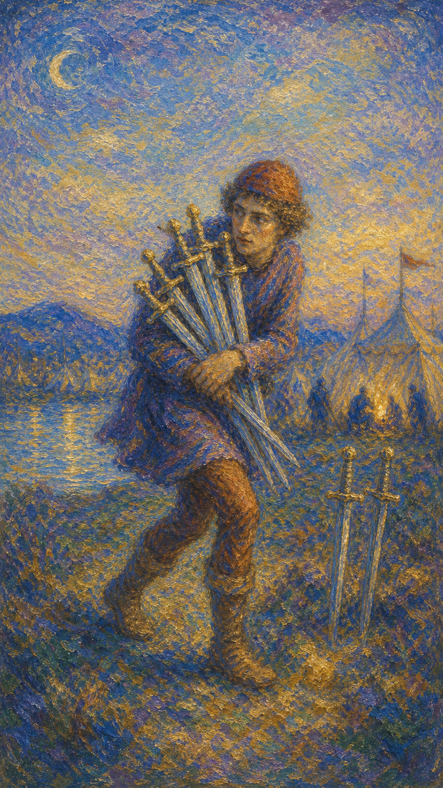

# 宝剑七

宝剑七是一个蹑手蹑脚的人，抱着五柄剑悄悄离开营帐，身后还留着两柄。他回头张望，脸上带着得意，也藏着心虚。这是一张关于策略、隐瞒与独行的牌。

这张牌出现时，事情正以某种不那么光明正大的方式进行。它可能是一次精明的谋划，一种避开正面冲突的迂回，也可能是欺瞒、逃避，或独自承担某事的孤独。

宝剑七并不简单地论对错。它提醒你看清自己的动机：你是在聪明地保护自己，还是在用回避欺骗他人，最终也欺骗了自己。

人物踮脚抱着五柄剑悄然离开营帐，回头露出得意又心虚的神情，身后帐前仍留着两柄剑，远处旗帜飘扬。画面象征策略、隐瞒、独行与暗中行事。

## 基础要素

1. 牌名：宝剑七 (Seven of Swords)
2. 数字编号：56 号牌
3. 核心主题：策略、隐瞒、逃避、独自行动
4. 元素：风
5. 星座或行星：月亮在水瓶座
6. 希伯来字母：无固定传统对应
7. 代表意义：通过审视动机分辨智慧的迂回与自欺的逃避

## 牌面要素

| 要素 | 含义 |
|------|------|
| 踮脚人物 | 偷偷行事、避开注意、不愿正面交锋。 |
| 抱走五剑 | 取巧、谋略，或想独占、带走某些东西。 |
| 回头张望 | 心虚、警惕，对自己的行为并非全然坦然。 |
| 留下两剑 | 未带走的部分，可能是疏漏，也可能是有意留下。 |
| 远方营帐 | 被绕开的群体或正面战场。 |
| 飘扬旗帜 | 热闹的表象，与暗中独行形成对照。 |

## 塔罗灵数

数字 7 代表反思、考验与内在探寻。来到宝剑组，它化作心智的谋略与独行，让人在暗处盘算，靠头脑而非蛮力行事。

宝剑七的 7 号能量像一场月光下的潜行。它聪明、灵活，却也容易滑向隐瞒与自欺，让人分不清是机智还是逃避。

这张牌的灵数提醒你，智慧与狡诈只在一念之间。同样是绕开正面冲突，动机的诚实与否，决定了它是策略，还是欺骗。

## 牌面解读重点

宝剑七正位，是"潜意识知道自己气力有限，于是用迂回与取巧避开正面交锋"——他展示出十足的自信，以为已经成功，却不知只要留一把剑给敌人，伤害就不免发生；宝剑七逆位，则是"潜意识良心发现、选择把带走的剑归还"，或相反地陷入更深的隐瞒与自欺。正逆位的共同特点是：事情正以不那么光明正大的方式进行，区别只在于动机的诚实与否。这张牌提醒人：想成功，就要付出极大的心力；而这种鼠窃狗偷般的取巧，也许一两次能得手，却并非永远行得通——如果真想成功，你需要另谋新方法。

## 正位牌意

**关键词**：策略，谋略，隐瞒，逃避，独行，取巧，需审视动机

正位的宝剑七表示事情正以迂回、隐蔽的方式进行。它可能是一次精明的策略，也可能是欺瞒、逃避或暗中行事。

它带来一种"绕道而行"的气质。你或他人可能在避开正面交锋，用智取代替硬碰；但这也可能滑向隐瞒真相、独占好处或逃避责任。

宝剑七提醒你审视动机。聪明地保护自己无可厚非，但若靠欺骗与回避来达成目的，迟早要面对那两柄留下的剑。

### 爱情/婚姻

感情中，宝剑七常表示隐瞒、不坦诚、暗中行事，或一方有所保留。某些话没说出口，某些事被刻意藏起。

单身者可能在感情中留有戒备，不愿全然敞开；也可能遇到不够坦诚的对象，需要留心对方的真实意图。

有伴侣者要警惕隐瞒与不忠的可能，或彼此之间有未说破的秘密。信任一旦出现裂缝，需要诚实来修补。

这张牌提醒你，关系经不起长期的隐瞒。聪明的迂回或许能避开一时的冲突，却换不来真正的亲密。

### 事业学业

事业学业上，宝剑七可能表示策略、谋划、走捷径，或职场中的暗中竞争与不光明手段。

你可能正用聪明的方式绕过障碍，这是优势；但也要警惕投机取巧、推卸责任，或他人在背后的小动作。

学习中，它可能暗示走捷径、抄近路，或独自钻研。提醒你别因取巧而跳过了真正该打的基础。

这张牌建议你权衡手段。智取是本事，但若靠欺瞒与逃避，赢来的东西往往不稳，也守不长久。

### 人际财富

人际方面，宝剑七可能表示有人暗中行事、不够坦诚，或你需要保留一些信息、独自处理某事。

你可能感到被欺骗或被防备，也可能自己正回避某段关系中的真相。值得留意彼此之间的诚实程度。

财富方面，要警惕欺诈、隐瞒、投机或不透明的交易。也可能表示你在用精明的策略经营财务，需把握分寸。

它提醒你，靠取巧得来的利益常伴风险。光明正大的经营虽慢，却让人睡得安稳。

### 健康生活

健康上，宝剑七与逃避问题、隐瞒症状、独自硬扛有关。你可能不愿正视身体的状况，或对他人隐藏真实的疲惫。

它提醒你别再一个人扛。逃避只会让小问题积成大问题，坦诚面对、寻求支持，才是真正的聪明。

请对自己诚实一点。有些事藏得了别人，藏不了身体，越早面对，越能从容应对。

### 其它牌意

若问具体事件，正位多表示事情暗中进行、有所隐瞒，或需要用策略而非硬碰来处理。

它也可能代表欺骗、逃避、独自行动、走捷径，或一次需要谨慎的谋划。

作为建议，宝剑七说：可以聪明，但要诚实。问问自己的动机——是智慧的迂回，还是不敢面对的逃避。

### 情境指引

- **过去**：曾以迂回、取巧或隐瞒的方式处理某事，避开了正面交锋，却也留下了隐患。
- **现在**：事情正暗中进行——你或他人在绕开正面冲突，用智取代替硬碰，也可能藏着秘密。
- **未来**：取巧或许能得手一时，但留下的那两柄剑迟早要面对，需提前权衡手段的代价。
- **挑战**：如何审视自己的动机，分清这是智慧的策略，还是不敢面对的逃避与欺瞒。
- **障碍**：心虚、戒备与"不想正面交锋"的念头，让坦诚迟迟无法出场。
- **环境**：周遭可能存在暗中竞争、不够透明的氛围，或有人在背后悄悄行事。
- **支持**：你内心对动机的诚实审视，以及愿意光明正大行事的选择，是真正的依托。
- **建议**：可以聪明，但要诚实；靠欺骗与回避赢来的东西不稳，也守不长久。
- **优势**：你头脑灵活、善用策略，懂得避开锋芒、以智取胜，这是难得的本事。
- **弱点**：容易滑向投机取巧、推卸责任或隐瞒真相，让聪明变成了自欺。
- **正面影响**：经由诚实地运用智慧，你能巧妙化解难题，又不必担惊受怕。
- **负面影响**：欺瞒、逃避或独占好处，可能在日后引爆信任的危机与惨烈的后果。
- **希望发生**：希望计划顺利、悄然达成目的，又不被察觉或追究。
- **害怕发生**：害怕隐瞒被揭穿、谋划败露，或那留下的剑反过来伤了自己。
- **你如何看对方**：你可能感到对方不够坦诚、有所保留，需留心其真实的意图。
- **对方如何看待你**：对方可能觉得你精明、有心机，或察觉你在某些事上有所隐瞒。
- **关系当前状态**：处在缺乏全然坦诚的阶段，某些话没说出口，某些事被刻意藏起。
- **关系未来发展**：关系经不起长期隐瞒，唯有诚实，才能换来真正的亲密与信任。
- **结果**：取决于动机的诚实与否——智慧的迂回可解一时，欺瞒的逃避终要付出代价。

## 逆位牌意

**关键词**：坦白，被揭穿，停止逃避，归还，良心发现，或更深的欺瞒

逆位的宝剑七有两种走向。积极时，它表示停止逃避、选择坦白，或良心发现把"带走的剑"归还，重新走向诚实。

消极时，它可能表示谎言被揭穿、计谋败露，或反而陷入更深的隐瞒与自欺。藏不住的真相终于浮出水面。

逆位像一个被回头看见的潜行者。无论是主动坦白，还是被迫现形，关键都在于你是否愿意结束那场迂回的游戏。

### 爱情/婚姻

感情中，逆位宝剑七可能表示隐瞒被揭穿、秘密暴露，或一方终于选择坦白。藏起的事再也藏不住。

单身者可能看清某人的真面目，或决定卸下戒备、真诚以待。坦诚带来的脆弱，反而是亲密的起点。

有伴侣者可能迎来一次真相的浮现，关系或因坦白而修复，或因揭穿而动荡。诚实虽痛，却是重建信任的唯一路。

这张牌提醒你，被揭穿是结束逃避的契机。与其等真相自己暴露，不如主动把话说清。

### 事业学业

事业学业上，逆位宝剑七表示计谋败露、取巧被识破，或你决定回归正道、不再走捷径。

你可能因之前的投机而付出代价，也可能良心发现，选择踏实地重来。诚实虽慢，却走得更远。

学习中，它代表停止偷懒、补回跳过的基础，或因取巧被发现而警醒。把根基打牢，才是长久之计。

这张牌建议你回到正轨。被揭穿不是终点，而是一次重新选择诚实的机会。

### 人际财富

人际方面，逆位宝剑七可能代表谎言被拆穿、信任危机，或某人终于坦白真相。也可能是你决定不再隐瞒。

你可能因之前的回避而面对后果，也可能勇敢地把藏起的话说出口，让关系重新建立在真实之上。

财富方面，可能表示骗局被识破、问题暴露，或你决定让财务回归透明。也要警惕仍未浮现的隐患。

它提醒你，纸终究包不住火。主动坦诚的代价，永远小于被动揭穿的代价。

### 健康生活

健康上，逆位宝剑七表示终于正视一直回避的问题，或被身体的信号"揭穿"了硬扛的真相。

它提醒你停止自欺，及时面对、及时求助。把藏起的疲惫与不适说出来，是康复的第一步。

请放下独自硬撑的执念。承认需要帮助，不是软弱，而是对自己负责的勇气。

### 其它牌意

若问具体事件，逆位多表示真相浮现、隐瞒被揭、计谋失效，或一次良心发现的转向。

它也可能代表坦白、归还、停止逃避、被识破，或更深的自欺。

作为建议，逆位宝剑七说：是时候把剑放回去了。坦诚或许让人一时狼狈，却能让你从此不必再回头张望。

### 情境指引

- **过去**：曾有一段隐瞒或逃避，如今或被揭穿，或在良心发现下，开始走向坦白。
- **现在**：你或选择停止逃避、把带走的剑归还，或陷入更深的隐瞒，藏不住的真相正浮出水面。
- **未来**：纸终究包不住火，主动坦诚将带来重建的契机，被动揭穿则要付出更大代价。
- **挑战**：如何鼓起勇气结束那场迂回的游戏，让一切重新建立在真实之上。
- **障碍**：怕坦白后的狼狈、怕失去既得的好处，让你迟迟不肯把剑放回原处。
- **环境**：周遭或正逼近真相的临界点，隐瞒的事眼看藏不住，信任面临考验。
- **支持**：你良心发现的契机、愿意坦诚的勇气，以及肯接纳真相的人，都是依托。
- **建议**：是时候把剑放回去了；坦诚虽让人一时狼狈，却能让你从此不必回头张望。
- **优势**：一旦选择回归正道，你便能卸下心虚的重负，重新走得踏实而安稳。
- **弱点**：容易在被揭穿后仍想掩饰，陷入更深的自欺，让局面越发难以收拾。
- **正面影响**：经由坦白与归还，信任有了重建的可能，你也终于不必再提心吊胆。
- **负面影响**：谎言被拆穿、计谋失效，或更深的隐瞒，让关系与声誉遭受重创。
- **希望发生**：希望真相能被妥善处理，或自己能鼓起勇气坦白、重新走向诚实。
- **害怕发生**：害怕隐瞒败露后无法收场，或坦白带来的后果超出自己能承受的范围。
- **你如何看对方**：你或看清了对方的真面目，或正决定卸下戒备、对其真诚以待。
- **对方如何看待你**：对方可能因真相浮现而重新审视你，或感到你终于愿意坦诚相待。
- **关系当前状态**：处在真相即将揭开的临界点，秘密藏不住，信任正面临修复或动荡。
- **关系未来发展**：诚实虽痛，却是重建信任的唯一路；主动坦诚，关系才有走下去的可能。
- **结果**：取决于你是否愿意放下逃避——坦白则解脱重生，掩饰则陷入更深的被动。
