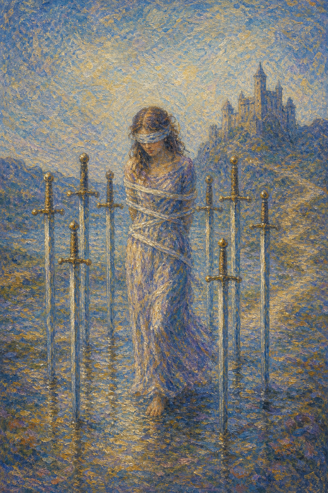

# 宝剑八

宝剑八是一位被绳索松松捆住、蒙着眼的女子，周围插着八柄剑，像一道无形的牢笼。她站在泥泞的浅滩，身后是冰冷的城堡。然而仔细看，绳并不紧，脚下也有路——困住她的，更多是她以为自己无法移动的念头。

这张牌出现时，你可能感到被困、受限、动弹不得。它可能是外在的处境，但更常是一种内在的束缚——恐惧、自我设限，或"我别无选择"的信念。

宝剑八并不否认你的困境是真实的。它只是轻轻提醒：蒙眼布是可以摘下的，绳索也比想象中松。牢笼的门，往往从内侧就能打开。

蒙眼女子被绳索松松束缚，八柄剑插在身周如同栅栏，脚下是泥泞滩地，远处矗立着城堡。画面象征受限、自我设限与看似无路可走的困境。

## 基础要素

1. 牌名：宝剑八 (Eight of Swords)
2. 数字编号：57 号牌
3. 核心主题：受限、束缚、自我设限、无力感
4. 元素：风
5. 星座或行星：木星在双子座
6. 希伯来字母：无固定传统对应
7. 代表意义：通过看清束缚多源于内心而重获选择的自由

## 牌面要素

| 要素 | 含义 |
|------|------|
| 蒙眼女子 | 看不清出路，被恐惧或偏见遮住了视线。 |
| 松散绳索 | 束缚并不如想象中牢固，挣脱其实有可能。 |
| 周围八剑 | 自设的限制与思维的牢笼，像栅栏般围困。 |
| 泥泞滩地 | 处境的不适与停滞，让人感到举步维艰。 |
| 远方城堡 | 安全或出路仍在远处，并非全然无望。 |
| 留出的缺口 | 剑与剑之间有空隙，暗示出路一直存在。 |

## 塔罗灵数

数字 8 代表力量、循环与掌控。来到宝剑组，它本应是心智的力量，却被困在自我设限里，化作一种"我无能为力"的错觉。

宝剑八的 8 号能量像一个被自己绑住的巨人。力量并未消失，只是被恐惧的念头封印，让人忘了自己其实可以挣脱。

这张牌的灵数提醒你，真正的牢笼往往建在心里。当你愿意摘下蒙眼布、看清那些剑之间的缝隙，力量就会重新回到你手中。

## 牌面解读重点

宝剑八正位，是"潜意识被恐惧说服，认定自己伸不出手、看不见路、动弹不得"——女人被蒙眼缚手困在剑阵之中，处境看似孤立无援，可背后暖和的家仍在召唤，绳索其实并不紧；宝剑八逆位，则是"潜意识开始质疑那道牢笼，愿意摘下蒙眼布、挣脱束缚",或相反地陷得更深、越绑越紧。正逆位的共同特点是：人所感到的受限，更多来自内心的设限而非全然的外在，区别只在于你是否相信自己能挣脱。这张牌表明的正是人所处的一种状态——自身受限、暂时丧失个人能力，但希望始终都在，牢笼的门往往从内侧就能打开。

## 正位牌意

**关键词**：受限，束缚，无力感，自我设限，进退两难，恐惧，看不清出路

正位的宝剑八表示你感到被困住了，仿佛四面是剑、动弹不得。处境或许确有难处，但更深的束缚，常来自内心的恐惧与"我没有选择"的信念。

它带来一种被卡住的无力感。你蒙着眼，看不见出路，于是以为自己只能停在原地。但那些剑之间，其实留着缝隙。

宝剑八提醒你，先摘下蒙眼布。当你愿意正视处境、质疑那些限制自己的念头，会发现绳索比想象中松，路也一直都在。

### 爱情/婚姻

感情中，宝剑八常表示感到被困在一段关系里，或被自我怀疑、恐惧束缚，不敢追求或离开。你可能觉得别无选择，其实是不敢选择。

单身者可能因害怕受伤、自我设限而把自己关起来，认定"不会有人喜欢我"。这种信念，正是那道无形的牢笼。

有伴侣者可能感到关系令人窒息，却又觉得无力改变。值得分辨：是处境真的困住了你，还是恐惧让你不敢迈步。

这张牌提醒你，你比自己以为的更有选择。看清束缚的来源，是重新拿回主动权的第一步。

### 事业学业

事业学业上，宝剑八可能表示感到被困在某个职位、环境或处境中，看不到出路，被无力感笼罩。

你可能觉得"我没办法改变""我只能这样"，但这些念头本身，往往就是最大的障碍。处境或许有限，选择却未必没有。

学习中，它代表被自我怀疑困住，或陷入"我学不好"的思维定式。打破这层心理设限，比解决问题本身更关键。

这张牌建议你质疑自己的限制性信念。把"我不能"换成"我还没找到方法"，视野就会重新打开。

### 人际财富

人际方面，宝剑八可能表示在关系中感到被束缚、被孤立，或因恐惧而不敢表达、不敢拒绝。

你可能觉得被困在某个角色或期待里，动弹不得。但很多时候，松开你的，恰恰是你自己愿意松开的那一刻。

财富方面，可能感到被财务困境捆住，看不到转机。提醒你别被恐惧麻痹，仔细看，总有可以调整的空间。

它提醒你，困境中最该警惕的是"我无能为力"的念头。一旦你开始寻找出路，出路就会开始显现。

### 健康生活

健康上，宝剑八与焦虑、恐惧、被无力感笼罩、身心被困有关。你可能因害怕而不敢行动，或被负面思绪困住。

它提醒你，许多束缚源于心理。适合通过梳理思绪、寻求支持，慢慢松开那些捆住自己的恐惧。

请温柔地提醒自己：你不是真的无路可走，只是暂时蒙着眼。摘下它，一步一步来，路会显出来。

### 其它牌意

若问具体事件，正位多表示局面看似受困、进退两难，但出路其实存在，只是暂时被恐惧遮蔽。

它也可能代表自我设限、犹豫不前、被处境捆住，或一种"动弹不得"的心理状态。

作为建议，宝剑八说：先摘下蒙眼布，再质疑那句"我别无选择"。当你愿意看，就会发现剑之间一直留着路。

### 情境指引

- **过去**：曾被某种处境或恐惧困住，认定自己别无选择，于是停在原地、不敢迈步。
- **现在**：你正感到四面是剑、动弹不得，蒙着眼看不见出路，被无力感笼罩。
- **未来**：当你愿意摘下蒙眼布、质疑那些限制性的念头，会发现绳索其实比想象中松。
- **挑战**：如何看清束缚多半来自内心，而非全然的外在，重新拿回选择的主动权。
- **障碍**：恐惧、自我怀疑与"我无能为力"的信念，是困住你的那道无形牢笼。
- **环境**：周遭看似处处受限、令人窒息，但那些剑之间，其实一直留着缝隙。
- **支持**：你内在尚未消失的力量、愿意正视处境的勇气，以及可求助的人，都是依托。
- **建议**：先摘下蒙眼布，把"我不能"换成"我还没找到方法"，视野就会重新打开。
- **优势**：一旦愿意睁眼看清，你便能发现那道牢笼本可打破，力量重新回到手中。
- **弱点**：容易被恐惧麻痹、被限制性信念说服，认定自己只能停在原地。
- **正面影响**：经由质疑束缚、正视处境，你重获选择的自由，看见一直存在的出路。
- **负面影响**：困于自我设限，让本可挣脱的处境变成"动弹不得"的心理牢笼。
- **希望发生**：希望挣脱束缚、重获自由，让自己从无力与受困中解脱出来。
- **害怕发生**：害怕自己真的无路可走，或被恐惧彻底困住、再也动不了。
- **你如何看对方**：你可能觉得被某段关系或对方困住，却又分不清是处境还是恐惧使然。
- **对方如何看待你**：对方可能感到你被自我设限捆住，明明有路却不敢迈步。
- **关系当前状态**：处在感到窒息、受限却无力改变的僵局里，更多是被恐惧而非现实困住。
- **关系未来发展**：唯有看清束缚的来源、质疑"我别无选择"，关系才有重新呼吸的余地。
- **结果**：取决于你是否愿意睁眼——看清剑间的缝隙，那座看似无解的牢笼便会松动。

## 逆位牌意

**关键词**：挣脱束缚，重获自由，看清真相，走出恐惧，或陷得更深

逆位的宝剑八有两种走向。积极时，它表示你开始挣脱束缚，摘下蒙眼布，看清那些限制原来可以打破，重新拿回选择权。

消极时，它可能表示陷得更深，被恐惧彻底困住，或在自我设限里越绑越紧。也可能是终于看清，却仍不敢迈出那一步。

逆位像一个正在解开绳索的人。无论是豁然挣脱，还是仍在挣扎，关键都在于你是否相信：这道牢笼，本就由你掌控开合。

### 爱情/婚姻

感情中，逆位宝剑八可能表示走出自我设限，重新敢爱敢追，或鼓起勇气离开困住自己的关系。

单身者可能终于打破"我不值得被爱"的念头，重新向感情敞开。这份松绑，让缘分有了进来的空间。

有伴侣者可能从令人窒息的状态中解脱，或与对方一起打破僵局。也可能仍困在恐惧里，需要再多一点勇气。

这张牌提醒你，自由往往始于一个念头的转变。当你不再认定自己被困，关系也就有了重新呼吸的余地。

### 事业学业

事业学业上，逆位宝剑八表示打破思维定式、走出困境，或终于看清那些限制其实可以跨越。

你可能找到了一直被忽略的出路，重新行动起来。也可能仍被旧的恐惧拖住，需要刻意推自己一把。

学习中，它代表突破"我做不到"的心结，重拾信心。或提醒你别让自我怀疑继续困住本可发挥的能力。

这张牌建议你勇敢迈步。最难的常常只是第一步，一旦动起来，你会发现牢笼根本不存在。

### 人际财富

人际方面，逆位宝剑八可能代表挣脱束缚自己的关系或角色，重新找回表达与拒绝的自由。

你开始敢于为自己发声，不再被恐惧捆住。这种松绑，让你重新成为自己生活的主人。

财富方面，可能从财务困境中找到出路，或打破"我没办法"的心态，重新主动经营。转机随行动而来。

它提醒你，自由不是等来的，是争取来的。一旦你停止认命，局面就开始松动。

### 健康生活

健康上，逆位宝剑八表示走出焦虑与恐惧，重新感到轻松自如。也可能提醒你，仍被负面思绪困住，需要主动求助。

它适合通过行动、倾诉、专业支持来松开心理的束缚。每挣脱一寸，呼吸就顺畅一分。

请相信自己有挣脱的力量。哪怕只是先摘下蒙眼布、看清四周，也已经是迈向自由的开始。

### 其它牌意

若问具体事件，逆位多表示困境开始松动、出路逐渐显现，或你终于看清并打破了限制。

它也可能代表重获自由、突破心结、走出恐惧，或仍深陷其中的挣扎。

作为建议，逆位宝剑八说：绳索从来就松。当你愿意睁开眼、迈开脚，那座看似无解的牢笼，会在你身后悄悄消失。

### 情境指引

- **过去**：曾被恐惧或自我设限困住，如今或开始挣脱，或在束缚里越绑越紧。
- **现在**：你或正摘下蒙眼布、看清限制可以打破，或仍深陷其中、不敢迈出那一步。
- **未来**：自由往往始于一个念头的转变——当你不再认定自己被困，局面便开始松动。
- **挑战**：如何相信这道牢笼本由自己掌控开合，鼓起勇气迈出最难的第一步。
- **障碍**：根深的恐惧、积习的自我怀疑，可能让你看清了出路却仍不敢行动。
- **环境**：周遭或正显出可挣脱的契机，也可能仍有让你困住的旧角色与旧期待。
- **支持**：行动的勇气、倾诉的出口、专业的支持，以及你愿争取自由的决心，都是依托。
- **建议**：勇敢迈步，最难的常只是第一步；一旦动起来，会发现牢笼根本不存在。
- **优势**：你已开始看清束缚可以跨越，这份觉醒让你有机会重新成为生活的主人。
- **弱点**：容易在看清后仍被旧恐惧拖住，或在挣扎中陷得更深、越绑越紧。
- **正面影响**：经由念头的转变与果断的行动，你挣脱束缚、重获表达与选择的自由。
- **负面影响**：若仍被恐惧麻痹，挣扎会变成更深的自困，让出路始终近在咫尺却走不出。
- **希望发生**：希望彻底挣脱束缚、重获自由，让自己轻松自如地重新行动起来。
- **害怕发生**：害怕始终迈不出那一步，或挣扎之后反而被困得更紧。
- **你如何看对方**：你或正鼓起勇气离开困住自己的关系，或仍被恐惧绊住、不敢松手。
- **对方如何看待你**：对方可能感到你正重新争取自由、敢于发声，或仍被旧的恐惧拖住。
- **关系当前状态**：处在束缚开始松动的转折里，或在挣脱、或仍困于令人窒息的状态。
- **关系未来发展**：当你不再认命、愿意为自己行动，关系便有了重新流动与呼吸的空间。
- **结果**：取决于你是否相信自己能挣脱——睁眼迈步则自由，犹疑退缩则继续受困。
