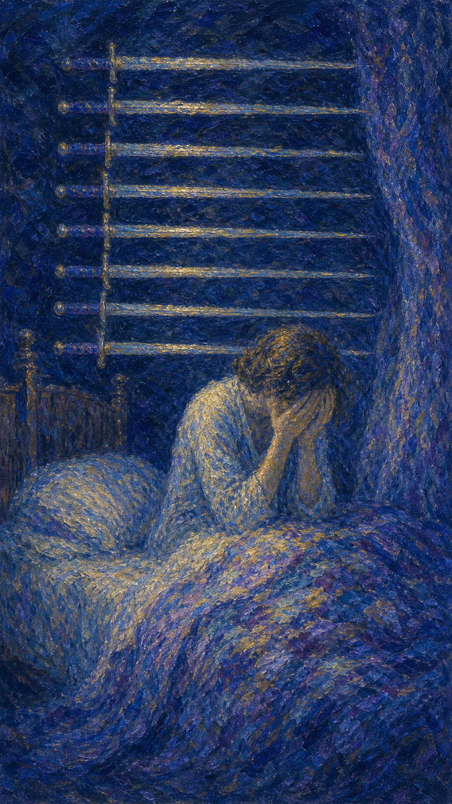

# 宝剑九

宝剑九是一个在深夜从睡梦中惊坐而起的人，双手掩面，身后墙上悬着九柄剑。黑暗笼罩四周，焦虑、悔恨与恐惧在静夜里无限放大。这是一张关于精神煎熬的牌。

这张牌出现时，你可能正被忧虑啃噬。它可能是失眠的长夜，反复盘旋的念头，挥之不去的愧疚，或对未来的深切恐惧。痛苦大多发生在脑海里，而非眼前。

宝剑九并不轻视你的痛。它知道那些深夜的恐惧有多真实。但它也轻声提醒：墙上的剑并未落下，许多最深的折磨，来自想象，而非现实本身。

人物在暗夜中坐起，双手掩面陷入痛苦，背后墙上横悬九柄宝剑，床沿雕刻着争斗的图案。画面象征焦虑、失眠、悔恨与深夜里被放大的恐惧。

## 基础要素

1. 牌名：宝剑九 (Nine of Swords)
2. 数字编号：58 号牌
3. 核心主题：焦虑、忧惧、失眠、精神煎熬
4. 元素：风
5. 星座或行星：火星在双子座
6. 希伯来字母：无固定传统对应
7. 代表意义：通过看清恐惧多源于内心而减轻精神的重负

## 牌面要素

| 要素 | 含义 |
|------|------|
| 惊坐人物 | 从噩梦或忧思中惊醒，被焦虑攫住。 |
| 掩面双手 | 痛苦、羞愧、不敢面对的恐惧。 |
| 墙上九剑 | 盘旋的念头与忧虑，悬而未落，多在脑中。 |
| 深沉黑暗 | 夜晚放大的孤独与恐惧，缺乏光亮。 |
| 床沿雕刻 | 过往的冲突与创伤，仍在潜意识里作祟。 |
| 温暖被褥 | 现实仍有依托，提示恐惧未必等于真相。 |

## 塔罗灵数

数字 9 代表接近完成、累积与极致。来到宝剑组，它化作思虑的层层堆叠，把焦虑推向顶点，让人在深夜里被念头压得喘不过气。

宝剑九的 9 号能量像一场无尽的循环梦魇。同样的忧虑反复回放，越想越深，越深越怕，直到人困在自己制造的黑暗里。

这张牌的灵数提醒你，思虑到了极致，便成了折磨。打破循环的方式，不是想得更多，而是让光照进来，看清那些剑其实悬在墙上，并未真正落下。

## 牌面解读重点

宝剑九正位，是"潜意识在夜深人静时反复回放忧虑与悔恨，被自己制造的黑暗折磨得彻夜难眠"——白天分心的琐事一结束，人便沉进自己的想法里，悲伤与悔恨格外强烈；它代表的是来自内心的煎熬，不同于宝剑三那种来自外界的痛楚；宝剑九逆位，则是"潜意识开始走出循环、寻求帮助、让光照进来"，或相反地把恐惧压得更深、陷入更浓的绝望。正逆位的共同特点是：折磨大多发生在脑海里，而非眼前——你担心的事或许尚未发生，墙上的剑悬而未落。这张牌正是那种对问题的忧虑让人日有所思、夜有所梦的状态，提醒人：恐惧不等于现实。

## 正位牌意

**关键词**：焦虑，忧惧，失眠，悔恨，精神压力，噩梦，过度思虑

正位的宝剑九表示你正经历一段精神上的煎熬。焦虑、恐惧、悔恨或忧思在深夜里被无限放大，让人辗转难眠、心神不宁。

它带来一种被念头围困的痛苦。这些折磨大多发生在脑海中——你担心的事或许尚未发生，悔恨的事也已无法改变，但思绪仍反复啃咬着你。

宝剑九提醒你，恐惧不等于现实。墙上的剑悬而未落，许多最深的痛来自想象。当你愿意把灯打开、把忧虑说出口，黑暗就会开始消退。

### 爱情/婚姻

感情中，宝剑九常表示因关系而焦虑、忧思、夜不能寐。你可能反复担心被抛弃、被背叛，或为某句话、某个眼神辗转难安。

单身者可能被孤独感与自我怀疑折磨，在深夜里放大"我会不会一直一个人"的恐惧。

有伴侣者可能因猜疑、不安或未说出口的心事而内耗。许多担忧或许并无实据，却在沉默中越积越重。

这张牌提醒你，把恐惧说出来。许多关系里的焦虑，一旦摊开沟通，就会发现远没有深夜里想象的那么可怕。

### 事业学业

事业学业上，宝剑九可能表示因压力、责任或对失败的恐惧而焦虑失眠。你可能被"做不好怎么办"的念头反复折磨。

你或许把问题想得过于严重，或为尚未发生的事提前忧虑。过度的精神负担，反而会影响真正的发挥。

学习中，它代表考试焦虑、压力过大、对结果的过度担忧。提醒你别让恐惧本身，成了最大的绊脚石。

这张牌建议你把忧虑落到纸上、拆成具体的步骤。当模糊的恐惧变成可处理的问题，重量就轻了一半。

### 人际财富

人际方面，宝剑九可能表示因人际关系而内耗、自责，或反复回想某段对话、某个误会而难以释怀。

你可能把别人的看法看得过重，在深夜里放大自己的过失。提醒你区分：哪些是真实的问题，哪些只是想象的放大。

财富方面，可能因金钱压力、债务或对未来的不安而焦虑。提醒你别让恐慌取代理性，许多担忧需要面对而非逃避。

它提醒你，独自在黑暗里反刍恐惧，只会越想越怕。把它说给信任的人听，光就会照进来。

### 健康生活

健康上，宝剑九与失眠、焦虑、精神压力、噩梦、身心俱疲密切相关。它常是身体在提醒你：忧虑已经超载了。

它强烈建议你正视心理健康。长期的焦虑与失眠不容忽视，必要时请寻求专业的心理支持，别独自硬扛。

请温柔地对待深夜里痛苦的自己。那些恐惧很真实，但你并不孤单，天亮之后，许多事都会变得不一样。

### 其它牌意

若问具体事件，正位多表示忧虑、压力、精神煎熬，或对某事的过度担心。提醒你恐惧可能大于实情。

它也可能代表失眠、噩梦、悔恨、焦虑，或一段需要被疗愈的心理低谷。

作为建议，宝剑九说：把灯打开，把话说出口。你担心的剑大多悬在墙上，而非落在身上。别让黑暗替你下结论。

### 情境指引

- **过去**：曾被某些忧虑或悔恨长久啃噬，那些深夜的念头至今仍在心底盘旋。
- **现在**：你正经历一段精神煎熬，焦虑、恐惧在夜里被无限放大，让人辗转难眠。
- **未来**：当你愿意把灯打开、把忧虑说出口，黑暗会开始消退，天亮后许多事会不同。
- **挑战**：如何看清恐惧不等于现实，把脑海中盘旋的念头与真实的处境区分开来。
- **障碍**：过度思虑、反复反刍，以及独自在黑暗里硬扛的习惯，让忧虑越积越重。
- **环境**：周遭的压力或孤独感放大了夜里的恐惧，缺少能让你安心倾诉的光亮。
- **支持**：愿意倾听的人、专业的心理支持，以及你愿意开口求助的勇气，都是依托。
- **建议**：把忧虑落到纸上、拆成具体的步骤，让模糊的恐惧变成可处理的问题。
- **优势**：你对处境的高度警觉与深思，若用对方向，能帮你提前看清并安顿问题。
- **弱点**：容易把事情想得过于严重、为尚未发生的事提前忧虑，陷入念头的迷宫。
- **正面影响**：经由表达与求助，被放大的恐惧缩回原本的尺寸，精神的重负得以减轻。
- **负面影响**：长期独自反刍，让焦虑、失眠与悔恨彼此叠加，把人困在自造的黑暗里。
- **希望发生**：希望忧虑能被安顿、恐惧能够消退，让自己重新睡个安稳的好觉。
- **害怕发生**：害怕担心的事真的发生，或自己始终走不出这片深夜的煎熬。
- **你如何看对方**：你可能因对方而反复担忧、猜疑，为某句话、某个眼神辗转难安。
- **对方如何看待你**：对方可能感到你心事重重、被忧虑缠住，却未必知道你夜里的煎熬。
- **关系当前状态**：处在因猜疑、不安或未说出口的心事而内耗的阶段，担忧在沉默中累积。
- **关系未来发展**：把恐惧说出来、坦诚沟通，许多关系里的焦虑就会远没有想象的可怕。
- **结果**：取决于你是否愿意让光照进来——开口求助则黑暗消退，独自硬扛则越想越怕。

## 逆位牌意

**关键词**：走出焦虑，恐惧消退，寻求帮助，看清真相，或绝望加深

逆位的宝剑九有两种走向。积极时，它表示焦虑开始消退，你逐渐走出精神的低谷，看清恐惧的虚幻，或主动寻求帮助、迎来曙光。

消极时，它可能表示痛苦加深、陷入绝望，或把恐惧压得更深、不愿面对。漫漫长夜，似乎还看不到尽头。

逆位像一个在黑暗中摸索灯绳的人。无论是即将迎来天明，还是仍困在深夜，关键都在于你是否愿意伸手求助、让光照进来。

### 爱情/婚姻

感情中，逆位宝剑九可能表示走出因关系而生的焦虑，恐惧逐渐平息，你重新感到安心。也可能是不安仍在，需要被看见。

单身者可能终于放下深夜的自我怀疑，重新相信自己值得被爱。也可能仍困在孤独的恐惧里，需要主动连接他人。

有伴侣者可能通过沟通化解了猜疑，焦虑随之消散。也提醒你，若担忧持续累积，更要坦诚相对而非独自内耗。

这张牌提醒你，说出来就是疗愈的开始。许多深夜的恐惧，在阳光与对话下都会显出它真实的、可承受的样子。

### 事业学业

事业学业上，逆位宝剑九表示从压力与焦虑中恢复，重新找回平静与专注。也可能提醒你，忧虑仍在累积，需要正视。

你可能终于看清某些恐惧并无实据，放下了沉重的心理包袱。也可能仍被压力困住，需要调整节奏、寻求支持。

学习中，它代表走出考试焦虑、缓解过度担忧，或提醒你别让恐惧持续侵蚀状态。适度休息，也是一种解药。

这张牌建议你，若焦虑已缓解，就温柔地肯定自己；若仍沉重，请别独自硬撑，寻求帮助是勇敢，不是软弱。

### 人际财富

人际方面，逆位宝剑九可能代表放下因人际而生的内耗，或终于看清某些自责并无必要。心结开始松开。

你可能不再把别人的看法看得过重，重新找回内心的安定。也可能仍困在悔恨里，需要主动与人倾诉。

财富方面，可能从财务焦虑中缓过来，或找到面对问题的方法。提醒你别让恐慌持续，理性面对才能真正减压。

它提醒你，恐惧最怕被说出口。一旦你愿意分享，那些深夜放大的怪影，就会缩回它原本的尺寸。

### 健康生活

健康上，逆位宝剑九表示焦虑与失眠开始好转，身心逐渐恢复平静。也可能是警告：精神压力已到临界，务必重视。

它提醒你认真对待心理健康。若焦虑、失眠、绝望持续，请务必寻求专业帮助，你值得被好好照顾。

请记得，再长的夜也会天亮。在黑暗最深时伸手求助，不是失败，而是对自己最深的温柔。

### 其它牌意

若问具体事件，逆位多表示忧虑开始消散、恐惧被看清，或提醒你别让焦虑继续加深。

它也可能代表走出低谷、寻求帮助、释放压力，或仍需面对的精神煎熬。

作为建议，逆位宝剑九说：你不必独自撑过这个夜。伸手、开口、求助——让光照进来，黑暗就守不住你了。

### 情境指引

- **过去**：曾被焦虑与恐惧困在深夜，如今或正走出低谷，或仍把痛苦压得更深。
- **现在**：你或开始看清恐惧的虚幻、迎来曙光，或仍陷在绝望里，看不到尽头。
- **未来**：当你愿意伸手求助、让光照进来，再长的夜也会天亮，焦虑终将消退。
- **挑战**：如何停止把恐惧越压越深，转而开口、求助，让积压的忧虑找到出口。
- **障碍**：不愿面对、独自硬撑的执念，可能让痛苦加深、把人推向更浓的绝望。
- **环境**：周遭或正提供疗愈与陪伴的契机，也可能仍让你感到孤立、无处安放心事。
- **支持**：专业的心理帮助、信任的人的陪伴，以及你愿意求助的勇气，都是依托。
- **建议**：若焦虑已缓解就温柔地肯定自己；若仍沉重，请别独自硬撑，求助是勇敢。
- **优势**：你已开始看清某些恐惧并无实据，这份觉察让你有机会放下沉重的心理包袱。
- **弱点**：容易把恐惧压得更深、不愿面对，或在绝望里反复打转、迟迟不肯伸手。
- **正面影响**：经由求助与表达，焦虑与失眠开始好转，身心逐渐恢复平静。
- **负面影响**：若把痛苦压抑、拒绝面对，绝望会持续加深，让漫漫长夜看不到尽头。
- **希望发生**：希望彻底走出焦虑、恢复平静，让自己从精神的低谷中重新明亮起来。
- **害怕发生**：害怕痛苦无法停止、绝望持续加深，或自己始终撑不过这个长夜。
- **你如何看对方**：你或正放下因对方而生的不安、重获安心，或仍被猜疑与担忧困住。
- **对方如何看待你**：对方可能感到你正在恢复、愿意敞开，也可能察觉你仍独自内耗。
- **关系当前状态**：处在化解猜疑后的平复期，或仍在因不安而内耗、需要被看见的阶段。
- **关系未来发展**：坦诚相对而非独自硬扛，许多深夜的恐惧在阳光与对话下都会变得可承受。
- **结果**：取决于你是否愿意伸手——开口求助则迎来天明，压抑硬撑则困在长夜难眠。
