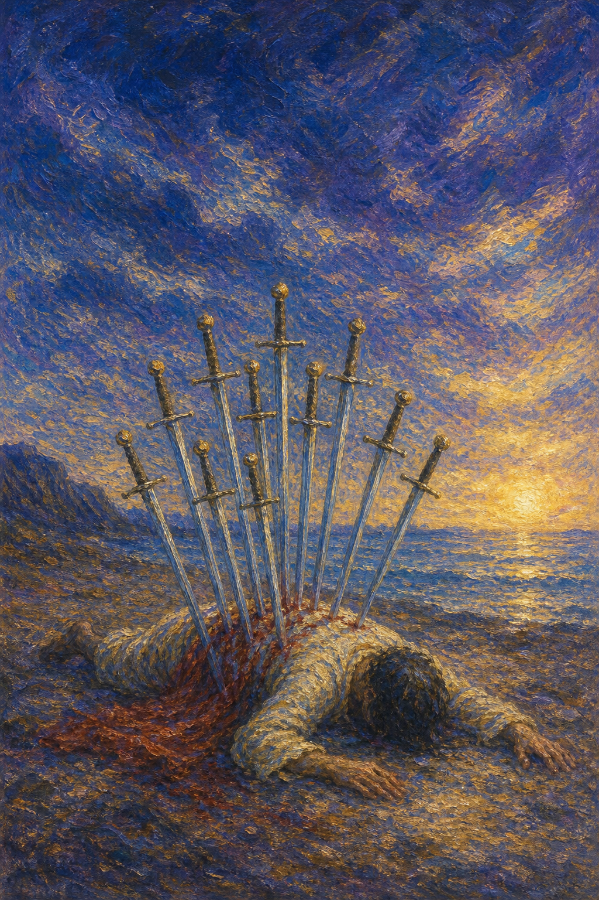

# 宝剑十

宝剑十是一个伏倒在地的人，背上插着十柄剑，鲜血染地。天空一片漆黑，然而地平线上，一缕金色的曙光正悄然亮起。这是最痛的结束，也是黑暗到了尽头的征兆。

这张牌出现时，某件事已经走到了它的终点。它可能是一次彻底的失败、背叛、崩溃，或某段折磨的痛苦落幕。十柄剑插下，意味着不会再更糟了——因为已经触底。

宝剑十并不停留在绝望里。它让黑暗中升起一线光，是要告诉你：当一件事痛到极致地结束，也就意味着一个新的循环即将开始。最深的夜，紧挨着黎明。

人物面朝下伏倒在地，背上插满十柄宝剑，身披红袍。天空漆黑沉重，远处地平线却泛起一抹金色的曙光。画面象征痛苦的终结、触底，以及黑暗尽头的转机。

## 基础要素

1. 牌名：宝剑十 (Ten of Swords)
2. 数字编号：59 号牌
3. 核心主题：终结、触底、痛苦的结束、转机将至
4. 元素：风
5. 星座或行星：太阳在双子座
6. 希伯来字母：无固定传统对应
7. 代表意义：通过接受彻底的结束迎来新循环的曙光

## 牌面要素

| 要素 | 含义 |
|------|------|
| 伏地人物 | 彻底的失败、终结，或痛苦到达极点。 |
| 背上十剑 | 累积的伤害达到顶点，不会再增加。 |
| 漆黑天空 | 至暗时刻，绝望与低谷的笼罩。 |
| 地平曙光 | 黑暗尽头的希望，新循环即将开始。 |
| 鲜红披袍 | 流逝的激情或被耗尽的能量。 |
| 平静的水 | 远方的安宁，提示风暴终会过去。 |

## 塔罗灵数

数字 10 代表圆满与循环的终点，也是下一轮的起点。来到宝剑组，它化作思想与冲突之旅的终结，把痛苦推到极限，也把转机带到门口。

宝剑十的 10 号能量像一场风暴的最后一道闪电。它击下时无比剧烈，却也宣告着：雷声将尽，雨终会停，天就要亮了。

这张牌的灵数提醒你，触底本身就是一种解脱。当一件事不能再更糟，唯一的方向就是向上。结束的尽头，藏着重新开始的种子。

## 牌面解读重点

宝剑十正位，是"潜意识承认某件事已痛到极致地结束、再也不会更糟"——它的含义非常负面，包含惨痛、难过与一切令人不适的情绪，象征事物泛滥与过度发展所造成的后果；但画面里那袭红袍透着对生命的热爱，远方泛起的鱼肚白与平静无波的水面，预示黑暗即将过去、黎明正在到来；宝剑十逆位，则是"潜意识从谷底慢慢爬起、走向复原",或相反地抗拒接受终局、困在已死的局面里反复受苦。正逆位的共同特点是：一个循环已走到尽头，区别只在于你是接受结束、迎接新生，还是拒绝放手、延续旧痛。这张牌的核心，正是"在新的开始之前，某种状况结束"——触底本身就是一种解脱。

## 正位牌意

**关键词**：终结，触底，彻底的失败，背叛，痛苦的结束，转机，谷底反弹

正位的宝剑十表示某件事已走到尽头，往往伴随痛苦、失败或背叛。它是一种彻底的结束，可能让人感到被击垮、被掏空。

但它也带来一种残酷的解脱——既然已经触底，就不会再更糟了。十柄剑插下，意味着这场折磨终于画上句点，黑暗已到尽头。

宝剑十提醒你，看向地平线上的那缕光。痛苦的结束虽然难熬，却清出了重新开始的空间。最深的谷底，正是反弹的起点。

### 爱情/婚姻

感情中，宝剑十常表示一段关系的彻底结束，或一次深刻的伤害、背叛。痛是真实的，但这或许也是必要的了结。

单身者可能终于从一段长久的心痛中彻底走出，或经历了某种情感的"清零"。结束虽痛，却为新的开始腾出了位置。

有伴侣者可能面对关系的终点，或一次难以挽回的裂痕。强行维系已无意义，接受结束，反而是疗愈的开始。

这张牌提醒你，有些结束是慈悲的。当一段关系痛到极致，放手让它结束，才能让自己重新迎来曙光。

### 事业学业

事业学业上，宝剑十可能表示项目的彻底失败、被背叛、被淘汰，或一段努力的惨痛收场。

你可能感到被击垮、心灰意冷。但触底也意味着：最坏的已经过去，接下来无论怎样，都是在往上走。

学习中，它代表一次重大的挫败或彻底的失利。痛过之后，请把它当作一个阶段的真正终结，而非自我的定义。

这张牌建议你接受结束、停止挣扎。与其在已死的局面里耗损，不如转身迎接那道正在升起的光。

### 人际财富

人际方面，宝剑十可能表示一段关系的决裂、被深深辜负，或某个圈子的彻底告别。痛苦中也藏着解脱。

你可能经历了背叛或伤害，感到心被掏空。但这场结束，也让你看清了谁不值得，为更真诚的关系腾出了空间。

财富方面，可能表示重大的损失、破产或财务的谷底。提醒你这是触底，接下来需要的是重建，而非沉溺于失去。

它提醒你，触底之后唯有向上。承认损失、接受结束，才能把力气用在重新站起来上。

### 健康生活

健康上，宝剑十与身心的彻底耗竭、崩溃，或一段病痛的谷底有关。它提醒你，已经到了不能再透支的极限。

它也带来转机的暗示：触底之后，是恢复的开始。请务必好好休养，必要时寻求帮助，让身心从谷底慢慢回升。

请温柔地对待被击垮的自己。你已经撑过了最难的部分，接下来要做的，是允许自己慢慢痊愈。

### 其它牌意

若问具体事件，正位多表示事情走到终点、彻底结束，或经历一次重大的失败与打击。但转机已在地平线。

它也可能代表背叛、崩溃、触底、谷底，或一段痛苦的了结。

作为建议，宝剑十说：接受它已经结束。别再为已沉的船流泪，抬头看那缕曙光——新的一天，正要为你升起。

### 情境指引

- **过去**：曾经历一次彻底的失败、背叛或崩溃，那场折磨把你推到了痛苦的极点。
- **现在**：你正处在某件事的终点，感到被击垮、被掏空，但黑暗已经到了尽头。
- **未来**：触底之后唯有向上——痛苦的结束清出了空间，新的循环正在地平线上升起。
- **挑战**：如何接受结束、停止挣扎，把力气从已死的局面里收回，转身迎接曙光。
- **障碍**：不愿承认终局、对已沉的船念念不忘，让你困在谷底反复受苦。
- **环境**：周遭或正笼罩在至暗的低谷里，但远方的地平线已悄然泛起一抹金光。
- **支持**：那袭象征生命热爱的红袍、终会过去的风暴，以及你愿意放手的决心，都是依托。
- **建议**：接受它已经结束，别再为已沉的船流泪，抬头看那道正在升起的光。
- **优势**：你已撑过最难的部分，触底带来的解脱，正是重新站起来的起点。
- **弱点**：容易沉溺于失去、反复哀悼，把一次终结误当成对自我的永久定义。
- **正面影响**：经由接受结束，你清出了重新开始的空间，谷底成了反弹的起点。
- **负面影响**：若拒绝放手，便会困在已死的局面里，让痛苦无谓地延续下去。
- **希望发生**：希望这场折磨彻底画上句点，让自己从谷底慢慢回升、迎接新生。
- **害怕发生**：害怕痛苦不会停止，或这次彻底的失败会永远改变自己的人生。
- **你如何看对方**：你可能感到被对方深深辜负或伤害，心被掏空，关系走到了尽头。
- **对方如何看待你**：对方可能也感到这段关系已无法挽回，彼此都站在了终点。
- **关系当前状态**：处在彻底破裂或重创之后的谷底，强行维系已无意义，结束已然降临。
- **关系未来发展**：有些结束是慈悲的——放手让它结束，才能让自己重新迎来曙光。
- **结果**：是一段痛苦的了结，但触底即是转机，接受结束之后，新的一天正要升起。

## 逆位牌意

**关键词**：复原，谷底反弹，走出低谷，恢复，或痛苦延续、拒绝结束

逆位的宝剑十有两种走向。积极时，它表示从谷底慢慢爬起，痛苦正在过去，你逐渐复原、重新站立，迎接黎明。

消极时，它可能表示痛苦延续、迟迟不肯结束，或抗拒接受终局，让自己困在已经死去的局面里反复受苦。

逆位像一个正从地上撑起身体的人。无论是缓缓复原，还是仍在挣扎，关键都在于你是否愿意放下那些剑，让结束真正完成。

### 爱情/婚姻

感情中，逆位宝剑十可能表示从一段痛苦的结束中慢慢恢复，伤口渐愈，你重新有了向前的力气。也可能是迟迟放不下，反复舔舐旧伤。

单身者可能终于从旧情的废墟中走出，重新相信爱。也可能仍困在过去的伤害里，需要主动放手。

有伴侣者可能从一次重创中艰难修复，或终于接受某段关系该结束的事实。复原需要时间，也需要诚实。

这张牌提醒你，复原始于放手。当你愿意承认它已结束、停止反复回望，新的爱才有进来的余地。

### 事业学业

事业学业上，逆位宝剑十表示从失败中慢慢恢复，重新积蓄力量，或终于走出一段惨痛的低谷。

你可能正一点点重建信心，把挫败转化为经验。也可能仍困在"为什么会这样"的反刍里，难以真正翻篇。

学习中，它代表从重大挫败中复原、重新出发。提醒你别让一次失利无限延长，谷底之后该是上坡。

这张牌建议你把目光放向前方。复盘是为了成长，而非自我惩罚；放下旧的失败，才能轻装上路。

### 人际财富

人际方面，逆位宝剑十可能代表从一段决裂中恢复，或终于放下被背叛的怨恨，重新建立信任的能力。

你开始疗愈被辜负的伤，重新向值得的人敞开。也可能仍困在旧的痛里，需要刻意把自己带出来。

财富方面，可能从重大损失中逐渐复原，开始重建。提醒你别被过去的失败定义，触底之后专注于向上。

它提醒你，复原的关键是停止流血。先让旧伤结痂，再谈重建，才能真正走出谷底。

### 健康生活

健康上，逆位宝剑十表示从身心的崩溃或病痛中慢慢康复，能量逐渐回升。也可能提醒你，仍需警惕反复，别急于求成。

它适合循序渐进地休养、恢复，给身体足够的时间重建。每一点回升，都值得被珍惜。

请相信你正在好转。最黑的夜已经过去，接下来要做的，是耐心地、温柔地，等自己重新明亮起来。

### 其它牌意

若问具体事件，逆位多表示从低谷中复原、痛苦正在过去，或提醒你别让已结束的事继续消耗你。

它也可能代表谷底反弹、恢复、重建，或迟迟不肯放手的延续之痛。

作为建议，逆位宝剑十说：把背上的剑一柄柄拔出来吧。结束已经发生，剩下的路，是站起来，走向那片正在变亮的天。

### 情境指引

- **过去**：曾跌入痛苦的谷底，如今或正慢慢爬起，或仍迟迟放不下、反复舔舐旧伤。
- **现在**：你或从触底中复原、重新站立，或抗拒接受终局，困在已死的局面里受苦。
- **未来**：谷底之后该是上坡——当你放下背上的剑、让结束完成，复原便会真正开始。
- **挑战**：如何停止流血、放下旧的失败，把目光从"为什么会这样"转向前方的路。
- **障碍**：迟迟不肯放手、反复回望，让本该结痂的伤口一再被重新撕开。
- **环境**：周遭或正提供复原与重建的契机，也可能仍有未了的旧痛牵绊着你。
- **支持**：循序渐进的休养、足够的时间，以及你愿意放手向前的决心，都是依托。
- **建议**：把背上的剑一柄柄拔出来，先让旧伤结痂，再谈重建，才能真正走出谷底。
- **优势**：你正一点点重建信心、把挫败转化为经验，这份韧性会带你走向上坡。
- **弱点**：容易困在反刍与自责里，让一次失利无限延长、迟迟无法翻篇。
- **正面影响**：经由放手与休养，痛苦正在过去，能量逐渐回升，你重新有了向前的力气。
- **负面影响**：若拒绝放手，延续之痛会反复消耗你，让复原迟迟无法真正发生。
- **希望发生**：希望彻底走出低谷、复原重建，让自己重新明亮、轻装上路。
- **害怕发生**：害怕始终走不出旧的伤害，或复原反复、迟迟无法真正站起来。
- **你如何看对方**：你或正放下被辜负的怨恨、学着重新信任，或仍困在旧痛里难以释怀。
- **对方如何看待你**：对方可能感到你正在恢复、愿意向前，也可能察觉你仍放不下过去。
- **关系当前状态**：处在重创后的修复期，或在艰难复原，或仍迟迟不肯接受该结束的事实。
- **关系未来发展**：复原始于放手——承认它已结束、停止反复回望，新的可能才有进来的余地。
- **结果**：取决于你是否愿意放下剑——放手则谷底反弹、走向新生，执着则延续旧日之痛。
