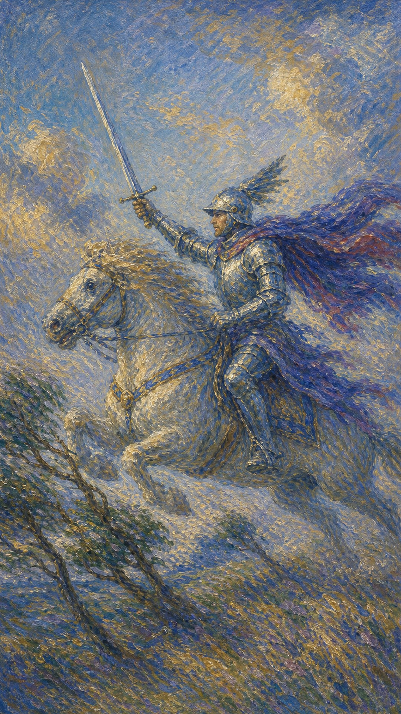

# 宝剑骑士

宝剑骑士策马疾驰，长剑前指，斗篷在狂风中猎猎翻飞。他不顾一切地向前冲，眼里只有目标，速度快得仿佛要把空气划开。这是一股锐不可当、却也可能横冲直撞的力量。

这张牌出现时，行动来得迅猛而果决。你可能充满冲劲，急于推进、辩论、出击，被一个想法或目标推着全速前进。

宝剑骑士的风是疾风。它提醒你，果断与速度是优势，但若没有方向与节制，再快的冲锋也可能冲向悬崖。让勇猛配上判断，锋芒才不会反噬自己。

骑士披甲扬剑，骑着白马向前疾冲，斗篷与马鬃在狂风中飞扬，天空乌云翻滚。画面象征果决、迅猛、勇往直前与不计后果的冲劲。

## 基础要素

1. 牌名：宝剑骑士 (Knight of Swords)
2. 数字编号：61 号牌
3. 核心主题：果决、迅猛、行动、雄辩
4. 元素：风中之风（风元素最活跃的层面）
5. 星座或行星：风象人格 / 双子、天秤、水瓶的行动能量
6. 希伯来字母：无固定传统对应
7. 代表意义：通过果断的行动推进目标，但需配以方向与节制

## 牌面要素

| 要素 | 含义 |
|------|------|
| 疾驰白马 | 迅猛的行动力，不受约束的冲劲。 |
| 前指长剑 | 明确的目标与决心，毫不犹豫地出击。 |
| 翻飞斗篷 | 速度与气势，被理想或念头推动向前。 |
| 翻滚乌云 | 急躁带来的动荡，冲动潜藏的风险。 |
| 披甲骑士 | 勇气与战斗力，也是一种不愿停下的执着。 |
| 倾身姿态 | 全力以赴的投入，也暗示失衡的可能。 |

## 塔罗灵数

宫廷牌中的骑士代表行动、追求与全力投入。宝剑骑士是风元素的行动者，思想化作疾风，催着他向目标全速冲锋。

他的力量在于果决与勇猛。一旦认定方向，便毫不犹豫地出击，势如破竹。但这股冲劲若缺了判断，也容易变成鲁莽。

这张牌提醒你，速度需要方向，勇气需要节制。在全力冲刺之前，先确认你冲的是对的方向，否则越快，越偏。

## 牌面解读重点

宝剑骑士作为宫廷牌，象征一种全力以赴、势不可当的人物性格。他身穿盔甲、骑着威猛的白马精力充沛地向前冲，高举的剑象征他对目标与使命的奉献，白马则是激励他的纯粹能量；背景中风暴云开始聚拢、树木在强风中弯曲，然而风并未阻止他——他一头扎进去，急切地想完成任务。正位时，这份风元素的行动力化作果决、迅猛、雄辩的冲劲；逆位时，则容易滑向鲁莽、横冲直撞，把雄辩变成攻击。无论正逆，他的核心都是被一个念头推着全速前进的疾风——区别只在于这股冲劲是否配上了方向与节制。这张牌提醒人：要达成愿望需要敏捷的行动，但越快，越要看清自己冲的是不是对的方向。

## 正位牌意

**关键词**：果决，迅猛，行动力，雄辩，勇往直前，目标明确，冲劲

正位的宝剑骑士代表果断而迅猛的行动力。你可能正被一个明确的目标驱动，充满冲劲，想要快速推进、突破、出击。

它带来势不可当的气势。你思路清晰、行动果决，敢于直言、勇于辩论，像一阵疾风般推动事情向前。

宝剑骑士提醒你，把勇猛用在对的方向上。果断是优势，但别让急躁取代了思考；冲刺之前，先看清前方的路。

### 爱情/婚姻

感情中，宝剑骑士常表示热烈而直接的追求，或一段进展迅猛的关系。你可能主动出击、勇敢示爱，不愿拖泥带水。

单身者可能遇到或成为那个主动、热情、直率的追求者。这份果决很迷人，但提醒你别只顾冲刺而忽略了对方的节奏。

有伴侣者可能进入快节奏的阶段，或因直言、争辩而产生摩擦。提醒你，表达想法时多一分温柔，少一分锋利。

这张牌提醒你，爱情不是辩论赛。果断追求的同时，也要懂得倾听与等待，让两颗心同步前行。

### 事业学业

事业学业上，宝剑骑士是雷厉风行、高效推进的信号。你可能正全力冲刺某个目标，行动果决，效率惊人。

它适合主动出击、抓住时机、果断决策。你思路敏捷、表达有力，是推动项目向前的关键力量。

学习中，它代表高效的冲刺、明确的目标，或一段全力以赴的拼搏期。提醒你别因求快而忽略了根基。

这张牌建议你乘势而上，同时保持判断。速度是你的武器，但方向才决定你能冲多远。

### 人际财富

人际方面，宝剑骑士可能表示直率的交流、果断的表态，或一个充满行动力的人出现。你敢说敢做，立场鲜明。

你可能在群体中扮演推动者的角色，但要留意，过于强势或急躁可能让人感到压迫。锋芒需要懂得收放。

财富方面，适合果断把握机会、快速行动。但也提醒你别因冲动而冒进，重大决定前仍需冷静评估风险。

它提醒你，果决能抓住机会，鲁莽却会埋下隐患。在出手之前，留一秒给清醒的判断。

### 健康生活

健康上，宝剑骑士与旺盛的精力、快节奏的生活有关。你可能动力十足，但也要警惕用力过猛、操之过急。

它提醒你别透支自己。冲劲十足是好事，但身体需要节奏，一味疾驰而不休整，容易突然耗竭。

请为自己的冲刺加上刹车。懂得在适当的时候慢下来，才能让这股能量走得更长、更稳。

### 其它牌意

若问具体事件，正位多表示快速的进展、果断的行动、明确的目标，或一次势不可当的推进。

它也可能代表急事、迅速的决定、激烈的辩论，或一个雷厉风行的人。

作为建议，宝剑骑士说：认准方向，就全力冲。但别忘了，最快的剑客，也懂得在何时收住那一击。

### 情境指引

- **过去**：曾被一个明确的目标推着全速前进，凭着果决与冲劲，雷厉风行地推进某事。
- **现在**：你正充满冲劲、势不可当，急于快速推进、突破、出击，像一阵疾风般向前。
- **未来**：敏捷的行动会带你接近愿望，但越快越要先看清前方的路，别冲偏了方向。
- **挑战**：如何让勇猛配上判断，在全力冲刺之前确认自己冲的是对的方向。
- **障碍**：急躁、缺乏节制，或一头扎进去而忽略风险，可能让冲锋冲向悬崖。
- **环境**：周遭节奏快、变动急，像聚拢的风暴云，催促你迅速决断、果断行动。
- **支持**：你清晰的思路、果决的执行力，以及敢于直言的勇气，都是推进的依托。
- **建议**：认准方向就全力冲，但别让急躁取代思考；最快的剑客也懂何时收住那一击。
- **优势**：行动果决、效率惊人、表达有力，是推动事情向前的关键力量。
- **弱点**：容易因求快而忽略根基，或因过于强势、急躁而让人感到压迫。
- **正面影响**：迅猛的行动与明确的目标，让你抓住时机、势如破竹地推进。
- **负面影响**：若缺了方向与节制，速度会变成鲁莽，越快越偏、越冲越乱。
- **希望发生**：希望快速达成目标、突破阻碍，让冲劲化作实实在在的进展。
- **害怕发生**：害怕冲得太快却冲错方向，或因急躁而功亏一篑。
- **你如何看对方**：你可能被对方的热情果决吸引，或自己正主动出击、勇敢追求。
- **对方如何看待你**：对方可能觉得你主动、热烈、有行动力，欣赏你的果决与坦率。
- **关系当前状态**：处在进展迅猛、节奏很快的阶段，热烈直接，却也容易因直言而摩擦。
- **关系未来发展**：果断追求的同时也要懂得倾听与等待，让两颗心同步前行。
- **结果**：通常向好，预示快速的进展与势不可当的推进，前提是认准了对的方向。

## 逆位牌意

**关键词**：鲁莽，冲动，横冲直撞，缺乏计划，言语攻击，或失去方向

逆位的宝剑骑士表示这股冲劲失去了节制。你可能行事鲁莽、不计后果，或因急躁、冲动而横冲直撞，把事情越搞越乱。

它也可能表示言语过于尖锐、咄咄逼人，把雄辩变成了攻击；或方向不明、计划缺失，空有速度却不知冲向何方。

逆位像一匹脱缰的烈马。力量惊人，却失了缰绳，容易撞翻自己，也伤及无辜。

### 爱情/婚姻

感情中，逆位宝剑骑士可能表示操之过急、过于强势，或因冲动、直白而伤害感情。你可能逼得太紧，让对方喘不过气。

单身者可能因急于求成而吓退对方，或遇到只顾自己、不顾感受的追求者。提醒你放慢脚步，感情急不得。

有伴侣者要留意争吵中的言语攻击，或一方过于霸道、不愿妥协。锋利的话一旦出口，往往难以收回。

这张牌提醒你，爱里没有输赢。收起咄咄逼人的剑，多一点耐心与体谅，关系才不会在冲撞中受伤。

### 事业学业

事业学业上，逆位宝剑骑士表示鲁莽冒进、缺乏计划，或因急于求成而出错、招致冲突。

你可能跳过了必要的准备就匆忙行动，或因过于强势而与人摩擦。提醒你慢下来，把方向和步骤想清楚。

学习中，它代表心浮气躁、急功近利，或因冲动而做出草率的决定。建议沉住气，扎实推进。

这张牌建议你勒住缰绳。在全速冲刺之前，先确认前方是路还是坑，谋定而后动才能走得稳。

### 人际财富

人际方面，逆位宝剑骑士可能代表言语冲突、咄咄逼人、强词夺理，或因冲动而破坏关系。

你或他人可能把话说得太冲、太绝，急于压倒对方。提醒你，赢了争论却输了人心，并不值得。

财富方面，要警惕冲动消费、盲目投资或仓促决定带来的损失。提醒你重大财务行动前务必冷静评估。

它提醒你，冲动是代价最高的习惯。在情绪上头时，先按下行动的暂停键。

### 健康生活

健康上，逆位宝剑骑士与用力过猛、操劳过度、急躁引发的问题有关。你可能透支精力，或因紧张焦躁而身心失衡。

它提醒你给自己踩刹车。一味疾驰不休，迟早会让身体亮起红灯。学会减速，是一种必要的智慧。

请温柔地对待急于求成的自己。慢下来不是退缩，而是为了让这股能量，能更长久地陪你前行。

### 其它牌意

若问具体事件，逆位多表示行动鲁莽、计划缺失、冲突激烈，或一次因冲动而失控的局面。

它也可能代表急躁、横冲直撞、言语攻击，或一个鲁莽冒进的人。

作为建议，逆位宝剑骑士说：先勒住你的马。把冲动换成判断，把蛮力换成方向，你的勇猛才能真正带你抵达目标。

### 情境指引

- **过去**：曾因鲁莽冒进、不计后果地冲，或言语太冲，把某件事越搞越乱、留下后患。
- **现在**：这股冲劲失了节制，你可能行事鲁莽、急躁冲动，或方向不明、空有速度。
- **未来**：若不勒住缰绳、想清方向，横冲直撞会撞翻自己，也伤及无辜。
- **挑战**：如何把冲动换成判断、把蛮力换成方向，在全速之前先确认前方是路还是坑。
- **障碍**：急于求成、咄咄逼人，或跳过必要准备就匆忙行动，让事情失控。
- **环境**：周遭或充满冲突与对立，紧张的气氛容易激起你更猛烈的反弹。
- **支持**：放慢脚步的自制、谋定而后动的耐心，以及冷静评估风险的习惯，都是依托。
- **建议**：先勒住你的马，把冲动按下暂停键，谋定而后动，勇猛才能真正带你抵达目标。
- **优势**：你的力量与锐气仍在，一旦找回缰绳与方向，仍能锐不可当地推进。
- **弱点**：鲁莽冒进、言语攻击、缺乏计划，容易把雄辩变成伤人的咄咄逼人。
- **正面影响**：作为警示，逆位促你勒住冲动、看清方向，避免一次失控的冲撞。
- **负面影响**：横冲直撞、强词夺理、仓促决定，让冲突激化、损失加重、人心尽失。
- **希望发生**：希望尽快达成目标，却又怕慢下来错失时机，内心被急躁推着。
- **害怕发生**：害怕因冲动而酿成大错，或赢了争论却输了人心、撞翻了关系。
- **你如何看对方**：你可能因急于求成而逼得太紧，或觉得对方只顾自己、不顾你的感受。
- **对方如何看待你**：对方可能觉得你过于强势、霸道、咄咄逼人，让人喘不过气。
- **关系当前状态**：处在争吵与言语攻击的紧绷里，一方过于霸道、不愿妥协，冲撞不断。
- **关系未来发展**：收起咄咄逼人的剑、多一分耐心与体谅，关系才不会在冲撞中受伤。
- **结果**：是一段需要勒住冲动、谋定后动的时期，待找回方向，勇猛才能化作助力。
