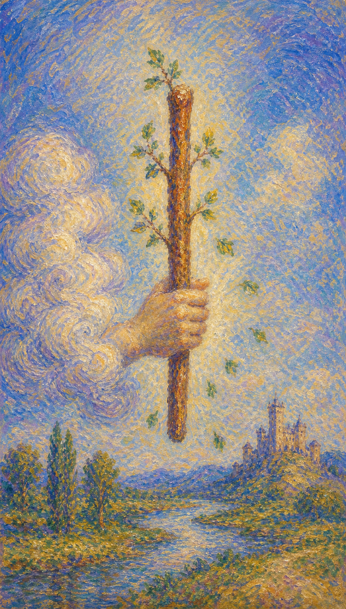

# 权杖一

权杖一像一道刚落入掌心的火光。它还没有成为道路、事业或关系，只是一股纯粹的生命冲动，催促人从沉睡里抬头。

这张牌出现时，常常意味着某个新的愿望正在体内发热。它可能是一项计划的第一念、一段吸引的闪电、一场旅行的召唤，也可能是你重新相信自己还能创造的瞬间。云端伸出的那只强劲大手紧握粗壮的权杖，权杖上萌出的绿叶在空中飞舞，大手四周环绕白色毫光，象征至高无上的力量，也像在转达神的旨意。

权杖一并不急着给出完整答案。它更像一粒带火的种子，提醒你先承认那股想要开始的力量，再慢慢为它寻找土壤、方向与持续燃烧的方式。作为整组权杖的首牌，它代表无穷的潜能——像一点火花，已隐隐藏着燎原之势，暗示某种方案即将开始执行。

云中伸出的手握着发芽的权杖，权杖长着新绿的叶片在空中飞舞，远处有山峦、草原、树木、流水与遥遥可见的城堡。机会从看不见的地方探出枝条，邀请人把灵感从内在带到现实。首牌意味着新的开始，权杖代表能量，二者相合便是无穷的潜能：无论结果如何，此刻放弃都不是明智之选。

## 基础要素

1. 牌名：权杖一 (Ace of Wands)
2. 数字编号：22 号牌
3. 核心主题：灵感、开端、创造力、行动火花
4. 元素：火
5. 星座或行星：火象能量 / 白羊、狮子、射手
6. 希伯来字母：无固定传统对应
7. 代表意义：通过初生的热情开启新的行动周期

## 牌面要素

| 要素 | 含义 |
|------|------|
| 云中之手 | 机会、天赋与忽然降临的推动力。它不完全来自计划，也像命运伸来的一次邀请。 |
| 强劲大手 | 紧握权杖的有力之手，象征执行的决心与转达神意的力量，提示某种方案即将付诸行动。 |
| 发芽权杖 | 创造力正在苏醒，热情已有生命迹象，但仍需要行动、时间与照料。 |
| 飘落叶片 | 灵感活跃，旧的静止状态被打破，能量开始在空气中流动。 |
| 白色毫光 | 大手四周的光辉，象征至高无上的祝福与纯净的精神能量。 |
| 远方城堡 | 未来可抵达的成果。它尚在远处，说明火花需要经过旅程才会成为现实。 |
| 山峦草原 | 开端之后的辽阔天地与挑战。热情会照亮路，也会显出需要跨越的坡度。 |
| 树木流水 | 生长与流动的生命力，提示火的能量需要自然的滋养与通道。 |
| 明亮天空 | 意识清醒、希望上升，适合把内在冲动带到可见世界。 |

## 塔罗灵数

数字 1 代表起点、种子与纯粹潜能。它像所有故事最初的呼吸，尚未分化为复杂情节，却已经包含未来的方向。

在权杖一里，数字 1 被火点亮。安静的可能性开始向上生长，化作想做、想爱、想创造、想走出去的力量。

这张牌的灵数提醒你，新的周期往往先以身体的热度出现。你可能还说不清它会通向哪里，但某个部分已经知道：生命不愿继续停在原地。

## 牌面解读重点

权杖一正位，表示潜意识里那股"想创造、想开始"的火被坦然承认，并顺势向外释放——你感到一股冲动，于是真的让它发光。权杖一逆位，则是同样的火在潜意识里被压抑、犹豫或耗散：想做却没做，火种被恐惧与拖延困在湿柴之下。正逆位的差别，在于这股热情能否找到通往现实的通道。它们的共同特点是：一切都以本能的热度为起点，先有冲动，后有方向，火光本身比清晰的计划来得更早。

## 正位牌意

**关键词**：灵感，热情，开始，创造力，机会，行动，冒险，潜能，火花，新生，主动，生育

正位的权杖一表示一股新的能量正在点燃。它带来值得珍惜的开端：一个念头、一封消息、一次心动，一种想要重新投入生活的冲动。

这张牌鼓励你把灵感带入行动。不要急着要求它立刻完整，也不要因为看不见终点就否定它。火种最初只需要被承认，然后才需要柴薪、方向与耐心。

在事件层面，它常指向新项目、新机会、新关系、新旅程，或一段停滞之后重新流动的局面。若你正在等待信号，权杖一往往就是那道最初的光，提醒你无论结果如何，放弃都不可取。

### 爱情/婚姻

感情中，权杖一带来鲜明的吸引力。它像两个人之间忽然亮起的火花，使目光、话语和身体都变得更有温度。

单身者可能遇到让自己迅速心动的人，也可能重新对爱产生期待。这里的缘分通常带着热烈、直接、带一点冒险意味的气息，需要后续相处来确认能否扎根。

有伴侣者则可能迎来关系升温、共同计划、亲密感恢复，或一起开启新阶段。若关系曾经沉闷，这张牌像把窗打开，让新鲜空气与欲望重新进入。

它也提醒你分辨激情与承诺。火花珍贵，却需要被温柔照看；若只追逐燃烧的瞬间，关系很容易在最亮的时候消耗得最快。

- **现况**：两人之间刚刚亮起火花，吸引强烈却尚未稳定，关系正处在令人心动的开端。
- **桃花**：容易遇到让你迅速心动的对象，缘分热烈直接、带一点冒险气息，需要相处来确认。
- **看法**：你被对方点燃，觉得久违的热情重新回到身上，愿意主动靠近。
- **复合**：旧情有重燃的可能，火苗已经出现，但要看双方愿不愿意为它继续添柴。

### 事业学业

事业学业上，权杖一非常适合开启新项目、提出创意、投递申请、创业、转向新领域，或把长期搁置的想法重新拾起。

它更强调"启动"而非"完成"。此时最重要的是让想法离开脑海，进入纸面、日程、邮件、作品或第一次尝试。只要开始，后续资源才有机会被吸引过来。

如果你正在学习，它象征兴趣被点燃，适合选择更能激发主动性的方向。若你感到倦怠，这张牌提醒你找回最初为什么想做这件事。

工作中它也可能代表上级或环境给出的机会。机会未必包装得完美，有时只是一个小窗口，但你若抓住，便能看见新的成长线索。

- **现况**：新项目、新机会、新方向正在浮现，你正处于跃跃欲试的启动期。
- **建议**：让想法离开脑海，进入纸面与行动，先开始，再让资源被吸引过来。
- **关系**：环境或上级可能递来机会，适合主动表达、争取合作。
- **发展**：前景向上打开，只要抓住最初的火花，成长线索会逐渐清晰。

### 人际财富

人际方面，权杖一带来主动表达与建立连接的勇气。你可能更愿意开口、亮相、参与活动，也更容易被有活力的人吸引。

它适合拓展圈子、发布作品、提出合作设想。此时的人际能量带着开场的光，重点在于让别人看见你正在燃起什么。

财富方面，权杖一可能意味着新的收入渠道、副业灵感、创业念头或投资机会。它提示"可能性正在出现"，但尚未等同于稳定收益。

因此，面对金钱议题时，可以先记录、调研、试水。让火花进入现实检验，避免只因一时兴奋就投入过多资源。

- **现况**：你更愿意主动表达、亮相、参与活动，容易被有活力的人吸引。
- **建议**：拓展圈子、发布作品、提出合作，让别人看见你正在燃起什么。
- **财运**：可能出现新收入渠道或投资灵感，先记录调研试水，别因兴奋投入过多。

### 健康生活

健康生活上，权杖一象征活力回升。它适合开始运动、调整作息、培养新习惯，也适合通过阳光、户外、舞蹈、跑步等方式唤醒身体。

如果你经历过疲惫或停滞，这张牌像身体里重新亮起的小灯。它不要求你一下子变得强大，只提醒你从一个可持续的动作开始。

也要留意火元素过旺带来的急躁、上火、睡眠不稳或运动过度。新的能量需要通道，不宜被压抑，也不宜被挥霍。

### 其它牌意

若问具体事件，正位多表示新的门正在打开。事情处于萌芽期，尚未定型，适合主动探索、争取、试做，让行动先于完美条件发生。

它也可能代表创作灵感、旅行召唤、性爱能量、怀孕或生育象征、创业冲动、比赛开端、某种突然恢复的勇气。

作为建议，权杖一说的是：先让生命动起来。你不必把未来一次看完，只需要认真回应此刻在你手中发光的那根杖。

### 情境指引

- **过去**：曾有一股新的热情或灵感被点燃，开启了某段令你振奋的开端。
- **现在**：一股新能量正在体内发热，你正站在跃跃欲试的起点。
- **未来**：新的机会、项目或缘分即将到来，火花会引向更广的可能。
- **挑战**：如何把一时的热情转化为持续的行动，而不是只追逐燃烧的瞬间。
- **障碍**：犹豫、缺乏方向或对失败的担忧，可能让火花迟迟无法燃起。
- **环境**：周遭氛围鼓励创造与尝试，可能有让你心动的新机会出现。
- **支持**：身边或许有人为你点火，给你启动的勇气与灵感。
- **建议**：抓住此刻的火花，先行动起来，让灵感离开脑海进入现实。
- **优势**：充满热情、富有创造力，敢于开启新事物。
- **弱点**：容易三分钟热度，缺乏后续的规划与耐心。
- **正面影响**：新的灵感、活力，以及重新投入生活的动力。
- **负面影响**：冲动行事或热情过旺，可能在尚未准备好时灼伤自己。
- **希望发生**：希望新的开始带来活力与成果，让生活重新燃起。
- **害怕发生**：害怕火花稍纵即逝，或开始后无力持续。
- **你如何看对方**：把对方看作充满活力、能点燃你热情的人。
- **对方如何看待你**：对方被你的热情与创造力吸引，觉得你充满生命力。
- **关系当前状态**：正处在火花初亮的开端，新鲜而充满可能。
- **关系未来发展**：预示关系升温或共同开启新阶段，需要双方持续添柴。
- **结果**：通常乐观，预示一个充满热情的新开始，鼓励你回应手中发光的杖。

## 逆位牌意

**关键词**：热情受阻，拖延，冲动，计划不足，灵感枯竭，错失机会，犹豫，半途而废，分散，疲惫

逆位的权杖一表示火种没有顺利燃起。它可能被恐惧压住，被拖延耗散，也可能烧得太急，尚未找到方向就先把自己灼伤。

这张牌常出现在"想开始却迟迟不能开始"的时刻。你也许有灵感，却缺少信心；有欲望，却缺少计划；有机会，却因为犹豫、外部阻力或精力不足而无法承接。

逆位并不意味着火已经熄灭。它更像湿柴上的烟，提醒你先照看内在状态，清理阻塞，重新判断这股热情是否仍然属于你。

### 爱情/婚姻

感情中，逆位权杖一可能表现为吸引力不稳定、热情忽冷忽热，或关系开始得很快，却没有足够的情感承载。

单身者可能遇到令人心动却难以持续的人，也可能因为过去的疲惫，对新的缘分提不起真正的热情。心门没有关闭，只是火还没有找到安全的空气。

有伴侣者则可能感到关系缺少新鲜感，亲密减少，或双方对未来计划缺乏共同动力。此时不宜只责怪冷淡，应该看见更深处是否有压力、失望或未被听见的需求。

若关系里只有欲望的亮光，却没有稳定的照顾，逆位提醒你放慢脚步。真正值得延续的火，会愿意在日常里继续发热。

- **现况**：吸引力不稳定，热情忽冷忽热，关系开始得快却缺乏承载。
- **桃花**：可能遇到心动却难持续的人，或因疲惫对新缘分提不起真正的热情。
- **看法**：你心门没关，只是火还没找到安全的空气，暂时提不起劲。
- **复合**：旧火未灭却也未旺，复合需先清理阻塞，确认热情是否仍属于你。

### 事业学业

事业学业上，逆位权杖一常指创意卡住、项目延迟、计划启动困难，或一开始很兴奋，执行时却发现资源、时间、能力并未准备好。

你可能同时想做许多事，却没有一件真正落地。也可能因为害怕失败，把最想尝试的方向不断推迟。

此时需要缩小目标。先完成一个最小动作：写下提纲、发出邮件、整理资料、预约咨询、做一次样品，让宏大的开端从手边生长。

若外部机会迟迟不来，也可以回到内在动机。问问自己：这件事仍让我发热吗？还是我只是被过去的兴奋推着走？

- **现况**：创意卡住、项目延迟、启动困难，或兴奋之后发现资源尚未备好。
- **建议**：缩小目标，先完成一个最小动作，让宏大的开端从手边生长。
- **关系**：合作中留意承诺过快、执行不足，火开了头却没人添柴。
- **发展**：外部机会迟来时回到内在动机，确认这件事是否仍让你发热。

### 人际财富

人际方面，逆位权杖一可能带来表达失衡。你可能急着证明自己，给他人压力；也可能因为缺少自信，把真正想说的话吞回去。

合作中要留意承诺过快、执行不足的情况。火开了头，后续却没有人添柴，关系和计划都会变得尴尬。

财富方面，它提醒你谨慎面对新机会。看似热烈的项目、投资或副业，可能还缺少清楚模式。先确认成本、周期、风险和自己的精力，再决定投入多少。

这张牌也可能提示赚钱动力下降。若你感到麻木，问题未必只在金钱本身，也许是你与创造力、价值感之间的连接需要重新点燃。

- **现况**：表达失衡，或急着证明自己给人压力，或缺乏自信把话吞回去。
- **建议**：放慢节奏，先照看内在状态，再决定向外释放多少能量。
- **财运**：谨慎面对看似热烈的新机会，先确认成本、周期与风险再投入。

### 健康生活

健康上，逆位权杖一可能表现为精力低落、上火、急躁、睡眠不稳，或运动计划开始得太猛，难以持续。

身体像一片需要重新点燃的炉膛。它需要空气，也需要节制；需要动起来，也需要避免突然过度消耗。

适合从温和的活动开始，例如散步、拉伸、规律睡眠、减少刺激性摄入。让身体慢慢记起活力，疲惫也会在被尊重时逐渐松开。

### 其它牌意

若问具体事件，逆位多表示开端延迟、机会尚未成熟、热情不足，或计划需要重新调整。事情未必没有希望，只是现在的火候还不够稳定。

它也可能代表创作瓶颈、性吸引下降、旅行受阻、创业准备不足、消息迟来，或某个想法需要被放回内心重新孵化。

作为建议，逆位权杖一说：不要责怪自己暂时没有燃烧。先找到潮湿之处，慢慢晾干柴薪；当内在重新变轻，火自然会再次升起。

### 情境指引

- **过去**：曾经的热情被压抑或耗散，某个想开始的契机未能燃起。
- **现在**：想开始却迟迟不能开始，火种被恐惧、拖延或疲惫困住。
- **未来**：若不照看内在状态，机会可能因准备不足而延迟或滑走。
- **挑战**：如何重新找回动力，分辨这股热情是否仍真正属于你。
- **障碍**：拖延、犹豫、精力不足或外部阻力，妨碍火花燃起。
- **环境**：周遭可能缺乏支持，或机会尚未成熟，让你难以发力。
- **支持**：需要先向内寻找支持，重新点燃自己的创造力与信心。
- **建议**：不要责怪自己暂时没燃烧，先清理阻塞，让柴薪慢慢晾干。
- **优势**：仍保有潜在的热情，一旦理顺方向便能重新点燃。
- **弱点**：容易冲动起步又中途熄灭，或被恐惧拖住而原地踏步。
- **正面影响**：作为提醒，让你先照看内在再出发，避免盲目消耗。
- **负面影响**：拖延、错失机会、热情枯竭或个人动力停滞。
- **希望发生**：希望重新找回动力与方向，让停滞的火重新燃起。
- **害怕发生**：害怕热情彻底熄灭，或机会因犹豫而永远错过。
- **你如何看对方**：可能觉得对方热情不稳定，忽冷忽热，难以依靠。
- **对方如何看待你**：对方可能觉得你提不起劲，或开始得快却难以持续。
- **关系当前状态**：处在火候不稳的阶段，需要双方重新点燃与照看。
- **关系未来发展**：若不调整，关系可能因缺乏持续动力而冷却。
- **结果**：可能是一段需要重新蓄能的时期，待内在变轻，火自会再起。
