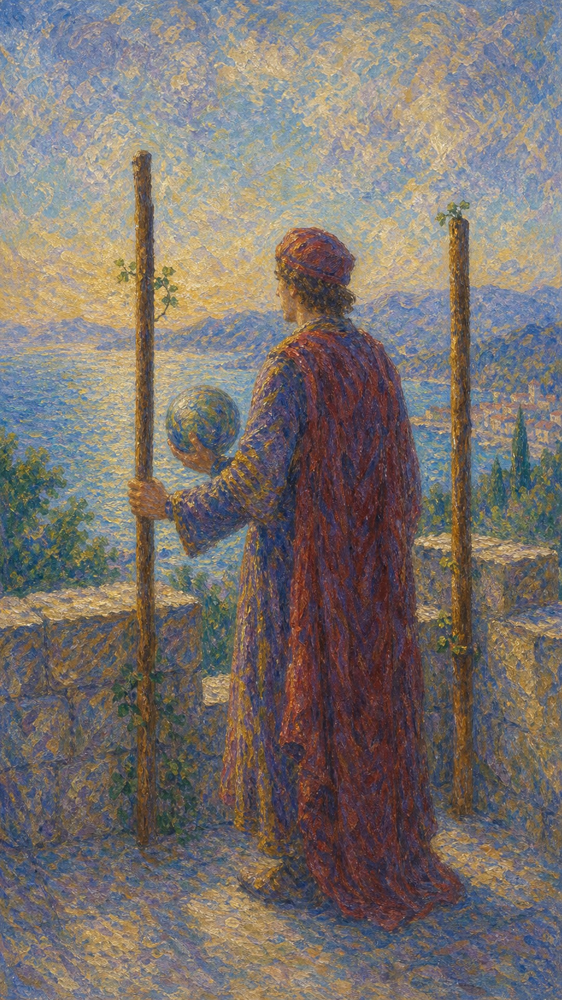

# 权杖二

权杖二站在高处眺望远方。热情已经苏醒，下一步需要视野、计划与选择，把内心的火推向更广阔的世界。

当这张牌出现，说明你正在评估未来方向。眼前已有资源，真正的课题在于敢不敢离开熟悉范围，迎向更大的可能。

人物站在城墙上，一手扶杖，一手托着地球仪。另一根权杖固定在墙边，象征安全基础与远行欲望同时存在。

## 基础要素

1. 牌名：权杖二 (Two of Wands)
2. 数字编号：23 号牌
3. 核心主题：远景、选择、规划、扩张
4. 元素：火
5. 星座或行星：火星在白羊座
6. 希伯来字母：无固定传统对应
7. 代表意义：通过远见与计划决定行动方向

## 牌面要素

| 要素 | 含义 |
|------|------|
| 城墙高处 | 已有位置、资源与观察全局的角度。 |
| 地球仪 | 世界、机会、远方计划与主动掌握。 |
| 两根权杖 | 选择、对照与行动方向的分岔。 |
| 固定权杖 | 安全基础，也提示旧位置的牵引。 |
| 远方海岸 | 扩张、旅行、海外或尚未抵达的目标。 |
| 红色衣袍 | 热情、野心与行动欲。 |

## 塔罗灵数

数字 2 代表选择、关系与二元张力。火的能量来到 2，开始从单纯冲动进入比较和判断。

权杖二的 2 号能量说明：视野决定行动的尺度。真正的前进，常常先从承认自己渴望更大的世界开始。

## 正位牌意

**关键词**：规划，远见，选择，扩张，主动权，海外，未来布局

正位的权杖二表示你正在制定下一阶段计划。适合评估资源、扩大格局、选择长期更有潜力的方向。

### 爱情/婚姻

感情中可能出现关系未来的讨论，例如异地、同居、见家长或长期承诺。单身者可能对远方的人、新圈子或更成熟的关系模式产生兴趣。

### 事业学业

事业学业上适合做战略规划、申请机会、考虑转岗、留学、出差或跨领域发展。你已拥有基础，现在需要更清楚的路线图。

### 人际财富

人际方面适合拓展圈层，寻找能共同眺望远方的人。财富上宜做长期配置、事业布局或海外相关计划，避免只看眼前收益。

### 健康生活

健康生活上适合制定可持续计划，例如长期训练、体检安排、饮食结构调整。重要的是先看见未来想抵达的状态。

### 其它牌意

可能代表远行计划、合作评估、职业选择、市场扩张。若问建议，正位提醒你把目光放远，再决定如何迈步。

## 逆位牌意

**关键词**：犹豫，视野受限，计划延误，害怕扩张，选择困难

逆位的权杖二表示方向尚未定稳。可能因为害怕风险而停在原地，也可能计划缺少现实依据。

### 爱情/婚姻

感情中可能对未来缺少共识，或一方想前进，另一方仍留在安全区。关系需要坦诚讨论目标，否则热情会被不确定感消耗。

### 事业学业

事业学业上容易有机会却不敢决定，或目标太大、步骤太模糊。适合回到现实条件，重新比较时间、资源和风险。

### 人际财富

人际方面可能因立场不明而错过合作。财富上要小心计划拖延、市场判断失准，避免因为焦虑在两个方向之间来回摇摆。

### 健康生活

健康上可能明知需要调整，却迟迟无法开始长期计划。建议先选择一个最容易执行的切入口，减少过度设想。

### 其它牌意

事情可能卡在决策前。逆位提醒你：看得见远方之后，还需要为自己选定一条可以实际走下去的路。
