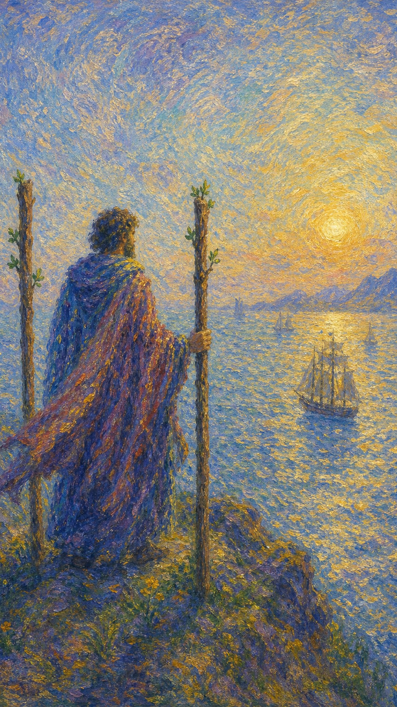

# 权杖三

权杖三是出发之后的眺望。火已经离开掌心，变成远行的船、寄出的信、投向世界的努力，在辽阔水面上等待回声。

这张牌出现时，事情通常已经不再停留于构想。你做过选择，也采取了行动；如今需要站在更高处，耐心看见能量如何在外部世界展开。人物像一个成功的商人立于山颠，右手撑着权杖寻求支持，一副期待者的形态，远眺平静辽阔的海面——那正是出航的良机。

权杖三带着一种安静的期待。它教你松开过度掌控，相信凡是真正被送出去的东西，都会在风、潮汐与时间中找到回应。若权杖象征神灵的旨意，那么这不可知的未来便略带几分依靠天意之意：有些疆域需要探索，有时人力难以尽达，但你已经踏上了旅程。

人物站在山颠远眺海面，三根权杖环绕身侧，远处船只在海面航行。金黄的背景象征光明，平静辽阔的海面预示成功与出航的良机。他以统领的姿势立于高处，登高远望，象征领导地位与高瞻远瞩的目光——这是一位有理想抱负、对未来充满愿景、很有远见的人，计划已离开原点，进入更广阔的交换。

## 基础要素

1. 牌名：权杖三 (Three of Wands)
2. 数字编号：24 号牌
3. 核心主题：扩展、等待成果、远航、初步成就
4. 元素：火
5. 星座或行星：太阳在白羊座
6. 希伯来字母：无固定传统对应
7. 代表意义：通过已启动的行动迎接未来回报

## 牌面要素

| 要素 | 含义 |
|------|------|
| 山颠眺望 | 站在更高视角观察未来走向。行动已展开，人需要从执行者变成观察者。 |
| 统领姿态 | 立于高处的领导地位，象征高瞻远瞩与对全局的掌握。 |
| 三根权杖 | 初步结构、扩展中的行动力，以及已经立住的计划支点。 |
| 撑杖之手 | 右手撑着权杖寻求支持，一副期待者的形态，等待远方的回应。 |
| 远方船只 | 商机、旅行、消息、回报与外部世界的回应。努力正在远处运行。 |
| 平静海面 | 辽阔而平静的水面正是出航良机，预示成功，也提示成果受环境与时机影响。 |
| 背影人物 | 注意力投向未来，也象征暂时无法看见他脸上的期待与忧虑。 |
| 金色天空 | 希望、清晰与计划的可见性。前方有光，但仍需要等待。 |

## 塔罗灵数

数字 3 代表生长、表达与初步成形。它让一的火花、二的选择，进入更真实的扩展。

在权杖三里，火不再只是个人意志。它已经穿过门槛，与世界发生交换，开始接受距离、市场、他人和时间的回应。

这张牌的灵数提醒你：凡是想长大的事物，都必须离开完全可控的地方。你已经把船放入水中，接下来要学会观察风向。

## 牌面解读重点

权杖三正位，表示潜意识已经接受"我能做的都已做了，接下来交给世界与时间"，于是站上山颠、安然等待回应——掌控转化为高瞻远瞩的观察。权杖三逆位，则是同样的等待在潜意识里变成焦虑与不甘：以为自己在等结果，实则尚未真正送出，或送出后因迟迟没有回声而不停想收回能量。正逆位的差别，在于能否信任已经启动的航程。它们的共同特点是：火已离开掌心、进入更广阔的交换，眼前所求的成果不再完全由个人意志决定，而要在风向、潮汐与时机里慢慢显现。

## 正位牌意

**关键词**：扩张，远景，等待成果，贸易，旅行，合作推进，前途打开，远航，领导，高瞻远瞩，初步成就

正位的权杖三表示行动已经发出，未来正在打开。它带来一种更成熟的期待：你知道自己已经做了该做的事，现在需要看见它如何远行。

这张牌常与扩张、远方、外部回应、海外事务、市场拓展、合作进展有关。它说明事情已经越过最初阶段，开始进入更大的流通系统。

若你正在焦虑结果，权杖三提醒你别急着收回能量。真正的成果有自己的航程；你能做的是持续观察、调整方向，并准备承接即将抵达的回报。这是探索新领域的好时机，你也已经踏上了探索的旅程。

### 爱情/婚姻

感情中，权杖三常代表关系开始看向更远的未来。两个人不再只停留在当下的吸引，而会思考共同生活、距离、旅行、城市、家庭或长期方向。

单身者可能通过旅行、网络、海外事务、学习或新环境遇见更开阔的缘分。这样的关系常带有远方气息，让你看见不同于过去的情感可能。

有伴侣者适合共同规划未来。若关系经历了初步选择，现在需要把愿景展开，看看它能否经得起现实距离与时间安排。

它也提示你不要只靠等待维系关系。若你把全部希望投向对方的回应，自己却停在原地，期待会慢慢变成消耗。好的远方需要两个人都在行动。

- **现况**：关系开始看向更远的未来，从当下吸引走向对共同生活的展望。
- **桃花**：可能通过旅行、网络、海外或新环境遇见带着远方气息的缘分。
- **看法**：你对这段关系怀有愿景，期待它能经得起距离与时间。
- **复合**：旧情有重启可能，但需双方都在行动，而非只靠一方等待回应。

### 事业学业

事业学业上，权杖三非常适合项目发布、市场拓展、申请提交、外部合作、留学计划、跨地区业务和等待结果。

它说明你已经完成了关键出发。接下来要从更大的视角看局面：谁会回应？资源在哪里流动？哪条路径正在变得更清晰？

如果你正在求职、考试或申请，这张牌往往表示材料已经送出，结果尚在路上。焦虑可以理解，此时更适合准备下一步，让目光离开反复刷新的窗口。

工作中它也可能代表领导者或开拓者的位置。你需要把精力从眼前琐事拔高，观察长期趋势和外部机会。

- **现况**：已完成关键出发，行动送出后正等待外部世界的回应。
- **建议**：从更大的视角看局面，准备下一步，别只盯着反复刷新的窗口。
- **关系**：适合站上领导者或开拓者的位置，观察长期趋势与外部机会。
- **发展**：前途向外打开，适合项目发布、市场拓展与跨地区业务。

### 人际财富

人际方面，权杖三鼓励跨圈层、跨地区、跨文化的联系。你可能通过远方的人、外部平台或不同领域的资源获得新的视野。

合作关系中，这张牌强调"共同扩张"。双方若能带来不同资源，计划会走得更远；若只是彼此等待，船就会停在港口附近。

财富方面，它可能指贸易、投资回报、副业扩展、项目收益、海外收入或长期布局开始显现。钱的流动与远方、市场、客户和时间有关。

但它也提醒你保持耐心。有些回报不会立刻抵达，收益需要经过运输、沟通、周期和外部环境的配合。

- **现况**：人际正向跨圈层、跨地区扩展，远方的人带来新的视野。
- **建议**：合作强调共同扩张，双方都带来资源，计划才会走得更远。
- **财运**：贸易、投资回报或海外收入开始显现，但需耐心等待周期配合。

### 健康生活

健康生活上，权杖三表示调整已初见方向。你可能已经开始运动、治疗、饮食改变或生活重整，现在需要观察身体如何回应。

它不强调短期爆发，而强调持续展开。身体像远航的船，需要稳定风向，也需要你在途中根据反馈微调。

如果你正在康复，这张牌给出温和的信号：进展可能已经启动，只是尚未完全显现。请用更细致的方式看待变化，而不要只等一个巨大转折。

### 其它牌意

若问具体事件，正位多表示前景打开，事情正在向外扩展。结果尚未完全到达，但趋势已有可期待之处。

它也可能代表远行、海外、船运、贸易、消息等待、长期回报、外部市场、作品发布、合作推进。

作为建议，权杖三说：把目光放到更宽的水面上。你已经做出行动，现在请学会与世界的节奏合作。

### 情境指引

- **过去**：你曾做出选择并付诸行动，把努力送向更广阔的世界。
- **现在**：站在高处眺望，行动已经发出，正耐心等待远方的回应。
- **未来**：前景正在打开，扩张与回报会在风向与时机里逐渐抵达。
- **挑战**：如何在等待中保持耐心，既不急着收回能量，也不放任停滞。
- **障碍**：对结果的焦虑，或把全部希望压在外部回应上而忽略行动。
- **环境**：周遭呈现开阔的机会，远方、市场与外部世界正在流动。
- **支持**：可能有跨地区、跨领域的人或资源为你的扩张助力。
- **建议**：把目光放到更宽的水面上，持续观察、调整方向，学会与世界的节奏合作。
- **优势**：富有远见与领导力，能高瞻远瞩、统筹全局。
- **弱点**：可能因等待而焦躁，或过度依赖外部回应。
- **正面影响**：前途打开、格局扩展，以及初步成就带来的信心。
- **负面影响**：若只等不动，期待会慢慢变成消耗。
- **希望发生**：希望已发出的努力顺利远航，带回丰厚的回报。
- **害怕发生**：害怕回应迟迟不来，或船只在途中受阻。
- **你如何看对方**：把对方看作有远见、值得与之共望未来的人。
- **对方如何看待你**：对方欣赏你的格局与远见，觉得你目光长远。
- **关系当前状态**：正处在展望未来、等待共同愿景落地的阶段。
- **关系未来发展**：预示关系走向更开阔的版图，需要双方都持续行动。
- **结果**：通常正向，预示前景打开、努力得到回应的成熟阶段。

## 逆位牌意

**关键词**：延迟，计划受阻，视野不足，回报迟缓，合作不顺，扩张过早，基础不稳，期待落空，方向偏离

逆位的权杖三表示已经发出的行动遇到阻滞。船可能离岸了，却被风向、天气、沟通、资源或前期准备不足拖慢。

它也可能意味着你以为自己在等待结果，实际上还没有真正把东西送出去。期待很强，行动却不够完整，于是远方迟迟没有回应。

逆位并不一定否定未来，只是要求你重新检查：计划是否足够清楚？合作是否可靠？方向是否真的通往你想去的地方？

### 爱情/婚姻

感情中，逆位权杖三可能带来距离造成的失落，或未来规划迟迟无法落地。关系像停在海上的船，看得见彼此，却一时靠不了岸。

单身者可能对远方缘分抱有期待，却发现现实条件、时间差、沟通频率或对方意愿都不够稳定。

有伴侣者可能因为异地、工作安排、家庭计划或长期承诺而感到疲惫。此时需要重新确认：你们等待的是同一个未来，还是各自心里的画面？

若关系只能靠期待维持，逆位提醒你让话语变得具体。什么时候见面？如何安排？谁愿意承担什么？模糊会慢慢磨损热情。

- **现况**：距离造成失落，未来规划迟迟无法落地，看得见却靠不了岸。
- **桃花**：对远方缘分抱有期待，却发现现实条件、时间差或对方意愿都不稳。
- **看法**：你或许仍在等待，却被迟来的回应与不确定逐渐消磨。
- **复合**：复合需让话语变得具体，模糊的期待只会慢慢磨损热情。

### 事业学业

事业学业上，逆位权杖三常指结果延迟、申请受阻、合作方回应慢、市场反馈不足，或外部机会没有预想中顺利。

你可能已经付出努力，却发现世界没有立刻回应。这时最重要的是复盘，让自我否定先退到一旁。

检查材料、渠道、沟通方式、目标市场和时间节点。很多延误都在提醒你补强某个被忽略的环节。

若你过早扩张，也可能因基础不稳而遇到阻力。逆位建议先收回一部分火力，把路线修整好，再继续远行。

- **现况**：结果延迟、申请受阻、合作回应慢，外部机会不如预想顺利。
- **建议**：复盘材料、渠道与时间节点，让自我否定先退到一旁。
- **关系**：合作方回应慢或责任不明，需重新确认彼此的节奏与期待。
- **发展**：若过早扩张，先收回部分火力，把路线修整好再远行。

### 人际财富

人际方面，逆位权杖三可能带来期待落差。你以为对方会回应、支持或履约，结果却迟迟没有动静。

合作中要留意沟通不清、责任不明、距离造成的误解，以及双方对成果周期的不同期待。

财富方面，可能出现回款延后、投资收益慢、物流或跨境事务受阻、扩张成本高于预期。此时宜保守评估现金流，避免把未来收益当成已经到手的资源。

它也提醒你不要把希望全部压在远方。远景需要保留，同时也要照顾眼前的稳定。

- **现况**：期待落差，以为对方会回应或履约，结果却迟迟没有动静。
- **建议**：保留远景的同时照顾眼前的稳定，别把希望全压在远方。
- **财运**：留意回款延后、收益迟缓或跨境受阻，保守评估现金流。

### 健康生活

健康上，逆位权杖三可能表示你因为看不到即时成果而松懈。身体的改变已经在路上，只是尚未抵达你期待的尺度。

也可能说明计划设计得过远，日常执行却跟不上。愿景很美，但每一天的节奏才是真正载船的水。

建议用更细的指标观察变化，例如睡眠、精神、疼痛程度、体力恢复、情绪稳定，让单一结果之外的进步也被看见。

### 其它牌意

若问具体事件，逆位多表示事情仍在途中，或路线需要修正。消息可能延迟，合作可能反复，成果可能比预期晚到。

它也可能代表旅行受阻、海外事务卡顿、物流延误、市场开拓不顺、等待落空。

作为建议，逆位权杖三说：先确认你的船是否真的朝正确方向航行。若风向变了，就调整帆；若船还没离岸，就别再只望着海平线。

### 情境指引

- **过去**：曾经发出行动或抱有期待，却因准备不足或方向偏离而受阻。
- **现在**：已启动的事遇到阻滞，回应迟迟不来，让你开始怀疑航向。
- **未来**：若不修整路线，延迟与落差可能继续，成果比预期晚到。
- **挑战**：如何分辨是耐心等待，还是该重新检查计划与方向。
- **障碍**：基础不稳、沟通不清，或扩张过早带来的阻力。
- **环境**：外部反馈不足或市场不顺，让远方的回应难以抵达。
- **支持**：需要先复盘自身，再寻求可靠的合作与现实支撑。
- **建议**：确认船是否朝正确方向航行；风向变了就调帆，没离岸就别只望海平线。
- **优势**：仍保有远见，复盘之后能找回更稳的航线。
- **弱点**：容易因焦虑而松懈，或把未来收益当成已到手的资源。
- **正面影响**：作为提醒，让你补强被忽略的环节，再继续远行。
- **负面影响**：延迟、落空、合作反复，让扩张陷入停滞。
- **希望发生**：希望延误尽快化解，让已发出的努力重新抵达。
- **害怕发生**：害怕等待落空，或方向根本就走偏了。
- **你如何看对方**：可能觉得对方回应迟缓，难以共望同一个未来。
- **对方如何看待你**：对方可能觉得你过于急切，或方向尚不清晰。
- **关系当前状态**：处在距离与期待落差中，需要把话语变得具体。
- **关系未来发展**：若一直靠模糊的期待维持，热情会慢慢被磨损。
- **结果**：可能是一段需要修正路线、重整航向的时期，调整后才有回报。
