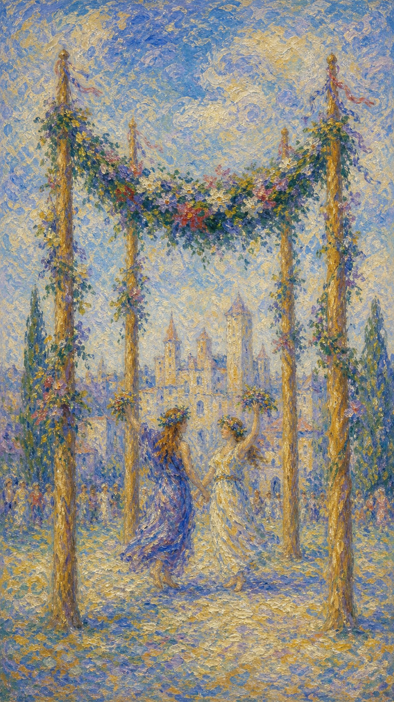

# 权杖四

权杖四像一座在阳光下搭起的花门。人们穿过它，带着奔走后的疲惫，也带着终于可以停下来相拥的喜悦。

这张牌出现时，某个阶段正在落地。努力不再只是个人的冲刺，而开始变成可被分享的成果、可被进入的家、可被祝福的关系。

权杖四的温暖来自稳定。它提醒你，生命需要向前，也需要有地方安放火光；当人被欢迎、被看见，心会自然松开。

四根权杖撑起花环，远处有城堡与欢庆的人群，画面洋溢节庆气息，象征稳定基础上的喜悦与归属。

## 基础要素

1. 牌名：权杖四 (Four of Wands)
2. 数字编号：25 号牌
3. 核心主题：庆祝、归属、稳定、家庭与仪式
4. 元素：火
5. 星座或行星：金星在白羊座
6. 希伯来字母：无固定传统对应
7. 代表意义：通过共享喜悦确认关系与生活基础

## 牌面要素

| 要素 | 含义 |
|------|------|
| 四根权杖 | 稳定结构、家园基础与可安放的空间。火被立成门，也被立成边界。 |
| 花环 | 庆祝、丰收、婚礼与祝福。它象征努力完成后被生活温柔接住。 |
| 欢庆人物 | 分享成果、社群支持与共同喜悦。快乐因有人见证而变得更完整。 |
| 城堡背景 | 安全感、归属地与现实基础。喜悦有了可依靠之处，便不再飘浮。 |
| 开阔前景 | 阶段完成后仍有未来空间。安定像下一次出发前的庭院。 |
| 明亮色彩 | 轻松、祝福与生活中的温暖。它让人想起阳光、音乐、鲜花和笑声。 |

## 塔罗灵数

数字 4 代表结构、稳定、边界与落地。它让火从奔涌的冲动，变成可以围坐、可以庆祝、可以生活其中的空间。

在权杖四里，火不再只属于个人意志。它成为炉火、灯火、节庆的火，照亮家人、伴侣、朋友与同伴。

这张牌的灵数提醒你：真正的成长需要阶段性的安顿。没有停下来的时刻，人就很难感受到自己已经走了多远。

## 正位牌意

**关键词**：庆典，稳定，家园，婚礼，团聚，阶段完成，归属感

正位的权杖四表示一个值得放松和庆祝的节点。事情可能已经完成初步阶段，关系获得确认，生活找到更稳定的落点。

它带来的快乐带着一种“我终于可以呼吸”的轻松。你可以暂时放下紧绷，与他人分享成果，让身心知道自己已经抵达一处可停靠的地方。

在事件层面，它常指婚礼、订婚、搬家、乔迁、聚会、毕业、庆功、家庭团聚、项目交付，或某种关系和生活基础的确认。

### 爱情/婚姻

感情中，权杖四是非常温暖的牌。它代表关系稳定、公开、被祝福，也常与订婚、婚礼、同居、见家人、共同布置生活有关。

单身者容易在熟人圈、聚会、节庆活动、朋友介绍中遇到让人安心的缘分。这样的吸引不一定最戏剧化，却有一种可以走进日常的温度。

有伴侣者适合共同营造家。它提醒你们谈爱，也创造可以安放爱的空间：一顿饭、一个房间、一场仪式、一次被家人朋友见证的确认。

若关系经历过不稳定，权杖四像一段修复后的晴天。它邀请双方重新感受归属，让防备慢慢退到门外。

### 事业学业

事业学业上，权杖四表示阶段成果、团队庆功、项目交付、考试通过、毕业、入职稳定，或进入更可靠的平台。

你可能终于看到努力落地，也可能得到团队、机构或环境的接纳。此时适合庆祝、复盘、感谢伙伴，并为下一阶段建立更稳的基础。

如果你一直处在冲刺状态，这张牌提醒你休息也是进程的一部分。适当停下来，才能让成果真正被身体和心理接收。

它也适合团队建设、活动策划、开业仪式、发布会、办公室搬迁等事务。火被放进共同空间，就会转化为凝聚力。

### 人际财富

人际方面，权杖四代表温暖的社群支持。家人、朋友、团队、邻里或共同兴趣圈，都可能成为你此刻的力量来源。

它适合和解、聚会、邀请他人见证重要时刻，也适合把一段关系从私下带到更公开、更稳定的位置。

财富方面，这张牌与居住、房屋、家庭开销、婚礼庆典、固定资产、稳定收益有关。它提醒你把钱用在能增加生活安全感与归属感的地方。

若你正在规划家庭财务，权杖四鼓励建立清楚预算。喜悦需要表达，也需要被现实稳稳托住。

### 健康生活

健康生活上，权杖四强调放松、规律与环境支持。身体在安全的空间里更容易恢复，心也需要知道自己有地方可以停靠。

适合整理居住环境、改善睡眠空间、与亲近的人共度轻松时光，或通过温和社交恢复生命热度。

如果你长期紧绷，这张牌提醒你让生活有一些仪式感。鲜花、饭菜、音乐、阳光、整洁的房间，都可能成为疗愈的一部分。

### 其它牌意

若问具体事件，正位通常表示事情进入和谐、安稳、可庆祝的阶段。成果已经足以被看见，也适合邀请他人共同分享。

它也可能代表婚礼、乔迁、派对、毕业、庆功、家庭聚会、开业、仪式、关系公开。

作为建议，权杖四说：请允许自己感受已经到来的好。不要急着奔向下一座山，先在花门下停一停，听见生活为你鼓掌。

## 逆位牌意

**关键词**：不稳定，庆祝延迟，家庭摩擦，归属感不足，基础松动

逆位的权杖四表示本该安稳的地方出现了不安。花门还在，花环却松动；人们也许聚在一起，心却没有真正放下防备。

它可能指庆典受阻、家庭摩擦、同居压力、关系无法公开、团队气氛不稳，也可能说明你表面拥有热闹，内心却缺少归属。

逆位并不一定意味着幸福消失。它更像提醒你回到基础：哪里没有被照顾？哪里只是看起来完整，实际上还需要修补？

### 爱情/婚姻

感情中，逆位权杖四可能出现承诺迟疑、婚期或计划延后、见家人不顺、同居摩擦，或双方对家庭形态缺少共识。

单身者可能在热闹场合里感到孤单，或遇到看似适合却无法真正安定的人。有人靠近之外，心也需要能安放的地方。

有伴侣者应留意隐藏的不满。家务、金钱、家庭意见、居住安排、公开关系等现实议题，可能正在影响感情温度。

这张牌建议把不安温柔地说出来。很多关系仍有爱，只是还需要共同建造生活的耐心和方法。

### 事业学业

事业学业上，逆位权杖四可能表示项目收尾不顺、团队庆功被推迟、成果尚未稳定，或进入新环境后缺少归属感。

你可能已经接近完成，却发现细节仍需补齐。也可能团队表面和气，实际缺少信任与凝聚。

此时不宜急着宣布圆满。先检查基础、流程、责任分配与后续维护，让成果真的能站稳。

如果你在学校或职场感到格格不入，逆位提醒你寻找更适合的支持系统。人需要被环境接住，才能长期发挥热情。

### 人际财富

人际方面，逆位权杖四要留意家庭压力、圈子排斥、聚会尴尬、社群不稳定，或为了维持表面和谐而压下真实感受。

财富方面，可能与房屋、装修、搬家、婚礼、家庭开销有关。预算若不清楚，喜事也可能带来压力。

它也可能提示固定资产或居住安排尚未稳妥。签约、付款、共同承担费用前，需要把责任说清楚。

若你为了让别人满意而过度花费，逆位提醒你：真正的归属不该要求你耗尽自己来换取入场资格。

### 健康生活

健康上，逆位权杖四可能与生活节奏混乱、休息空间不足、家庭压力、睡眠环境不佳有关。

身体缺少安全感时，很难真正放松。即使外界看起来热闹，你也可能感到疲惫、浮躁或无处安放。

建议先重建一个小小的稳定角落：固定睡眠时间、整理房间、减少噪音、安排轻松社交。让身体重新相信日常可以托住自己。

### 其它牌意

若问具体事件，逆位多表示庆祝延迟、基础未稳、表面和谐下仍有隐忧。事情仍可完成，只是需要更多整理和确认。

它也可能代表婚礼延期、搬家不顺、家庭争执、团队不合、场地问题、仪式缺席。

作为建议，逆位权杖四说：先照看那根松动的柱子。根基稳了，花环自然会重新垂下，喜悦也会回到它该在的位置。
