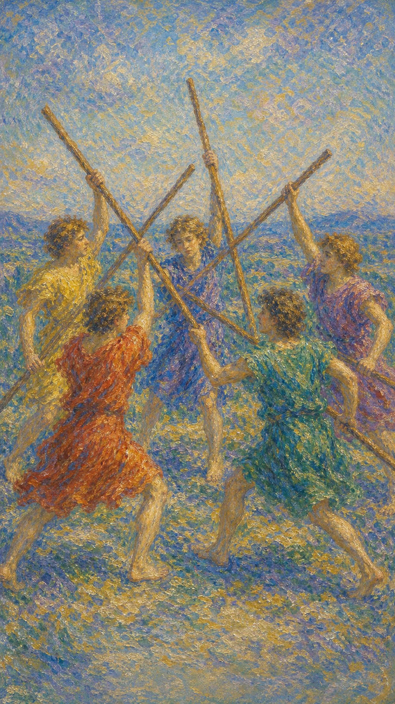

# 权杖五

权杖五是一片火星四溅的练习场。五根权杖在空气中交错，像五种欲望、五个声音、五股都不愿退让的年轻火焰。它更像一场模拟的战争——权杖代表火元素，整个画面便像一场没有硝烟却热气腾腾的混战。

这张牌出现时，局面往往热闹而混乱。人们都想表达，都想证明，都想把自己的力量挥出去，于是摩擦变成了成长的声音。每个人举着权杖彼此争斗，神色中却透出一丝迷茫，仿佛连他们自己也说不清究竟在争什么。

权杖五不一定带来真正的伤害。画中人装束相近、形貌相似，象征这是一场公平的较量，虽在争斗却无血腥残酷之景。所以它更像一种竞争的状态——不仅是外在的对抗，也是内心的矛盾与冲突，提醒你看清竞争、分歧和内在躁动背后，究竟有什么力量正在要求被承认。

五个装束相近的年轻人各自挥舞权杖，动作交错而缺少统一方向，像一场公平却无序的模拟战。他们神色迷茫，争斗中没有血腥，象征能量旺盛、彼此较劲，也暗示尚未形成真正的合作。火元素在这里彼此碰撞，把一片空地点成喧闹的练习场。

## 基础要素

1. 牌名：权杖五 (Five of Wands)
2. 数字编号：26 号牌
3. 核心主题：竞争、冲突、磨合、能量碰撞
4. 元素：火
5. 星座或行星：土星在狮子座
6. 希伯来字母：无固定传统对应
7. 代表意义：通过摩擦看清力量位置与行动规则，团队内部存在冲突、缺乏和谐

## 牌面要素

| 要素 | 含义 |
|------|------|
| 五个青年 | 多方意志、团队成员或竞争者。每个人都带着火，也都还在学习如何与他人的火共处。 |
| 交错权杖 | 观点冲突、资源争夺与方向不一。能量很多，却尚未汇成共同目标。 |
| 相近装束 | 势均力敌的公平较量。彼此形貌、衣着相似，说明这是一场没有绝对强弱的竞争。 |
| 迷茫神色 | 争斗中的困惑与盲目。人们在混战里，未必清楚自己究竟为何而争。 |
| 开阔场地 | 冲突仍有活动空间，可被引导。局面紧张，但仍有转化余地。 |
| 不同衣色 | 立场差异、个性差异和角色混杂。每个人都从自己的经验出发。 |
| 非致命姿态 | 争执更像试炼或练习，无血腥残酷之景，尚可转化为能力、默契与更清楚的边界。 |
| 杂乱构图 | 缺少规则时，能量容易互相消耗。秩序一旦建立，活力便能成为推进力。 |

## 塔罗灵数

数字 5 代表变化、挑战与不稳定。它像一阵忽然吹进房间的风，把原本整齐摆放的东西全都掀开。

在权杖五里，火遇见阻力，也遇见其他火焰。个人热情不再独自燃烧，而必须面对比较、竞争、碰撞与磨合。

这张牌的灵数提醒你：摩擦会显出真实形状。你以为自己只是在争执，其实也在学习如何使用力量。

## 牌面解读重点

权杖五正位，是「火焰正在明面上彼此碰撞」的状态：潜意识里那股不服气、想证明、想争位置的冲动被直接挥了出来。冲突是公开的、热闹的，虽然嘈杂，却把每个人真实的立场和力量都摆到了台面上，因而仍保有被整理、被转化的余地。

权杖五逆位，则是「火焰转入内里」的状态：潜意识把对抗压了下去，明争变成暗斗，或干脆退出竞争。表面安静了，心里的权杖却仍在互相撞击。它的关键在于分辨——这份退让究竟是清醒的省力，还是害怕面对的逃避；前者带来安宁，后者只会让冲突在别处重新升起。

## 正位牌意

**关键词**：竞争，争执，磨合，挑战，训练，观点碰撞，活力，混战，分歧，内在冲突，缺乏和谐

正位的权杖五表示局面进入充满碰撞的阶段。这里有竞争、有噪音、有不服气，也有尚未被整理好的生命力，团队内部往往存在冲突、缺乏和谐。

它常出现在团队意见不一、多人竞争、资源争夺、考试压力、争论升温的时候。事情未必已经失控，但需要规则、分工和更成熟的沟通。

这张牌也可能指向内在冲突。你心里有好几股力量同时拉扯，每一股都带着理由。先听清它们分别想保护什么，答案会比压抑更早浮现。

### 爱情/婚姻

感情中，权杖五常带来争执、较劲、互不相让。两个人像都拿着自己的权杖，希望对方先看见自己的委屈和理由。

单身者可能面对竞争者，或在暧昧中感到不确定。你也可能被有活力、有挑战感的人吸引，关系一开始就带着火花与不安。

有伴侣者则容易因生活习惯、价值观、时间安排、家庭意见或小事累积而起冲突。真正需要留意的，是争吵之后双方是否还愿意听见对方。

权杖五提醒你，冲突也能帮助关系排出淤积的热。只要不以伤害为目的，争执有时会把真实需求带到光下。

- **现况**：关系里争执与较劲不断，两人都想先被理解，和谐暂时让位给了碰撞。
- **桃花**：可能出现竞争者，或被有活力、带挑战感的人吸引，缘分一开始就带着火花与不安。
- **看法**：把对方看成需要争辩、磨合的对手，既想靠近又不愿轻易退让。
- **复合**：旧情重燃前先看清当初为何而争，若只是重复较劲，复合也难有真正的和解。

### 事业学业

事业学业上，权杖五代表竞争激烈、团队磨合、项目资源争夺、会议争论、考试压力或同侪比较。

它提示你当前环境里有很多活跃力量。每个人都想表现，每个人都想争取位置，因此规则、优先级和角色划分变得尤其重要。

如果你正在参加考试、竞赛、面试或项目比稿，这张牌说明压力真实存在，但也能激发潜力。不要被场上的噪音吓退，把注意力放回自己的节奏和优势。

团队工作中，权杖五要求把模糊冲突变成具体议题。谁负责什么？目标是什么？如何判断成败？火需要边界，才能成为生产力。

- **现况**：身处竞争激烈、意见纷杂的环境，团队磨合不顺，资源与位置都需要争取。
- **建议**：把模糊的冲突变成具体议题，理清分工、优先级与目标，给火划出边界。
- **关系**：同侪间较劲多、合作少，需要更成熟的沟通把对抗转化为良性竞争。
- **发展**：压力真实存在，却也能激发潜力，守住自己的节奏便能在混战中胜出。

### 人际财富

人际方面，权杖五容易带来口角、比较、争宠、立场对抗或小圈子摩擦。你可能觉得周围声音太多，很难安静表达自己。

它也可能代表有益的竞争。朋友、同事或同行之间的较量，会让你看见自己的能力边界，并推动你成长。

财富方面，可能面对同行竞争、价格战、客户争夺、资源分配不均，或因意见不合影响合作收益。

此时不适合被情绪带着出牌。先看清竞争规则，再决定是进入、调整策略，还是离开无谓消耗。

- **现况**：身边声音太多，口角、比较与立场对抗频繁，让人难以安静表达自己。
- **建议**：先看清竞争规则，分清哪些较量值得参与，哪些只是无谓的能量消耗。
- **财运**：面对同行竞争、价格战或资源争夺，别被情绪牵着出牌，理性评估再进退。

### 健康生活

健康上，权杖五可能与压力、上火、肌肉紧张、运动碰撞、发炎或身体内部的"躁动感"有关。

你的身体也许正在承受太多互相冲突的要求：想休息，又想证明自己；想放松，又被竞争推着向前。

适合把多余能量导入规律训练、伸展、呼吸、户外活动。火需要出口，也需要节奏，才不会在情绪里乱撞。

### 其它牌意

若问具体事件，正位多表示竞争、争论、磨合期、多人意见不一。事情有压力，也保留着转化空间。

它也可能代表比赛、辩论、团队建设、临场训练、年轻人的冲突、兴趣小组里的较劲。

作为建议，权杖五说：不要害怕火星四溅，但请为火星找到规则。混乱被看见之后，真正的力量才会浮现。

### 情境指引

- **过去**：你曾经历一段竞争与摩擦不断的时光，在争执和较量中磨砺出自己的力量。
- **现在**：正处在充满碰撞的阶段，团队或环境里冲突多、和谐少，各方力量彼此角力。
- **未来**：竞争与磨合仍会持续，但若能建立规则，混战有望转化为成长的契机。
- **挑战**：如何在嘈杂的对抗中守住节奏，把无序的较劲变成有方向的良性竞争。
- **障碍**：缺少规则与共识，让能量互相消耗，谁也无法真正向前推进。
- **环境**：周遭环境活跃而紧张，各方都想表现、争位置，氛围充满火药味。
- **支持**：竞争对手有时也是磨刀石，旁人的较量能照见你的能力边界，推动你成长。
- **建议**：别害怕火星四溅，但要为火找到规则与出口，把冲突变成具体可解的议题。
- **优势**：精力旺盛、敢于争取，能在压力与竞争中被激发出潜力。
- **弱点**：容易陷入无谓争执，或在混乱中迷失，分不清自己究竟为何而争。
- **正面影响**：摩擦显出真实形状，让你看清力量的位置，学会更成熟地使用它。
- **负面影响**：持续内耗与缺乏和谐，可能消磨精力，让人疲于应付而无所成就。
- **希望发生**：希望竞争分出结果、分歧得到厘清，让混乱中浮现清晰的方向。
- **害怕发生**：害怕冲突失控、关系破裂，或在无休止的较量中白白损耗自己。
- **你如何看对方**：把对方看作势均力敌的对手或竞争者，既想较量又难以忽视。
- **对方如何看待你**：对方视你为不肯轻易退让、充满斗志的竞争者。
- **关系当前状态**：处在摩擦与磨合之中，张力十足，却也保留着转化与靠近的余地。
- **关系未来发展**：若能把争执变成坦诚沟通，关系有望在磨合后更加清晰、牢固。
- **结果**：多半是一段需要竞争与磨合的时期，混乱被看见、规则被建立之后，真正的力量才会浮现。

## 逆位牌意

**关键词**：冲突缓和，逃避争执，内耗，暗中竞争，缺少斗志，压抑，冷战，被动抵抗

逆位的权杖五表示冲突正在改变形态。它可能逐渐缓和，也可能从明面转入暗处，变成压抑、冷战、被动抵抗或内在消耗。

有时，人为了维持表面和平，把真实意见吞下去。场面安静了，心里的权杖却仍在互相撞击。

逆位也可能表示你厌倦了竞争，想退出比较。若这是清醒选择，它能带来安宁；若只是害怕面对，则问题会在别处重新升起。

### 爱情/婚姻

感情中，逆位权杖五可能代表争吵后愿意和解，也可能表示双方都不想吵了，却仍没有真正解决问题。

单身者可能不愿卷入复杂竞争，或对充满火药味的暧昧关系感到疲惫。你的心正在寻找更平静、更诚实的相处方式。

有伴侣者需要留意"看似没事"的沉默。若一方总是退让，另一方总是回避，冲突会沉到关系底部，变成日后的疏离。

这张牌建议你用温和而清楚的语言表达不满。真正的和平，会在说出来之后仍愿意彼此靠近。

- **现况**：争执表面平息，却可能只是把不满压了下去，问题并未真正解决。
- **桃花**：厌倦了火药味的暧昧，或不愿卷入竞争，心在寻找更平静诚实的相处方式。
- **看法**：不想再争，却也未必看清对方，沉默之下藏着尚未说出口的情绪。
- **复合**：旧情若想重续，先把当初压下的话好好说清，否则疏离只会再度蔓延。

### 事业学业

事业学业上，逆位权杖五可能表示团队冲突暂时缓和，竞争压力下降，或你从激烈环境中抽身。

它也可能指出表面合作、内部各做各的。会议上没有人争论，执行时却各自按照自己的理解行动。

如果你因为害怕比较而退缩，逆位提醒你重新找回适度的斗志。竞争不一定是敌意，也可以是提醒你认真对待自己的能力。

若环境确实消耗过重，退出混战也可能是智慧。关键在于分辨：你是在保存力量，还是在放弃本该争取的位置。

- **现况**：明面的冲突缓和或被搁置，但表面合作之下，各人仍按自己的理解行事。
- **建议**：分辨退让是省力还是逃避，该争取的位置别因怕比较而轻易放弃。
- **关系**：会议上无人争论，执行时却各自为政，隐性的不合需要被点破。
- **发展**：若环境过度消耗，抽身是智慧；若只是回避，问题会在别处重新升起。

### 人际财富

人际方面，逆位权杖五要小心暗中较劲、被动攻击、背后议论或小团体里的隐性竞争。

你也可能选择不再参与无意义的争论，让自己的能量从混乱关系中撤回。这会带来清净，也可能让某些关系自然淡去。

财富方面，可能因回避竞争而错失机会，也可能因为不再盲目卷入价格战、面子消费或资源争夺而减少损耗。

合作涉及金钱时，越是表面客气，越需要把规则写清楚。模糊的和平常常比公开争论更难处理。

- **现况**：人际间多了暗中较劲与被动攻击，表面客气，底下却藏着隐性的竞争。
- **建议**：把规则与边界写清楚，别让模糊的和平积成日后更难处理的心结。
- **财运**：或因回避竞争错失机会，也可能因不再盲目卷入消耗战而减少损失。

### 健康生活

健康上，逆位权杖五可能提示压抑怒气、压力内化、动力下降，或长期竞争后出现身心疲惫。

身体里的火没有消失，只是找不到出口。它可能变成烦躁、失眠、肩颈紧张，也可能变成突然的无力感。

适合通过运动、整理空间、书写、坦诚沟通来释放紧绷。让火流动起来，它就不会在体内变成焦灼。

### 其它牌意

若问具体事件，逆位多表示冲突降温、竞争退出、明争转暗流，或内耗比外部阻力更严重。

它也可能代表和解、停止争论、规则重整、退出比赛、团队表面平静。

作为建议，逆位权杖五说：请看清你真正想避免的是什么。若是无谓纷争，可以离开；若是真实表达，就不要让沉默替你承担一切。

### 情境指引

- **过去**：曾有过被压下的冲突或回避的争执，问题没真正解决，只是暂时安静了下来。
- **现在**：明争转入暗流，或你正从竞争中抽身，表面平静下仍有未消的张力。
- **未来**：若只是压抑而非化解，冲突可能在别处重新升起；唯有坦诚才能带来真正安宁。
- **挑战**：如何分辨退让是清醒的省力，还是害怕面对的逃避，并找回适度的斗志。
- **障碍**：压抑、冷战与被动抵抗，让真实问题被掩盖，迟迟得不到解决。
- **环境**：周遭气氛看似缓和，实则暗潮涌动，合作只在表面，各人另有打算。
- **支持**：愿意坦诚沟通的人能帮你把暗处的张力摊开，避免它沉到关系底部。
- **建议**：看清你真正想避免的是什么，该离开的离开，该表达的别让沉默替你承担。
- **优势**：懂得保存力量、避开无谓消耗，能从混乱关系中及时抽身。
- **弱点**：容易把情绪憋在心里，以沉默回避问题，让内耗悄悄累积。
- **正面影响**：适时退出无谓纷争能带来清净，让能量从消耗中重新收回。
- **负面影响**：压抑的怒气与隐性竞争若不疏导，会化作疏离、焦躁与身心疲惫。
- **希望发生**：希望冲突真正平息、关系归于平静，不必再耗在反复的较量里。
- **害怕发生**：害怕暗中的对立无法化解，或自己在退让中放弃了本该争取的东西。
- **你如何看对方**：可能觉得对方在回避或暗中较劲，难以正面把话说开。
- **对方如何看待你**：对方可能认为你在退缩或冷处理，看不清你真正的态度。
- **关系当前状态**：表面平静，内里却藏着未解的张力，沟通停在了不痛不痒的层面。
- **关系未来发展**：若延续沉默与回避，疏离会慢慢加深；唯有坦诚表达才能让彼此重新靠近。
- **结果**：多半是一段冲突降温却未真正了结的时期，看清自己想避免什么，才能从内耗中走出来。
