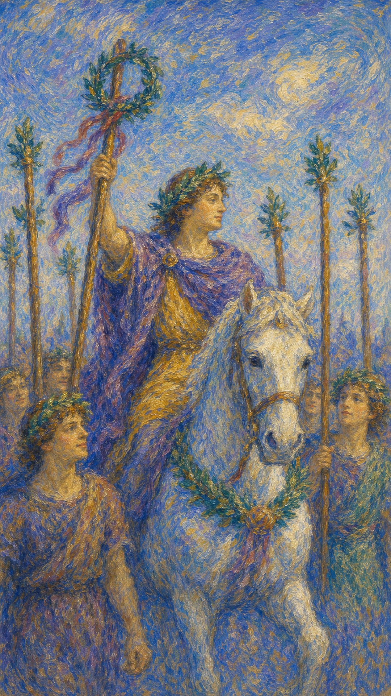

# 权杖六

权杖六是一场穿过人群的凯旋。火曾经在竞争中被考验，如今它举起桂冠，让努力、勇气和坚持终于被看见。

这张牌出现时，某种阶段性的胜利正在靠近。它可能是一份成绩、一句肯定、一次公开认可，也可能是你终于重新相信自己配得上掌声。

权杖六的光明属于个人荣耀，也连接感谢、承担和继续前行的姿态。成熟的胜利不会停在掌声里。

骑士头戴花环，骑马穿过人群，高举装饰桂冠的权杖。身后随从象征公众支持，胜利在众目之下显现。

## 基础要素

1. 牌名：权杖六 (Six of Wands)
2. 数字编号：27 号牌
3. 核心主题：胜利、认可、荣誉、公开成就
4. 元素：火
5. 星座或行星：木星在狮子座
6. 希伯来字母：无固定传统对应
7. 代表意义：通过表现与坚持获得外界认可

## 牌面要素

| 要素 | 含义 |
|------|------|
| 骑马人物 | 胜利者、领袖姿态与被看见的位置。人被推到台前，也承担台前的目光。 |
| 桂冠权杖 | 荣誉、成就与公众认可。努力已经结出可被展示的成果。 |
| 头戴花环 | 胜利归属个人，也带有祝福。它象征自信重新回到头顶。 |
| 跟随人群 | 支持者、团队与社会评价。个人成功背后常有集体力量。 |
| 前进队伍 | 成功之后仍要继续前行。凯旋只是旅程中的明亮节点。 |
| 明亮氛围 | 自信、荣耀和能量上升。它让人感到心胸打开、步伐变轻。 |

## 塔罗灵数

数字 6 代表和谐、修复与关系中的平衡。它把五号牌的冲突带向整合，使分散的火焰汇成共同欢呼。

在权杖六里，胜利不再只是“我赢了”。它更像一个人带着自己的成果穿过人群，让他人也因此受到鼓舞。

这张牌的灵数提醒你：被看见是一种祝福，也是一种责任。掌声会滋养信心，也会要求你更稳地站在光中。

## 正位牌意

**关键词**：胜利，成功，认可，晋升，自信，领导，公开赞赏

正位的权杖六表示努力正在获得肯定。你可能通过竞争、考验或长期坚持，走到一个可以被认可的位置。

它带来的成功通常具有公开性：成绩公布、项目获奖、升职、通过考试、作品被看见、关系被承认、口碑提升。

这张牌也在疗愈自我怀疑。若你曾经觉得自己不够好，权杖六像人群中的欢呼，提醒你：你的努力有人看见。

### 爱情/婚姻

感情中，权杖六代表被欣赏、被选择、被公开承认。关系里可能有告白成功、追求有回应、伴侣为你感到骄傲，或两个人愿意更大方地站在一起。

单身者容易因自信、才华、外在表现或社交魅力受到关注。你不需要刻意讨好，稳定发光本身就会吸引目光。

有伴侣者可能一起度过某个考验，关系因此更有信心。也可能一方取得成就，另一方给予真诚支持。

它提醒你在被爱与被赞赏时保持柔软。爱情里的胜利，会让彼此都因对方的光而更愿意靠近生活。

### 事业学业

事业学业上，权杖六是非常积极的信号。它有利于考试通过、竞赛获奖、升职、发表作品、项目成功、面试胜出和获得行业认可。

你适合站到台前。展示成果、争取资源、做汇报、发布作品、接受表扬，都可能成为下一阶段的入口。

如果你正在领导团队，这张牌说明你的方向感能带动他人。但它也提醒你记得感谢支持者，胜利若只归于个人，团队的火会慢慢熄灭。

学业上，它代表努力被评分系统、老师、同学或机构看见。你可以允许自己为成果感到骄傲。

### 人际财富

人际方面，权杖六带来影响力提升。你可能更受欢迎、更容易获得支持，也更容易在人群中成为被信任的人。

它适合公开表达、竞选、演讲、发布消息、建立个人品牌。你的能量能够鼓舞他人，也能召集同路者。

财富方面，可能因业绩、名声、客户认可、职位提升或作品影响力带来收入增长。声誉在此时是一种资源。

不过，财富增长仍需要后续管理。掌声能带来机会，真正稳定的收获还需要系统、合约和长期维护。

### 健康生活

健康生活上，权杖六表示恢复信心，训练、调养或治疗出现可见成果。你可能终于看到身体给出的正向回应。

它适合用阶段性奖励鼓励自己，例如完成训练周期、检查指标改善、精神状态回升后，给自己一个温柔的庆祝。

若你曾因身体状态失去信心，这张牌提醒你把注意力放在已经做到的部分。每一点恢复都值得被看见。

### 其它牌意

若问具体事件，正位多表示胜算提升、成果被承认、事情有望获得公众或权威认可。

它也可能代表获奖、升职、通过考试、公开表扬、胜诉、凯旋、粉丝增长、名声提升。

作为建议，权杖六说：请站出来接受属于你的花环。谦逊不等于否认成果，真正的光会让你更愿意继续向前。

## 逆位牌意

**关键词**：认可不足，骄傲受挫，失败感，虚荣，声望不稳

逆位的权杖六表示胜利感受阻。你可能努力了，却没有得到期待中的掌声；也可能过度依赖外界评价，导致内在价值随他人目光起伏。

它有时指向失败、落选、成绩不理想、功劳被忽视，也可能表示表面风光下并没有真正的信心。

逆位并不否定你的能力。它只是提醒你，把全部自我价值交给掌声，会让你在没有人鼓掌的时候迷失方向。

### 爱情/婚姻

感情中，逆位权杖六可能带来自尊心受伤。你希望被选择、被公开、被珍惜，却感觉自己没有得到足够确认。

单身者可能因追求受挫而怀疑魅力，也可能太在意“赢得某个人”而忽略自己真正想要怎样的关系。

有伴侣者可能出现争面子、比较谁更受欢迎，或关系无法公开带来的失落。此时需要分辨：你想要的是被看见，还是被真正爱护？

这张牌建议回到亲密本身。真正的关系在外界目光中成立，也在两个人安静相处时保持可靠。

### 事业学业

事业学业上，逆位权杖六可能表示比赛失利、成绩低于预期、升职未果、作品反响平淡，或你的贡献没有被正确归功。

它也可能提醒你不要因一点成功而轻敌。若骄傲走在能力前面，掌声很快会变成压力。

此时适合回到基本功。重新检查作品、策略、表达方式和团队协作，把失落转化为下一轮更扎实的准备。

如果你确实被忽视，也要学会为自己发声。温和而清楚地呈现贡献，是成熟专业的一部分。

### 人际财富

人际方面，逆位权杖六要小心虚荣、嫉妒、比较和名声压力。你可能被外界评价推着走，忘记自己真正重视什么。

也可能因为没有得到支持而感到孤单。此时需要寻找真正理解你的人，减少在人群中反复追问自己是否足够耀眼。

财富方面，可能因过度追求排场、面子、短期声望而增加支出。也可能名声或客户评价不稳，影响收入。

建议把资源投入长期信誉。真正有价值的认可，来自持续可信的表现，而非短暂风光。

### 健康生活

健康上，逆位权杖六可能表示因为成果不明显而灰心，或为了证明自己过度训练、过度节食、过度追求外界认可的身体形象。

身体需要被尊重，不该被迫成为证明自己值得被赞美的比赛场。

适合减少比较，回到真实感受：睡得好吗？呼吸顺吗？疼痛是否减轻？精神是否更稳？这些安静的进步同样值得承认。

### 其它牌意

若问具体事件，逆位多表示尚未得到公开认可、结果低于预期、名声不稳，或成功需要更长时间才会被看见。

它也可能代表落选、延迟表扬、功劳被抢、虚荣压力、短暂风光后的空落。

作为建议，逆位权杖六说：先把桂冠放回心里。真正经得起时间的成果，不会只靠一阵掌声证明自己。
