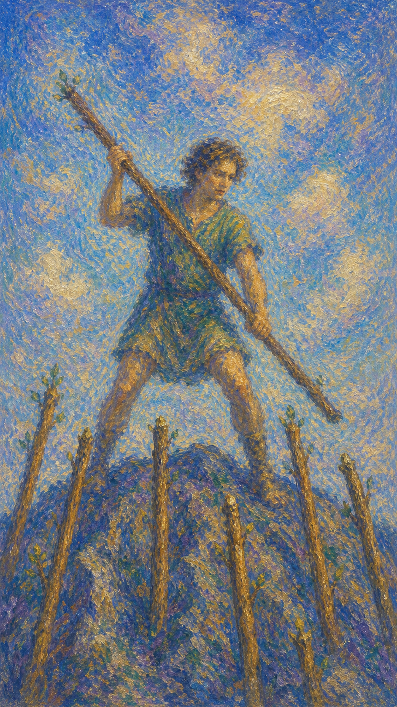

# 权杖七

权杖七站在高处迎战。脚下的位置来之不易，远处伸来的权杖像质疑、竞争和压力，一根根敲向你的边界。

这张牌出现时，生命常常要求你为自己站稳。你已经取得某种优势、成果或立场，如今要学习如何守护它，而不被外界的声音推下山坡。画面里那位身着绿衣的人，既像在进攻，也像在防卫，也许两者都是——你进攻，对方防卫；当对方反攻，你便需要防御。攻守如同硬币的两面，在一念之间不断翻转。

权杖七并不轻松，却有一种清醒的尊严。绿衣象征气力，勇士面色坚毅象征态度的坚定；既攻又守的姿态，代表内心的权衡与决断。所以它也代表一种信仰——相信自己的观点与能力，并拥有正义鉴别的洞察力。它告诉你，有些东西一旦真正属于你，就需要你亲手守住；不要放弃，坚韧地度过挫折，才能获得最终的成功。

人物站在高坡上，手持权杖抵御下方伸来的六根杖。姿态紧张而有力，象征在压力中守住自己的位置。他面色坚毅，目光专注，仿佛早已下定决心：无论来势如何，都不退让脚下这片来之不易的土地。

绿色的衣装是这幅画面最醒目的细节，象征旺盛的气力与生命的韧性。下方六根权杖来自不同方向，既是对手的攻势，也是处境的考验。整幅画面把"以一敌众"的孤独与勇气凝固在一瞬间——他既在防守，也随时准备反击，攻与守在他身上合而为一。

## 基础要素

1. 牌名：权杖七 (Seven of Wands)
2. 数字编号：28 号牌
3. 核心主题：防守、坚持、立场、竞争压力
4. 元素：火
5. 星座或行星：火星在狮子座
6. 希伯来字母：无固定传统对应
7. 代表意义：通过勇气守护已经争取到的位置

## 牌面要素

| 要素 | 含义 |
|------|------|
| 高坡位置 | 暂时优势、制高点与更大的责任。站得越高，也越容易被看见和挑战。 |
| 手中权杖 | 主动防御、意志与个人立场。它是你此刻最直接的力量。 |
| 下方六杖 | 挑战者、压力与外界质疑。它们来自不同方向，也带来持续消耗。 |
| 张开姿态 | 警觉、应战和不退让。身体已经进入保护重要事物的状态，攻守一体。 |
| 绿色衣装 | 旺盛的气力与韧性，象征支撑你坚持下去的生命能量。 |
| 坚毅面色 | 态度坚定、信念清晰，代表愿意为自己的观点负责。 |
| 不同鞋子 | 临场匆忙，也暗示处境并不完全稳妥。你可能尚未准备完美，却必须回应。 |
| 空旷背景 | 孤身面对挑战，需要依靠内在火力。此刻没有太多遮蔽。 |

## 塔罗灵数

数字 7 代表试炼、觉醒与自我确认。它常把人带到一个需要独自面对的问题前，让人看清自己的信念是否足够坚实。

在权杖七里，六号牌的掌声之后，挑战随即到来。被看见的同时，也会被比较、质疑、要求证明。

这张牌的灵数提醒你：立场会在压力中被实践出来。你守住什么，也就在成为怎样的人。

## 牌面解读重点

权杖七正位，是潜意识里"认定值得守护，于是站稳了脚下"——你对压力做过甄别，清楚自己为何而战，因此防守带着清醒与尊严，进攻也带着分寸。权杖七逆位，则是潜意识里"被压得不得不撑，却已分不清该不该撑"——防守变成本能的消耗，立场开始模糊，攻守的节奏被外界牵着走。

两者的共同点在于：人都处于"以一敌众"的迎战姿态，外界不断伸来权杖。区别只在于，你是带着信念主动守护，还是带着疲惫被动支撑。正位让你在压力中确认自己，逆位则提醒你重新分辨——哪些阵地值得守，哪些战斗只是在耗尽自己。

## 正位牌意

**关键词**：坚持，防守，勇气，挑战，守住优势，立场清楚，攻守一体，坚韧，信念，洞察力，不放弃，迎战，主动防御

正位的权杖七表示你需要为自己争取空间。面对竞争、质疑、压力或不合理要求时，退让未必带来和平，清楚站稳反而能让局面更有秩序。你既要敢于进攻，也要懂得防卫，在攻守的翻转间守住属于自己的位置。

它常出现在竞争加剧、成果被挑战、职位需要防守、边界需要建立的时候。你可能感到孤单，内在仍有可以依靠的力量。绿衣勇士的坚毅提醒你：只要相信自己的观点与能力，坚韧地度过这段挫折，成功终会站到你这一边。

这张牌也提醒你，防守可以保持清明。你可以坚定，可以拒绝，也可以不把每个质疑都当成敌人。

### 爱情/婚姻

感情中，权杖七可能表示需要抵御外界干扰，维护关系边界，或为自己的真实需求发声。

单身者可能处在竞争关系中，需要更主动地表达心意。也可能是在面对他人评价时，仍愿意忠于自己的择偶标准。

有伴侣者可能需要一起面对家庭压力、距离、第三方意见或生活现实。若关系值得守护，两个人需要站到同一边，避免让外界压力变成彼此攻击。

它也可能提示关系里一方总在防御。若你不断觉得自己需要解释、证明、抵抗，也许要重新思考安全感从哪里流失。

- **现况**：关系正面对外来的竞争或质疑，你需要为这段感情站稳立场，既不轻易退让，也别把对方当成假想敌。
- **桃花**：可能有人主动出现，但也伴随竞争或阻力；坚持自己的标准与真心，比急着取胜更重要。
- **看法**：你看重这段关系，愿意为它据理力争，内心其实希望对方看见你守护的诚意。
- **复合**：若旧情值得，仍有机会重燃，但需要你主动跨出、坚定表态，并抵住外界的杂音。

### 事业学业

事业学业上，权杖七代表竞争加剧、职位防守、答辩、面试、汇报、论文辩护、项目成果被审视，或需要坚持自己的专业判断。

你可能已经取得优势，却还不能松懈。此时需要准备充分，明确论点，用事实、能力和稳定态度支撑自己。

如果你正在创业或争取资源，这张牌提示你市场中会有挑战者。守住差异化、节奏和核心价值，比四处迎合更重要。

学业中，它适合面对考试冲刺、答辩压力或竞争名额。紧张是真实的，但你的准备会成为脚下的高地。

- **现况**：你处在被审视、被挑战的位置，优势仍在，却必须认真应对来自四面的压力。
- **建议**：备足弹药，明确论点，用事实与稳定的态度回应质疑，别被气势压退也别盲目硬刚。
- **关系**：身边可能有竞争者或不认同者，不必把他们都当敌人，但要清楚谁与你同向。
- **发展**：只要坚持守住核心价值与节奏，挫折会逐渐被你度过，成果终能稳固下来。

### 人际财富

人际方面，权杖七适合设定边界。面对过度索取、无理批评、群体压力或道德绑架，你需要说出自己的立场。

它也可能表示你在人群中处于少数意见的位置。此时不必为了合群而急着退缩，先确认自己坚持的理由是否清楚。

财富方面，要守住既有资源、权益、客户、预算或投资原则。避免因压力、竞争者挑衅或短期诱惑而失去主动权。

若涉及合约、分配或谈判，权杖七提醒你：温和并不等于让步。清楚的边界是保护未来收益的护栏。

- **现况**：你可能正处在需要表态、设界限的处境，外界的声音很多，主动权却必须握在自己手里。
- **建议**：分辨哪些意见值得听、哪些只是压力；温和地坚持，比一味退让或激烈对抗都更长久。
- **财运**：守住既有的资源与原则，谨防竞争者挑衅或短期诱惑让你乱了阵脚，先稳后进为宜。

### 健康生活

健康上，权杖七提示保持抵抗力与日常纪律。若正在康复、训练或戒除旧习惯，你需要抵御短期诱惑和外界干扰。

身体可能正处于需要防守的阶段：免疫、炎症、压力、睡眠、饮食都需要更清楚的照顾。

它也可能反映心理上的长期警觉。若你总像站在高坡上迎战，身体会逐渐疲惫。守护自己，也包括让自己有恢复的时间。

### 其它牌意

若问具体事件，正位多表示需要辩护、竞争、守擂、抵抗压力。你仍有优势，但必须认真应对。

它也可能代表公开质询、维权、考试答辩、面试竞争、保护作品、守住客户或坚持原则。

作为建议，权杖七说：请站稳脚下的位置。不要把每一次压力都当作退缩的理由，也不要忘记你为何走到这里。

### 情境指引

- **过去**：你曾凭着勇气与坚持争取到某个位置或成果，那段不轻松的经历奠定了今天的立场。
- **现在**：你正站在高坡上迎战，一边守护已有的优势，一边应对来自四方的质疑与竞争。
- **未来**：只要坚持下去、不轻言放弃，挫折会被你度过，属于你的成果将稳固下来。
- **挑战**：如何在攻与守之间找到平衡，既不退缩，也不把每个声音都当成敌人。
- **障碍**：孤军奋战的疲惫、四面而来的压力，以及对自己是否撑得住的怀疑。
- **环境**：竞争激烈、众声喧哗的处境，你处在被看见也被挑战的制高点上。
- **支持**：你内在的气力与坚定信念是最大的依靠，必要时也有人愿意与你同向而立。
- **建议**：相信自己的观点与能力，站稳脚下，坚韧地守住值得守护的东西。
- **优势**：勇气、韧性与清晰的立场，让你能在压力中保持尊严而不溃散。
- **弱点**：容易陷入孤军奋战，把所有质疑都当成攻击，从而过度消耗自己。
- **正面影响**：守住成果、确立边界、在试炼中确认并强化自己的信念。
- **负面影响**：长期紧绷带来的疲惫，以及把精力过度耗在防守上的风险。
- **希望发生**：希望坚持能换来认可，守住的位置最终被证明是值得的。
- **害怕发生**：害怕独自撑不下去，或在最后关头被压力推下高坡、前功尽弃。
- **你如何看对方**：把对方看作需要认真应对的竞争者或质疑者，也可能是必须守护的关系。
- **对方如何看待你**：对方视你为坚定有力、不易动摇的人，欣赏或忌惮你的坚持。
- **关系当前状态**：处在需要据理力争、守护边界的阶段，张力明显但方向清楚。
- **关系未来发展**：若你愿意坚持并主动表态，关系有望在考验后变得更稳固。
- **结果**：通常正面，预示只要不放弃、坚韧应战，你将守住优势并赢得应得的成功。

## 逆位牌意

**关键词**：压力过大，防线松动，退缩，立场不稳，疲于应对，过度防御，自信流失，孤立硬撑，策略需调整

逆位的权杖七表示防守已经消耗过多。你可能被挑战压得喘不过气，也可能因为立场模糊，无法有效回应外界压力。攻守的节奏被打乱，进攻无力，防御也漏洞百出。

它常出现在一个人长期独自支撑的时候。外界不断伸来权杖，而你的手臂已经酸痛，心里开始怀疑自己是否还能继续。绿衣的气力似乎被耗尽，坚毅的面色也露出疲态。

逆位提醒你分辨两件事：有些阵地值得守护，有些战斗只是消耗。真正的勇气，也包括承认自己需要支援或改变策略。

### 爱情/婚姻

感情中，逆位权杖七可能表示被外界意见影响，或双方都觉得自己需要防御。亲密关系若变成长期对抗，爱会慢慢被紧绷替代。

单身者可能在竞争或评价中失去信心，觉得自己总要证明才配被选择。这时需要回到自我价值，让外界反应退到次要位置。

有伴侣者可能因家庭、朋友、现实压力而不断争辩。若两个人无法站在同一边，就会把本该共同面对的问题转成彼此消耗。

这张牌建议先降低战斗姿态。问问自己：我在保护关系，还是在保护受伤的自尊？答案会帮助你重新选择沟通方式。

- **现况**：关系陷入持续的紧绷与防御，彼此都觉得自己在迎战，爱意被消耗得越来越薄。
- **桃花**：可能因为自信不足或害怕被比较而退缩，错过本可以靠近的人。
- **看法**：你或许已经累于不断证明自己，开始怀疑这段关系是否还值得继续硬撑。
- **复合**：勉强迎战难以挽回，唯有先放下战斗姿态、坦诚脆弱，才有重新靠近的可能。

### 事业学业

事业学业上，逆位权杖七可能表示竞争压力过大、准备不足、答辩失利、职位被动摇，或你已经不愿再坚持原目标。

它也可能提示你把太多精力花在防守上，反而没有余力继续成长。长期应付质疑，会让创造力变得干枯。

此时适合评估哪些阵地真正值得守护。若目标仍然重要，就补强资料、寻求支持、调整策略；若只是面子之争，就不必继续把自己耗在坡上。

学业中，逆位提醒你别独自硬撑。请教老师、同学或专业资源，可能比单打独斗更有效。

- **现况**：你被竞争与质疑压得疲惫，防线开始松动，优势也在一点点流失。
- **建议**：先分辨哪些阵地值得守，再补强准备、寻求支援，别把全部力气耗在面子之争上。
- **关系**：长期独自硬撑容易让你与团队疏离，适度求助反而能换来真正的合力。
- **发展**：若目标仍重要，调整策略后仍有转机；若已无意义，及时退场不是失败。

### 人际财富

人际方面，逆位权杖七可能表示边界被侵犯，或因为害怕冲突而一次次退让。你越不说清楚，别人越容易把你的沉默当作允许。

也可能是你对每个声音都过度防御，使关系变得紧绷。有些不同意见只是提醒你调整表达方式。

财富方面，要小心资源被稀释、权益被挤压、预算被他人影响，或在竞争压力下做出不利决定。

必要时寻求专业支持，如法律、财务、合约咨询。守住利益不必全靠自己赤手空拳。

- **现况**：你的边界可能正被侵蚀，要么因怕冲突而退让，要么因过度防御而四处树敌。
- **建议**：把立场说清楚，分辨善意的提醒与真正的进犯，必要时借助专业力量护住权益。
- **财运**：警惕资源被稀释、在压力下仓促决定；疲惫时做的财务判断尤其需要复核。

### 健康生活

健康上，逆位权杖七可能与免疫力下降、压力性疲惫、长期紧绷、睡眠不稳有关。

身体也许已经厌倦了随时备战。你需要一个能让神经系统放松下来的环境，让强硬意志暂时卸甲。

适合减少刺激源，安排休息，调整过度防御的心理状态。若症状持续，应及时寻求专业帮助。

### 其它牌意

若问具体事件，逆位多表示处在被围攻、难以支撑、准备不足或优势下降的状态。事情仍可调整，但需要先看清压力来源。

它也可能代表退出竞争、放弃辩护、边界失守、被质疑压倒、策略需要改变。

作为建议，逆位权杖七说：请不要把所有压力都当成必须独自赢下的战争。守住自己，有时意味着换一种站法，或允许可靠的人与你并肩。

### 情境指引

- **过去**：你曾长期独自迎战，或在压力下逐渐失去立场，那段消耗埋下了今天的疲惫。
- **现在**：防线松动、自信流失，你被四方压力压得喘不过气，开始怀疑还能否撑住。
- **未来**：若不调整策略或寻求支援，硬撑可能让你耗尽，优势进一步滑落。
- **挑战**：如何分辨值得守护的阵地与纯粹消耗的战斗，并允许自己改变战法。
- **障碍**：过度防御、孤立硬撑，以及害怕承认脆弱而拒绝任何帮助。
- **环境**：竞争与质疑过载的处境，缺乏支持，让你感到孤军奋战。
- **支持**：你需要向外寻求援手——可靠的人、专业资源，而非凡事赤手空拳。
- **建议**：先降低战斗姿态，看清压力来源，必要时换一种站法或让人与你并肩。
- **优势**：经历过迎战，你仍保有韧性，只要懂得休整就能重新站稳。
- **弱点**：容易把一切当成必须独赢的战争，从而透支自己、错失合力。
- **正面影响**：作为警示，提醒你重新评估目标、放下无谓之争、保存实力。
- **负面影响**：持续紧绷导致的崩溃、边界失守，以及创造力被消耗殆尽。
- **希望发生**：希望卸下重担、获得喘息，并找回足以继续坚持的信心。
- **害怕发生**：害怕被彻底压垮、阵地失守，或在最后阶段前功尽弃。
- **你如何看对方**：可能觉得对方咄咄逼人，或让你不得不时刻防御、疲于应付。
- **对方如何看待你**：对方可能认为你过于强硬戒备，或看出你已显疲态、立场动摇。
- **关系当前状态**：处在持续紧绷的拉锯里，防御多于沟通，张力让彼此都消耗。
- **关系未来发展**：若不放下对抗姿态、坦诚脆弱，关系会在消耗中越走越僵。
- **结果**：可能是一段需要喊停与重整的时期，承认疲惫、调整策略后才有转机。
