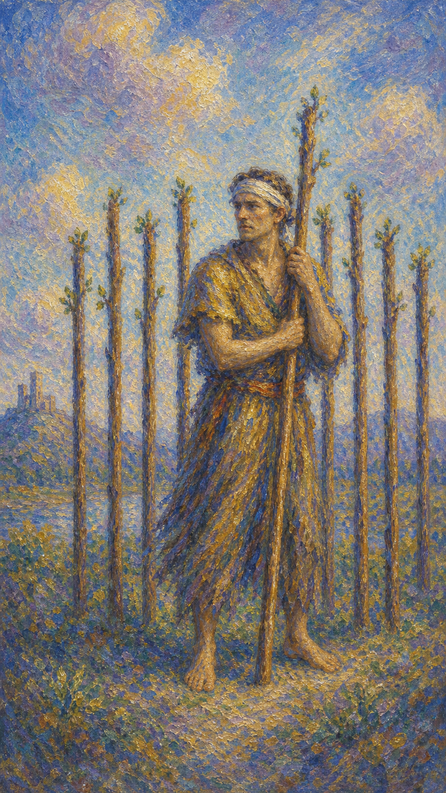

# 权杖九

权杖九是一道受伤后仍然站立的防线。额头的绷带、身后的木杖、警觉的眼神，都在诉说一个人已经走过许多风暴。

这张牌出现时，事情常常接近尾声，却仍要经历最后的考验。画中人物显然经历了一段艰苦岁月，身上缠满绷带，靠一根权杖支撑着身体，受过不少战争的浸礼。你可能很累，但还没有真正倒下；你也许不再天真，却因此学会了守护自己。

权杖九的力量像深夜里的坚持。它让人明白，当我们走过一段艰难旅程，疲惫、受伤，或即便身上没有伤痕、灵魂也已受尽折磨——原有的童真、宽广坦荡、对人的信任都一去不返，取而代之的，只是一种自我防御。它提醒我们更细心地处理事务、保持警醒，因为伤害随时可能再次出现。然而图中的士兵虽伤痕累累，却依然没有倒下，顽强地站着、永不放弃。这正是权杖九的内涵：不管面对什么，永不放弃；即使一切看似都在反对我们，也不要屈服，要坚信体内有一种能量，足以让我们赢得最终的胜利。

人物额头缠着绷带，手握一根权杖，身后八根权杖排成防线。画面呈现伤后戒备，也呈现不愿放弃的韧性。他倚着手中的杖支撑身体，目光警觉地望向一侧，仿佛随时提防着下一次袭击。

绷带记录了过往的战斗，也提示伤口尚未痊愈；身后那排权杖，是他一路打下、用经验筑成的防线。整幅画面把"伤痕"与"坚守"并置在一起——他不再是当初那个天真坦荡的人，却也因此更懂得什么值得守护。疲惫写在身上，意志却仍在守夜。

## 基础要素

1. 牌名：权杖九 (Nine of Wands)
2. 数字编号：30 号牌
3. 核心主题：坚持、防备、韧性、最后考验
4. 元素：火
5. 星座或行星：月亮在射手座
6. 希伯来字母：无固定传统对应
7. 代表意义：通过警觉与耐力守住接近完成的成果

## 牌面要素

| 要素 | 含义 |
|------|------|
| 受伤人物 | 过去的挫折、经验与仍未痊愈的疲惫。伤口让人谨慎，也让人更懂代价。 |
| 手中权杖 | 当前依靠的意志与防御力量。它像最后一根支撑身体的杖。 |
| 身后八杖 | 已建立的边界、经验与防线。过去的努力并未白费，它们都站在你身后。 |
| 警觉眼神 | 对风险保持敏感，防止旧伤重演。它也可能带来过度防备。 |
| 绷带 | 伤口正在恢复，也记录过往战斗。脆弱与坚强同时存在。 |
| 站立姿态 | 虽疲惫仍坚持，不轻易后退。身体累了，意志仍在守夜，永不放弃。 |

## 塔罗灵数

数字 9 代表完成前的沉淀、考验与经验整合。它像黎明前最冷的一段路，提醒人把过去所有经历化为智慧。

在权杖九里，火已经不再是兴奋的火。它变成耐力、戒备、长期守望，以及经历伤痛后仍未熄灭的生命意志。

这张牌的灵数提醒你：真正的坚强并不要求你否认疲惫。承认自己受过伤，并仍然选择站着，本身就是一种深沉的力量。

## 牌面解读重点

权杖九正位，是潜意识里"虽然受过伤、累到极点，仍判断这一仗值得撑下去"——你对风险做过甄别，知道终点不远，于是带着伤痕继续守望，让经验成为身后的防线。它的关键是"清醒的坚持"：永不放弃，但也懂得照顾伤口。权杖九逆位，则是潜意识里"已经习惯了防备，却分不清是危险还是旧伤在作祟"——防御变成本能，要么硬撑到崩溃，要么因过度戒备而拒绝一切帮助与新的可能。

两者的共同点在于：人都带着过往的伤痕，处于戒备与守望的状态，旧经验始终在场。区别只在于，这份警觉是清醒的守护，还是失衡的消耗。正位让你在疲惫中仍能完成最后考验，逆位则提醒你分辨——此刻是真的有威胁，还是过去的痛正借现在说话。

## 正位牌意

**关键词**：坚持，韧性，防备，经验，边界，最后考验，警觉，永不放弃，伤后坚守，蓄力一搏，重新评估

正位的权杖九表示你已经经历许多，眼前局面仍需要守住。它常出现在项目临近完成、关系进入关键考验、长期压力尚未解除的时候。一切看似都在反对你，但你体内仍有一种能量，足以撑你走到胜利。

你可能感到疲惫、敏感、紧绷，甚至有些不信任未来。但过去的经验、边界和教训都在你身后成为防线。每一根杖都见证了你走过的路。

它鼓励你再坚持一段时间，永不放弃；同时也提醒你照顾伤口，并对手中的承诺是否真能完成，做一次冷静的重新评估。真正的韧性懂得在守护目标的同时保存自己。

### 爱情/婚姻

感情中，权杖九常代表因过去受伤而保持戒备。你可能渴望靠近，却又害怕重演旧痛，于是心门只开了一条缝。

单身者可能在保护自己与渴望亲密之间摇摆。你仍然想爱，只是希望这一次不要再毫无防备地受伤。

有伴侣者可能经历过争吵、失望、信任危机或外部压力。关系若想继续，需要双方耐心修复，让受伤的一方有时间慢慢放下防备。

这张牌温柔地提醒你：边界可以是一种自我照顾，警觉也可能来自旧伤。当你准备重新相信时，请让对方用持续行动来靠近你的心。

- **现况**：关系正经历考验，你因过去的伤而保持戒备，心门半开，既渴望靠近又害怕重演旧痛。
- **桃花**：可能有人正在靠近，但你会先观望、试探，需要时间确认对方是否真的安全可靠。
- **看法**：你重视这段感情，也愿意坚持，只是希望这一次不要再毫无防备地受伤。
- **复合**：旧情仍有余温，但重启需要对方用持续行动证明诚意，让你慢慢卸下防备。

### 事业学业

事业学业上，权杖九代表项目接近尾声、考试前最后冲刺、长期任务进入疲惫期，或你需要保护已经完成的成果。

你可能已经很累，但距离终点不远。此时最怕的是在最后阶段松手，或因疲劳导致判断失准。

它适合复查、备份、整理资料、守住节奏、减少不必要干扰。你的经验会帮助你避开曾经踩过的坑。

如果你正在面对竞争或压力，这张牌说明你仍有防守能力。不要只看见自己的疲惫，也要看见自己一路积累的能力。

- **现况**：任务进入最后冲刺或疲惫期，你已撑了很久，终点在望却仍需咬牙坚持。
- **建议**：守住节奏、复查细节、减少干扰，重新评估承诺能否如期完成，必要时蓄力一搏。
- **关系**：长期作战可能让你与人疏远，但你的经验仍是团队中可靠的防线。
- **发展**：只要不在临门一脚松手，凭着积累的能力与韧性，你有能力通过这道最后的考验。

### 人际财富

人际方面，权杖九适合设立边界，避免再次被消耗。你可能已经对某些关系模式产生警觉，这是经验在保护你。

它也提醒你不要把所有人都当成旧伤的延续。防线可以保护你，但过高的墙也会阻挡真正可靠的支持。

财富方面，宜保守一些，守住已有成果，减少高风险尝试。过去的损失或压力给了你判断力，现在需要用它来保护资源。

若涉及合约、借贷、合作或投资，权杖九建议你仔细检查细节。谨慎是一种对辛苦所得的尊重。

- **现况**：你对某些关系模式已有警觉，倾向于设界限、保护自己，避免再被消耗。
- **建议**：守住边界的同时别筑得太高，分辨谁是旧伤的延续、谁是真正可靠的支持。
- **财运**：宜保守守成、减少高风险尝试，对合约与合作细节仔细复查，谨慎对待辛苦所得。

### 健康生活

健康上，权杖九提示疲劳累积、旧伤、免疫力、压力恢复期或身体仍在警戒状态。

你可能已经撑了很久，身体还站着，却一直没有真正放松。绷带提醒你：伤口需要时间，不宜因为快到终点就忽略照护。

适合关注睡眠、复原、慢性疼痛、压力反应，也适合建立更温和的训练和恢复计划。

### 其它牌意

若问具体事件，正位多表示最后关卡、防守期、复原期、长期坚持。事情尚未完全结束，但你已经具备通过考验的经验。

它也可能代表边界建立、警戒、旧伤影响、复查、复赛、临近完成前的压力，以及对某项承诺能否完成的重新评估。

作为建议，权杖九说：请稳住，也请照顾自己。你不必假装没有受伤，只要记得，身后的每一根杖都证明你已经走到这里。

### 情境指引

- **过去**：你曾走过一段艰苦的旅程，受过伤、付出过代价，那些经历让你不再天真，也更懂守护。
- **现在**：你带着疲惫与警觉守在阵地上，终点已近，却仍需经受最后的考验。
- **未来**：只要永不放弃、撑过这一段，你将凭借积累的韧性与经验赢得胜利。
- **挑战**：如何在坚持守护与照顾伤口之间取得平衡，不在最后关头松手，也不硬撑到崩溃。
- **障碍**：累积的疲惫、未愈的旧伤，以及对未来隐隐的不信任。
- **环境**：长期压力尚未解除的处境，仿佛一切都在反对你，需要靠内在能量支撑。
- **支持**：身后那排权杖——你一路积累的经验、边界与教训，都是此刻的依靠。
- **建议**：稳住，再坚持一段，同时照顾好自己；承认受过伤，仍然选择站着。
- **优势**：经历淬炼出的韧性与判断力，让你能避开旧坑、撑到终点。
- **弱点**：过度防备与疲劳，可能让你把可靠的人也挡在墙外，或因累而误判。
- **正面影响**：守住接近完成的成果，把过往伤痛化为更深沉的力量与智慧。
- **负面影响**：长期紧绷带来的消耗，以及戒备过高导致的孤立。
- **希望发生**：希望熬过最后这关，让坚持终被证明值得，伤口也得以愈合。
- **害怕发生**：害怕在临门一脚倒下，或旧伤重演让先前的努力功亏一篑。
- **你如何看对方**：你带着戒备观察对方，既想信任，又怕重蹈过去受伤的覆辙。
- **对方如何看待你**：对方视你为坚韧不屈、却有些设防的人，看见你的疲惫也敬佩你的不放弃。
- **关系当前状态**：处在带伤坚守、谨慎试探的阶段，靠近中夹着自我保护。
- **关系未来发展**：若对方以持续行动赢得信任，关系有望在修复后变得更稳固。
- **结果**：通常正面，预示只要稳住、不放弃，你将撑过最后考验、守住应得的成果。

## 逆位牌意

**关键词**：疲惫过度，防备失衡，放弃，旧伤复发，信心下降，硬撑到崩溃，拒绝求助，过度戒备，承诺难继

逆位的权杖九表示防线已经消耗过久。你可能接近崩溃，也可能因为太习惯防备，反而无法接受帮助与新的可能。手中那根支撑身体的杖，已经快撑不住了。

它常出现在"撑不下去"的时刻。长期紧绷已经让身体、心智和情感都发出求救信号。一切看似都在反对你，而你也快要失去再站起来的力气。

逆位也可能表示旧伤复发。某个现在的事件触动了过去的记忆，让你比实际情况更强烈地想要保护自己。此时尤其需要对手中的承诺重新评估——它是否还撑得下去，还是该换一种方式。

### 爱情/婚姻

感情中，逆位权杖九可能因旧伤、防备或反复试探而让关系难以靠近。你可能把对方当成风险，也可能被对方的防线挡在外面。

单身者可能因害怕受伤而拒绝开始，或总在关系尚未深入前先退一步。你的心需要安全，也需要逐渐学会分辨谁值得靠近。

有伴侣者可能陷入互相防御。每句话都像需要解释，每次靠近都像在穿越旧伤口。此时需要慢下来，让痛苦先被听见。

这张牌建议把伤口从关系事件中分辨出来。对方是否真的在伤害你？还是过去的痛正在借现在说话？

- **现况**：关系被过度的防备与反复试探拖住，彼此难以真正靠近，旧伤不断在现在发作。
- **桃花**：可能因害怕受伤而拒绝开始，或在关系刚要深入时先退一步、自我保护。
- **看法**：你或许已疲于戒备，分不清是对方真的危险，还是过去的痛在借现在说话。
- **复合**：在旧伤未被听见、防线未被理解之前勉强复合，只会重复消耗，需先疗愈再谈靠近。

### 事业学业

事业学业上，逆位权杖九可能出现倦怠、效率下降、临门一脚退缩，或对长期任务失去信心。

你可能已经坚持太久，导致注意力、创造力和判断力都在下降。此时继续硬撑，未必比短暂恢复更有效。

它也可能指准备不足导致防线松动。若你知道自己还缺资料、能力或支持，就不要只靠意志硬顶。

适合重新安排任务，寻求协助，拆分压力，或给自己一个明确的恢复窗口。最后一段路也需要燃料。

- **现况**：倦怠累积、效率下滑，你在临门一脚处犹豫退缩，对能否完成开始失去信心。
- **建议**：别只靠意志硬顶，重新评估承诺、拆分压力、寻求协助，给自己一个恢复窗口。
- **关系**：长期硬撑容易让你拒绝团队支援，适度求助比独自死扛更能走到终点。
- **发展**：若准备不足就硬顶，防线只会更快松动；先补齐短板，最后一段路才有燃料。

### 人际财富

人际方面，逆位权杖九可能表现为过度敏感、边界破裂后感到被利用，或因为太疲惫而无法判断谁值得信任。

你也可能拒绝所有帮助，只因过去有人让你失望。这样会让你孤立在防线里，越来越难恢复力量。

财富方面，要避免因疲惫判断失准。重要决定宜延后，尤其是投资、借贷、合作和大额消费。

如果长期处在财务压力中，逆位提醒你不要独自扛到崩溃。咨询、协商、重新分期或调整预算，都可能成为新的支撑。

- **现况**：你可能过度敏感、感到被利用，或因太累而分不清谁值得信任，把人都挡在墙外。
- **建议**：别因过去的失望就拒绝所有帮助，孤立只会更难恢复；适度敞开才有新的支撑。
- **财运**：疲惫时判断易失准，投资、借贷、大额消费等重要决定宜延后，必要时寻求协商。

### 健康生活

健康上，逆位权杖九可能与过劳、旧伤复发、睡眠不足、压力性症状、免疫力下降有关。

身体已经从提醒走向更清楚的呼唤。若继续把警讯当成背景噪音，恢复会变得更困难。

建议降低强度，优先休息、检查和修复。让身体从长期备战中退下来，是此刻最重要的勇气。

### 其它牌意

若问具体事件，逆位多表示卡在最后关头、体力不足、防线松动、旧问题复发，或坚持已经接近耗尽。

它也可能代表放弃、拒绝帮助、过度戒备、复原不充分、临近完成前的崩溃，以及对承诺能否兑现的动摇与重估。

作为建议，逆位权杖九说：请分辨坚持与耗尽。你可以请求支援，可以暂时坐下，也可以重新修补防线；这并不会抹去你一路走来的勇敢。

### 情境指引

- **过去**：你或许已独自硬撑太久，旧伤不断累积，长期的紧绷悄悄掏空了你的力气。
- **现在**：防线接近崩溃，疲惫与戒备失衡，你可能在硬撑与放弃之间摇摆不定。
- **未来**：若继续硬顶或拒绝求助，旧伤可能复发，坚持也会逼近彻底耗尽。
- **挑战**：如何分辨真正的威胁与旧伤的回响，并允许自己休整、求助、重估承诺。
- **障碍**：过度戒备、拒绝帮助，以及把每个现在都当成过去伤痛的延续。
- **环境**：压力久未缓解、支持稀薄的处境，让你感到孤立无援。
- **支持**：你需要向外寻求援手——咨询、协商、可靠的人，而非独自扛到崩溃。
- **建议**：分辨坚持与耗尽，必要时坐下来休息、修补防线，这不会抹去你的勇敢。
- **优势**：哪怕疲惫，你仍有积累的经验，只要肯休整就能重新蓄力。
- **弱点**：习惯性防御与硬撑，容易让你错过帮助、误判形势、加速崩塌。
- **正面影响**：作为警示，提醒你停下脚步、疗愈旧伤、重新评估值不值得继续。
- **负面影响**：过劳崩溃、旧伤复发、孤立加深，以及临近完成前的功亏一篑。
- **希望发生**：希望卸下重担、得到喘息与支援，让自己有力气重新站稳。
- **害怕发生**：害怕彻底垮掉、防线失守，或在最后一步前放弃多年的坚持。
- **你如何看对方**：可能把对方当成风险或威胁，时刻防着，难以真正信任。
- **对方如何看待你**：对方可能觉得你戒备过重、疲惫不堪，难以靠近你的内心。
- **关系当前状态**：处在互相防御、旧伤反复的僵局里，靠近都像在穿越伤口。
- **关系未来发展**：若不慢下来让痛苦被听见，关系会在消耗与设防中越走越远。
- **结果**：可能是一段需要喊停、疗愈与重估的时期，先照顾自己，才谈得上重新坚持。
